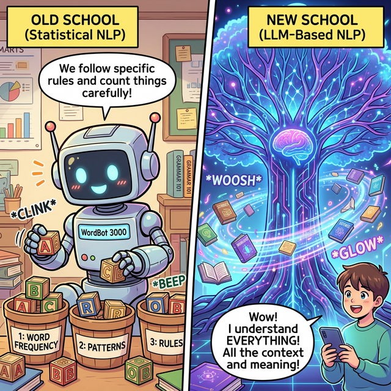

# 자연언어처리 - 01주차: 자연언어처리(NLP) 개요

## 1. 자연언어처리와 텍스트 마이닝

### 자연언어처리의 목적과 범위
* **목적:** 컴퓨터를 통해 인간의 자연어를 이해하고 처리하는 것을 목표로 합니다.
* **범위:**
  * **자연언어:** 한국어, 영어, 중국어, 일본어 등 사람이 일상적으로 사용하는 언어.
  * **인공언어:** 프로그래밍 언어, 수식, 논리 기호.
  * **현대의 관점:** 과거에는 자연어만 다뤘지만 현대의 NLP는 ‘언어’라는 개념을 넘어, 자연어부터 코드, 수식, 로그, JSON 등 **확률적으로 구조화된 기호 시퀀스를 모델링하는 문제**로 전반적인 확대가 이루어졌습니다.

### 텍스트 데이터의 특성과 구조
* **특성:** 글쓴이의 의도를 파악하기 쉬운 반면, 뉘앙스나 감정 등은 모호하여 분석하기 어려운 복잡함(비정형성, 함축성)이 공존합니다.
* **구조:** 기계가 정해준 구조화된 데이터(Structured data)와 달리 문법과 길이가 개별적인 **비정형 데이터(Unstructured data)**입니다. 따라서 기계학습에 적용하려면 반드시 '데이터 정형화'와 전처리 단계가 필요합니다.

### 텍스트 마이닝과의 관계
* **텍스트 마이닝:** 대량의 비정형 텍스트 데이터셋에서 흥미로운 규칙들을 자동으로 탐색하고 분류하여 새로운 정보를 발굴하는 과정입니다.
* **고전적 관점:** NLP 기술은 텍스트 마이닝 분야에서 데이터를 정제하고 형태소를 분석해 주기 위한 종속적인 '전처리 도구'로 여겨졌습니다.
* **현대적 관점:** 대형 언어 모델(LLM)의 등장 이후, 기존 텍스트 마이닝 기술과 도구가 모두 넓은 의미의 **NLP(자연언어처리) 프레임워크 한가운데로 흡수 통합**되는 패러다임의 변화가 일어났습니다.

---

## 2. 자연언어처리 기법 및 활용 사례

### 자연언어처리 기법의 패러다임 변화

| 구분 | 통계 기반 접근 (고전적/전통적) | LLM 기반 접근 (현대적) |
|---|---|---|
| **시기** | 초기 ~ 딥러닝 이전 | Transformer 등장 이후 |
| **핵심 아이디어** | 사람이 직접 설계한 표현(Feature) 및 통계 분석 | 방대한 모델에 기반한 데이터 학습 표현과 추론 |
| **대표 기법** | 형태소 분석, 토픽 모델링, BoW (Bag of Words), TF-IDF | BERT, GPT, T5, Llama 등 |
| **특징** | 구조가 단순하고 빠르며 **직관적 설명(설명 가능성)**이 쉬움 | 문맥(Context)의 깊은 이해 및 **광범위한 범용성** |

### (1) 통계 기반 접근 (고전적 방식)
* **형태소 분석 등 전처리:** 문장을 최소 단위(토큰)로 쪼개고, 어간을 추출(Stemming)하며 불용어를 제거합니다.
* **Bag of Words (BoW):** 문서 안에 어떤 단어가 몇 개가 있는지만 빈도로 측정하여 문서를 숫자의 배열(Matrix)로 변환합니다. 
* **토픽 모델링:** 주요 단어들의 출현 확률 기반으로 문서의 핵심적이고 추상적인 '주제(Topic)'를 묶어냅니다.
* **장점:** 어떤 픽셀인지 알 수 없는 이미지와 달리, 텍스트의 "단어" 자체가 고유한 의미를 내포하고 있으므로 **단순 빈도 통계만으로도 직관적이고 강력한 설명력을 가집니다.**

### (2) LLM 기반 접근 (현대적 방식)
* **워드 임베딩 (Word Embedding):** 전통적인 희소 행렬 벡터 방식을 벗어나, 단어의 문맥을 훈련해 실수형의 밀집 벡터(Dense Vector) 공간에 의미를 투영합니다.
* **Transformer 아키텍처:** Attention 메커니즘을 이용해 입력 프롬프트의 토큰화 위치 문맥을 정밀하게 병렬 수집하고, 결과를 추론 및 텍스트 샘플링합니다.

### NLP 주요 활용 분야
1. **문서 분류:** 텍스트를 인식해 카테고리(스팸/정상, 뉴스 주제 등) 분류.
2. **문서 요약:** 방대한 양의 문서에서 핵심 주제를 선별하여 요약문(Summary) 작성.
3. **감성 분석:** 리뷰 등에 쓰인 의견의 주관적인 데이터 성향(긍정/부정/중립) 파악.
4. **기계 번역:** 사람의 자연어를 컴퓨터가 문맥에 맞추어 다른 언어로 매끄럽게 번역 (예: 한국어 $\rightarrow$ 영어).
5. **텍스트 기반 멀티모달 (VQA & Text-to-Image):** 
   * **VQA:** 이미지에 대해 자연어로 질문하면 정답을 추론(예: "콧수염은 무엇으로 만들어졌나?" $\rightarrow$ "바나나").
   * **Text-to-Image:** 텍스트 프롬프트를 인식하여 해당하는 이미지를 생성 모델을 통해 구현.

### LLM 기반 자연언어처리의 한계점과 대응
* **한계 (리스크):** 
  * **환각 (Hallucination):** 그럴싸하게 보이나 정보가 존재하지 않거나 완전히 잘못된 사실을 생성.
  * **편향성:** 학습 데이터 내의 인종적, 성적 편향을 그대로 결과물로 스며내어 안전성 위협.
  * 모델이 왜 이런 결과를 도출했는지 내부를 완벽히 해석하기가 불가능(설명 가능성 부재).
* **해결 방안:**
  * 검색 증강 생성인 **RAG(Retrieval-Augmented Generation)**나 프롬프트 엔지니어링 활용으로 환각 최소화.
  * **RLHF (인간 피드백 기반 강화학습)** 모델 파인튜닝을 거쳐 편향성과 공격성 제어.

> **💡 요약 가이드:** 모든 문제를 무조건 LLM으로 해결하는 것이 정답은 아닙니다. 데이터의 양, 비용 한도, 즉각적이고 직관적 이유 파악(설명 가능성)이 필요한 곳에서는 여전히 통계 기반의 고전적 기법이 효과적이며, 높은 문맥 파악/서비스 자동화 구현에는 LLM 기법을 선별적으로 채택하는 안목이 필요합니다.
