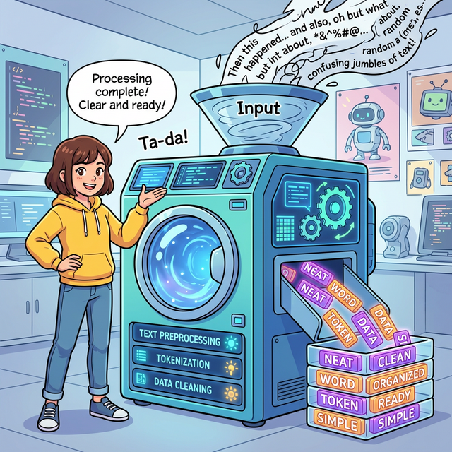

# 자연언어처리 - 02주차: 텍스트 전처리

## 1. 텍스트 전처리와 어휘 표현 분석

### 텍스트 전처리(Text Preprocessing) 개요
기계가 만들어낸 데이터와는 달리 비정형화된 텍스트(자연어)를 컴퓨터가 이해하고 기계학습 모델에 적용할 수 있도록 **데이터를 정형화(Structuring)**하고 가공하는 필수 단계입니다. 텍스트 마이닝과 자연어 처리 기법의 기반이 됩니다.

### 텍스트의 3가지 표현 단위 분석
자연어를 어떤 단위로 쪼개고 다룰지 결정해야 합니다.
1. **어휘 표현 (Lexical):** 글자, 단어, 품사 태깅, 구 등 가장 기본적인 단위.
   * **문자 기반:** n-gram, 순서열
   * **단어 기반:** 불용어, 어간 추출, 원형 복원, n-gram
   * **구 (Phrase):** 구 단위 파싱
2. **구문 표현 (Syntactic):** 벡터-공간 모델(Vector-Space Model), 언어 모델, 전체 구문 분석 등 문장 이상의 구조에 집중.
3. **의미론적 표현 (Semantic):** Ontologies(사물 간 개념 관계), Frames(단어의 연관관계 의미 부여), Collaborative Tagging 등을 톻하여 텍스트에 깊은 의미를 부여.

---

## 2. 텍스트 전처리 세부 단계 (Pipeline)

텍스트 전처리는 분석 목적에 맞게 불필요한 노이즈를 지속적으로 제거해가는 정교한 파이프라인 과정입니다.

### 1) 토큰화 (Tokenization)
긴 문장을 의미 분석에 가장 유용한 최소 단위(**토큰, Token**)로 쪼개는 작업입니다.
* **단어 단위 토큰화:** 영어의 경우 공백 단위 분리가 유효함. (예: `['Starting', 'a', 'restaurant']`)
* **형태소 단위 토큰화 (한국어 등에 필수):** 한국어는 어절 단위(띄어쓰기)로 쪼개면 조사와 어미가 결합해 있어 의미 변질이 심하므로, **의미를 가진 가장 작은 단위인 '형태소' 단위**로 더 잘게 분리해야 합니다 (KoNLPy 등 활용).
* **서브워드 토크나이징 (LLM 트렌드):** 단어 집합에 없는 OOV(Out-Of-Vocabulary) 신조어 문제를 완화하기 위해, 하나의 단어를 여러 서브워드로 분리하는 기법(예: BPE, Byte Pair Encoding). 모델 훈련 효율을 크게 높입니다.

### 2) 정제 (Cleaning)
분석 목적에 맞지 않는 텍스트 노이즈를 제거하는 작업.
* **저빈도 단어:** 10만개 문서 중 단 1번만 등장하는 오타 등 제거.
* **짧은 단어:** 영어의 'I', 'a' 등 한두 글자 단어는 의미가 적음.
* **불용어 (Stopword):** 문법적 역할뿐 실질적 핵심 정보(주제)를 담지 않는 단어들('a', 'the', 전치사 'of', 'in' 등). 웹 스크래핑 HTML 잔여물도 포함.

### 3) 정규화 (Normalization) & 정규 표현식
* **정규화:** 같은 뜻임에도 형태가 다른 단어들을 하나의 **표준 단어**로 묶어줍니다. (예: `USA`, `US`, `uh-huh`, `uhhuh`, `Windows`, `windows`).
* **정규 표현식 (Regular Expression):** 복잡하고 일정한 패턴 규칙(`/[Ww]+/` 등)을 이용해 코딩만으로 이메일, 특수문자, 숫자 등을 일괄 검색하고 치환/제거할 때 가장 강력합니다.

### 4) 표제어 추출과 어간 추출 (형태학적 통합)
* **표제어 추출 (Lemmatization):** 사전에 등재된 뿌리 원형(Lemma)으로 변환 (예: `lives` $\rightarrow$ `life`, `dies` $\rightarrow$ `dy`). 좀 더 정교하고 품사를 보존합니다.
* **어간 추출 (Stemming):** 규칙에 따라 단어 어형에서 접사 등 꼬리만 툭 잘라내는 기계적 작업 (예: `automate`, `automatic` $\rightarrow$ `automat`). 연산이 빠르지만 없는 단어가 도출되기도 합니다.

### 5) 품사 태깅 (POS Tagging)
* 분리된 각 단어 토큰이 문장에서 어느 품사(명사, 동사, 형용사 등) 역할을 하는지 레이블링 (Labeling) 합니다.
* 하나의 단어가 여러 품사(모호성)를 가질 수 있으므로 문맥을 고려하여 해소하는 것이 중요한 태스크입니다. (규칙 기반, HMM 확률 기반 방식 등 활용)

---

## 3. 구문 분석: N-gram과 청킹 (Chunking)

단순히 단어 1개 단위로만 쪼개면 "문맥의 순서" 정보가 치명적으로 훼손됩니다. 이를 복원하기 위한 고전적 텍스트 표현 방법론입니다.

### N-gram (N개의 연속적 단어 나열)
문장을 파편적인 단어가 아니라 **연속적으로 나열된 N개 단어의 뭉치**로 인식하게 하여 "단어의 통계적 순서와 묶임"을 모델링합니다.

* **원문:** The future depends on what we do in the present
* **uni-gram ($n=1$):** `The`, `future`, `depends`, `on`, ...
* **bi-gram ($n=2$):** `The future`, `future depends`, `depends on`, ...
* **tri-gram ($n=3$):** `The future depends`, `future depends on`, ...

### 텍스트 단위화 (Chunking) 및 BIO 태깅
* **Chunking:** 텍스트를 단순히 개별 품사로만 두는 것이 아니라, 어휘적으로 강하게 연관되어 있는 구(Phrase, 예를 들어 명사구 NP, 동사구 VP) 단위별로 **청크(Chunk)**를 묶어주는 상위 레벨의 기술입니다.
* **개체명 인식(NER)과 BIO 태그:**
  * 보통 고유명사나 특정 정보 '조직', '장소' 등을 추출할 때 많이 쓰이는 데이터 라벨링 규칙.
  * **B (begin):** 해당 청크(개체명)의 **시작 단어**.
  * **I (inside):** 해당 청크의 **내부(이어지는) 단어**.
  * **O (outside):** 청크 밖에 속하는 잡다한 단어.
  * *예시:* `We(B-NP) saw(O) the(B-NP) yellow(I-NP) dog(I-NP) ...`

### RAG (검색 증강 생성) 관점에서의 최신 청킹
대형 언어 모델(LLM) 기반의 자연어처리 기법인 RAG(Retrieval-Augmented Generation)에서도 청킹 전략이 핵심적으로 쓰입니다. 
긴 정책 문서나 논문 데이터를 벡터 공간에 임베딩할 때, 문서 하나를 통째로 두지 않고 **적절한 길이의 문단이나 의미 단위별로 자잘하게(Chunking)** 잘라 벡터화합니다. 이후 사용자가 질문(Query)을 던지면 **어느 Chunk가 가장 유사도(Similarity) 높은지** 정밀하게 검색·매칭하여 그 문단만을 모델 답변 재료로 제공해 가장 정확한 답을 도출합니다.
