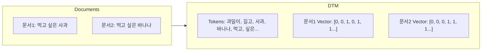
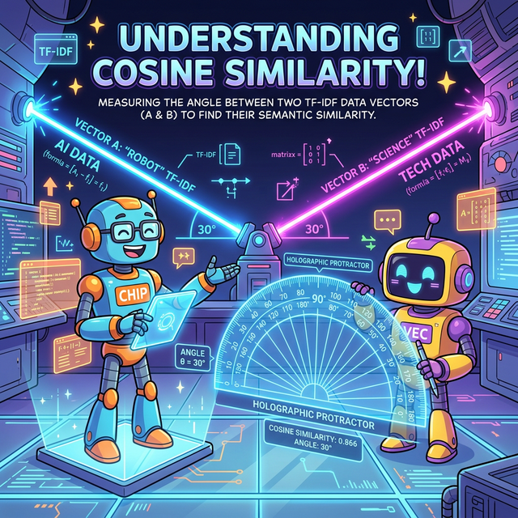

# 자연언어처리 - 03주차: 텍스트 표현

## 1. 카운트 기반 텍스트 표현과 벡터 공간 모델

### 텍스트를 컴퓨터가 이해하는 방식
자연어처리에서는 비정형 데이터인 텍스트를 컴퓨터가 이해하고 계산할 수 있도록, **대수적인 모델(벡터, Vector)**로 변환하는 표현 과정론이 매우 중요합니다.

1. **벡터 공간 모델 (Vector Space Model):**
   * 텍스트 문서를 수치화된 벡터로 나타내는 가장 기본적인 대수적 모델입니다.
   * 문서는 하나의 차원 공간에 표상된 벡터로 표현되며, 각각의 차원은 **개별 단어**에 대응됩니다.

2. **단어 빈도 기반 표현 (Count-based Representation):**
   * 단어의 의미적 문맥이나 문법, 어순은 완전히 무시하고, 단순히 **"어떤 문서에 어떠한 단어가 몇 번 등장했는지(출현 빈도, Frequency)"**만을 세어 텍스트 문서를 수치화하는 직관적인 연산 기법입니다.
   * 대표 기법: 원-핫 인코딩(One-hot encoding), 백 오브 워즈(BoW), TF-IDF 등.

### 1) 원-핫 인코딩 (One-hot Encoding)
* 분석 대상이 되는 전체 말뭉치(단어 집합, Vocabulary)를 구성하고, 그 안의 각 단어에 고유한 정수 인덱스를 부여한 후, 해당 단어의 인덱스 위치에만 1을 넣고 나머지 위치에는 0을 넣는 가장 원시적인 방식의 **희소 벡터(Sparse Vector)** 표현법입니다.
* *예: 단어장이 [자연언어, 처리, 를, 배운다] 이고 "자연언어"의 인덱스가 0이면 $\rightarrow$ `[1, 0, 0, 0]`*
* **한계점:** 단어가 늘어날수록 차원 배열의 크기가 엄청나게 방대해지는데, 정작 99%의 값은 쓸모없는 0으로 가득 찬 희소 표현(Sparse representation)이 되기 때문에 메모리가 막대하게 낭비됩니다.

### 2) BoW (Bag-of-Words) 방식과 문서-단어 행렬 (DTM)
* **BoW:** 단어들의 순서 정보를 배제하고 가방(Bag) 속에 넣어 섞은 것처럼, 오로지 출현 빈도수만을 계산하는 수치화 방법.
* **문서-단어 행렬 (DTM, Document-Term Matrix):** 여러 개의 문서들을 각각의 BoW 벡터 행렬로 합쳐 나타낸 공간 행렬 표 형식입니다.

* **DTM의 한계:** 
  단순한 빈도수 접근법이라서 영어의 'the', 'a', 조사 '은/는/이/가' 처럼 **모든 문서에서 무지성으로 많이 등장하는 (정보량이 드문) 단어가 오히려 중요도가 높은 것처럼 스코어가 왜곡**됩니다. 또한 비슷한 의미를 가져도 형태가 다르면 연관성을 전혀 갖지 못합니다.
  *(지프의 법칙(Zipf's law): 극소수 관사나 조사 단어들이 전체 사용 빈도의 대부분을 독점하는 통계적 언어 현상)*

---

## 2. TF-IDF와 텍스트 유사도 알고리즘

단순 카운트 기반, DTM 모델들의 왜곡을 해소하기 위해 등장한 통계적 가중치 계산법입니다. 자연어처리 텍스트 마이닝에서 가장 중요하게 사용되는 기법 중 하나입니다.

### TF-IDF (Term Frequency-Inverse Document Frequency)
어떤 단어가 특정 문서 내에서는 많이 쓰이되(단어빈도 TF 상승), 다른 문헌에서는 잘 나오지 않을 때(역문서빈도 IDF 상승) 그 단어는 **해당 문서의 핵심 주제어**일 확률이 높다는 논리에 기반합니다.

* **TF (단어 빈도, Term Frequency):** 문서 $d$에서 단어 $t$가 등장한 횟수. (높을수록 좋음)
  $$tf(t, d) = f_{t, d}$$
* **IDF (역문서 빈도, Inverse Document Frequency):** 전체 문서 집합 $D$의 수를 단어 $t$가 등장한 문서 수로 나눈 뒤 $\log$를 씌운 값. (즉, 여러 문서에 흔하게 등장할수록 중요도 패널티 값이 급감함.)
  $$idf(t, D) = \log\left(\frac{|D|}{1 + df(t, D)}\right)$$
* **최종 연산방식:** 두 값을 곱함. 즉 특정 문서 안에서 자주 등장하는 단어는 가중치를 얻고, 모든 문서에서 흔한 단어는 가중치가 낮아집니다.
  $$tfidf = tf(t, d) \cdot idf(t, D)$$

### 벡터의 텍스트 유사도 (Text Similarity)
텍스트 문서가 다차원 공간의 원소(벡터)로 매핑(수치화) 되었으므로 수학적인 거리를 잴 수 있습니다. 기계는 이를 계산하여 주어진 두 텍스트가 서로 같은 말을 하는 지 얼마나 닮았는지를 판별합니다. 

#### 1) 코사인 유사도 (Cosine Similarity)
가장 보편적으로 쓰이는 핵심 유사도 척도입니다. 
두 벡터 간의 **사잇각(Cosine $\theta$)**의 크기를 구합니다. 값의 크기 차이(문서의 길이 차이)가 달라도 벡터 방향 비율 자체의 일치율을 비교하므로 NLP에 유리합니다.
$$\cos(\theta) = \frac{\mathbf{A} \cdot \mathbf{B}}{||\mathbf{A}|| \, ||\mathbf{B}||} = \frac{\sum_{i=1}^{n} A_{i} B_{i}}{\sqrt{\sum_{i=1}^{n} A_{i}^{2}} \sqrt{\sum_{i=1}^{n} B_{i}^{2}}}$$
* **값의 범위:** -1부터 +1까지.
* **해석:** 
  * 1 : 벡터의 방향이 완전히 같음 (각도가 0도, **두 문서가 사실상 완전히 똑같음**)
  * 0 : 직교 (서로 아무런 상관이 없음)
  * -1: 방향이 상반됨 (반대되는 뜻의 텍스트 구성)

#### 2) 자카드 유사도 (Jaccard Similarity)
전체 단어 집합 크기 대비 두 문서에 **공통적으로 속하는 단어 종의 개수(교집합)** 비율을 구하는 방식입니다.

$$J(A, B) = \frac{|A \cap B|}{|A \cup B|} = \frac{|A \cap B|}{|A| + |B| - |A \cap B|}$$

#### 3) 유클리드 거리 (Euclidean Distance)
기하학적인 두 점과 점 사이의 단순 직선 거리 좌표 편차를 구하는 지표입니다.

$$d(A, B) = \sqrt{\sum_{i=1}^{n} (B_i - A_i)^2}$$

> **📌 핵심 요약:**
> 기계가 문서를 판별하려면 자연어를 텍스트 벡터로 먼저 치환해야 합니다. 이를 위해 단순하게 횟수만을 세는 방법이 One-Hot Encoding과 BoW, DTM 기반이라면, 문서별 단어의 상대적 가중치 의미까지 끌어올려 중요 주제어를 도출하는 방식이 **TF-IDF** 입니다. 이후 정해진 문서 벡터 좌표들로 코사인 공식을 적용하면 어떤 다발이 서로 제일 비슷한 말(유사도)을 하는 지 기계적으로 찾아낼 수 있습니다!
