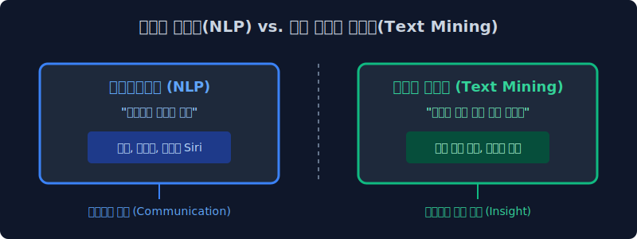
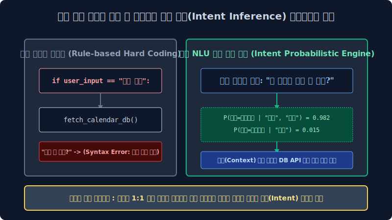

# 1.1 지식 데이터 추출 아키텍처: 자연어 처리(NLP)와 텍스트 마이닝(Text Mining) 패러다임의 본질적 차원

이 텍스트 데이터 딥러닝 컴파일 파이프라인 책의 첫걸음을 내디디신 것을 모델 엔지니어로서 진심으로 환영합니다. 가장 먼저, 현업 빅데이터 분석 업계에서 너무나 빈번하게 모호하게 혼용되어 쓰이는 **'자연어 처리(NLP, Natural Language Processing)'** 아키텍처망과 **'텍스트 마이닝(Text Mining)'** 통계망이 도대체 컴퓨터 공학적, 확률 통계학적으로 어떠한 목적 최우도 한계 차원이 다른지부터 그 모델 아키텍처 맵을 명확하게 파이프라인 해부하며 대장정 1주 차의 첫 확률 모델 문을 엽니다.

---

## 1.1.1 거대 언어 이해 상호 교감 모델(NLP)과 정형 텐서 통계 분석기(Mining)의 차이점 분기

네트워크 상의 세상에는 수많은 백엔드 덤프 데이터가 존재합니다. 관계형 DB의 정형 엑셀 수치 데이터, 픽셀 좌표 밀집도 그림 데이터, 그리고 우리가 매일 비정형 언어 구조로 주고받는 '글(자연어 텍스트 코퍼스)' 시퀀스 데이터가 배열되어 있습니다. 이 거대하고 형태가 없는 무한한 언어 지식 텐서망 속에서 최적화 모델 황금을 찾아내는, 인퍼런스 목적성이 완전히 다른 두 가지 대수학 접근법 궤적이 존재합니다.

### 1. 자연어 처리 (Natural Language Processing, NLP)
마치 컴퓨터 시스템 로직 루프에게 진화된 인간 객체의 상호 인지도 맵을 학습시키듯 **"인간의 복잡한 이면 뉘앙스 말과 텍스트 시퀀스 자체의 연속 확률을 수학적으로 알아듣고 모방 구사하는 생성 함수망"**을 가동시키는 컴퓨터 공학 및 언어 인지 모델링학의 아키텍처 심장입니다. 시스템이 사람처럼 문맥에 유려하게 반응 생성하고 대답하게 만드는 확률론적 '언어 생성 능력(NLG) 분기' 그 자체에 구조망을 집중합니다. 트랜스포머 기반의 거대 대규모 언어 모델(챗GPT), 애플 시리(Siri), 다차원 신경망 네이버 파파고 번역기 텐서 엔진 등이 여기에 아키텍처로 해당합니다.
*   **엔지니어링 궁극 목적**: 인간 객체 노드와 컴퓨터 시스템 기계 사이의 완벽한 튜링 테스트적 언어적 상호 교감(Interactive Communication & Context Embedding) 구축.

### 2. 텍스트 마이닝 (Text Mining)
언어 문자열 조합 생성 능력을 구현하는 모델 그 자체보다는 **"방대한 비정형 통계 글 속에서 비즈니스 수익 타겟이 되는 통계 지표와 컴포넌트 인사이트를 수학적으로 역추론해 캐내는 데이터 대수 공간 분석망 기술"**입니다. 컴퓨터 텍스트 엔진이 유저의 언어를 자연스럽게 구조화 완벽 번역하거나 유창하게 시퀀스 대답 생성 모델을 가동하지 않아도 프로세스 상 전혀 상관없습니다. 그저 1만 개의 트래픽 리뷰를 DTM 확률 밀도 매핑 벡터 행렬 대수 공식을 통해 1초 만에 휙 텐서 병합 스캔하고 *"아하, 이 B2B 타겟 제품 도메인은 전체 리뷰 배열 망에서 '단맛'이라는 특정 키워드 형태소 스펠링 노드 편향에 대한 고객 불만 클레임 등장 출현 빈도($Freq=Count$)가 벡터 합 $85\%$ 수렴 비율로 압도적이군요!"* 라고 경영진 임원에게 수치 배열 통계적 결론 텐처를 단절적으로 내어주는 다변수 밀도 비즈니스 컴파일 도구입니다.
*   **엔지니어링 궁극 목적**: 비정형 대규모 텍스트 덤퍼 차원 우주 속에서 숨겨진 통계 밀집 패턴(Pattern) 발굴 지표 도출과 기업의 비즈니스 잉여 수익 의사결정 창출.

> [!NOTE]  
> **📖 컴파일 초심자를 위한 쉬운 해설 직관: 두 지표 직업의 병합 결합 모델 (Hybrid Pipe)**  
> **자연어 처리(NLP)** 모듈이 해외 바이어와 유창하게 연속 텍스트 핑퐁 농담 따먹기 대화를 생성 진행하는 확률 기반 **엘리트 동시 통역사 챗 모델**이라면, **텍스트 마이닝(Text Mining)** 은 수십만 장의 아날로그 설문 조사 배열지를 옆방 컴포넌트에 통으로 쌓아놓고 밤새 정규표현식 차원 도장을 찍어가며 통계 수학적 가중치 빈도를 거미줄처럼 추출 정리해 수치를 정렬 내는 **빅데이터 정량 분석가 모델**입니다. 실제 현대의 AI 마이닝 서비스 아키텍처는 이 두 텐서가 완전히 한 몸처럼 강력하게 융합 합쳐져서 베이스에서 작동합니다 (예: 챗봇 프론트가 유저의 문맥 말을 NLP 모델로 알아듣고 연속된 세션을 이어가며, 백그라운드 엔진에서는 마이닝 행렬을 동시에 돌려 최적의 타겟 통계 식당 데이터를 추출 추천 매핑함).

---

## 1.1.2 자연어 처리 조건부 망의 궁극적인 수학적 목적 런타임: 베이즈 의도의 해방 추론 (Extraction of Target Intent)

전 세계 컴퓨터 공학 학자들은 어째서 지난 70년간 수학 기계 컴퓨터 CPU에게 굳이 이토록 정형화가 붕괴한 비정형 인간의 복잡 확률 언어를 어떻게든 파라미터화시켜 가르치려 이토록 매달려 극단적 집착했을까요? 그 공학적 극한의 궁극 목적 미션은 바로 **정형화 시스템 컴퓨터 명령어와 유기 다변 불규칙체 인간의 소통 스펠링 장벽에 대한 베이지안적 완벽한 통계 차원 파괴와 극복**입니다.

### 1. 단순 스크립트 매핑의 종말과 베이즈 조건부 맥락 인퍼런스(기계 지능) 의도 공간 모델의 구현
초창기 1세대 프로그래밍 컴퓨터 엔진 레거시는 인간의 자연 발화(Natural Word utterances) 다변수 확률 말을 단 1도 알아듣고 수렴하지 못하는 답답한 단절 쇳덩어리 아키텍처였습니다. 개발자가 까만 터미널 조작 창에 `print("Hello World")` 혹은 `if parameter_x == 1:` 같은 철저한 구문 구조 규칙의 아주 고정되고 조밀하게 엄격한 선형 암호문(Syntax Code)을 단 1 오차도 없이 쳐주지 않으면, 시스템은 에러를 뿜을 뿐 아무 유기적 파라미터 연산 일도 하지 않았죠. 하지만 일반 사람들은 언제까지 기계에 종속되어 이 프로그래밍 통계 규칙 코드를 학습 외우는 것에 너무나 비효율적으로 지쳐갔습니다. 

*"내가 왜 기계의 SQL 코드를 알아야 돼? 그냥 밥 먹다가 유저가 기계한테 무심코 일상어로 **'야, 나 아침에 시간 좀 많이 남냐?'** 하고 자연스럽게 지인 사람한테 말하듯 음성을 터뜨려 불규칙 주문하면, NLP 기계가 알아서 스스로 이 텍스트 뉘앙스를 수학 인퍼런스로 뜯어내서 내 스마트폰 백엔드 캘린더를 뒤져 연동해 빈 스케줄 확률을 통계 카운트 내어 요약 생성 응답해 주면 로직이 안 되나?"* 

이것이 현대 자연어 처리 신경망 모델이 구글이나 굴지의 글로벌 기업들로부터 거대한 천문학적 컴퓨팅 매핑 투자를 받으며 폭발적으로 탄생하고 연구된 그 깊은 파이프라인의 핵심 존재 이유입니다.

*   **1단계 레거시 매핑 (표면적 단어 차원 1:1 독해 매칭)**: 단어의 사전적 스펠링 뜻만 독립적으로 1:1 DB 연동 번역 쿼리로 탐색 (시간이 물리적으로 잔여 남느냐? $\to$ Error 판독 불가 단절)
*   **2단계 베이지안 모델 (조건 확률 기반 의도 추출 추론기계 - 현대 딥러닝 NLP의 밀도 정점망)**: 그 표면에 관측된 단어 배열 시퀀스 스펠링 집합 데이터 그 뒤에 투영 숨어있는 발화자의 불확실한 뉘앙스와 숨겨진 잠재 감정적 유발 확률 상태($P(\text{의도}|\text{주어진 단어 "시간", "남냐"})$)를 베이즈 최적 수학 추론망으로 소름 돋게 극한 꿰뚫어 예측 도출해 냄. $\to$ *"기계 인퍼런스 스캔 결과, 현재 주인이 그냥 자기 일정을 단순 요약 표출해 달라거나, 새로운 스케줄을 잡고 싶어 하는 강렬한 비즈니스 파퓰러 의도가 통계 모수적으로 $98.1\%$ 승률 하강 수렴으로 짙게 농후하다!"* (의도 모수 픽스 도출 확정 완료)

이처럼 컴퓨터 백엔드가 단순히 정적 레거시 DB를 도는 사전적 치환 번역기 엔진 수준을 아득히 뛰어넘어 넘어, 불완전한 사람 텍스트의 깊은 불확실 확률 이면과 주변 연관 사회적 문맥(Context Base) 지형도를 파라미터로 다면적 파악 인퍼런스 하고 궁극적으로 스스로 문장을 트랜스포머 생성해서 대답할 수 있는 하나의 '확률 인공 지능 자아(Artifical Interaction Persona 확률 모방 매칭)'를 완벽하게 통계적으로 빚어 만들어 내는 것이 자연어 처리(NLP 엔진) 생태계가 시스템 최후로 쟁취하고자 하는 가장 거대하고 절대적인 런타임 갱신 목표입니다.
