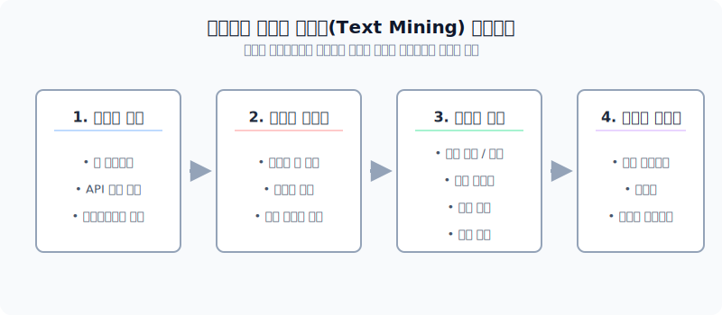
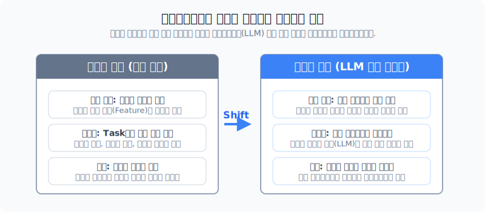
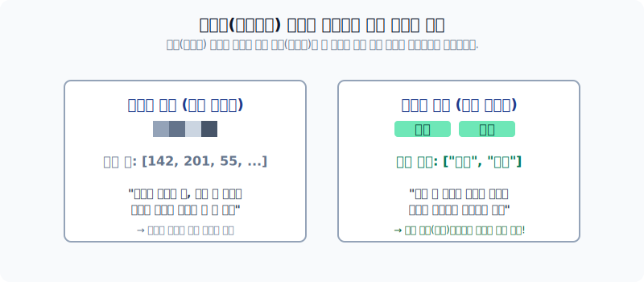

# 자연언어 처리의 목적 및 텍스트 마이닝 패러다임

인간의 복잡 미묘한 대화를 컴퓨터에게 이해시키는 일은 오랜 컴퓨터 과학의 난제였습니다. 본 섹션에서는 인공언어(프로그램 코드)와 철저히 비교되는 **자연언어의 비정형성** 특성을 살펴보고, 과거 고전적 텍스트 마이닝 통계 분석에서부터 현재 모든 과업을 삼켜버린 LLM(대형언어모델) 기반 딥러닝 NLP로의 극적인 패러다임 변화를 다룹니다.

---

## 1. 자연언어(Natural Language)란?

우리가 C언어나 파이썬으로 컴퓨터에게 명령을 내릴 땐 오직 변수, 반복, 논리의 단 한 가지 의미만 존재하며, 여기서 토씨 하나만 틀려도 컴퓨터는 오류를 냅니다. 이를 **인공언어**라고 합니다.

반면, 사람이 일상적으로 쓰는 **자연어**는 그렇지 않습니다.

"오늘 분위기 미쳤다."라는 자연어 문장은 문맥에 따라 극찬일 수도, 혹은 극도의 불만일 수도 있습니다. 이러한 의미의 모호성, 함축성, 비정형성 때문에 언어 데이터를 정형화하고 의도를 알아채는 **자연언어 처리(NLP: Natural Language Processing)** 기술이 대두되었습니다.

---

## 2. 텍스트 마이닝 프로세스 (Text Mining Process)

텍스트 마이닝은 산더미 같은 비정형 글뭉치 속에서 규칙을 발굴하는 데이터 마이닝의 한 분야입니다. 

1. **텍스트 수집**: 웹 페이지나 SNS에서 크롤링 및 API를 통해 글을 모아옵니다.
2. **텍스트 전처리**: 조사를 떼어내고(형태소 분석), 불필요한 단어를 지워서 기계가 읽기 쉽게 컴퓨터용 언어 구조로 바꿉니다.
3. **텍스트 분석**: 이 글이 긍정인지 부정인지, 어떤 토픽을 담고 있는지를 수학적으로 분석합니다.
4. **시각화**: 결과를 워드 클라우드나 트리맵처럼 사람이 직관적으로 볼 수 있게 그려냅니다.

---

## 3. 고전적 접근과 현대(LLM) 환경의 대통합

불과 10년 전까지만 해도, 번역기는 번역 전문가들이, 요약 모델은 요약 전문가들이 서로 다른 통계 모델을 수작업으로 지루하게 설계하여 사용했습니다. 

*대규모 텍스트 모델의 등장 전후의 자연어 처리 구조의 변화*

현대의 자연언어 처리는 **딥러닝 기반 대형언어모델(LLM, ex. ChatGPT)**이 하나의 거대한 근본 모델(Foundation framework)로써 자리 잡았습니다. 이 모델을 약간만 변형하거나 지시를 주면, 요약이든 번역이든 문맥을 정확히 파악하여 스스로 해결하는 통합의 시대를 맞이했습니다.

### 고전 통계 텍스트 분석의 존재 가치

그렇다면 복잡한 딥러닝이 지배하는 이 시대에 단순한 빈도수를 세는 '고전적 통계 기반 텍스트 마이닝'은 폐기되었을까요? 정답은 '아니오'입니다.

*이미지 분석과 텍스트 분석의 데이터 속성 차이*

이미지를 구성하는 픽셀은 단순한 밝기를 뜻하는 무의미한 숫자에 불과하여 전체의 큰 그림(Deep Network)을 보지 않고서는 의미를 절대 유추할 수 없습니다. 하지만, 텍스트 데이터에 있는 **'단어'는 애초에 글자 그 자체로 고유한 생명과 뜻**이 박혀있습니다. 

따라서 굳이 무거운 딥러닝을 거치지 않아도 이 문서에 '사랑'이라는 단어가 100번 등장했다면 직관적으로 '긍정문'임을 쉽게 증명(설명 가능성)할 수 있기에, 오늘날에도 통계 기반 텍스트 마이닝은 데이터 분석 분야에서 막강한 실용성을 자랑합니다.
