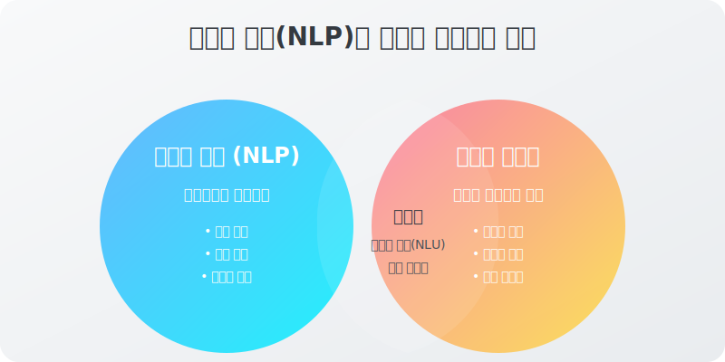
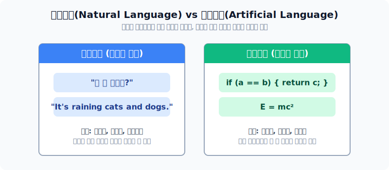
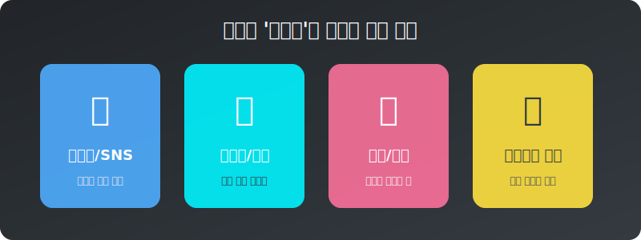
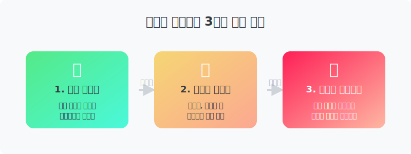
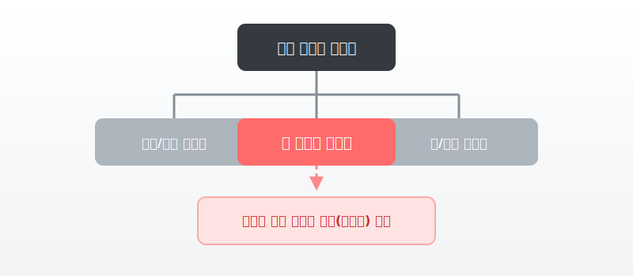
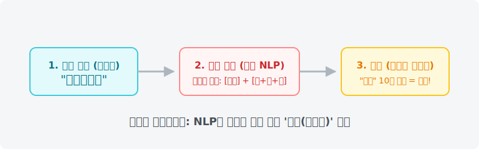
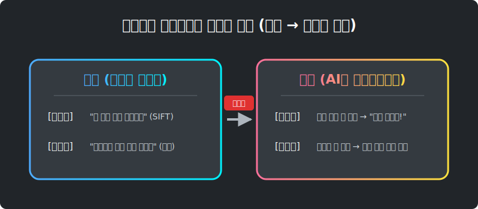

# 자연언어 처리의 목적 및 텍스트 마이닝 패러다임

이 문서는 프로그래밍 초보자와 인공지능 입문자를 위해, 기초 자연어처리(NLP)의 목적과 현대 텍스트 마이닝의 전반적인 개념을 가상의 대화와 비유를 통해 아주 쉽고 친절하게 다룹니다.

---

## 00. 자연언어처리와 텍스트 마이닝
자연언어처리와 텍스트 마이닝 기초 과정에 오신 것을 환영합니다.

> [!NOTE]  
> **📖 초심자를 위한 쉬운 해설**  
> 자연어 처리(NLP)와 텍스트 마이닝은 종종 혼용되어 쓰이지만 목적이 살짝 다릅니다.  
> **자연어 처리**가 컴퓨터에게 "우리가 하는 말을 알아듣고 똑같이 사람처럼 말해봐!"라고 가르치는 기술이라면, **텍스트 마이닝**은 수백만 개의 문서를 컴퓨터에게 던져주면서 "여기서 돈이 될 만한 트렌드나 사람들이 자주 쓰는 키워드를 통계로 뽑아봐!"라고 지시하는 데이터 분석 기술입니다.

## 01. 자연언어처리의 목적
컴퓨터를 통해 인간의 자연어를 이해하고 처리하는 것을 목표로 합니다. 컴퓨터가 언어를 통해 사람의 의도를 파악하고 서로 막힘없는 상호작용을 할 수 있도록 만듭니다.

> [!TIP]  
> **📖 초심자를 위한 쉬운 해설**  
> 옛날에는 컴퓨터에게 일을 시키려면 검은 화면에 `print("Hello")` 같은 외계어(코드)를 쳐야만 했습니다.  
> 하지만 자연어 처리의 궁극적인 목적은, 만약 우리가 **"야, 오늘 서울 날씨 어때?"**라고 지나가듯 말하면, 컴퓨터가 그 속에서 '오늘', '서울', '날씨'라는 핵심 의미를 알아듣고 날씨 앱을 켜서 대답해 주도록 **컴퓨터의 귀와 입을 사람 사이즈에 맞게 개조하는 것**입니다.

## 02. 자연언어의 범위 (1)
언어는 대상에 따라 두 가지로 구분됩니다.

1. **자연언어(Natural Language)**: 한국어, 영어 등 사람이 일상적으로 쓰는 언어 (모호성이 큼)
2. **인공언어(Artificial Language)**: 프로그래밍 언어, 통신 프로토콜 등 엄격한 규칙의 언어

> [!WARNING]  
> **📖 초심자를 위한 쉬운 해설**  
> 인공언어(C, 파이썬)는 `1+1=2` 처럼 무조건 정답이 딱 떨어지는 '수도관'과 같습니다. 조금만 틀려도 에러를 내며 멈춥니다.  
> 반면 자연언어는 굽이치는 '강물'과 같습니다. "밥 다 먹었어?"와 "식사 마치셨나요?"는 글자는 완전히 다르지만 뜻이 똑같습니다. 컴퓨터 입장에서는 이런 **자연어의 엄청난 유연성(정답이 없는 모호함)**이 가장 처리하기 고통스러운 수학적 난제가 됩니다.

## 03. 자연언어의 범위 (2)
현대의 NLP는 단순한 대화뿐만 아니라 텍스트 전반으로 범위 확장이 이루어졌습니다.

> [!NOTE]  
> **📖 초심자를 위한 쉬운 해설**  
> 요새 챗GPT한테 코딩을 짜달라고 하면 코드를 짜주죠?  
> 이제 컴퓨터(AI) 입장에서 '자연어'란 단순히 한국어, 영어를 넘어 **"어떤 일정한 확률적 규칙을 가진 기호(글자)들의 나열"**이라면 모조리 텍스트로 간주하여 학습해버립니다. 심지어 악보나 DNA 서열조차도 텍스트 취급을 받을 수 있습니다.

## 04. 텍스트의 이해
인간의 대화를 완벽히 이해하기 위해 컴퓨터 혹은 알고리즘이 파악해야 하는 4대 핵심 질문입니다.

| 질문 (Question) | AI가 수행해야 할 과업 (NLP Task) | 예시 상황 |
|:---|:---|:---|
| **의도가 무엇인가?** | 의도 분류 (Intent Classification) | "나 오늘 완전 망했어" -> 분노/슬픔 감지 |
| **핵심 메시지는 무엇인가?** | 문서 요약 (Text Summarization) | 30장짜리 회의록 -> 3줄 요약 |
| **뉘앙스는 무엇인가?** | 감성 분석 (Sentiment Analysis) | "영화 참~ 재밌네(비꼬기)" -> 부정 평가 감지 |
| **사진과는 무슨 관계인가?** | 멀티모달 (Multi-Modal) | 밈(Meme) 이미지와 텍스트의 결합 분석 |

> [!TIP]  
> **📖 초심자를 위한 쉬운 해설**  
> 단순히 사전적 뜻만 번역하는 건 구형 번역기의 한계였습니다.  
> 진정한 텍스트의 이해는, 친구가 "아, 진짜 배부르네~"라고 할 때 이게 밥을 많이 먹어서 만족한 건지, 억지로 많이 먹어서 불쾌한 건지 **상황(문맥)**까지 파악하는 눈치를 기계에 탑재하는 과정입니다.

## 05. 텍스트 데이터의 특성
텍스트 데이터가 가지고 있는 고유한 특성 3가지입니다.

> [!NOTE]  
> **📖 초심자를 위한 쉬운 해설**  
> 텍스트는 숫자에 비해 겉보기엔 목적이 아주 투명합니다("나는 사과가 싫다").  
> 하지만 반어법, 농담, 줄임말("킹받네", "억텐") 같은 오묘한 감정선이 끼어들기 시작하면, 정해진 표에 맞춰 숫자만 계산하던 컴퓨터는 뇌 정지에 빠지게 됩니다. 이것이 불확실하고 복잡한 비정형 데이터의 무서움입니다.

## 06. 텍스트 데이터의 구조
언어마다 문법 체계가 다르고 텍스트의 길이가 매우 들쭉날쭉한 **비정형 데이터(Unstructured data)**입니다.

| 데이터 유형 | 특징 | 기계의 선호도 |
|:---|:---|:---|
| **정형 데이터** | 엑셀 표, 날짜, 가격, 주민번호 (규칙적) | 매우 좋아함 (계산만 하면 됨) |
| **비정형 데이터** | 소설, 유튜브 자막, 인스타 댓글 (불규칙적) | 매우 싫어함 (어떻게 다룰지 모름) |

> [!IMPORTANT]  
> **📖 초심자를 위한 쉬운 해설**  
> 엑셀 표(정형)는 가로세로 줄이 딱딱 맞습니다. 컴퓨터가 읽기 편하죠.  
> 하지만 카톡방 대화는 어떤 사람은 1줄 쓰고, 어떤 사람은 10줄을 이어서 씁니다. 이런 제멋대로인 텍스트 길이를 컴퓨터가 소화하게 하려면, 단어들을 전부 고정된 길이의 **숫자(벡터)로 변환(정형화)**시켜주는 과정이 절대적으로 필수입니다.

## 07. 텍스트 데이터의 양
인터넷의 보급과 함께 웹과 소셜미디어에서 생산되는 데이터가 달에 수십억 건 씩 폭발적으로 증가했습니다.

> [!NOTE]  
> **📖 초심자를 위한 쉬운 해설**  
> 과거 학자들은 뉴스 기사 1만 개만 모아도 "우와 엄청 큰 데이터다!" 했습니다.  
> 하지만 요즘 딥러닝 모델들은 나무위키, 레딧, 트위터에 올라오는 수경(1경=10,000조) 단위의 글 데이터를 통째로 집어삼킵니다. 인류가 만들어낸 정보의 대폭발(정보의 바다) 자체가 요즘 AI 지능의 압도적인 밑거름이 되었습니다.

## 08. 텍스트마이닝 (Text mining) 이해
데이터 마이닝의 하위 분야 중 하나입니다.

> [!TIP]  
> **📖 초심자를 위한 쉬운 해설**  
> **마이닝(Mining)**은 우리말로 '광산에서 광물을 캔다'는 뜻입니다.  
> 잡동사니 문자가 가득한 거대한 텍스트 산더미(인스타 게시글)에서, 쓸데없는 흙(조사, 오타)은 털어버리고 황금(요즘 10대들의 유행 키워드)만 캐내는 것이 바로 텍스트 마이닝입니다!

## 09. 텍스트마이닝 작동 과정
자연어 처리는 이 4가지 파이프라인 전방위에서 도구로 활용됩니다.

> [!NOTE]  
> **📖 초심자를 위한 쉬운 해설**  
> 공장에서 물건을 만드는 것과 같습니다.  
> 1. 원재료 채굴 (인터넷에서 기사 긁어오기)  
> 2. 원료 세척 (쓸데없는 특수기호, 오타 없애기)  
> 3. 제품 가공 (긍정/부정 판단, 주제 요약하기)  
> 4. 진열 및 판매 (결과물을 예쁜 워드클라우드로 그려서 사장님께 보고하기)

## 10. 고전적 관점
과거 기계학습 시절의 자연어 처리입니다.

> [!TIP]  
> **📖 초심자를 위한 쉬운 해설**  
> 예전에는 NLP가 주인공이 아니었습니다. 그저 텍스트 마이닝을 돕는 "도마 위에서 칼질하는 주방 보조" 역할이었습니다. 텍스트 마이닝이라는 요리를 하기 위해 한글을 형태소 단위('안녕', '하세요')로 썰어주는 잡일을 맡았습니다.

## 11. 고전적 텍스트마이닝의 특징
어떤 문서에 'AI'라는 단어가 100번 나오면 그 문서는 AI 문서라고 단정짓는 식의 **치밀한 빈도수 통계 수학**에 절대적으로 의존했습니다.

## 12. 고전적 텍스트마이닝의 한계
수학적 카운트에만 의존하다 보니 치명적인 문제들이 잇따랐습니다.

| 고전 방식의 치명적 한계 | 초보자를 위한 비유 |
|:---|:---|
| **인간 수작업 (표현 공간 설계)** | "개", "강아지", "멍멍이"가 같은 말이라는 사전(사전 지식)을 인간이 일일이 코딩해서 먹여주어야 했습니다. 엄청난 노가다의 연속입니다. |
| **형편없는 문맥 파악 (국소적 통계)** | "이 영화 진짜 재미 **원툴**이네 ㅋㅋ" 라는 문장에서 사전에 없는 신조어나 비꼬는 문맥을 아예 파악하지 못해 오류가 났습니다. |
| **범용성 결여 (분산된 모델)** | 번역을 돕는 로봇 따로, 요약하는 로봇 따로 각자 따로 놀아서 효율이 극악이었습니다. |

## 13. 현대적 관점 (NLP 대통합 시대)
대형언어모델(LLM)이 등장하면서 패러다임이 완전히 뒤집혔습니다.

> [!IMPORTANT]  
> **📖 초심자를 위한 쉬운 해설**  
> 과거의 잡다한 모델들을 모두 해고시키고, 엄청나게 크고 똑똑한 뇌 하나(예: GPT-4, 쌍방향 트랜스포머)가 번역, 요약, 문맥 파악, 계산까지 다 해치우는 **"초거대 AI 만능 직원"** 체제로 통일되었습니다. NLP 서브 기술들이 모두 하나의 블랙홀로 빨려 들어갔습니다.

## 14. 이미지 분야와의 패러다임 변화 비교
이런 통폐합 현상은 이미지(CV) 분야에서도 똑같이 일어났습니다.

> [!NOTE]  
> **📖 초심자를 위한 쉬운 해설**  
> 옛날에는 고양이를 인식시키려면 사람이 "귀가 뾰족하고 수염이 3가닥..." 이라고 공식을 입력했습니다.  
> 지금은 그냥 고양이 사진 1억 장과 텍스트 문서를 통째로 쏟아부으면 기계가 **스스로 "아, 이게 고양이라는 뜻이구나" 하고 규칙(특징)을 스스로 공부합니다(표현 학습).**

## 15. 통계기반 텍스트마이닝의 굳건한 중요성
그렇다고 해서 옛날 통계 방식이 쓸모없어진 것은 전혀 아닙니다. 오히려 실무에서는 아직 최고입니다!

> [!TIP]  
> **📖 초심자를 위한 쉬운 해설**  
> 가장 최신 AI(딥러닝)는 너무 복잡해서 대답을 기가 막히게 잘하지만, "왜 그런 결론이 나왔어?" 라고 물으면 **설명(증명)을 못 합니다(블랙박스 현상).**  
> 반면, 구식 통계 기법은 "이 기사에서 '삼성'이라는 글자가 500번 카운트 되었기 때문에 삼성이 대세입니다!" 라고 **상사에게 보고서를 올릴 때 근거가 너무나도 명확**합니다. 따라서 가성비가 좋고 속도가 미친 듯이 빠른 통계 텍스트마이닝은 무조건 배워두어야 하는 영원한 필수 기초입니다.
