# 자연언어처리와 텍스트 마이닝의 본질

이 책의 첫 걸음을 내딛으신 것을 진심으로 환영합니다. 가장 먼저, 현업에서 너무나 자주 혼용되어 쓰이는 **'자연언어처리(NLP)'**와 **'텍스트 마이닝'**이 도대체 족보가 어떻게 다른지부터 명확하게 해부하며 1주차의 첫 번째 문을 엽니다.

---

## 00. 분석가와 통역사의 차이
세상에는 수많은 데이터가 존재합니다. 숫자로 된 엑셀 데이터, 그림 데이터, 그리고 우리가 매일 주고받는 '글(텍스트)' 데이터가 있습니다. 이 무한한 글자 더미 속에서 황금을 찾아내는 두 가지 다른 접근법이 있습니다.

*   **자연언어처리 (Natural Language Processing, NLP)**: 마치 컴퓨터에게 유치원생을 가르치듯 **"인간의 말과 글 자체를 알아듣고 구사하는 법"**을 가르치는 기술입니다. 사람처럼 웃고, 울고, 대답하게 만드는 '언어 능력' 그 자체에 집중합니다.
*   **텍스트 마이닝 (Text Mining)**: 언어 능력 자체보다는 **"글에서 돈이 되는 통계와 인사이트를 캐내는 분석 기술"**입니다. 컴퓨터가 언어를 완벽히 못 알아들어도 상관없습니다. 그저 1만 개의 리뷰를 휙 훑어보고 "아, 이 제품은 단맛에 대한 클레임이 압도적이군요!"라고 통계적 결론을 내주는 비즈니스 도구입니다.

> [!NOTE]  
> **📖 초심자를 위한 쉬운 해설: 번역가와 분석가**  
> **자연언어처리**가 해외 바이어와 유창하게 대화하는 **엘리트 통역사**라면, **텍스트 마이닝**은 수만 장의 설문지를 옆방에 쌓아놓고 밤새 도장을 찍어가며 통계를 내는 **데이터 분석가**입니다. 실제 현대의 AI 서비스는 이 둘이 한 몸처럼 합쳐져서 작동합니다.

## 01. 자연언어처리의 궁극적인 목적
컴퓨터 과학자들은 왜 지난 70년간 컴퓨터에게 인간의 언어를 가르치려 이토록 집착했을까요? 그 궁극적인 목적은 바로 **컴퓨터와 인간 장벽 사이의 완벽한 파괴**입니다.

### 기계에게 눈치와 맥락을 가르치다
초창기 컴퓨터는 인간의 말을 단 1도 알아듣지 못하는 쇳덩어리였습니다. `cmd` 창에 `print("Hello")` 같은 엄격한 암호문(코드)을 쳐주지 않으면 아무 일도 하지 않았죠. 하지만 사람들은 귀찮아지기 시작했습니다. "그냥 밥 먹다가 무심코 '야, 오늘 서울 날씨 좀 띄워줄래?' 하고 사람한테 말하듯 주문하면 기계가 스스로 문맥을 분석해 주면 안 되나?" 이것이 자연언어처리가 탄생한 핵심 이유입니다.

컴퓨터가 단순히 사전적 뜻만 번역하는 것을 넘어, 그 단어 뒤에 숨은 사람의 뉘앙스, 감정, 의도를 파악하고 궁극적으로 스스로 사람처럼 창작해서 대답할 수 있는 '인공 자아'를 만들어 내는 것이 NLP의 목표입니다.

