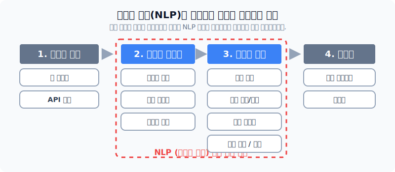
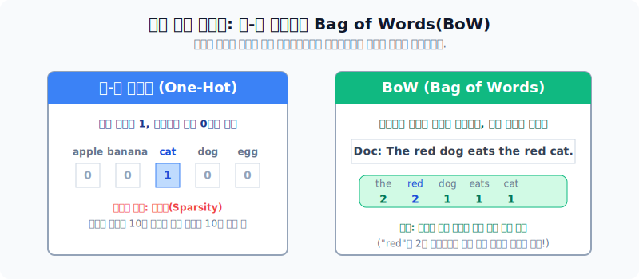
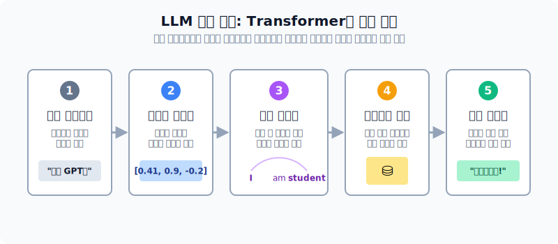

# 자연언어처리 기법의 발전과 활용 사례

자연언어처리(NLP)는 거대한 텍스트 마이닝 파이프라인(수집-전처리-분석-시각화)에서 지성의 영역인 **전처리와 분석** 파트를 전담하는 핵심 기술 집합체입니다. 본 섹션에서는 NLP의 구체적 기술 진화와 더불어, 실제로 어떤 산업 영역에 활용되고 있는지, 그리고 트랜스포머 기반 대형언어모델(LLM)이 맞닥뜨린 치명적인 한계점까지 살펴봅니다.

*텍스트 마이닝 파이프라인 속 자연어 처리(NLP)가 맹활약하는 구간*

---

## 1. 통계 기반 접근법의 기초

딥러닝의 폭발적인 발전 이전에는 단어의 등장 횟수(빈도수)와 배열 상태를 수학적 통계로 모델링했습니다. 그 중심에는 원-핫 인코딩과 BoW가 있습니다.

- **원-핫 인코딩(One-Hot Encoding)**: 내가 목표로 한 단어에게만 "1"을 부여하고 나머지 수만 개의 사전 단어는 전부 "0"으로 꺼버리는 희소 행렬 기법입니다. 수만 개의 0 때문에 메모리 낭비(Sparsity 문제)가 극심합니다.
- **BoW (Bag of Words)**: 단어의 문법, 어순을 싸그리 무시하고 그저 커다란 가방(Bag) 속에 단어를 쑤셔 넣어 **어떤 단어가 몇 번 들어갔나(빈도)만 카운트**합니다. 아주 단순하지만 의외로 문서의 핵심 뼈대(주제)를 간파하는 데 압도적인 효율을 보입니다.

---

## 2. LLM(대형 언어 모델) 기반 접근법

기존 통계 모델은 문장의 전체 뉘앙스(문맥)를 제대로 이해하지 못했습니다. 이를 격파한 것이 2017년에 등장한 **트랜스포머(Transformer)** 아키텍처입니다.

*프롬프트가 거대한 파라미터 망을 거쳐 지능적인 대답으로 샘플링되는 5단계 핵심 흐름*

수천 억 개의 매개변수(Parameter)를 통해 기계 스스로 거대한 문맥 법칙을 추론해 냅니다. 특히 **셀프 어텐션(Self-Attention)** 기법 덕분에, 문장 안에서 거리가 먼 단어들 간의 관계성까지 면밀하게 측정할 수 있게 되었습니다.

### 주요 활용 분야 (Task)
- **문서 분류/요약**: 이메일 스팸을 거르거나, 긴 뉴스 기사에서 핵심 줄거리만 추출합니다.
- **감성 분석**: 텍스트의 긍정/부정 수치를 수치화하여 고객 리뷰 평판 등을 수학적으로 계측합니다.
- **기계 번역 및 토픽 모델링**: 구글 번역기처럼 인코더-디코더를 거치거나, 숨겨진 주제를 군집화합니다.
- **멀티모달(Multi-modal) 모델**: 이미지 임베딩과 결합하여 그림을 보고 상황을 문장으로 그럴싸하게 설명해 줍니다. 

---

## 3. 끝이 아닌 시작, LLM의 4대 한계점

LLM은 인류 역사에 남을 마법 같은 도구지만, 구조적 한계를 안고 있습니다.

1. **환각(Hallucination)**: 있지도 않은 세종대왕의 맥북 던짐 사건을 기가 막히게 지어낸 거짓말에 속지 않도록 검색(RAG)을 보강해야 합니다.
2. **편향성(Bias)**: 혐오 발언 등 오염된 데이터가 학습된 모델은 그대로 거울처럼 편향을 내뱉으므로, 인간 피드백 강화학습(RLHF)으로 입마개를 채워야 합니다.
3. **블랙박스**: 왜 그런 결과가 생성되었는지 딥러닝 망 속을 연산으로 증명하기 어렵습니다.
4. **유용성 결여**: 프롬프트 창에 형식과 조건을 아무리 엄격하게 명령해도, 자기 멋대로 무시하고 생성해 버리는 고집을 부릴 때가 많습니다.

최종적으로는 비용과 컴퓨팅 자원, 그리고 문제의 복잡도를 전부 저울질하여 구형의 '통계 기반 모델'로 싸게 해결할지, 'LLM 딥러닝'을 무겁게 붙일지 결정해야 합니다.
