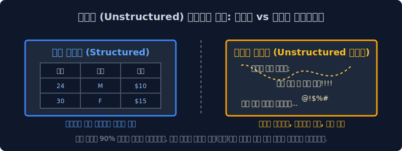

# 1.2 자연언어의 끔찍한 모호성과 텍스트 데이터 계층

기계에게 인간의 언어를 가르치는 것은 왜 극도로 복잡한 확률 편미분 방정식을 푸는 것보다 더 잔혹한 노가다 과정일까요? 이번 챕터에서는 인공지능 엔지니어들을 절망에 빠뜨리는 인간 언어 고유의 확률적 모호성 문제와, 텍스트 데이터만이 가지는 지독한 비정형(Unstructured) 구조에 대해 학술적으로 학습합니다.

---

## 1.2.1 컴퓨터가 멘붕에 빠지는 세계: 2가지 언어 대립

언어는 그 설계 철학과 소비 대상이 기계인지 인간인지에 따라 완전히 두 가지의 대척되는 생태계로 나뉩니다.

### 1. 컴퓨터가 사랑하는 성역: 인공 언어 (Artificial Language)
기계에게 가장 아름다운 언어는 파이썬(Python), C언어, 자바(Java)와 같은 프로그래밍 언어, 혹은 일상생활의 교통 신호등 같은 엄격한 `인공 언어`입니다.
*   **완벽한 엄격성과 흑백논리**: 조금의 예외도 허용하지 않습니다. 조건문에서 `1 + 1`은 언제나 `2`입니다.
*   **감정의 부재**: 코드는 화를 내거나 비꼬지 않습니다. 개발자가 문장 끝에 세미콜론(`;`)이나 괄호 하나를 빼먹으면, 컴파일러는 고민조차 하지 않고 곧바로 `Syntax Error`를 내뿜으며 시스템을 정지시킵니다. 기계는 이런 $100\%$ 예측 가능한 결정론적 환경에서만 안도감을 느낍니다.

### 2. 컴퓨터를 절망에 빠뜨리는 정글: 자연 언어 (Natural Language)
반대로 우리가 실생활에서 숨 쉬듯 쓰는 한국어, 영어 같은 `자연어`는 수학적으로 이 세상에서 가장 예의 없고 제멋대로인 끔찍한 데이터 구조입니다.
*   **모호성(Ambiguity)**: "차 좀 빼주세요" 할 때 '차'가 마시는 차(Tea)인지 타는 차(Car)인지, 혹은 발로 걷어차란 뜻(Kick)인지, 단일 단어의 글자 모양만 봐서는 기계가 절대 모릅니다. 주변 문맥($Context$)을 수학적으로 곁눈질 조사하지 않으면 완벽하게 오답을 냅니다.
*   **엄청난 유연성과 다형성**: *"밥 먹었어?"*, *"식사하셨습니까?"*, *"끼니는 때웠고?"* 이 세 문장은 알파벳 스펠링 배열이 완전히 180도 다르지만, 사람의 뇌파에서는 목적 함수(의미)가 $100\%$ 똑같이 인식됩니다. 스펠링이 다르면 무조건 다르다고 튕겨내는 인공언어 체계에서는 상상도 할 수 없는 대혼란입니다.

> [!WARNING]  
> **📖 초심자를 위한 쉬운 해설: 1차원적인 로봇과의 소개팅**  
> 화난 연인이 팔짱을 끼고 **"나 오늘 별로 안 예쁜 거 같지 않아?"** 라고 물어봤다고 가정해 봅시다.  
> 인공언어(계산기 뇌)를 탑재한 로봇은 이 문장을 곧바로 수식화하여 `If(예쁘다 == False): print("네 팩트 맞습니다.")` 로 연산해 대답했다가 영원히 이별 통보를 받게 됩니다.  
> 자연언어를 처리한다는 것은, 이 엄청난 인간의 '숨겨진 돌려 말하기'와 '기만', '다의어'를 뚫고 진의를 확률적으로 유추해 내야 하는 미친 난이도의 과정입니다.

---

## 1.2.2 텍스트 세계관의 무한 확장 (모든 기호 = 자연어)

과거의 고전 컴퓨터 학자들은 수백 년 동안 사람들의 입 밖에 나온 대화나 '위키백과'의 산문 글쓰기만을 자연언어로 취급했습니다. 하지만 2017년 구글의 트랜스포머(Transformer) 알고리즘이 눈부시게 폭발하면서 텍스트의 인식 범위가 문과적 사고방식을 완전히 파괴하며 무섭게 확장되었습니다.

### 1. 수학적 확률과 패턴이 있는 모든 기호 배열은 '텍스트(자연어)'다!
딥러닝 학계에는 엄청난 철학적 전환이 일어났습니다. *"특정 문법적 규칙이나 일정한 확률 분포를 따르는 시계열 배열(Sequence)이라면, 그것이 한글 알파벳이든 악보의 콩나물 음표든 DNA 염기서열이든 모조리 '텍스트(자연어)' 취급해서 언어 번역기에 학습시킬 수 있다!"*

*   **HTML 및 Code 체계**: 사람들이 깃허브(Github)에 짜둔 수십억 줄의 컴퓨터 코드 소스 기록(이것이 현재 코딩 AI인 Copilot의 원리입니다).
*   **악보 및 기호 체계**: 도-레-미-파 옥타브 순서가 일정한 확률 연쇄(마르코프 체인) 방식으로 존재하는 악보데이터. 
*   **생물정보학(Bio-Informatics)**: 아데닌(A), 시토신(C), 구아닌(G), 티민(T) 문자로 끝없이 이어지는 복잡다단한 인간 유전자 배열 시퀀스 정보.

인공지능 트랜스포머 입장에서는 모차르트의 위대한 악보도 기호가 일정하게 나열된 **"수학적 외계어 자연어"** 로 인식됩니다. 실제로 요즈음 챗GPT의 엔진 아키텍처에 악보를 통째로 쏟아부어 작곡을 시키거나, 신약 개발을 위해 단백질 구조 문자열을 예측하게 만드는 대통합의 마법이 구사되고 있습니다.

---

## 1.2.3 기계가 자연어를 정복하기 위한 4대 고급 임무 (NLP Tasks)

기계가 눈앞에 벌어진 문장들을 완벽히 해독했다고 산업계에서 인정받으려면 기계는 아래의 4가지 파이프라인 과제(Task)를 모두 해결해야 합니다. 

| 수학적 임무 목표 (Goal) | NLP 정식 명칭 (Task) | 실제 비즈니스 머니타이제이션(수익화) 상황 |
|:---|:---|:---|
| **화자의 카테고리 태깅** | **텍스트 분류 (Text Classification)** | "왜 아직도 배송 출발 안 해요?" $\to$ 기계가 글을 읽자마자 CS 부서의 `긴급 환불 불만` 폴더 박스로 강제 배정함 |
| **핵심 맥락 압축** | **문서 요약 (Summarization)** | 500페이지짜리 난해한 주주총회 회의록 PDF 문서 $\to$ 사장님을 위해 3줄로 핵심만 요약한 이메일 초안 자동 발송 |
| **문장 속 감정의 극성 도출** | **감성 분석 (Sentiment Analysis)** | "영화 참~ 눈물 나게 재밌네요 중간에 자느라" $\to$ 비꼬기 확률 $85\%$ 로 계산하여 `극도로 부정(Negative)` 라벨링 (영화 평점 테러러 방어) |
| **언어-시각 대통합 추론** | **멀티모달 (Multi-modal)** | "우주복을 입은 사과가 춤춘다" 라는 텍스트 수학 벡터 입력 $\to$ 해당 텍스트의 확률을 이미지(Pixel) 매트릭스 세계로 매핑하여 실제 고퀄리티 아트웍 이미지 출력 (Midjourney, DALL-E) |

---

## 1.2.4 사람을 미치게 하는 텍스트의 본질: 비정형(Unstructured) 쓰레기 더미

위의 위대한 4대 임무를 완수하기 위해 빅데이터 전문가들이 현실 세계의 텍스트를 막상 열어보면, 그 안에 숨겨진 지독한 **비정형(Unstructured)** 성질에 혈압이 오르게 됩니다.

*   **엑셀과 정형 데이터(Structured Data)**: 컴퓨터가 환장하게 좋아하고 군침을 흘리는 밥입니다. 가로 행(Row)과 세로 열(Column)이 군대처럼 딱딱 맞춰진 나이, 성별, 가격표는 평균값이나 분산 같은 다차원 통계 지표를 뽑아내기 압도적으로 편안합니다.
*   **텍스트 쓰레기장(Unstructured Data)**: 카카오톡 대화방 기록을 다운받아 분석해 본다고 가정합시다. 어떤 상대는 `ㅇㅇ` 한 글자만 보냅니다. 어떤 화가 난 사람은 띄어쓰기 한 번 없이 엔터 연타로 A4용지 3장 분량의 괴문서를 발송합니다. 글자의 길이도, 국어사전 문법도, 감정도, 오타도 완벽히 제멋대로인 이 삐뚤어진 불순물 덩어리를 엑셀표와 같은 **'정해진 차원의 숫자로 된 벡터 매트릭스'** 로 반듯하게 다림질(규격화)해 내지 못하면 모델은 뇌정지에 빠져 평생 단 하나의 통계도 돌리지 못합니다.

이 압도적인 비정형의 쓰레기더미 늪에서 텍스트를 건져 올려 반짝이는 다이아몬드 숫자로 가공해 내는 극한의 노가다 과정, 그것이 바로 다음 장에서 다룰 **텍스트 마이닝 파이프라인(Text Mining Pipeline)** 의 눈물겨운 여정입니다.
