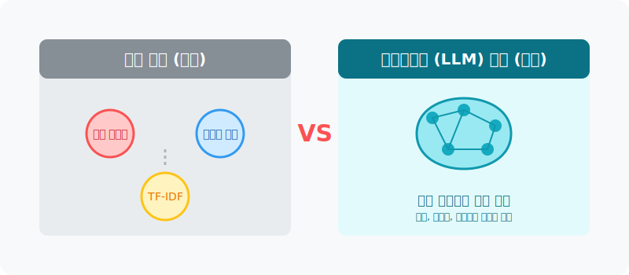
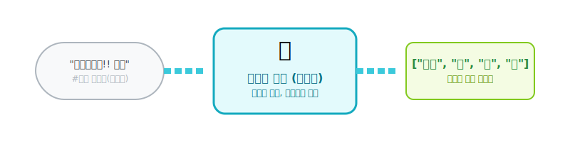
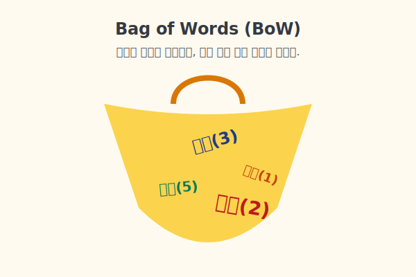
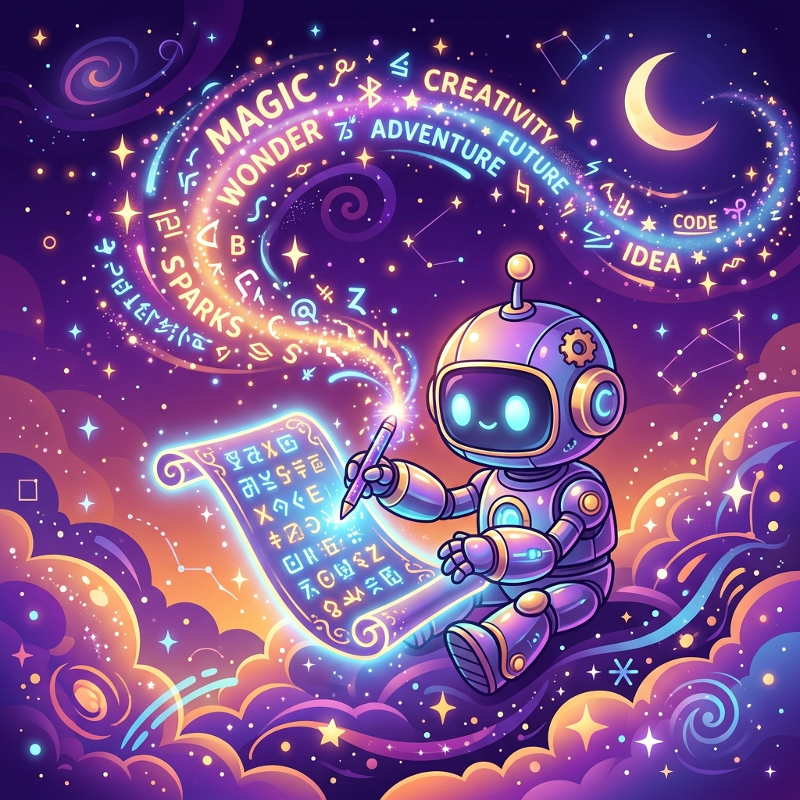
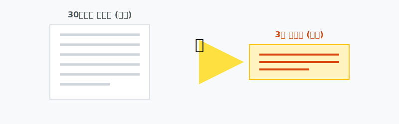
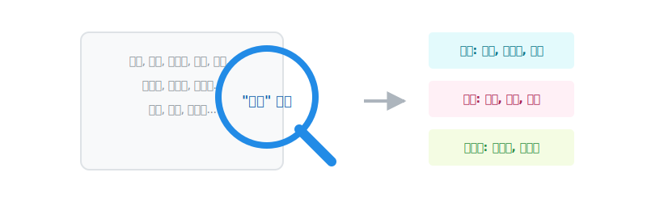
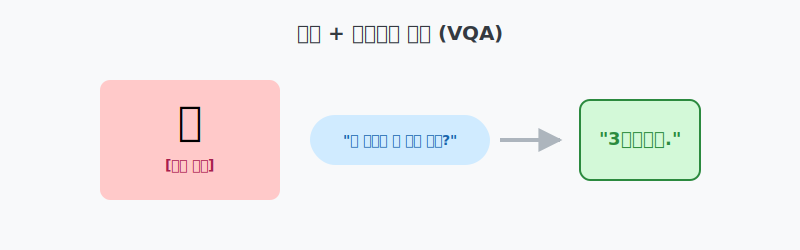
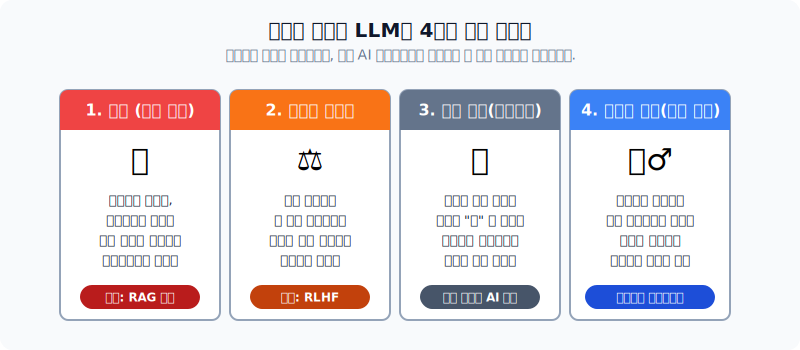
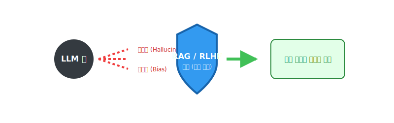

# 자연언어처리 기법의 발전과 활용 사례

이 문서는 초보자를 위해 기초 자연어처리(NLP)의 최강 도구인 '트랜스포머'의 작동법과 다양한 실생활 활용 사례를 재미있는 비유와 시각 자료로 상세히 다룹니다.

---

## 00. 자연언어처리 기법 및 활용 사례
본격적으로 텍스트 마이닝 내에서 자연어처리 기법이 어떻게 인간의 일을 돕는지 알아봅니다.

> [!NOTE]  
> **📖 초심자를 위한 쉬운 해설**  
> AI는 이제 단순 계산기가 아닙니다. 기획안 작성, 영어 번역, 기사 요약, 그림 그리기 등 지적인 사무 업무 전체를 당신 옆에서 함께 보조해 주는 "만능 인턴"으로 진화했습니다.

## 01. NLP의 영역
자연언어처리는 주로 거대한 분석 프로젝트의 **텍스트 전처리**와 **분석** 과정에 전방위로 참여합니다.

> [!TIP]  
> **📖 초심자를 위한 쉬운 해설**  
> `전처리`는 요리하기 전에 감자 껍질을 깎고 불순물을 제거하는 작업입니다.  
> `분석`은 깨끗해진 감자를 가지고 이 요리가 무슨 요리인지 카테고리를 분류하거나(문서 분류), 감자스프를 만드는(문서 생성) 등 진짜 요리가 이루어지는 멋진 과정입니다.

## 02. 자연언어처리 기법의 패러다임 변화
최근 NLP 기술은 통계 카운트에서 거대한 LLM 빙하로 혁명적 전환을 맞았습니다.

> [!WARNING]  
> **📖 초심자를 위한 쉬운 해설**  
> 옛날 통계 기반 기법은 "이 문서에 '최고'라는 단어가 15번 나왔으니 긍정적인 글!"이라고 점수를 계산하는 계산기와 같았습니다. 빠르고 확실하죠.  
> 하지만 현대의 LLM(트랜스포머)은 비꼬는 말장난, 농담, 숨겨진 슬픔 같은 맥락 전체를 아예 스스로 파악해 버리는 거의 사람 뇌 수준의 통찰력을 가지게 되었습니다.

## 03. 통계기반 접근: 데이터 전처리
문자들을 기계가 취급할 수 있게 방해물(노이즈)을 덜어내는 단계입니다.

> [!NOTE]  
> **📖 초심자를 위한 쉬운 해설**  
> 인터넷 댓글 데이터는 욕설, 이모티콘, 오타, 띄어쓰기 오류가 난무하는 쓰레기 더미 수준입니다.  
> 이 텍스트 덩어리를 씻어서 `["나", "는", "오늘", "밥", "을"]` 처럼 깨끗한 작은 조각(토큰) 단위로 예쁘게 자르는 것이 바로 전처리의 핵심입니다.

## 04. 원-핫 인코딩 (One-hot encoding)
단어를 벡터 숫자로 바꾸는 가장 다루기 쉬운 고전 방법 중 하나입니다.

> [!IMPORTANT]  
> **📖 초심자를 위한 쉬운 해설**  
> 100만 단어가 있는 국어사전 출석부를 상상해 보세요.  
> '사과'라는 단어가 5번 학생이라면, 5번 칸에 손을 번쩍 들게(1을 넣음) 하고, 나머지 999,995개의 칸은 전부 결석(0) 자리에 둡니다.  
> 직관적이지만 빈칸(0)이 너무나도 많아서 메모리 낭비가 끔찍하게 심한 방식(`희소성(Sparsity) 문제`)입니다.

## 05. Bag of Words (BoW)
출현 빈도를 고려한 텍스트 데이터의 수치화 표현 방법입니다.

> [!TIP]  
> **📖 초심자를 위한 쉬운 해설**  
> 문장이 끝났는지, "너가 나를 때렸다"인지 "내가 너를 때렸다"인지 문법 어순은 싹 무시합니다.  
> 텍스트 전체를 커다란 자루(Bag)에 쓸어 넣고 막대기로 저은 다음, "사랑이란 단어는 주머니에 3개, 이별은 1개가 들어있네?" 라고 주사위 빈도수만 계산하는 재밌지만 조금 무식한 텍스트 분석 기법입니다.

## 06. LLM기반 접근: Transformer
현대 무적의 딥러닝 기술인 **LLM의 핵심 아키텍처**입니다. 전 세계 AI계를 지배하고 있습니다.

> [!NOTE]  
> **📖 초심자를 위한 쉬운 해설**  
> 챗GPT가 똑똑한 이유는 바로 이 트랜스포머의 **'자기 집중(Self-Attention)'**이라는 기능 때문입니다.  
> "그녀가 은행에 가서 돈을 넣었다. 거기는 추웠다." 라는 문장을 읽었다고 칩시다. 여기서 '거기는'이 도대체 어딜 나타내는 건지 컴퓨터는 기가 막히게 '은.행.' 이라고 단어들의 시선을 집중시켜서 맥락을 찾아내는 마술을 부립니다.

## 07. 활용사례: 문서 분류
텍스트를 입력으로 받아, 미리 정해놓은 서랍(카테고리) 중 어디에 속하는지 예측합니다.

| 분류 사례 | 목적 | 비유적 설명 |
|:---|:---|:---|
| **스팸 필터링** | 이메일의 메일함 격리 | 메일함 입구에 서 있는 "경비원 아저씨" |
| **뉴스 카테고리화** | (정치/경제/사회) 자동 분류 | 신문사 1면에 기사를 척척 꽂아주는 "속독왕" |

## 08. 활용사례: 문서 생성
입력 자연어를 기반으로 하여 완전히 새로운 문장을 논리적으로 만들어냅니다.

> [!TIP]  
> **📖 초심자를 위한 쉬운 해설**  
> "신데렐라와 해리포터가 만나는 소설 10장 써줘"라는 프롬프트를 치면, AI가 마치 창작의 요정이 된 것처럼 무에서 유를 창조해 냅니다. 기계가 앵무새를 넘어 소설가 지위를 넘보게 된 영역입니다.

## 09. 활용사례: 문서 요약
수많은 텍스트 문단에서 가장 극적인 중심 내용을 자동 추출하여 요약합니다.

> [!NOTE]  
> **📖 초심자를 위한 쉬운 해설**  
> 직장인들의 꿈의 기술입니다!  
> 아침에 읽어야 할 수십 장짜리 정부 정책안 텍스트를 강력한 프레스 기계에 넣고 쭈욱 짜내어, 핵심 과즙만 남은 딱 "3줄 요약"만 여러분의 모니터에 던져주는 시간을 지배하는 기술입니다.

## 10. 활용사례: 감성 분석
텍스트에 나타난 사람들의 성향과 감정을 통계적으로 차갑게 꿰뚫어 봅니다.

| 분석 데이터 자원 | 도출 결과 예시 |
|:---|:---|
| **배달의 민족, 영화 리뷰** | "면이 다 불었네요(별 1개)" -> **강력한 부정 감지!** |
| **선거철 트위터 데이터** | A후보 언급 데이터 분석 -> **우호적 민심 67% 판별!** |

## 11. 활용사례: 토픽 모델링
문서더미 속 어딘가에 은닉되어 있는 추상적인 '주제(Topic) 섬'을 돋보기로 발견하는 과정입니다.

> [!IMPORTANT]  
> **📖 초심자를 위한 쉬운 해설**  
> 문서들을 읽고 미리 정해진 서랍에 넣는 것(07. 분류)과는 달라도 완전히 다릅니다!  
> 정해진 서랍조차 없는데 기계가 1년치 인터넷 게시글을 쭉 읽어보더니 "어? 유독 사람들이 '테슬라', '자율주행차' 라는 단어들을 막 같이 몰아서 쓰네요? 이거 하나의 '뜨는 주제'인 것 같은데요?!" 라며 **아무것도 없는 빈 땅에서 스스로 유행하는 토픽을 그룹화**해서 사장님에게 제시해 주는 마법 같은 통계 기법입니다.

## 12. 활용사례: 기계 번역
한 나라의 언어를 인코더-디코더 구조로 문맥을 파악한 뒤 타 언어로 자연스럽게 통역합니다.

| 종류 | 특징 및 설명 |
|:---|:---|
| **과거: 단어장 번역** | `Apple=사과` 단어를 일대일 치환. 문맥을 전혀 몰라서 이상한 외계어가 탄생함. |
| **현재: 딥러닝 번역** | 문장 전체 느낌을 모조리 흡수(인코더)한 후, 스무스하게 뱉어냄(디코더) (예: 파파고, 딥플). |

## 13. 활용사례: 멀티모달 모델 (VQA)
VQA (Visual Question Answering), 사진을 볼 수 있고 글도 쓸 줄 아는 눈과 입이 결합된 기술입니다.

> [!TIP]  
> **📖 초심자를 위한 쉬운 해설**  
> 시각장애인 분들에게 엄청난 혁명입니다. 강아지 사진을 딱 올려놓고 기계에게 문자로 "이 동물이 지금 자고 있니 달리고 있니?" 라고 물어보면, 눈(컴퓨터 비전)으로 상황을 인식하고 입(NLP)으로 "소파 위에서 자고 있습니다" 라고 텍스트로 대답해 주는 환상적인 콜라보입니다.

## 14. 활용사례: 멀티모달 모델 (Text-to-Image)
글로 묘사된 프롬프트 명령어를 완벽히 해석하여 그에 맞는 고화질 이미지를 즉시 창조합니다.

> [!NOTE]  
> **📖 초심자를 위한 쉬운 해설**  
> "분홍색 헬멧을 쓴 고양이가 우주에서 커피를 마시는 팝아트!" 라고 글로 적으면, 단 번에 컴퓨터가 상상력을 발휘해 진짜로 고퀄리티 그림을 토해냅니다 (Midjourney, DALL-E 등).

## 15. LLM 기반 자연어처리의 한계점 (1)
만능으로 보이지만 치명적이고 무서운 부작용 4마리입니다.

*   **환각 (Hallucination)**: 존재하지도 않는 위인전, 세종대왕의 아이폰 던짐 사건 같은 거짓말을 진짜인 것처럼 당당하게 소설로 적어냅니다.
*   **편향성 (Bias)**: 학습한 인터넷 댓글에 있던 남녀노소 차별, 인종차별 데이터를 뱉어냅니다.
*   **블랙박스**: 왜 이런 답변이 나왔는지 수천억 개 변수 속에서 아무도 그 인과관계를 증명할 수 없습니다.
*   **유용성의 반항**: 가끔 시스템 프롬프트(이모지 쓰지 마)를 제멋대로 무시하고 자기 맘대로 답을 내놓습니다.

## 16. LLM 기반 자연어처리의 한계점 (2) - 보완 기법
위의 미친 단점들을 억제하는 강력한 통제 방패 기술들입니다.

> [!IMPORTANT]  
> **📖 초심자를 위한 쉬운 해설**  
> *   **환각 방어막 (RAG)**: AI가 헛소리(환각)를 못 하도록, 밖에서 "회사 공식 매뉴얼"을 미리 억지로 건네주면서 "야 너 없는 소리 지어내지 말고, 이 PDF 책상 위에 올려둔 거에서만 읽어보고 답해!"라고 가두는 검색 기반 보조 기법(결합형)입니다.
> *   **순응성 교육 (RLHF)**: AI가 인종차별이나 욕설을 할 때마다 사람(평가자)이 "너 방금 마이너스 5점이야!"라고 혼을 내면서, 점점 착하고 말 잘 듣는 AI로 조련시키는 훈련법입니다.

## 17. 자연어처리 기법 선택의 기준
모든 실무 과정에서 무조건 무겁고 비싼 최신 LLM만 도입하는 것은 어리석습니다.

| 기준 요소 | 통계 기반 기법 (TF-IDF 등) | 딥러닝 LLM (ChatGPT 등) |
|:---|:---|:---|
| **결과 설명(보고서)** | 100% 명확히 증명 및 설명 가능 엑셀화 가능 | ❌ 불가능 (블랙박스) |
| **컴퓨팅 유지비용** | 일반 사무용 노트북 1대로 1초 만에 끝냄 | 수억 원의 거대 GPU 서버 펑펑 돌아감 |
| **고객 응대력(문맥)** | 눈치 없음, 단일 단어만 찾음 | 세계관 최고의 눈치와 창작력 |

> [!TIP]  
> **📖 초심자를 위한 쉬운 해설**  
> 스팸 이메일 하나 걸러내는데 수억짜리 챗봇 엔진을 돌리는 건 파리 잡는데 대포를 쏘는 격입니다!  
> 상황, 자금, 보고해야 할 상사의 취향을 분석하여 가성비 좋은 **통계반**과 엄청난 **LLM** 중 최적의 무기를 고르는 똑똑한 엔지니어가 되어야 합니다.
