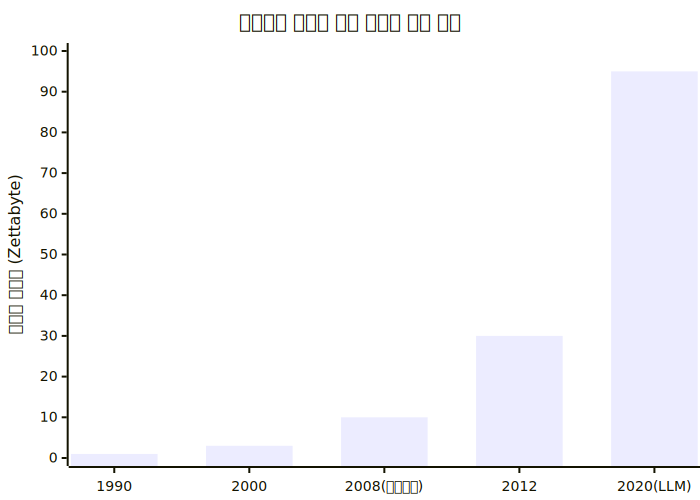

# 자연언어의 끔찍한 모호성과 텍스트 특성

기계에게 인간의 언어를 가르치는 것은 왜 수학 난제를 푸는 것보다 더 잔혹한 과정일까요? 이번 챕터에서는 인공지능 엔지니어들을 절망에 빠뜨리는 인간 언어 고유의 모호성 문제와 텍스트 데이터만이 가지는 지독한 비정형 구조에 대해 학습합니다.

---

## 00. 컴퓨터가 멘붕에 빠지는 세계: 2가지 언어 대립
언어는 대상이 기계인지 인간인지에 따라 완전히 두 가지의 다른 생태계로 나뉩니다.

### 컴퓨터가 좋아하는 세계: 인공언어 (Artificial Language)
기계에게 가장 아름다운 언어는 파이썬(Python), C언어, 교통 신호등 체계 같은 `인공언어`입니다.
*   **완벽한 엄격성**: 조금의 예외도 허용하지 않습니다. `1 + 1`은 언제나 `2`입니다.
*   **감정의 부재**: 코드는 화를 내거나 비꼬지 않습니다. 세미콜론(`;`)이나 괄호 하나를 빼먹으면 곧바로 프로그램이 뻗어버리는 무자비하고 차가운 논리 체계입니다. 기계는 이런 100% 예측 가능한 흑백 논리 환경에서만 안도감을 느낍니다.

### 컴퓨터를 절망에 빠뜨리는 세계: 자연언어 (Natural Language)
반대로 우리가 실생활에서 쓰는 한국어, 영어 같은 `자연어`는 수학적으로 이 세상에서 가장 예의 없고 제멋대로인 끔찍한 데이터 구조입니다.
*   **모호성(Ambiguity)**: "차 좀 빼주세요" 할 때 '차'가 마시는 차(Tea)인지 타는 차(Car)인지, 글자만 봐서는 절대 모릅니다. 주변 문맥(Context)을 살피지 않으면 오답을 냅니다.
*   **엄청난 유연성**: "밥 먹었어?", "식사하셨습니까?", "끼니는 때웠고?" 이 3문장은 글자 배열이 완전히 다르지만 사람 뇌에서는 뜻이 100% 똑같이 인식됩니다. 인공언어 체계에서는 상상도 할 수 없는 대혼란입니다.

> [!WARNING]  
> **📖 초심자를 위한 쉬운 해설: 소개팅에서의 대화 오류**  
> 소개팅에서 기분 상한 상대방이 "저 오늘 별로 안 예쁜 것 같아요"라고 말했다고 칩시다.  
> 인공언어(계산기 뇌)를 탑재한 로봇은 `안 예쁘다 == True` 로 즉시 연산하여 "네 팩트 맞아요, 좀 붓고 못생겨 보이네요"라고 대답했다가 물벼락을 맞게 됩니다.  
> 자연언어를 처리한다는 것은 이처럼 복잡한 인간의 '돌려 말하기'와 '감정의 소용돌이'를 수학적 뇌로 해독해 내야 하는 과정입니다.

## 01. 확장되는 자연언어의 세계 (모든 기호 = 텍스트)
과거의 고지식한 컴퓨터 학자들은 사람들의 '입 밖으로 나온 대화나 책 내용'만을 자연언어로 취급했습니다. 하지만 딥러닝이 눈부시게 발전하면서 텍스트의 인식 범위가 문과적 사고를 파괴하며 무섭게 확장되었습니다.

### 수학적 확률과 패턴이 있는 모든 기호는 '자연어'다!
"문법적 규칙이나 일정한 확률 분포를 따르는 시퀀스(연속된 배열)라면, 그것이 한글 알파벳이든 악보 콩나물이든 DNA 염기서열이든 모조리 텍스트(자연어) 취급해서 번역기에 학습시킬 수 있다!" 라는 경이로운 발상의 전환이 일어났습니다.

*   **문서 및 코드 체계**: 매일 쏟아지는 뉴스, 소설, 그리고 사람들이 깃허브(Github)에 짜둔 수십억 줄의 컴퓨터 코드 소스 기록.
*   **악보 및 기호 체계**: 도-레-미-파 옥타브 순서가 확률적으로 존재하는 음표 기호들.
*   **생물학 정보 구조**: A, C, G, T 문자로 이어지는 복잡한 인간 유전자 배열 정보.

인공지능 입장에서는 모차르트의 위대한 악보도 "일정하게 띄어쓰기가 된 규칙적인 외계어 텍스트"로 인식됩니다. 실제로 요즈음 챗GPT 뱃속의 트랜스포머 알고리즘에 악보를 통째로 쏟아부어 작곡을 시키거나, DNA 서열을 예측하게 만드는 마법이 구사되고 있습니다.

## 02. 자연어를 정복하기 위한 4대 기계 임무 (Tasks)
기계가 눈앞에 주어진 아무 문장을 "완벽히 씹고 이해했다"라고 사람들에게 인정받으려면 다음의 4가지 질문에 답할 수 있어야 합니다. 각 질문은 실제 IT 시장에서 비싸게 팔리는 고부가가치 AI 서비스와 직결됩니다.

| 기계에게 던지는 질문 (Goal) | 산업화된 AI의 임무 (NLP Task) | 일상 속의 예시 상황 |
|:---|:---|:---|
| **"네가 읽은 이 고객의 진짜 의도가 뭐니?"** | **의도 분석 및 카테고리 분류** | "진짜 이따구로 장사할겁니까?" -> `긴급 환불 불만 건` 폴더 배정 |
| **"너무 긴데, 딱 3줄로 핵심만 요약해 봐"** | **문서 요약 (Summarization)** | 50페이지짜리 회의록 문서 -> 3줄 요약 메일 초안 작성 |
| **"글에서는 칭찬하는데, 진짜 뉘앙스는 뭐지?"** | **감성 분석 (Sentiment)** | "오 배송 참~ 빠르네요 한달만에 오고" -> `극도로 빡침(부정)` 라벨링 |
| **"이 글이 저 사진의 상황과 무슨 연관이 있지?"**| **멀티모달 (Multi-modal)** | 강아지가 뛰는 영상 생성 (텍스트를 이미지와 병합 해석) |

## 03. 사람을 미치게 하는 텍스트의 성질 (비정형 데이터)
이러한 임무를 수행하기 위해 빅데이터 전문가들이 텍스트를 열어보면, 그 안에 숨겨진 지독한 성질 3가지에 부딪히게 됩니다. 가장 큰 문제는 텍스트가 **비정형(Unstructured)** 하다는 것입니다.

*   **엑셀과 정형 데이터(Structured Data)**: 컴퓨터가 환장하게 좋아하는 밥입니다. 가로세로 줄이 군대처럼 딱딱 맞춰진 가격표와 시간표는, 통계를 돌리기 압도적으로 쉽습니다.
*   **텍스트 트래시(Unstructured Data)**: 카톡 대화록을 다운받아 보십시오. 어떤 사용자는 `굿` 한 글자만 보냅니다. 어떤 화난 악플러는 띄어쓰기 한 번 없이 A4용지 3장 분량의 괴문서를 보냅니다. 길이도, 문법도, 감정도 제멋대로인 이 삐뚤어진 불순물 덩어리를 엑셀표처럼 '숫자'로 반듯하게 닦아(규격화) 넣지 못하면 AI는 뇌 정지에 빠져 영원히 단어 하나 읽지 못합니다.

## 04. 텍스트 마이닝의 원동력: 정보의 대폭발
텍스트는 더럽고 모호하여 다루기 힘들지만, 2010년대 스마트폰 혁명 이후 트위터, 페이스북, 인스타그램 등 소셜 미디어가 탄생하면서 인류가 쏟아내는 글자 텍스트의 양은 우주 팽창 속도로 폭발해 버렸습니다.

### 데이터 쓰레기장이 만들어낸 괴물 AI
과거 학자들은 저작권이 있는 정제된 책 기사 1만 개만 모아도 "와 데이터셋 대박이다!" 외쳤습니다. 
그러나 지금은 나무위키, 디시인사이드, 레딧 등에서 필터 없이 쏟아지는 수경(1경 = 10,000조) 단위의 방대한 인터넷 잡담 텍스트 데이터들을 로봇이 통째로 진공청소기처럼 긁어모아 딥러닝 입맛에 먹여줍니다. 
이처럼 전 세계 모든 인간들의 대화 조각들이 거대한 데이터 은하계를 팽창시켰고, 역설적이게도 이 무한한 잡동사니 쓰레기 텍스트 더미가 컴퓨터를 문법의 신, 대화의 신으로 각성시킨 압도적인 밑거름이 되었습니다.

