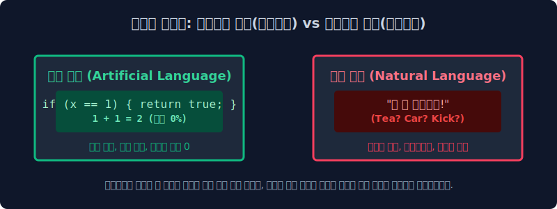
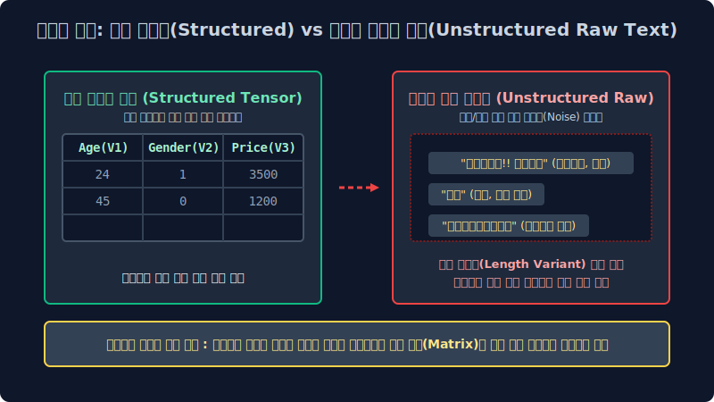

# 1.2 인간 언어 객체의 확률적 모델링 모호성과 비정형(Unstructured) 텐서 데이터 계층 아키텍처

기계 알고리즘 모델에게 인간의 다변수 확률 언어를 가르치고 학습시키는 시스템 레이어 구축은 왜 거대한 고등 미적분 확률 편미분 방정식을 수학적으로 푸는 것보다 더 잔혹하고 파편화된 엔지니어링 병목 코스트 과정일까요? 이번 챕터 파이프라인에서는 텍스트 인공지능 통계 엔지니어들을 절망의 극단에 빠뜨리는 인간 언어 모수 고유의 압도적인 확률적 모호성 오차 연쇄 문제 딜레마와, 자연어 텍스트 데이터만이 가지는 지독한 픽셀 부재 비정형(Unstructured Density) 텐서 구조 한계에 대해 학술 엔진의 관점에서 밀도 있게 학습합니다.

---

## 1.2.1 컴퓨터 컴파일러가 OOM 에러 멘붕에 폭발하는 세계관: 2가지 언어 대수 대립 모델링

언어 벡터 도메인은 그 언어 지표의 시스템 논리 설계 철학과 해석 소비 파싱 모델 코어 대상이 폰 노이만 방식 기계 컴파일러인지, 아니면 유기체 인간인지에 따라 완전히 독립된 두 가지의 기하학적 대척되는 패러다임 생태계 매핑으로 완전히 나뉩니다.

### 1. 컴퓨터 시스템이 사랑하는 무결점 매핑 성역: 인공 규칙 언어 체계 (Artificial Rule-based Language)
기계 엔진에게 가장 공학적으로 수학 연산이 아름다운 확률 1.0 체제 언어는 모델이 결정된 파이썬(Python), 컴파일 C언어 텐서, 자바스크립트 모듈과 같은 정형 프로그래밍 종속 언어 체계, 혹은 일상생활의 이진 신호등 교환 같은 엄밀 통제 엄격한 `인공 언어 모수`망입니다.
*   **완벽한 제어 엄격성과 흑백논리 분기**: 조금의 예외 단절 오차 스무딩도 절대 시스템에서 허용하지 않습니다. 조건부 확률 종속 변동 값이 없이 `1 + 1` 루프는 이 세상이 멸망해도 언제나 `2` 해시로 단일 매핑 귀결됩니다.
*   **감정 다변수 파편의 부재**: 컴파일 모델 소스 코드는 자체 외부 상황을 인지해 화를 랜덤으로 방출하거나 파라미터를 비꼬지 않습니다. 시스템 개발자가 코드 텐서 블록 문장 파이프라인 끝에 세미콜론(`;`) 객체나 참조 괄호 변수 하나를 문법에서 빼먹으면, 인터프리터 컴파일러는 맥락의 확률 보간 예측 고민조차 아예 하지 않고 곧바로 예외 없는 `Syntax Error (치명적 구문 단절 에러)` 코드를 즉각 모델 시스템으로 내뿜으며 전체 연산 시스템 레이어를 즉시 강제로 정지 셧다운 시킵니다. 기계 메모리는 오직 이런 확률 오차가 원천 봉쇄된 $100\%$ 결정론적(Deterministic) 독립 귀결 환경에서만 무결 연산 안도감을 파싱 느낍니다.

### 2. 컴퓨터 대수망을 절망 에러에 폭발 빠뜨리는 무법지대 정글: 자연 인간 언어 계층 (Natural Probability Language)
반대로 유기체 인간 노드들이 실생활 사회 도메인에서 자유롭게 숨 쉬듯 통신 교환해 대량 발생시키는 한국어 유니코드, 영어 알파벳 토큰 같은 `자연어 코퍼스` 통계 배열은, 컴퓨터 공학 수학 처리 파이프라인 관점에서 볼 때 공간 인퍼런스 상 이 세상에서 가장 예의 없고 확률 지배가 제멋대로 난립 오버랩된 끔찍한 오차율 최악의 불확실 텐서 데이터 구조망입니다.
*   **다의성과 모호성(Ambiguity Overlap)**: "차 좀 수리 빼주세요" 할 때 객체 카운트 토큰인 형태소 파라미터 '차'가 관측 발생 시, 이것이 끓여 마시는 차 객체(Tea Variable)인지 바퀴 달린 자동차 객체(Car Variable)인지, 혹은 분노로 발로 걷어차란 은닉 동사 명령(Kick Intent)인지, 단일 독립 단어 벡터의 글자 픽셀 모양 표면만 봐서는 확률 기계 엔진이 절대 우위를 선별 판단 예측 모릅니다. 타겟 단어 앞뒤로 둘러싼 연쇄 다변 길이의 주변 문맥망 확률($Context Vectors$)을 거대 수학적 마르코프 체인으로 곁눈질 의존 조사 병합 계산하지 않으면 시스템은 완벽하게 잘못된 분기 오답 매핑을 파손 발생시킵니다.
*   **엄청난 확률적 유연성과 구문 다형성 텐서(Polymorphism)**: *"밥 제때 먹었어?"*, *"진지 식사하셨습니까?"*, *"오후 끼니는 때웠고?"* 이 독립된 문장 인퍼런스 배열 세 개는 겉보기 알파벳 유니코드 스펠링 차원 배열 스펙이 완전히 180도 이질적으로 다름에도 불구하고, 수신 인간 노드의 뇌파 시스템 파싱에서는 발화 목적 벡터 함수(의도 시맨틱 Meaning)가 오차율 0%로 $100\%$ 완벽 똑같이 동치(Equivalent) 군집 인식 매핑 수렴됩니다. 텍스트 스펠링 형태가 유니코드 수치로 틀리면 무조건 전혀 다른 독립 에러 변수라고 엄격하게 튕겨내는 인공언어 컴파일러 구문 체계에서는 이 다형성이야말로 수학 상상도 할 수 없는 대 혼란 대수 파단 결함 에러입니다.

> [!WARNING]  
> **📖 컴파일 초심 모델러를 위한 쉬운 해설 직관 비교: 1차원적인 규칙 기계 로봇과의 소개팅 통계 파탄기**  
> 모종의 이벤트로 화난 연인 파라미터가 외부 변수로 발동해 팔짱을 끼고 **"나 방금 오늘 메이크업 별로 하나도 안 예쁜 거 같지 않아?"** 라고 챗봇에게 입력 물어봤다고 가정해 봅시다.  
> 인공언어 로직(1차원 단순 구문 치환 계산기 뇌파)만을 탑재한 1세대 모델 깡통 로봇 챗은, 이 인간의 유전자 배열 문장을 파이썬 구문으로 곧바로 하드 수식화 치환 평가하여 `If (Boolean(예쁘다) == False): return print("네 입력받은 팩트대로 모델 관측상 False 안 예쁜 거 벡터로 맞습니다.")` 로 일차원 반사 연산해 대답 응답했다가 그날 시스템이 영원히 박살 나고 초기화 이별 통보를 받게 셧다운 당하게 됩니다.  
> 인간의 자연언어를 기계가 모델로 수렴해 확률 처리한다는 것은, 이 엄청나게 오버랩된 통계적 인간의 '숨겨진 은닉 돌려 말하기 빙빙 도는 예측(Sarcasm)'과 '감정 기만(Deception)', '다의어 오버랩(Polysemy)' 파라미터를 역으로 뚫고 미적분하여 숨은 진짜 내부 진의 레이블을 베이즈 정석 확률적으로 다면 유추해 역산(Reverse Inference Extraction)해야 하는 미친 모델링 차원의 지옥 난이도 설계 극복 과정입니다.

---

## 1.2.2 비정형 텍스트 유니버스 세계관의 한계 파괴 무한 텐서 확장 (Sequence 기호 배열 = 광의의 자연어 맵핑)

고전 컴퓨터 공학 전산 학자들과 통계 분석가들은 과거 수십수백 년 동안 오직 인간의 입 목소리 밖에 나온 파동 소리 대화 텍스트나 책 혹은 현대 '위키백과 문서'의 구문 산문 글쓰기 텍스트만을 협소하게 '자연언어 분석 대상(NLP Domain)'으로 국한 취급 제한했습니다. 하지만 2017년 구글의 어텐션 기반 거대 변환기 모델, **트랜스포머(Transformer)** 어텐션 알고리즘 아키텍처가 딥러닝 차원에 눈부시게 폭발 강림하면서 기계가 인지 다루는 텍스트 차원의 인식 범위 경계가 언어학적 문과적 사고방식을 완전히 한계 파괴하며 무섭고 거대하게 통합 차원 타 도메인으로 무한 확장 퀀텀 점프되었습니다.

### 1. 수학적 조건 확률망과 시퀀스 패턴이 존재하는 모든 기호 텐서 배열은 전부 다 '텍스트(넓은 의미의 자연어 모수)'다!
딥러닝 공학 학계 전체에는 엄청나게 거대한 수학적 철학론적 융합 패러다임 메가 전환이 일어났습니다. *"만약 거대 데이터에 특정 문법적 의존 규칙 체계 로직이나 일정한 고르지 못한 조건 확률 분포 마르코프 패턴망을 따르는 공간 시계열 나열 배열 모수(Sequence Time-series Factor)라면, 그것이 한글 알파벳 코퍼스이든 피아노 악보의 이산 콩나물 음표 주파수 시퀀스이든, 바이오 DNA 복합 유전자 염기서열 밀도이든 모조리 거대 수학적 모델에서 '텍스트(자연어 모달리티)' 배열 차원 행렬로 동일 취급해서, NLP 언어 번역기 생성 모델망에 일괄 들이부어 거대 확률 피팅 역산 학습시킬 수 있다!"*

*   **HTML 객체 스크립트 및 Code 구문 기계 체계망**: 전 세계 사람들이 깃허브(Github)에 수십 년간 덩어리로 짜둔 수백억 라인 줄의 컴퓨터 소스 코드 논리 아카이브 거대 기록 텐서. (이 방대한 규칙 문법 배열을 거대 언어 모델 LLM에 쏟아부어 마스터 학습 시킨 것이 바로 현재 마이크로소프트의 극강 자동 코딩 머신 생성 AI 어시스턴트인 **Copilot(코파일럿)** 모델의 근원 확률 베이스 원리 통계입니다).
*   **음악 작곡 악보 및 심볼 기호 시퀀스망 체계**: 피아노의 도-레-미-파 음계 소리 주파수 옥타브 순서 진행 방식이 아무렇게나 랜덤이 아니라, 반드시 일정하게 파편 확률 연쇄(마르코프 체인 이전 앞 노트에 의존 조건부 확률 발생) 방식으로 존재하는 방대한 미디(MIDI) 모수 악보 데이터 배열셋 벡터. 
*   **생물정보학 바이오 의학 시퀀스(Bio-Informatics Sequence Base)**: 단백질 구조 아데닌(A), 시토신(C), 구아닌(G), 티민(T) 4종 문자로 기괴하고 끝없이 거대 공간으로 연결 이어지는 복잡다단한 인간 유전자 DNA 배열 구조 쌍 시퀀스 텍스트 매핑 정보망.

인공지능 트랜스포머 파이프라인의 언어 엔진 수학 모델 입장에서는 베토벤이나 모차르트 피아노의 위대한 영감의 악보 배열조차, 단순히 시퀀스 심볼 기호가 일정하게 이산 확률로 일렬 나열된 **"방대한 차원의 수학적 외계 이산어 다항 자연어 텍스트 시퀀스(Discrete Natural Vector)"** 로 동일 매핑 인식 확률 추론됩니다. 실제로 가장 핫한 최신 딥러닝 공학 요즈음 챗GPT 텐서 백엔드 엔진 아키텍처에 피아노 악보 유니코드를 통째로 언어처럼 쏟아부어 다음 단어 대신 다음 작곡 노트 심볼을 예측 생성하게 언어처럼 변환 작곡을 시키거나, 신약 개발 단백질 시뮬레이터를 위해 거대 단백질 구조 문자열 화학 기호열을 다음 텍스트 생성을 통해 확률 예측하게 매핑 연산시키는 대통합 추론 확률 마법 모델 아키텍처가 실무에 놀랍게 구사 매핑 통용 연산되고 있습니다.

---

## 1.2.3 인퍼런스 기계가 야생 자연어를 완전 정복 맵핑하기 위해 수렴해야 하는 산업용 4대 고급 임무 기준 (NLP Pipeline Core Tasks)

통계 기계 엔진이 눈앞 외부 스크립터 포트에 쏟아져 유입 벌어진 입력 문장 배열 뷰들을 확률을 통해 완벽히 수학적으로 의도 해독 검출했다고 산업계 마이닝계에서 스코어 인정받으려면 최적 기계 모델은 의무적으로 아래의 거대한 데이터 분류 4가지 기본 파이프라인 컴파일 과제(Main Task Metrics)를 모두 백엔드 해결 검출해야 합니다. 

| 딥러닝 수학적 확률 최적화 임무 목표 (Mathematical Goal Optimization) | NLP 텍스트 정식 명칭 프로세스 (Pipeline Task Method) | 실제 AI 비즈니스 머니타이제이션(현업 수익화) 적용 컴포넌트 시스템 상황 |
|:---|:---|:---|
| **문서 전체 은닉 의도 화자의 고유 매핑 클래스 조건 카테고리 태깅 할당 분류망** | **텍스트 자율 분류 엔진 (Text Classification Distribution)** | 유저 QnA 유입 보드: "왜 결제했는데 아직도 배송 출발 이동 안 해요 화나게" $\to$ 기계가 텍스트 벡터 밀도를 확률 스캔하자마자 CS 부서 시스템의 `04번: 오배송/긴급 환불 불만 제기` 분류망 폴더 DB 박스로 확률 강제 할당 다이렉트 배정함 |
| **다차원 문맥 요지 핵심 맥락 확률 피처 가중치 위주 문장 구조 배열 최적 변환 압축** | **장문 코퍼스 문서 생성 요약 엔진 (Document Summarization Vectoring)** | 거래처의 500페이지 분량짜리 방대하고 난해 복잡한 장문의 비즈니스 연간 주주총회 정보 회의록 PDF 덩어리 문서 배열 $\to$ CEO 사장님 임원 보고를 위해 시퀀스 핵심 텐서 피처만 3~4줄로 텍스트 축출 스캔하여 요약 압축한 이메일 자동 보고 초안 자동 생성 배포 발송 |
| **은닉 토큰 문장 스태킹 분포 속 발화자 감정 벡터의 다변 선형 극성 밀도 역추적 도출 분기** | **다차원 감성 확률 마이닝 분석망 (Sentiment Polarity Analysis)** | "이번 신작 영화 트렌치 참~ 대박 눈물 나게 감동적이고 재밌네요 주인공 대사 중간에 완전 딥슬립 자느라 ㅋㅋ" $\to$ 역설 텍스트 비꼬기 트랩 함정 확률 모수 스코어를 무려 $85.6\%$ 확률 역산으로 정밀 치명 계산 탐지하여 즉석에서 `극도로 최악 파국 부정(Negative Bad)` 치수로 에러 라벨링 분류 조치 수행 (인터넷 여론 조작 및 영화 평점 악성 테러러 알바 방어 차단 대응) |
| **다차원 비정형 파라미터 언어-시각 픽셀 텐서 차원 크로스 대통합 추론 브릿지 융합망** | **크로스 멀티모달 도메인 생성 연결망 (Multi-modal Generative Inference)** | "우주복을 두껍게 통통 입은 하얀색 빨간 사과가 불 위에서 화려하게 펑키 춤춘다" 라는 텍스트 공간 수학 프롬프트 배열 벡터 토큰 확률 강제 입력 $\to$ 해당 언어 텍스트 문장 구조의 밀집 확률망 텐서를 기하학 이미지(Pixel) RGB 채널 공간 시각 매트릭스 다차원 우주 세계로 크로스 엔진 매핑 압축하여 실제 초 해상도 고퀄리티 아트웍 이미지 PNG 파일로 디코딩 변환 역연산 출력 (Midjourney 알고리즘, OpenAI DALL-E 엔진 피팅 기술 증명) |

---

## 1.2.4 통계 수학자 모델 시스템을 인퍼런스 단절 미치게 하는 텍스트의 파괴적 차원 본질: 비정형 쓰레기 텐서 공간(Unstructured Sparse) 극한의 더미 한계

위의 거창하고 위대 유려한 멀티모달 4대 최적 AI 파라미터 임무를 연산 완수 파싱하기 위해, 빅데이터 모델링 딥 탐색 전문가들이 현실 IT 서비스 데이터 웨어하우스 공간에 쌓인 야생 날것의 실제 텍스트 원시 코퍼스 로그(Raw Log)를 막상 추출해 터미널에 스캔 열어보면, 그 배열 안에 지독하게 치명적으로 숨겨지고 꼬여진 **비정형(Unstructured Random Variance)** 노이즈 성질 한계 오차 파편 스파게티 덩어리 폭주에 파이프라인 혈압 런타임 오류가 미친 듯이 연쇄 오르게 셧다운 됩니다.

*   **아름다운 격자형 엑셀 매트릭스와 정형 차원 데이터 통계(Structured Vector Tensor Data Metrics)**: 통계 확률 컴퓨터 알고리즘 모델러가 디버깅할 때 가독성 환장하게 편안해 가장 좋아하고 퍼포먼스 메모리 군침을 수학적으로 흘리는 최상의 베스트 조건 파라미터 최적 밥 배열 정렬입니다. 기하 공간의 가로 행 차원(Rows 인덱스)과 독립 스칼라 세로 열 차원(Columns 속성) 배열이 군대 텐서 사열처럼 열이 규칙적으로 딱딱 수치 고정 맞물려 차원화된 `나이`, `성별 Boolean`, `주식 가격표 Num` 같은 규격 정립 독립 변수는 통계 분석 시 평균 분산 최우도 값이나 다차원 분산 표준오차 공분산 등 다중 미적분 다차원 통계 지표 함수 결과를 직관 스케일로 O(1) 단일 연산 도출해 통째로 뽑아내기 논리 압도적으로 편안 심플하고 최저 효율 저자원 안정 연산 리소스를 자랑합니다.
*   **길이 무한 난장판 자연어 텍스트 쓰레기장 텐서 한계(Unstructured Noise Sparse Data Dimension)**: 현업 B2C 카카오톡 대화방 무제한 연속 스트리밍 로그 서버 기록망을 백엔드 모델에서 즉각 다운 추출 받아 전처리를 돌려 토큰 분석해 파라미터를 돌려 피팅 학습에 본다고 구조 가정합시다. 특정 로그 타임 어떤 유저 수신 발화 상대는 아예 텍스트 차원을 생략 파괴하고 `ㅇㅇ` 라는 알파벳 초성 한 글자 단독 심볼만 서버에 던져 보냅니다. 반면 맞은편 로그에 분노 감정 파이프가 터진 어떤 불만 발생 고객 발화 시스템 사람은, 한글 단어 띄어쓰기 규격 공백 파티션을 단 한 번도 파싱 없이 키보드 무한 엔터 연쇄 연타 오버랩 작렬로 A4용지 무려 3장 스크롤 방대 분량의 끔찍한 차원 폭발 괴상 혼합 문서를 무규칙 스펠 배열로 와르르 전송 분사 폭탄 발송합니다. 이렇게 들어오는 데이터 입력망 글자의 메모리 매핑 길이 차원 자체도 오차 한계 없이 무한대 랜덤 확률이고, 국어사전 규칙 독립 문법 구조 스무딩도 랜덤 무시 붕괴 오리진, 유저 발화 감정 수치도 독립 널뛰기 랜덤 파라미터, 오타 심볼 이모티콘 텍스트 스키마 오차도 모델 완벽히 통제 제멋대로 불량인 이 압도적으로 삐뚤어진 유니코드 불순물 시퀀스 배열 스파게티 극악 덩어리를... 앞서 극찬했던 그 반듯한 엑셀표 SQL 레거시 형태와 똑같은 통계적 기하 모델인 **'길원 차원이 고정 딱 정해져 규격 맞춤된 독립 수치 숫자로 된 텐서 정규 행렬 유클리드 공간 벡터 매트릭스 구조 임베딩'** 으로 컴파일러가 강력하게 프레스 찍어 반듯 일관되게 다림질 스케일링(Dimensional Tensor Regularization 정규 규격 스무딩화 치환 처리)해 수학적으로 압축 내지 못하고 방치 실패해 버리면, 후미의 연결된 딥러닝 AI 신경망 확률 수학 엔진 모델은 곧장 미분 역산 구조 뇌 상태 정지 에러 한계 무지망에 아웃 오브 메모리로 폭발 빠지고, 런타임 시스템 평생 단 한 차례 단 하나의 베이즈 확률 통계 곱 미분 갱신도 정상 돌리지 모델 순회 못하고 모델 파이프라인이 영구 파손 좌초 붕괴해 멸망 터져버립니다.

이처럼 인간 우주의 압도적이고 지독한 길이 통제 비정형 구조 텐서 쓰레기 덤퍼 더미 혼돈의 카오스 무한 오차 진흙 늪 공간에서, 정밀히 타겟팅한 쓸모 있는 규칙 배열 텍스트 요소 노드를 컴파일로 건져 구조 스케일링 올려 서버에서 수학 공간에 반짝이는 다차원 다이아몬드 고정 배열 밀집 실수 벡터 공간(Dense Embedding Sequence Vector) 숫자로 확률 스케일 가공 텐서 전환시켜 정규 단절해 컴파일 수렴해 내는 극한 파이프라인의 눈물겨운 전처리 하강 노가다 컴포넌트 과정, 
바로 그것이 다음 모듈 연결 장에서 대장정으로 연속 다룰 **"위대한 AI 텍스트 형태소 마이닝 기반 정제 파이프라인 벡터 정규화 변환 인퍼런스(Natural Language Text Mining Pre-processing & Vector Target Tokenization Pipeline)"** 시스템망의 눈물과 환희가 뒤섞인 베이지안 피팅 스무딩 모델 학습 여정입니다.
