# 텍스트 마이닝의 과정과 고전 모델의 한계점

비정형 텍스트 쓰레기를 비즈니스 인사이트 황금으로 바꾸는 텍스트 마이닝의 4단계 파이프라인을 해부하고, 과거 학자들이 매달렸던 규칙 기반(Rule-based) 알고리즘이 왜 실패할 수밖에 없었는지 그 한계(모호성, 희소성)를 수학적으로 뜯어봅니다.

---

## 00. 텍스트 마이닝(Text Mining) 4단계 파이프라인
데이터 마이닝이 정형 엑셀에서 광물을 캔다면, 텍스트 마이닝은 늪지대에서 사금을 캐내는 과정입니다. 전체 과정은 보통 아래의 무자비한 4단계 팩토리 레일을 거칩니다.

### `STEP 1` 텍스트 수집 (Collection)
웹 크롤러(Web Crawler) 봇이나 트위터 API 등을 통해 야생의 텍스트(뉴스 기사, 디시인사이드 댓글, 리뷰)를 수만 단위로 긁어오는 막노동 작업입니다.

### `STEP 2` 텍스트 전처리 (Preprocessing)
가장 피눈물 나는 단계입니다. "ㄹㅇㅋㅋ 이거 진짜 쓰레기임;;" 같은 외계어를 기계가 읽을 수 있도록 특수기호(`;`)를 박살 내고, 욕설이나 은어를 정제하며, 컴퓨터용 맞춤 단어 사전 코드로 사각사각 자르는(토큰화) 과정입니다.

### `STEP 3` 모델링 분석 (Modeling & Analysis)
통계 공식이나 딥러닝 망에 정제된 텍스트 숫자를 들이붓습니다. "이 영화 리뷰는 98% 확률로 [부정] 극대노 스코어다!" 라는 결론을 내뿜습니다.

### `STEP 4` 시각화 및 의사결정 (Visualization & Decision)
경영진이나 기획자에게 보고하기 위해, 기계가 판별한 결과를 '워드 클라우드'나 '막대그래프' 형태로 이쁘게 그려내 비즈니스 판단을 돕습니다.

## 01. 고전 NLP: 원시적인 규칙 기반(Rule-based) 파이프라인
1990년대 학자들은 딥러닝 같은 수학 모델이 없었기 때문에 컴퓨터에게 **국어사전 문법책을 통째로 하드코딩**하여 때려 박는 미친 짓을 저질렀습니다.

*   **한계점**: 이 수동 `if-else` 분기 모델은 "신조어", "은어", "오타"가 단 하나라도 문서에 나타나면, 사전에 매칭할 수 없으므로 시스템이 파업을 선언하며 멈춰버리는 치명적인 결함이 있었습니다.

## 02. 컴퓨터를 괴롭히는 자연어 분해의 3대장 맹점

### 1) 차원의 저주와 희소성 (Curse of Sparsity)
기계는 단어를 숫자로 인식해야 합니다. 만약 세상에 국어 단어가 50만 개 있다고 칩시다.
*   "사과"라는 단어 하나를 기계에 저장하기 위해, `[0, 0, 0, ..., 1, 0]` 처럼 50만 칸짜리 메모리 배열을 만들고 '사과' 칸에만 `1`을, 나머지 499,999칸에는 전부 쓸모없는 `0`을 채워 넣게 됩니다.
*   저장 공간(차원)은 무한정 폭발하는데, 안에 든 의미는 거의 다 0인 텅 빈 우주가 되는 것을 **데이터 희소성**이라 부르며, 딥러닝 연산을 모조리 지연시키는 구시대 최악의 버그였습니다.

$$ \text{Memory Vector} = \begin{bmatrix} 0 & 0 & 0 & \cdots & 1 & 0 & \cdots \end{bmatrix}_{1 \times 500,000} $$

### 2) 반어법과 기만 (Sarcasm & Irony)
단어 갯수나 규칙 사운드만 세는 모델은 인간의 악랄한 기만을 잡아내지 못합니다.
*   **유저**: `"야 배송 진짜 빠르네요~ 한 달 만에 오시고~!"` 
*   **고전 AI**: `빠르다(+1)`, `오다(+0)` $\to$ 오! 칭찬 스코어가 높다! 이 리뷰는 **[긍정 리뷰 결론]** 입니다! (사장님 화병 폭발)

### 3) 동음이의어의 벽 (Polysemy)
'눈' 이라는 세 글자가 '내리는 눈(Snow)'인지 '보는 눈(Eye)'인지 옛날 컴퓨터는 주변 맥락을 인지할 지능(메뉴얼)이 없었기에, 그냥 무식하게 같은 ID 숫자로 더해버려 통계를 완전히 박살 내버렸습니다. 

이러한 고전 시대의 모호성 참극을 끝내기 위해 등장한 것이 바로 확률 모델과 딥러닝의 거대 언어 모델(LLM) 체계입니다.
