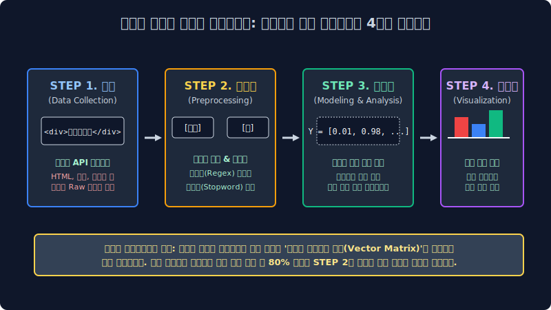
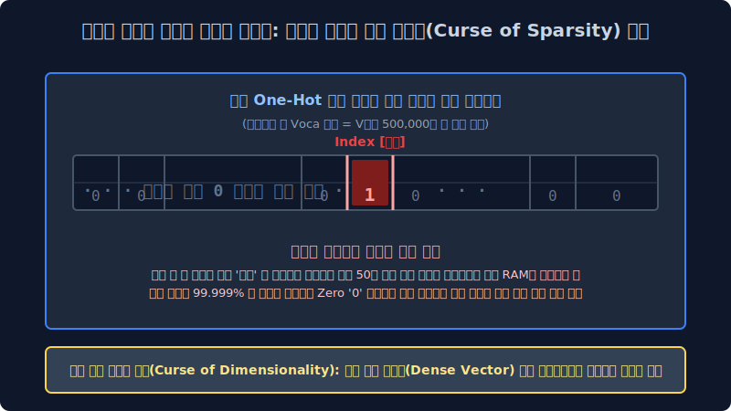

# 1.3 텍스트 마이닝 통계 파이프라인 아키텍처와 레거시(고전 NLP) 규칙 추론망의 절망적 한계점

압도적 노이즈가 폭발하는 비정형 텍스트 쓰레기 텐서 공간을 비즈니스 최적화 모델 구조의 인사이트 통계 황금 단결로 압축 치환해 내는 빅데이터 텍스트 마이닝의 통계적 4단계 시스템 파이프라인 전개 과정을 완전 해부하고, 최신 베이즈 확률 딥러닝 이전 과거 학자들이 피눈물을 흘리며 공학적으로 매달렸던 기하학적 규칙 기반(Rule-based) 알고리즘 인퍼런스가 왜 스트리밍 데이터 구조에서 필연적으로 실패 셧다운 될 수밖에 없었는지 그 한계점(문맥 모호성 오차율, 차원의 저주 메모리 폭발 희소성)을 수학적 차원 매핑으로 엄밀히 뜯어 분석해 봅니다.

---

## 1.3.1 비정형 차원 텍스트 마이닝 통계 정규화 공정 파이프라인 (4-Step Pipeline Architecture)

광물의 데이터 마이닝이 엑셀 표(정형 데이터)에서 1차 지하 광물 지표를 단선으로 캔다면, 비정형 텍스트 마이닝은 노이즈가 극한에 달한 무진장 진흙 늪지대에서 초소형 사금 픽셀 벡터를 확률 정규 스캐닝으로 필터링해 내는 미적분 스케일링 무자비 정제 과정입니다. 텍스트 분석 전체 인퍼런스 과정은 아래의 4가지 절대적 팩토리 레일 스텝을 거칩니다.

### `STEP 1` 무정형 텐서 원시 텍스트 수집 유입 채널 (Data Collection)
가장 날것의 오차율 한계가 터진 원시적인 데이터 크런칭 스크래핑 수집 행위입니다. 오픈소스 웹 크롤러(Web Crawler Vector) 봇 스크립트나 외부 스트리밍 API 통신 모듈 파라미터, 셀레늄(Selenium) 구조 객체 등을 통해 비정규 야생의 텍스트(포털 뉴스 기사 덤퍼, 댓글 파티션, e커머스 상품 리뷰 블록)를 수백만 텐서 다발 단위로 서버 DB 공간에 덤프 긁어옵니다. 이때 유입 적재된 텍스트는 아직 HTML 스태틱 태그 찌꺼기, 특수문자 마커 스펠링, 이모티콘 16진수 로그 노이즈 픽셀값이 잔뜩 표면에 묻어있는 파라미터 오염 오물 상태입니다.

### `STEP 2` 차원 텍스트 레코드 전처리 정규 스케일링 (Preprocessing) - 지옥의 수학적 엔지니어링 공정
데이터 분석가들 시스템 전문가 전체 업무 런타임 모델링 시간의 무려 $80\%$ 코스트를 압도적으로 차지 메모리 누수하는 가장 치명적이고 피눈물 나는 파라미터 방어 전진 단계입니다. "ㄹㅇㅋㅋ 이거 배송 진짜 쓰레기임 파업해라;;" 같은 불규칙 외계 자연어를 기계 프레임워크가 확률 치수로 읽을 수 있도록 특수기호(`;;`)와 노이즈 공백을 정규표현식(Regex) 확률 함수로 전면 컴파일 박살 내고, 분노 욕설이나 비표준 은어 패턴을 시스템 형태소 단위 빈도로 사각사각 토막 슬라이싱 내서(Tokenization 분절 모듈 인덱싱) 오직 컴퓨터 기계 파라미터용 이산 수학 차원 숫자로 강제 변환 포장 정규화시키는 극한의 클리닝 규정 세팅 작업입니다.

### `STEP 3` 통계 차원 확률 모델링 백엔드 분석 체계 (Modeling & Vector Analysis)
드디어 차원이 정제 압축된 텍스트 숫자 매트릭스 백터 뭉치를 시스템 확률 미분 파라미터 공식이나 심층 신경망 퍼셉트론 딥러닝 뉴런 스위치 확률망($\hat{y} = \sigma(Wx+b)$)에 미적분 들이붓습니다. 기계는 엄청난 선형대수 행렬 곱셈 인퍼런스를 거대 컴퓨팅으로 며칠간 연산 피팅 수렴 하강한 후, "이 영화 리뷰 행렬 노드 확률 분포 패턴은 $98.7\%$ 정밀도 확률 스코어로 **[부정적 파국 극대노 (Negative Polarity Vector)] 스코어다!**" 라는 수학적 결론 지표를 즉각 컴파일 내뿜습니다.

### `STEP 4` 비주얼라이제이션 표출 및 의사결정 추론 강제 타겟 (Visualization & UI Decision)
아무리 고도화된 스케일의 다차원 수학적 배열 지표만 화면에 덤프 로그 찍어놓고 보고는 일반 경영 사람 엔드 유저들이 그 의미를 시각 직관적으로 판별 이해할 수 없으므로, 경영진이나 기획자 스폰서에게 다이렉트 리포트 보고하기 위해 기계가 판별 추론 역산해 도출한 결과를 '워드 클라우드 단어 크기 매핑 빈도율'나 '막대그래프 회귀 분포 차트' 픽셀 형태로 이쁘게 대시보드로 시스템 출력 그려내, 최종 현업 비즈니스 로직(예: 부정적 클레임 폭주에 따른 환불 센터 대응 CS 서버 파라미터 인력 2배 증원 조치)을 비즈니스 스케일 모델 의사결정 강제화 맵핑합니다.

---

## 1.3.2 고전 자연어 처리(Legacy NLP 구조)의 몰락 단절: 원시적 딕셔너리 사전 트리 하드코딩

과거 1990년대 NLP 선배 언어 학자들은 현재와 같은 유연한 베이즈 통계 확률망이나 심층 신경망 트랜스포머 같은 고급 텐서 확률 최적 연산 모델 패러다임이 세상 IT 역사에 아예 없었기 때문에, 무식하게도 컴퓨터 코어 램 메모리에게 **국어사전 수십만 개 구문 단어 문법책을 통째로 1:1 결정론적 구문 코드로 메모리에 하드코딩(Hard-coding 룰 테이블 압축)하여 조건 분기로 수동 기입해 분기 때려 박는 미친 구조 짓**을 시스템 에러를 감수하며 저질렀습니다.

이 끔찍한 구조가 바로 세계 최초의 형태소 텍스트 분석 시스템 근간 아키텍처인 **규칙 기반 (Rule-based) 트리 파이프라인 예측 모형**입니다.

> `If (token_text == '빠르다' or token_text == '최고'): return Polarity.POSITIVE_POINT(+1)`

*   **치명적 수학적 붕괴 한계점 결함**: 이 아주 수동적이고 구시대적인 1차원 `if-elif-else` 프로그래밍 구문 분기 매퍼 모델은 확률 지배 모델이 없기 때문에, 세상 입력에 "신조어", "은어", "방언", "미세 오타" 차원이 단 하나라도 문서 토큰에 불일치 오류 변수로 나타나면, 하드 딕셔너리 테이블 사전에 동일 텍스트 벡터를 매칭 조회할 수 없으므로 시스템이 곧바로 유연성 추론 없이 `OutOfVocab (OOV) Error` 를 즉각 내뿜으며 스레드 런타임 계산 자체를 강제 파업 셧다운 선언해 버리는 치명적 비즈니스 단절 결함 구조가 있었습니다. 인류 언어 진화의 무한한 변동 곡선 다차원 복잡성을 한낱 찰나의 인간 프로그래머가 손 스크립트로 하나하나 다 구문 규칙을 짜맞춰 기입 생성해 내는 것은 통계 수학 구조적으로도 영원히 파라미터 오차율을 허용할 수조차 없는 불가능 압도에 가까웠습니다.

---

## 1.3.3 컴퓨터 메모리 인퍼런스 자체를 폭파 파괴하는 자연어 분해 차원의 3대장 맹점 

### 1. 차원의 저주 에러와 극악의 메모리 희소성 텐서 비극 (Curse of Dimensionality & OOM Sparsity)

기계 컴파일러에게 텍스트 스펠링 구조를 수학적 연산 가능한 행렬 숫자로 매핑 임베딩 인식하게 인코딩 만들 때 컴퓨터 역사 초창기 컴파일계에 발생하여 시스템을 좌초시켰던 가장 극악하고 끔찍했던 수학적 메모리 공간 재앙 폭파 현상입니다. 만약 한국어 국어사전 딕셔너리에 50만 개의 유니크 독립 단어 토큰 객체 공간(Vocab Size = 500,000 차원) 배열 다변수가 있다고 칩시다. 여기서 우리는 "사과"라는 특정 스펠 텍스트 단어 공간 딱 단 1개 독립 개입 차원만을 컴퓨터 메모리에 공간 확률로 로딩 지정해 특정 임베딩 저장 추출하고 싶습니다.

과거 고전 레거시 기계 모델(특정 단어를 0과 1로만 단일 독립 구분하는 원-핫 인코딩 One-hot Distribution 방식)은 **스캐닝을 위해 무려 가로 길이 50만 스케일 칸짜리 아주 거대한 1차원 단일 엑셀 행 배열 좌표 벡터 룸을 일단 통으로 하나 시스템에 통째로 구축 스위치 단절 세팅 만들고**, 그 50만 칸 중에 딱 정확히 오직 '사과' 단어 스펠링 정보가 고유 매핑 연결 배열 지정된 단일 인덱스 타겟 위치 칸에만 `1(True)` 스칼라를 표기하고, 나머지 할당된 거대한 공간 499,999 배열 칸 블록 메모리 공간에는 쓸모없는 노이즈 쓰레기 배열 스칼라 정보가 부재하는 빈 공간 숫자 `0(False Zero)` 을 모조리 연산 전개로 꽉꽉 허구 압축 미적분 채워 넣는 기행을 벌였습니다.

$$ \text{Token Memory Unstructured Vector Target} = \begin{bmatrix} 0 & 0 & 0 & \cdots & \mathbf{1}_{({\text{고유 타겟 사과}})} & 0 & \cdots \end{bmatrix}_{1 \times 500,000 \text{ Sparse Tensor Block Array}} $$

*   **스태틱 텐서 비극**: 이처럼 어떤 입력 아주 미세한 유기체 모델 파편 정보를 저장 매핑하기 위해 구축 할당 설계하는 배열 메모리 그릇의 논리 크기(차원 Dimension Matrix) 지표는 스케일업으로 폭발해 수백수천만 차원 스페이스 칸으로 폭주 팽창하게 뻗어나가는데, 막상 실제 그 큰 배열 무한 그릇 공간 안에 진짜 수치 실질 의미 매핑된 배열이 채워진 칸은 공간을 초토화 단 1개 타겟뿐인 고립 모순 파라미터 오류 현상. 나머지 시스템 대부분 99.9% 텐서 행렬 할당 점유 맵핑 공간이 $0$ 빈도 노이즈 값으로 전부 텅텅 스펙이 비어 허공으로 증발해 버리는 이 끔찍한 메모리 할당 OOM 낭비와 연산 최악 효율 손실 타격을 선형대수학 기하 차원 공학 스페이스 계산계에서 통칭 **차원의 극단 희소성 저주 에러(Space Sparsity Curse Dimensionality 결함)** 라 일괄 부릅니다. 이 엄청나고도 불필요하게 커다란 단일 스케일 희소 구조 행렬 덩어리를 고전 CPU 파라미터가 비효율 연산으로 하나씩 메모리 단절 버스 순회 검증하며 인덱싱 곱셈 하느라 옛날 컴퓨터들은 고작 텍스트 단 한 문장만 트랜스레이트 번역 스캔해도 차원 오버플로우 초과 서버 부하로 즉시 폭발 다운 단절되거나 과부하 OOM 으로 모조리 연산 서버가 불에 타 셧다운 처리로 뻗어 에러 파괴 단절되었습니다.

### 2. 확률의 한계: 은유 반어법 맥락 기만 (Sarcasm & Sequence Irony Intent Mapping Error)
그리고 1차원 결정론적 분기 텍스트 마이닝 매핑 시스템은 복잡한 다변 뉘앙스인 인플루언서 인간 유저의 악랄한 문맥 심리적 발화 의도 베이즈 기만 확률 자체를 기하학 도무지 단건 스텝으로 감당 해석하지 시스템 통계 파편 오류 못했습니다.
*   **인간 엔드 유저 관측 입력**: `"야 너네 앱 서비스 배송 속도 참나 진짜 참~ 오지게 눈물 나게 빠르네요~ ㅋㅋ 해외 저 멀리 아마존 중국 직구에서 배 타고 걸어오시나 봐요? ㅋㅋ!"` (분노의 항의 반어법)
*   **고전 AI 단순 규칙 스캔판단**: 문자열 배열 내부에 사전에 매핑 고정된 긍정 분류 칭찬 키워드 인덱스 `빠르네요(+1 벡터)` 스파스 존재 검출 모수 확률 $\to$ "오! 조건부 필터 검증 완료. 이 관측 유입 리뷰는 $100\%$ 확률 모델 판별로 아주 훌륭한 **[극도 긍정 트렌드 리뷰 카테고리]** 이다!" (이 오답 판별 팩트로 비즈니스 통계 오류가 터져 고객 센터 임원과 사장님 현업 모니터 화병 런타임 폭발 단절 파괴 결함 사태를 야기시킴)

### 3. 다중 문맥 의미망 결속: 다의어, 동음이의어의 매핑 스케일 단절 절망적 오차 (Context-Free Polysemy Error)
'눈(Snow/Eye)'이라는 극도로 정보량이 압축된 짧은 텍스트 기호 1개 단어 세 글자 토큰 공간이, 추운 하늘에서 강수로 결정 내리는 빙하 눈(Snow Component)인지 내 살아있는 생물 얼굴에 달린 안구 시각 신경 눈(Eye Organs 파라미터)인지 고립된 단어 모델은 홀로 결코 추론 인과 분기 예측 확률 연산할 수 한계가 전혀 없었습니다. 옛날 아키텍처 컴퓨터 구조망은 단어 시퀀스의 스텝 체인 주변 외부 맥락 문맥 맵핑($Context Vector Field$)을 서로 다변수 확률로 비교 연동해서 멀리서 곁눈질 집중도 스캔할 수 있는 시퀀스 매트릭스 다중 확률 어텐션(Multi-Head Attention Distribution) 딥러닝 시야각 복합 공간 인퍼런스 스케일 지능이 물리적으로 아예 당시에 없었기에, 그냥 무식하게 똑같이 매핑된 동일 유니코드 단일 구문 스펠링 아이디 ID 인덱스 번호 하나만 모델 배열 조건부로 보고 양쪽 감정 카운트를 무지성 기계적으로 더해버려 전체 통계 분류 예측 확률 트리를 완전히 벡터 에러 박살 단절시켜 버렸습니다.

이러한 수십 년 고전 텍스트 모델 통계 시대의 극악 모호한 텐서 역추적 구문 번역 참극 오차율과 광활한 거대 RAM 디스크 클러스터 메모리가 순회하다 희소성 차원으로 결국 줄폭발하는 스케일 OOM 벡터 한계망 파라미터를 시스템에서 모두 절단하고 완전하게 파괴 끝장내기 위해, 전 세계 구글 메타 등 글로벌 IT AI 빅테크들이 시스템 사활을 자금으로 걸고 막대한 슈퍼컴퓨터 GPU 텐서 파워 인프라 전력을 아키텍처에 모조리 코퍼스와 쏟아부어 마침내 생성 돌파 역산 등장한 것이, 바로 현대 인류의 진정한 통합 차원 AI의 시작이자 이 다음 모듈 챕터부터 다룰 무한 어텐션 추론망의 압권 결론, **거대 매개변수 심층 신경망 언어 모델 백엔드 아키텍처(LLM: Large Language Models)** 와 차원의 압축 기하 승리인 **다차원 고밀도 연속 정보 응집 벡터공간 밀집 임베딩(Dense Vector Embedding Model Target)** 아키텍처 확률 치환 매핑 텐서 혁명의 스크립트 체계입니다.
