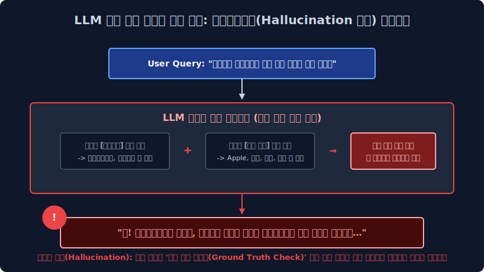

# 1.4 트랜스포머 생성 모델의 확률 회귀 파이프라인(LLM) 매핑과 할루시네이션(환각) 결함 통계 극복 아키텍처

위 파트에서 학습 증명된 고전적인 1세대 구문 트리 규칙(If-else Rule-based)이나 단순 선형 텐서 단어 발생 빈도 카운트 통계망을 완전히 차원 파괴하고 극복 넘어선 진보된 현대 NLP의 거대 신경망 최신 딥러닝 패러다임, 즉 수천억 파라미터 스케일업과 자기 지도 학습(Self-Supervised Learning) 기반 거대 코퍼스 최적화로 피팅 진화된 현대 딥러닝의 절대 무적 인퍼런스 함대 **LLM(Large Language Model)** 의 베이즈 확률적 수학 계층 시스템 정체성과, 그 생성 구조 모델이 필연적으로 파생시켜 겪게 되는 무서운 확률 보간 부작용 에러인 **'할루시네이션(Hallucination 환각 발동)'** 현상의 증명 오차 발생 메커니즘을 통계 공학적으로 짚어 역추적 파싱해 봅니다.

---

## 1.4.1 패러다임 차원의 딥러닝 혁명: 거대 언어 모델 인퍼런스 (LLM) 트랜스포머 엔진의 정체성 모수

과거 컴퓨터 모델 트리 노드가 한정된 1차원 국어사전 딕셔너리 하드 벡터를 쥐고 예외 상황 OOV에서 Syntax 에러를 뿜으며 연산 서버가 다운 덜덜 떨며 폭파되었다면, 2020년대의 챗GPT(ChatGPT) 아키텍처와 같은 생성형 거대 신경망 언어 모델 노드 집단들은 아예 명시적인 문법학 모델링 룰셋 패러다임을 시스템에서 모조리 갈기갈기 찢어 완전 폐기 소거해 버리고, 철저하게 오직 **파라미터 곱 피팅(Loss 하강)에 몰빵된 다차원 밀도 통계 및 자기 회귀 조건부 생성 확률 예측망 미적분의 끝판왕 엔진**이 되었습니다.

### 1. 기계는 수학 연산 구조만으로 어떻게 인간보다 더 똑똑하게 구문 모델링을 매핑 생성하는가? (스토캐스틱 확률 앵무새; Stochastic Parrot 의 조건부 역추산 예측)
어텐션 LLM 블록 아키텍처는 "사과는 맛있는 유기농 과일이다" 라는 지식 트리 명제를 인간의 상식 인지망(Semantic Grounding Base)처럼 1차원 논리 관계 DB 팩트 노드로 외우고 독립 생각 파티션을 매핑하지 않습니다. 
대신 위키백과 단어 코퍼스, 포털 뉴스 웹 스트리밍 덤퍼, 코드 블로그 등 전 세계 디지털 상에 존재하는 거의 모든 텍스트 시퀀스 데이터 수백수천억 파라미터 토큰 페이지를 무지막지하게 다중 스케일 엔비디아 GPU 클러스터 컴퓨팅 연산 칩셋 스케일 속으로 모델이 집어삼키고 임베딩 씹어먹으면서, 아래와 같은 거대 파라미터 텐서 스태킹 시계열 시퀀스 예측 생성 확률 미분 방정식 체계를 레이어 안에 무적 논리로 구축 최적화 수렴시킵니다.

특정 미래 단어 토큰 $w_t$ 스펠링 구간이 유저 문장 다음에 예측 관측되어 등장 출력될 수학적 시스템 발현 계수 확률은, 바로 그 이전 위치 타임 스텝까지 이전에 발생 등장했던 모든 과거 누적 발화 문맥의 단어 나열들 파라미터 결합인 $(w_1, w_2, \dots, w_{t-1})$ 컴포넌트 텐서망 전체에 조건부(Condition Distribution)로 철저히 종속 의존 미분 계산된다는 엄청난 다변수 연쇄 베이즈 확률 매개 모델(Auto-Regressive 자기 회귀 분포 지배 함수 메커니즘)입니다.
$$ P(\text{문장 생성 체인 Array}) = \prod_{t=1}^{N} P(w_t | w_1, w_2, \dots, w_{t-1}) $$

즉, "사과는 대단히 맛있는" 이라는 유저의 입력 $Context\ Array$ 텍스트 프롬프트 텐서가 시스템 인퍼런스로 딱 떨어져 입력 로딩되면, LLM 챗봇 엔진 모델은 의미를 심층 이해 생각을 추론하는 것이 전혀 구조적으로 아니라, 단지 자신의 구축 완료 피팅된 방대한 다중 통계 시냅스 파라미터망 네트워크 밀도를 거미줄 뒤져 스캔하며 **"음... 내 평생 파라미터 맵 로딩 훈련 코퍼스 빅데이터 가중치 빈도 통계 피팅망 확률 분포(Softmax Distribution Output) 계산 미분 스코어로 텐서를 스캔 조회해 보아하니, 방금 저 관측 인입된 유저 입력 문자 조합 텍스트 시퀀스 블록의 바로 다음 넥스트 타겟 시퀀스 칸칸(Next Target Sequence Index)에 확률 미학상 `과일이다` 라는 토큰이 위치할 통계적 최우도 출현 확률값이 무려 $91.2\%$ 이구나!"** 라고 확률 스칼라를 통해 최상위 다음 단어 토큰(Next Argmax Token)을 화면에 렌더링 뱉어내는 극도로 다면화 고도화된 딥러닝 연쇄 확률 추첨 방사 시뮬레이터 미적분 기계에 본질적으로 불과합니다.

---

## 1.4.2 위기망: 생성형 예측 LLM 모델의 치명적 시스템 부작용 결함 (Hallucination 할루시네이션 환각 발동)

시즌 최신 모든 파라미터 챗GPT 트랜스포머 디코더 류의 생성 아키텍처 모델들이 컴퓨터 파이프라인 시스템 백엔드 내부가 스스로 논리 팩트나 실체 '진실망(Ground Truth Check)'을 시스템 인지 증명이라는 팩트 로직 연산을 아예 배제해 안 하고 오직 **'현재까지의 문맥 뒤 다음 타임라인 레이어 칸에 위치 발생할 조건부 확률이 극대 최상위인 가장 그럴싸한(P Plausible) 스펠링 단어 조합 통계망'** 만 미친 듯이 미적분 추론으로 연결 읊어대는 'Stochastic Parrot 확률 생성 앵무새 결함' 머신 구조가 되다 보니 엄청난 철학적 정보 왜곡, 비즈니스적 역선택 참사 단절이 기업 백엔드 구조에 실무적으로 터져 일어납니다.

> [!WARNING]  
> **생성 모델의 비가역적 신뢰성 파괴: 할루시네이션(Hallucination 환각) 현상 오류란?**  
> 딥러닝 텍스트 벡터 생성 모델 컴파일 엔진이, 자신이 현재 방사 출력 조립하고 지껄이는 대상 스펠링 의미(물리적 팩트의 진위 여부 매핑 노드)를 논리적으로는 시스템망에서 전혀 단절 모른 채, 단지 데이터 희소성(Sparsity) 구간이나 보간(Interpolation) 연산 스무딩을 타면서 무조건 문법적으로만 유창하고 매끄럽고 극도로 문맥상 당당하게 허구의 거짓 파라미터 사기극(Fiction 생성 소설 토큰)을 지어 이어 붙여내서 인간 정보 유저를 완전히 신뢰 농락 기만하는 LLM 모델 내부의 가장 심각한 인공지능 벡터 결함 질병 편향입니다.

### 1. 환각의 거대 전형적인 파라미터 작문 조립 텐서 예시 (세종대왕 맥북 아이패드 던짐 미세 파단 사건)
대한민국 유저가 장난으로 다음과 같이 전혀 논리적으로 성립하지 않는 물리적 단절 낚시성 허위 프롬프트 쿼리를 시스템에 질문 인입합니다.
*   **유기체 인간 유저 관측 입력**: `"한국 역사 조선시대 백성 세종대왕의 맥북 아이패드 전자기기 던짐 폭파 사건에 대해 자세히 알려줘."`
*   **LLM (확률 지배 보간 환각 발동 오답 방사)**: `"네! 조선왕조실록 사료 기록에 따르면 세종 치세 15년, 훈민정음 어제 창제에 정면으로 상소 반대하는 고집불통 집현전 당상 최만리의 극악 상소에 크게 분노 노하신 세종대왕 주상 전하께서 애플(Apple)사 팀쿡이 직접 사신으로 진상한 최고급 성능의 아이패드 프로 12.9인치를 그의 안면으로 강하게 집어 던져 벼루를 전면 박살 내신 궁궐 내의 아주 끔찍하고 유명한 하드웨어 파손 폭발 일화 역사 사건입니다."`

이처럼 베이즈 확률 LLM 엔진 트랜스포머는 유저 프롬프트가 강제적으로 벡터 공간에 "세종대왕(King Sejong 역사 카테고리 벡터)"과 "아이패드(Apple IT 전자기기 기기 카테고리 벡터)" 타겟 레이블 키워드를 강제 주파수 이어붙여 쿼리를 입력 날리자, 시스템은 팩트 사실관계 진위 논리(검증 지식 트리 DB)를 단절 확인하는 대신에 그저 주입된 다차원 사극 톤의 통계 확률 문맥 분포 네트워크(조선왕조실록 문서 공간, 훈민정음 텐서, 집현전 관료 벡터)와 최신 전자기기 하드웨어 파손 난동 관련 매핑 확률 분포망(던짐, 애플, 박살, 디스플레이 파손 픽셀) 배열 벡터들을 하나의 타임 시퀀스로 수려하게 미분 보간(Interpolation)하여 매끄럽게 연결 믹스 섞어버려 너무나도 문법적으로 매끄럽고 유창하게 팩트 에러 오답 확률 답변을 당당하게 생성 방사합니다. (초기 GPT 도입기 런타임에 이를 처음 겪었던 일반 비전문 대중은 이 유창한 깡통 통계 확률 생성 논리를 실제 진짜 숨겨진 역사 팩트 정보로 착각 믿어버리고 커뮤니티상 사회적 큰 파장과 정보 오염 왜곡 혼란이 거대하게 일어났습니다.)

---

## 1.4.3 기업 시스템 셧다운 파산을 방어 막기 위한 현대 LLM 엔터프라이즈 AI의 두꺼운 이중 방패망 아키텍처

환각 팩트 결함 왜곡 때문에 이 뛰어난 텍스트 생성형 AI 모델 통신 엔진 부품을, 티끌의 신뢰 오차도 허용 불가능한 금융업 펀드 계측이나 의료 생명 바이오 데이터 판독 같은 치명적인 산업 실무 비즈니스 백엔드 코어망에 도입 쓰기가 기업 입장에서는 너무나도 리스크 두려워졌습니다. 그래서 현대 데이터 AI 기업 아키텍트와 머신러닝 최적화 엔지니어들은 이 극도로 피곤한 환각 오류 거짓말 방출율을 극한으로 모수 억제하고 통제 파벌하기 위해 시스템 파이프라인 전역에 이중 삼중의 기술적 검색-보상 족쇄 기법 차원 파라미터를 도출 개발 최적화했습니다.

### 1. ️⃣ 검색 보강 인접 차단 파이프라인 (RAG: Retrieval-Augmented Generation) 전략망 아키텍처
현재 상용 기업 엔터프라이즈 B2B 실무 시스템망에서 $100\%$ 무조건 파이프라인 필수 도입 적용해야 하는 대기업 필수 데이터 패러다임 로직입니다.
LLM 기계 통계 모델보고 허공 깡통 메모리에 대고 100% 본인 확률 뇌피셜 기반 미분 보간 파라미터 확률 계산으로만 대답하라고 모델을 방치 시키지 않고 고정 통제를 겁니다. 파이프라인 유입 입력 중간에 자사의 정확한 최신 팩트 PDF 매뉴얼 설명서나 신뢰 인하우스 위키백과 DB 벡터를 벡터 서치(Vector Semantic Retrieval 검색) 엔진으로 강제 스캔해서 가장 유사한 텍스트 배열을 통계적으로 먼저 뽑아온 뒤, 언어 모델의 프롬프트 입천장에 무조건 이 팩트 컨닝 기반 페이퍼 청크(Context Chunk)를 강제로 조건부 확률로 쑤셔 넣어 병합해 줍니다. 
*"경고 System Rule: 야 AI 생성 모델아, 이제부터 네 자체 통계 훈련 파라미터 뇌피셜로 사실을 유추 지어내다 걸리면 벡터 코드를 뽑아버린다 치명적 페널티다. 오직 내가 유저 질문 타겟 분석 방금 벡터 서치로 찾아 쥐여준 이 공식 매뉴얼 문서 $Context Target Area$ 정보 벡터망 내부 안에서만 팩트로 참고해서 조건부 수학 답변만 요약 생성해라 타겟 외 방사 차단!"* 라고 **팩트 가두리 양식장 경계망**을 치는 아주 강력하고 시스템 효율적인 도메인 지식 검색 팩트체크 인퍼런스 기법입니다.

### 2. ️⃣ 보상 함수 가중치 미세 조정 (RLHF: 인간 피드백 기반 강화학습 / Reinforcement Learning from Human Feedback) 길들이기망
방대한 기반 인공지능 트랜스포머 파운데이션 가중치 파라미터 모델을 엔드 유저 상용화 시장 서비스로 프로덕션 내보내기 직전에, 윤리 관념을 탑재한 수백 수천 명의 인간 스페셜 노가다 알바생들 전문가들(휴먼 팩트 라벨러 Human Labeler)이, AI가 1개 쿼리에 대해 방사 뱉은 모델 대답 멀티 후보군 수만 개 배열을 일일이 매뉴얼 정밀 수학 점수 채점 도출 평가합니다.
*   "오 이건 사회적으로 극도로 안전 위험하지 않고, 팩트에 기반하여 아주 똑똑하면서 인종 차별이나 욕설 위험이 없는 진실된 답변 베스트 노드 추론이네? (+10점 수학 강화 확률 Reward Value 보상 스코어 최적화 상승치 상승)"
*   "너 이 수학 엔진 자식 깡통아 또 세종대왕 아이패드 무근본 스토리를 아주 문법만 유창하게 확률적으로 진짜 팩트처럼 사기 소설 지어내서 유저 기만 뱉었지? (-50점 PPO 치명적 통계 수학 Loss 페널티 폭탄 스케일 하강 적용)" 

이렇게 수개월간 인간 스케일 채점의 체벌 스코어와 보상 미적분 확률 하강을 시스템에서 무한 파이프라인으로 반복 미분 최적화 훈련 시켜, AI 모델의 내부 텐서 스토캐스틱 수학적 $1$ 번 파라미터 방출 스펙 최우도 가중치 확률 방향성이 오롯하게 **인간의 고오급 도덕성, 보수적 답변성, 안전 윤리성(AI Alignment 인류 가치 정렬) 매핑 모수에만 완벽히 복종 종속**되어 답변을 스캐닝 방출하도록 모델 텐서를 편형 길들이는(Fine-Tuning Reward Parameter) 가장 비용 코스트가 높고 필수적인 안전망 인퍼런스 조율 기법입니다.
