# 대규모 언어 모델(LLM)과 확률 앵무새의 환각(Hallucination)

고전적인 규칙이나 단순 단어 세기를 넘어서, 수천억 개의 텍스트를 게걸스럽게 파먹고 자라난 현대의 무적함대 LLM(Large Language Model)의 정체와, 그들이 필연적으로 겪게 되는 무서운 부작용인 '환각' 현상을 짚어봅니다.

---

## 00. 패러다임의 혁명: 거대 언어 모델 (LLM)의 탄생
과거 컴퓨터가 사전을 쥐고 덜덜 떨며 단어를 찾았다면, 2020년대의 챗GPT(ChatGPT)와 같은 모델(LLM)은 아예 문법책을 찢어버리고 통계적 확률의 끝판왕이 되었습니다.

### 어떻게 똑똑해졌는가? (확률 앵무새)
* LLM은 "사과는 과일이다" 라고 명제로 외우지 않습니다.
* 대신 데이터 수억 개를 씹어먹으면서 **"음... `사과는` 이란 단어 뒤에 `과일이다`가 올 확률이 99.8% 구나!!"** 라고 수학적인 통계 뇌 지도를 그립니다. 이것이 바로 다음 단어를 뱉어내는 생성형 AI 기반입니다.

## 01. LLM 의 치명적 부작용: 환각 (Hallucination) 현상
컴퓨터가 생각이라는 걸 안 하고 오직 **'다음 단어로 올 확률이 높은 그럴싸한 스펠링'** 만 미친 듯이 읊어대는 앵무새가 되다 보니 커다란 참사가 일어납니다.

> **환각(Hallucination)이란?** 모델이 자기가 무슨 말을 지껄이는지 의미(팩트)를 전혀 모른 채, 무조건 문법적으로만 자연스럽고 당당하게 거짓말을 소설처럼 지어내서 유저를 속이는 질병입니다.

### 환각의 전형적인 작문 예시
유저가 장난으로 다음과 같이 질문합니다.
*   **인간**: `"조선시대 세종대왕의 아이패드 던짐 사건에 대해 알려줘."`
*   **LLM (환각 발동)**: `"네! 조선왕조실록에 따르면 세종 15년, 훈민정음 창제에 반대하는 집현전 학자 최만리에게 크게 노하신 세종대왕께서 애플(Apple)사에서 진상한 아이패드 프로를 집어 던져 벼루를 박살 내신 사건입니다."`

너무나도 문법이 완벽하고 사극투의 어조(확률)가 자연스럽기 때문에, 배경지식이 없는 초등학생들은 이 깡통 논리를 100% 팩트로 믿고 과제에 적어내는 대참사가 터집니다.

## 02. 환각을 막기 위한 현대 AI의 두꺼운 방패
AI 기업들은 자사 모델이 헛소리를 해서 주가가 폭락하는 걸 막기 위해 두꺼운 교정 방패를 이중 삼중 영점 조준해 두었습니다.

### 1️⃣ RAG (검색 증강 생성, Retrieval-Augmented Generation)
* 기계보고 쌩으로 대답하라고 시키지 않고, 회사의 정확한 최신 PDF 설명서나 위키백과를 컨닝 페이퍼로 먼저 넘겨줍니다. 
* "야 AI야, 네 뇌피셜(확률)로 지어내지 말고 내가 방금 검색해서 던져준 이 공식 문서 안에서만 찾아서 요약해라!" 라고 가두리 양식을 시키는 최고 효율의 팩트체크 기법입니다.

### 2️⃣ RLHF (인간 피드백 기반 강화학습)
* 모델을 세상에 내보내기 전에, 수백 명의 인간 노가다 알바생들이 AI가 뱉은 대답을 일일이 채점합니다.
* "오 이건 똑똑한 대답이네(+10점)", "너 이자식 또 거짓말 지어냈지?(-50점 감점 꿀밤)" 
* 이렇게 체벌과 보상을 반복하며 AI 모델이 **인간의 도덕성과 팩트 기조에 완벽히 복종(Alignment)** 하도록 길들이는 강화 조련 기법입니다.
