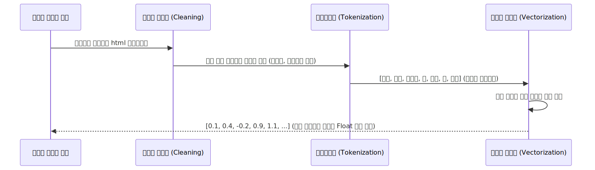

# 텍스트 전처리와 가장 기초적인 숫자 번역기 (One-hot)

기계는 텍스트를 절대로 한글로 읽지 않습니다. 그저 0과 1로 된 길다란 엑셀 벡터 표를 들이마실 뿐입니다. 기계가 텍스트를 삼킬 수 있도록 불순물을 걷어내고 숫자로 치환해 주는 전처리 파이프라인과 가장 기초 모델인 원-핫 인코딩(One-hot)을 배워봅니다.

---

## 00. 텍스트 전처리(Preprocessing) 3대 공정
더러운 텍스트가 컴퓨터 신경망 뉴런으로 빨려 들어가기 위해서는 피 터지는 3단계 클렌징 작업이 필수입니다.

### 1) 노이즈 정제 (Cleaning)
컴퓨터가 이해하는 데에 전혀 도움을 안 주는 잡음 기호들을 치워버립니다. 특히 웹페이지를 크롤링 한 경우 `<html>`, `\n` 같은 태그 찌꺼기나 의미 없이 이어진 이모티콘 `ㅎㅎㅎㅎㅎ` 수십 개를 정규식 코드를 짜 통째로 날려버리는 작업입니다.

### 2) 토큰화 (Tokenization)
긴 문장을 "분석 단위(토큰)"인 개별 단어 구슬로 사각사각 잘라 배열(`List`)로 만듭니다. (이 부분은 다음 02주차에서 가장 깊게 다룹니다!)

### 3) 벡터화 (Vectorization)
이제 잘라진 글자 단어들을 기계가 곱하기 더하기 연산을 할 수 있도록 **"숫자로 된 표식 벡터 집합"** 으로 맵핑하여 엑셀 구조로 변환시켜 줍니다. 그 첫 번째 무식한 변환 방식이 바로 아래의 원-핫 인코딩입니다.

## 01. 뼛속까지 아제로스: 원-핫 인코딩 (One-hot Encoding)
"One(하나) 빼고 다 Hot(터뜨려버린다, 0으로 만듦)"
기계에게 단어들을 구별해 주기 위해, 엑셀 칸 하나씩 영토를 떼어주고 자기 영토에만 1을 찍는 방식입니다.

예를 들어 단어 사전에 딱 4개의 단어 {`나는`, `너를`, `사랑`, `증오`} 만 존재한다고 칩시다.

| 고유 단어 ID | 단어 이름 | One-hot 행렬 벡터 구조 |
|:---:|:---|:---|
| 0 | 나는 | `[1,  0,  0,  0]` |
| 1 | 너를 | `[0,  1,  0,  0]` |
| 2 | 사랑 | `[0,  0,  1,  0]` |
| 3 | 증오 | `[0,  0,  0,  1]` |

$$ \begin{bmatrix} 1 \\ 0 \\ 0 \\ 0 \end{bmatrix}, \quad \begin{bmatrix} 0 \\ 1 \\ 0 \\ 0 \end{bmatrix}, \quad \begin{bmatrix} 0 \\ 0 \\ 1 \\ 0 \end{bmatrix}, \quad \begin{bmatrix} 0 \\ 0 \\ 0 \\ 1 \end{bmatrix} $$

## 02. 원-핫 인코딩의 처참한 메모리 초과폭발 버그!
고작 단어 사전이 4개일 때는 예쁘게 4칸짜리 벡터로 표기 가능했습니다. 
하지만 현실의 한국어 단어 사전을 긁어모으면 고유 단어가 대충 **100만 개**가 나옵니다.

만약 "사과" 라는 단어를 이 원-핫 인코딩 방식으로 저장하게 된다면?
> `['사과']` = `[0, 0, 0, 1, 0, 0, 0, ... (이 뒤로 0이 무려 999,993칸 더 이어짐)]`

사과 하나를 표현하기 위해 100만 칸짜리 긴 엑셀 열차를 만들고, 오직 1칸만 1을 칠한 뒤 나머지 99만 9천 칸의 하드디스크 공간을 쓸모없는 `0`의 아파트들로 공허하게 메워서 메모리 전체 용량을 펑격시켜버립니다!
이것이 바로 앞 챕터에서 배웠던 고전 모델들의 **희소성(Sparsity)의 폭발** 문제입니다.

이 문제를 깨뜨리기 위해 "그럼 문장을 통째로 가방에 던져넣고 빈도 숫자만 뭉치자!" 라고 타협한 원시 기술이 다음 섹션의 Bag of Words(BoW)입니다.
