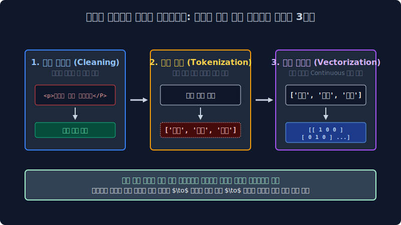
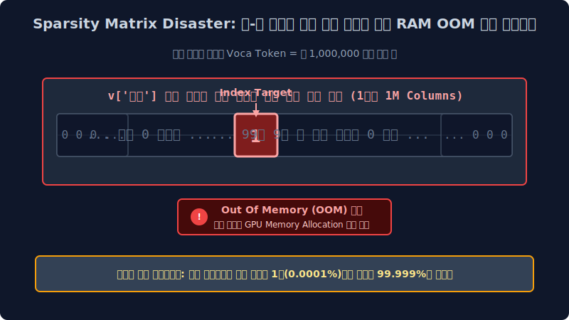

# 1.5 텍스트 전처리와 가장 기초적인 기계 숫자 번역기 (One-hot)

기계는 우리가 쓰는 "사랑"이라는 아름다운 텍스트를 절대로 한글로 읽지 않습니다. 그저 $0$과 $1$로 된 거대한 선형대수 엑셀 매트릭스(Matrix)를 이진수로 들이마실 뿐입니다. 기계가 텍스트를 삼킬 수 있도록 불순물을 걷어내고 숫자로 치환해 주는 전처리 파이프라인 수술 기법과 인공지능 역사상 가장 원초적인 번역기, 원-핫 인코딩(One-hot)의 수학적 원리를 배워봅니다.

---

## 1.5.1 텍스트 전처리(Preprocessing) 3대 공정

더러운 찌그레기 텍스트가 컴퓨터 신경망 뉴런 레이어인 $y = Wx + b$ 매트릭스 연산기로 빨려 들어가기 위해서는 피 터지는 3단계 클렌징 외과 수술이 필수적입니다.

### 1. 노이즈 정제 (Cleaning)
컴퓨터가 이해하는 데에 전혀 통계적 영향을 주지 않는 잡음 기호들을 치워버립니다. 특히 웹 자바스크립트를 크롤링 한 경우 `<html>`, ` `, `\n` 같은 태그 찌꺼기나 의미 없이 이어진 이모티콘 `ㅎㅎㅎㅎㅎ` 수십 개, 그리고 이모지(😊) 등을 **정규표현식(Regular Expression)** 알고리즘 코드를 짜서 통째로 파괴시켜 버리는 살균 작업입니다.

### 2. 토큰화 (Tokenization)
긴 문장을 "문맥 분석 단위(토큰, Token)"인 아주 작은 개별 단어 구슬들로 사각사각 잘라 파이썬의 리스트(`List`) 배열로 만듭니다. (이 띄어쓰기와 교착어의 분해 부분은 다음 02주차에서 아주 깊게 다룹니다!)

### 3. 수학적 벡터화 (Vectorization 및 Embedding)
가장 신비로운 단계. 이제 깔끔하게 잘라진 "안녕" 같은 글자 단어들을 기계가 역전파 곱하기 더하기(+) 연산을 수행할 수 있도록 **"수학적 차원 위의 공간 좌표를 가진 숫자 집합 벡터(Vector)"** 로 맵핑하여 변환시켜 줍니다. 그 첫 번째 무식한 1차원적 변환 방식이 바로 아래의 **원-핫 인코딩(One-hot)** 입니다.

---

## 1.5.2 뼛속까지 아제로스 호족: 원-핫 인코딩 (One-hot Encoding)

> **"오직 나 하나(One)의 아이디만 불태우고(Hot, `1`), 나머지 타 종족들은 모두 멸살시켜 터뜨려버린다(Zero, `0`)"**

단어 백과사전에 존재하는 모든 글자를 구별해주기 위해, 컴퓨터가 엑셀로 된 거대한 영토 칸을 만들고 오직 자신의 고유한 ID 인덱스 칸에만 `1`을 찍는 원시적인 방식입니다. 예를 들어 단어 사전에 딱 4개의 유니크한 단어 {`나는`, `너를`, `사랑`, `증오`} 만 존재한다고 칩시다. 

전체 단어의 개수($N=4$)만큼 차원이 생성됩니다.

| 고유 단어 ID 번호 | 단어 텍스트 | One-hot 행렬 벡터 구조 반환 |
|:---:|:---|:---|
| 0 | 나는 | `[1,  0,  0,  0]` |
| 1 | 너를 | `[0,  1,  0,  0]` |
| 2 | 사랑 | `[0,  0,  1,  0]` |
| 3 | 증오 | `[0,  0,  0,  1]` |

수학적 기저 벡터(Basis Vector) 형상으로 바라보면 다음과 같습니다:
$$ v_0 = \begin{bmatrix} 1 \\ 0 \\ 0 \\ 0 \end{bmatrix}, \quad v_1 = \begin{bmatrix} 0 \\ 1 \\ 0 \\ 0 \end{bmatrix}, \quad v_2 = \begin{bmatrix} 0 \\ 0 \\ 1 \\ 0 \end{bmatrix}, \quad v_3 = \begin{bmatrix} 0 \\ 0 \\ 0 \\ 1 \end{bmatrix} $$

이 벡터들은 선형대수학적으로 서로 완벽히 **직교(Orthogonal)** 합니다. 즉 어떤 두 단어 백터를 내적(Dot Product, $v_i \cdot v_j$) 하더라도, 인덱스가 다르면 곱셈 결과는 언제나 무자비하게 **$0$** 이 나옵니다. 
이 뜻은 기계 입장에서 **"모든 단어가 서로 코딱지만큼의 의미 유사성 끈끈함도 1%도 겹치지 않는 완전 남이며 고립 상태이다"** 라고 인식하게 되는 끔찍한 부작용(단어의 뉘앙스 파괴)을 초래합니다.

---

## 1.5.3 원-핫 인코딩의 처참한 메모리 초과폭발 버그! (OOM)

고작 단어 사전이 4개일 때는 예쁘게 4칸짜리 벡터로 표기 가능했습니다. 
하지만 현실의 한국어 단어 사전을 긁어모으면 고유 단어가 대충 **100만 개($N=1,000,000$)** 가 나옵니다. 만약 "사과" 라는 단어를 이 원-핫 인코딩 방식으로 저장하게 된다면 시스템은 어떻게 될까요?

> `v['사과']` = `[0, 0, 0, 1, 0, 0, 0, ... (이 뒤로 0이 무려 999,993칸 더 이어짐)]`

"사과"라는 작은 단어의 뜻 하나를 표현하기 위해 RAM 메모리에 무려 100만 칸짜리 긴 엑셀 열차 메모리를 할당한 뒤, 오직 1칸만 `1`을 칠하고 나머지 99만 9천 칸의 하드디스크 공간을 쓸모없는 `0`의 빈 창고로 공허하게 메워서 전체 GPU/RAM 용량을 펑격시켜버립니다! (OOM: Out Of Memory 에러 발생)

이것이 바로 앞 챕터에서 배웠던 고전 모델들의 고질병, **희소성(Sparsity) 공간의 대폭발** 문제입니다. 
이 미련한 문제를 깨뜨리고 메모리를 압축하기 위해 1950년대의 학자들은 타협을 시작합니다. *"야, 어차피 안 될 거면 단어 하나씩 칸을 주지 말고, 그냥 문장 하나를 통째로 뭉둥그려서 빈도 숫자만 한꺼번에 카운팅 합체해 버리자!"* 라고 꼼수를 생각해낸 기술이 바로 다음 섹션의 **Bag of Words(BoW)** 입니다.
