# 구시대의 꼼수 합의: 가방 속 단어들 (Bag of Words, BoW)

원-핫(One-Hot) 배열로 100만 칸짜리 메모리가 터지는 지옥도를 본 학자들은 고민합니다. "단어 하나하나를 칸을 만들어주는 건 미친 짓이야. 그냥 문장 단위로 거대한 가방을 하나 만들어서 등장 횟수(카운트)만 찍어버리자!"
그렇게 텍스트의 맥락(순서)을 완전히 파괴하는 대가로 연산력을 얻어낸 역사적인 BoW의 수학적 생성 원리를 배웁니다.

---

## 00. Bag of Words (단어 주머니 모델) 사상
이름 그대로 **"단어를 뒤죽박죽 섞어놓은 가방 주머니"** 입니다. 가방 안에 단어 공들을 몽땅 집어넣고 흔들었기 때문에, **누가 언제 첫 번째로 문장에서 등장했는지(문맥 순서)** 는 완전히 파괴되고 소멸합니다. 
기계는 이제 오직 가방 안에 손을 넣어 "이거 '바보' 글자 공이 2개 더듬어지네! 바보란 단어가 2번 등장했군!" 오로지 **출현 빈도수(Count) 결괏값만 매트릭스**로 퉁쳐서 저장합니다.

## 01. BoW 빈도 카운팅의 수학적 행렬 치환 과정
주어진 2개의 짧은 로맨스 문서가 어떻게 수학 매트릭스 벡터가 되는지 볼까요?

*   문서 A: `"사랑해요 당신 정말 사랑해요"`
*   문서 B: `"정말 미워요 영원히 미워요"`

### STEP 1: 전체 토큰(구슬) 백과사전 생성
두 문서에 나온 모든 유니크한 단어들을 모아 단어 사전을 번호표와 함께 배열합니다.
$$ \text{Vocabulary Index} = \begin{bmatrix} 0:\text{사랑해요} & 1:\text{당신} & 2:\text{정말} & 3:\text{미워요} & 4:\text{영원히} \end{bmatrix} $$

### STEP 2: 빈도수 변환 행렬 채우기 (DTM: 문서-단어 행렬)
해당 문서에서 단어가 튀어나온 횟수만큼 숫자를 1, 2, 3 차곡차곡 쌓아 올려서 벡터를 이쁘게 반환합니다.

$$ \text{Matrix}(V) = \begin{bmatrix} 
\text{(Doc A)} & 2 (\text{사랑}) & 1 (\text{당신}) & 1 (\text{정말}) & 0 & 0 \\
\text{(Doc B)} & 0 & 0 & 1 (\text{정말}) & 2 (\text{미워}) & 1 (\text{영원}) 
\end{bmatrix} $$

## 02. BoW의 잔혹한 한계점 (눈치 없음)
매우 직관적이고 카운트 숫자를 세기가 편해서 초창기 기계학습 모델의 황금기로 쓰였으나, 순서(맥락)가 파괴되었다는 치명적인 맹점이 존재합니다.

*   문서 1: `"강아지가 나를 너무 안 좋아해서 나는 슬프다"`
*   문서 2: `"내가 강아지를 너무 안 좋아해서 강아지가 슬프다"`

놀랍게도 2개 문장이 내뿜는 메시지와 결과의 비극은 완전히 주인공이 다르게 정반대입니다! 하지만 이를 BoW 주머니에 넣으면?
> **BoW의 결론: "문서 1과 문서 2는 쓰인 단어(강아지, 좋아, 슬프다)의 출현 빈도수 횟수가 완전히 100% 똑같은 숫자네!? 고로 저 두 문서는 동일한 뜻과 주제의 문서다 삐리비립!"**

이렇게 멍청한 카운팅의 한계를 넘기 위해 "그럼 흔한 단어(은, 는, 이, 가)는 숫자가 아무리 무식하게 많아도 카운트를 일부러 왕창 깎아내려(Penalty) 버리자!" 라고 진화한 가중치 조절 사상, 'TF-IDF' 모델로 세상은 진화하게 됩니다.
