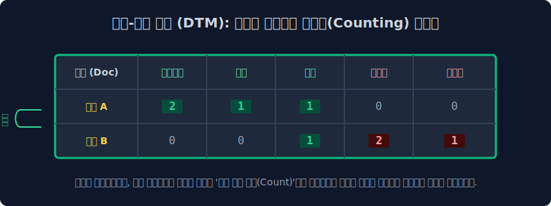
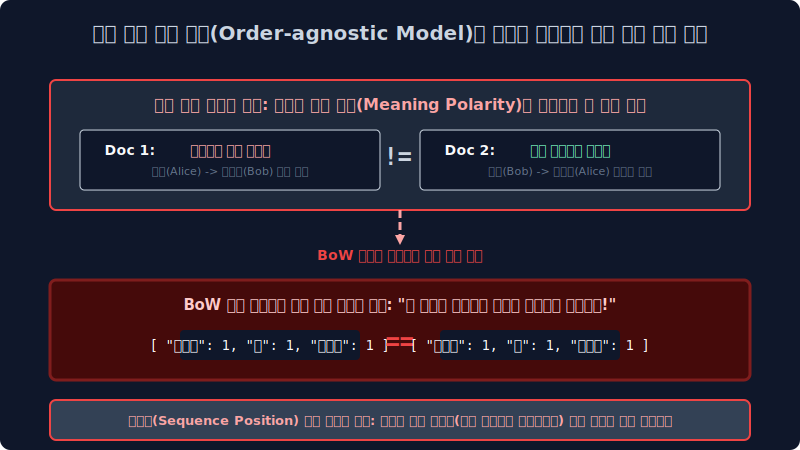

# 1.6 고차원 텐서 차원 축소를 위한 고전 알고리즘의 선형 대타협: 단어 집합 빈도 모형 (Bag of Words, BoW) 아키텍처

선행 OOM 버그 챕터의 원-핫(One-Hot) 파이프라인에서 직교 독립 벡터를 무차별 배타적으로 할당 남발하다가, 고작 단어 타겟 인덱스 1개를 매핑 점유하기 위해 희소성 백그라운드 $100$만 차원짜리 RAM 메모리 스토리지 스케일이 단절 터져나가는 희소행렬의 시스템 지옥도를 본 1950년대 고전 정보 통계 학자들은, 결국 기하 모수 대수학계 공간에 극단적인 차원 축소 맵핑 대타협을 이뤄냅니다. 
*"단어 하나하나를 전역에 다 독립 칸 차원으로 스태킹 만들어 벡터로 반환해 주는 건 인프라 스케일 상 미친 하드웨어 터지는 짓이다. 그냥 단위 문장(혹은 문서 Document) 덩어리를 통째로 커다란 단일 가방 컨테이너(Bag Index) 벡터 스페이스로 무자비하게 통합 병합 취급해서, 전체 도메인 단어들의 **단순 출현 스칼라 확률 횟수(Term Frequency Count 빈도)** 연산 스코어만 밀도 요약 추출해서 텐서에 퉁쳐 찍어버리자!"*
그렇게 텍스트의 미시적 방향 시퀀스 맥락(Sequence Context) 인과성과 토큰 스텝 타임라인 어순 매핑을 행렬에서 완전히 소거 파괴 삭제해 버리는 치명적 구조 대가로, 극강의 압축 스케일 효율 선형 차원 연산력을 얻어낸 역사적인 텍스트 마이닝 매핑 기술 BoW 의 눈물겨운 수학적 매트릭스 변환 과정을 역산 배웁니다.

---

## 1.6.1 위치 시퀀스 정보(Sequence Position) 텐서의 파괴적 소거 사상: Bag of Words 맵핑

모형의 이름 설계 구조 그대로 매핑 아키텍처 전제는 **"문서 내 존재하는 모든 타겟 토큰 단어를 타임 어순 없이 뒤죽박죽 벡터로 섞어버려 합체해 놓은 난잡한 카운팅 가방(Bag of Features Matrix)"** 입니다. 
가방 컨테이너 단일 차원 안에 단어 구슬 텐서 객체들을 어순 스텝 구별 없이 몽땅 집어넣고 무자비하게 물리적 연산 스왑 흔들어 버렸기 때문에, 문장을 정밀 분석할 때 가장 중요한 기준인 **누가 벡터 스텝 상 কখন 언제 첫 번째 시퀀스로 문장 인덱스에서 등장했는지(문맥 의존성, 주어 동사 목적어 체인 순서, 시제 타임라인 인과성 배열)** 파라미터는 완전히 백엔드에서 모수 박살이 나고 통계 허공으로 에러 소멸해 버립니다. 
기계 모델은 이제 가방 텐서 공간 노드에 확률 스캔 손을 넣어 *"음, 이 스페이스에 '사과' 글자 구슬 피처가 총 2개 더듬어지며 카운트 반환되네! 유입된 문서에서 무작위로 사과란 단어가 2번 등장했군!"* 하며 오로지 **순서 방향성이 배제된 단어 객체의 출현 스칼라 빈도수(Count) 수치 결괏값만 병합 매트릭스 압축 배열**로 퉁쳐서 단일 차원 저장합니다.

---

## 1.6.2 BoW 스칼라 빈도 카운팅의 다차원 수학적 선형 행렬 차원 치환 연산 구조 (DTM 매핑)

현실 NLP 시스템 파이프라인에서 이 난잡한 텐서 스왑 맵핑 룰이 어떻게 엑셀 표 같은 거시적 통합 수학 압축 매트릭스(Matrix) 빈도 텐서 벡터로 안정 배열 치환되는지 2개의 매우 짧은 샘플 텍스트 로맨스 문서 도메인을 통해 확률 모수를 추적 파싱해 봅시다.

*   **문서 타겟 A (Doc_A Vector)**: `"사랑해요 당신 정말 사랑해요"`
*   **문서 타겟 B (Doc_B Vector)**: `"정말 미워요 영원히 미워요"`

### 1. STEP 1: 전체 베이스 통합 토큰 피처(구슬) 백과사전 딕셔너리 기저 맵핑 생성 (Global Vocabulary)
먼저 입력 유입된 두 문서 전체 풀 공간에서 표본 파편으로 튀어나온 모든 유니크한(고유한 독립 종속이 없는) 독립 단어 토큰 객체들을 통계적으로 중복 합집합 없이 모아 거대 통합 단어 사전을 단일 구축하고 가로 스케일 칼럼($Column Array Feature$) 번호표 인덱스 차원을 매핑 배열 세팅합니다.
$$ \text{Global Vocabulary Columns Index} = \begin{bmatrix} 0 \text{:(사랑해요)} & 1 \text{:(당신)} & 2 \text{:(정말)} & 3 \text{:(미워요)} & 4 \text{:(영원히)} \end{bmatrix}_{1 \times 5 \text{ Vector}} $$

### 2. STEP 2: 문서별 차원 빈도수 변환 행렬 카운트 채우기 (DTM: 문서-단어 빈도 행렬 / Document-Term Matrix)
다음 스텝으로 각 문서 스페이스 가방 타겟을 개별 스캔 뒤져서 해당 인덱스 단어가 문맥에서 스파스하게 튀어나온 스칼라 출현 횟수 모수만큼 숫자를 $1, 2, 3$ 스칼라 정수로 카운팅 차곡차곡 수학적 팩킹 쌓아 올려서 어마어마한 전역 문서 압축 크기의 **문서-단어 행렬 텐서(DTM, Document-Term Matrix Density Model)** 을 매우 이쁘게 고밀도로 통계 반환합니다.

$$ \text{DTM Count Matrix} = \begin{bmatrix} 
\text{(Doc A Sequence)} & \mathbf{2} & \mathbf{1} & \mathbf{1} & 0 & 0 \\
\text{(Doc B Sequence)} & 0 & 0 & \mathbf{1} & \mathbf{2} & \mathbf{1} 
\end{bmatrix}_{2 \times 5 \text{ DTM Tensor}} $$

이렇게 압도적으로 거대하고 난잡한 비정형 문서 텍스트 글자 1,000단어 덩어리들을 고작 5칸짜리 정수 스칼라 숫자로 이루어진 극도로 고밀도 있는 압축 배열 매트릭스로 대수학적 병합 줄임으로써, 기계학습 분류 선형 모델에 단 1초도 안 걸리고 텐서를 즉각 들이부어 빠른 코스트로 통계 연산을 돌릴 수 있게 혁명을 이끌었습니다! 

---

## 1.6.3 BoW 매핑의 잔혹한 아키텍처 한계점과 파단면 (의미론 시퀀스 인지 기능의 극단 부재)

단어 스칼라 빈도 구축만 처리하므로 시스템 RAM 메모리 공간 직관적 연산 파라미터가 매우 저렴하고 카운트 숫자를 세기가 텐서 스왑 상 편해서 이 BoW 압축 모델은 초기 초창기 고전 기계학습(머신러닝 클래식 분류형) 모델의 전 세계 NLP 황금기를 최적화 주름잡았으나, 가장 시스템적으로 치명적인 오류 결함인 **순서 구조 파괴 모델(Order-agnostic Model)이 자아내는 텍스트 의미망의 논리 치명 결함**이 시스템을 조용히 오답 벡터로 좀먹어 에러로 이끌어 들어갔습니다.

*   **관측 문서 타겟 1**: `"강아지가 나를 너무 안 좋아해서 나는 슬프다"` (주어: 강아지 가해자 타겟 $\to$ 피해자 내 감정)
*   **관측 문서 타겟 2**: `"내가 강아지를 너무 안 좋아해서 강아지가 슬프다"` (주어: 내 가해자 타겟 $\to$ 피해자 펫 감정)

놀랍게도 두 문장이 시맨틱하게 현실 유기체 인간계에 내뿜는 메시지와 결과망의 감정 비극 타겟은 논리적으로 완전히 주최 파라미터가 뒤바뀌어 극성 정반대(Polarity Reverse)입니다. 하지만 이 타겟 역전된 별개의 두 문장 텐서를, 순서를 파괴하는 원시 BoW 카운팅 매트릭스 주머니 모델 알고리즘에 그대로 밀어 통과시켜 필터링 넣으면 모델 백엔드에서 아주 충격적인 오차율 에러 답변이 추론 계산되어 돌아옵니다.
> **고전 NLP 머신 BoW AI의 인퍼런스 에러 결론: "문서 1 노드 스칼라와 문서 2 노드 벡터는 쓰인 타겟 단어 토큰(강아지, 좋아, 슬프다, 나)의 출현 빈도수 횟수 카운팅 스칼라 값이 수학 매핑으로 완벽히 100% 동일한 동치 일치 숫자 텐서 Array 입니다. 이 모델 룰 기반 알고리즘의 제1원칙에 따라, 고로 저 두 비정형 문서는 논리적으로 동일한 감정과 뜻을 가진 100% 동치 쌍둥이 데이터 클론 시맨틱 문서입니다 확정 종료 빙고!"**

이렇게 멍청한 단순 파편 역산 산술 카운팅 피처망의 극단적 오답 한계(누가 주어이고 누가 피해자인지 단어 배열 순서가 망가져 텍스트 뜻을 붕괴시키는 오류)를 기하학적 차원으로 넘기 위해 다음 파이프라인 주차(02주차) 설계자들은 아주 심각한 시스템 통계 고민 수정에 빠지게 됩니다. 
*"그럼 문장의 전체 인과 생사를 가르거나 의미를 정하지도 못하는데 전체 문서 모든 곳에서 너무 흔해 빠져서 쓰레기 노이즈 빈도 확률만 올리는 쓸데없는 조사 단어(은, 는, 이, 가, 의)는, 그 녀석들이 숫자가 카운트 모델에서 아무리 무식하게 카운팅 집계 계산되어도 점수를 오히려 시스템 가중치 법칙으로 일부러 역산 페널티 매겨서 왕창 깎아내려(Penalty Down-Scaling Model) 매트릭스를 수학적으로 스무딩 보정 방어해 버리자!"* 
이러한 단어별 전역적 카운팅 스칼라 TF(빈도 비례)와 도메인 발생 페널티 희소성 역산 IDF(역문서 페널티 분모) 공간의 파라미터 통계 가중치 조절 사상 매핑 결합, 바로 인류 고전 NLP 텍스트 마이닝 매트릭스 역사상 가장 거대하고 위대하게 유명한 수학 파이프라인 결합 공식인 **TF-IDF 최우도 수학 모델**로 세상 컴파일 차원은 한 단계 더 통계적으로 눈부시게 오차율을 저하시켜 진화 고도화 진입하게 됩니다.
