# 문자와 단어 표현 (어휘, 구문, 의미론적 계층)

기계가 사람의 말을 이해하게 만드는 기나긴 여정의 첫 번째 시간입니다. 프로그래밍 초보자 입장에서는 자연어 처리가 단순히 "글자를 컴퓨터에 입력하는 것"처럼 단순하게 느껴질 수 있습니다. 하지만 학술적으로 언어는 매우 깊은 깊이의 **'계층 사다리'**를 갖고 있습니다. 이를 일상적인 비유를 통해 아주 쉽고 직관적으로 파헤쳐 봅니다.

---

## 00. 문자와 단어: 컴퓨터가 고기를 먹는 법
"안녕하세요 선생님" 이라는 인간에게는 너무나 익숙하고 평범한 문장이 있습니다. 이것을 컴퓨터 메모리에 그대로 집어넣으면 컴퓨터는 질식해 버립니다.

> [!NOTE]  
> **📖 초심자를 위한 쉬운 해설: 아기에게 스테이크 먹이기**  
> 컴퓨터는 거대한 문장 지문을 통째로 주면 절대 스스로 소화 구별을 하지 못합니다. 마치 치아가 없는 아기에게 등심 스테이크 덩어리를 통째로 입에 밀어 넣는 것과 같습니다.  
> 인공지능 분석의 가장 첫 번째 단추는, 이 덩어리를 컴퓨터 목구멍에 넘어가기 가장 좋은 최소 크기(단어, 혹은 글자 한 알 단위)로 사각사각 잘라주는 **칼질(토큰화, Tokenization)**에서 시작됩니다. 본 장에서는 도대체 무엇을 기준으로 칼질을 해야 하는지 언어의 뼈대를 봅니다.

## 01. 텍스트 분석의 스펙트럼 (3대 계층 구조)
인간의 말, 자연어 텍스트는 칼로 자르는 깊이에 따라 크게 3가지 계층(Layer)의 관점으로 바라볼 수 있습니다. 얕은 곳에서부터 아주 깊은 곳까지 순서대로 내려가 봅니다.

1.  **어휘 표현 (Lexical)**: 낱말 카드 하나하나의 껍데기만 쳐다보는 아주 1차원적인 단계입니다. (예: "안녕", "사과")
2.  **구문 표현 (Syntactic)**: 낱말 카드를 레고처럼 조립해서 뼈대를 세우는 문법적 단계입니다. (예: "나는 사과를 먹는다")
3.  **의미 표현 (Semantic)**: 뼈대 뒤에 은밀하게 숨겨진 글쓴이의 진짜 시그널(비꼬기, 감정)을 눈치껏 스캔하는 최종 보스 단계입니다.

---

## 02. 가장 얕은 물: 어휘 표현 (Lexical)
단어와 문자 그 자체가 가진 형태학적, 사전적 특성에만 집중하는 가장 밑바닥 기초 공사 단계입니다.

> [!IMPORTANT]  
> **📖 초심자를 위한 쉬운 해설: 영단어 암기장**  
> 마치 영어 사전의 가장 첫 페이지를 무작정 펼쳐놓고 'A'부터 'Z'까지 글자 자체의 스펠링이나 품사(명사냐 동사냐)만 달달 쓰면서 외우는 고통스러운 작업과 똑같습니다. 문장이 전체적으로 무슨 뜻인지는 이 단계에서는 1%도 관심이 없습니다. 오로지 눈앞에 떨어진 토큰 조각이 생겨 먹은 그 자체에만 집착합니다.

### 어휘 분석의 실무적 과제
*   **띄어쓰기 절단**: 텍스트를 공백이나 탭(Tab) 기준으로 기계적으로 부숩니다.
*   **품사 분석**: 잘라진 조각에 국어사전을 들이대고 "이 녀석은 `명사`입니다!", "저 녀석은 `조사`입니다!" 하고 라벨 이름표를 붙입니다.
*   **어간 추출**: 영어의 `cats`, `watches` 뒤에 붙은 복수형 꼬리 `-s`, `-es`를 체에 걸러버리고 본래의 뿌리 단어 `cat`, `watch` 만 무자비하게 추출해 냅니다.

## 03. 문법의 뼈대 세우기: 구문 표현 (Syntactic)
단어 파편들이 모여서 하나의 완전한 문장을 이룰 때 보여주는 구조적/통계적 뼈대를 파악하는 2단계입니다.

### 컴퓨터에게 문법 구조도 그리기
학창 시절 구어체와 문어체의 문법 트리를 그렸던 기억이 있으신가요?
"키가 큰 소년이 빠르게 달린다"라는 문장을 받았을 때 기계는 다음과 같이 트리를 뻗어나갑니다.
- `키가 큰 소년이` $\to$ 명사구(NP, Noun Phrase) 집단
- `빠르게 달린다` $\to$ 동사구(VP, Verb Phrase) 집단
이렇게 트리 계층이 올바르게 성립되는지 검사하여, 해당 문장이 문법적으로 불량이 아닌 정상인지 컴퓨터 모델이 스스로 판단(Parsing)할 수 있도록 구조를 심어줍니다.

## 04. 최종 보스 독심술: 의미론적 표현 (Semantic)
텍스트의 이면에 깔려 있는 진정한 뜻, 그리고 단어와 단어 사이의 유기적인 관계도를 도출해 내는 가장 고차원적인 단계입니다. 바로 **챗GPT와 거대 트랜스포머 AI가 지배하는 현대 자연어 처리의 핵심 영역**입니다.

### 맥락과 눈치의 정복
과거 컴퓨터 학자들이 가장 크게 좌절했던 계층입니다. 단어 하나하나 명사인지 동사인지(어휘) 다 맞추고, 주어-동사 호응 법칙(구문) 검사까지 완벽히 통과했는데도 컴퓨터는 문장의 진짜 뜻(의미)에 도달하지 못해 오답을 냈습니다.

*   `"사과를 맛있게 먹었다."` $\to$ 먹는 과일 종류 (Fruit)
*   `"저의 진심 어린 사과를 받아주십시오."` $\to$ 미안함을 표현하는 행위 (Apology)

컴퓨터가 이 '사과'라는 동일한 쌍둥이 글자를 맞닥뜨렸을 때, 주변 글자들을 곁눈질로 훑어보고(Contextual Attention) 진짜 뜻이 무엇인지 꿰뚫어 보는 지능을 갖추는 것. 이것이 텍스트 데이터의 언어학적 계층 구조가 도달하고자 하는 가장 궁극적인 성배(Holy Grail) 기술입니다.
