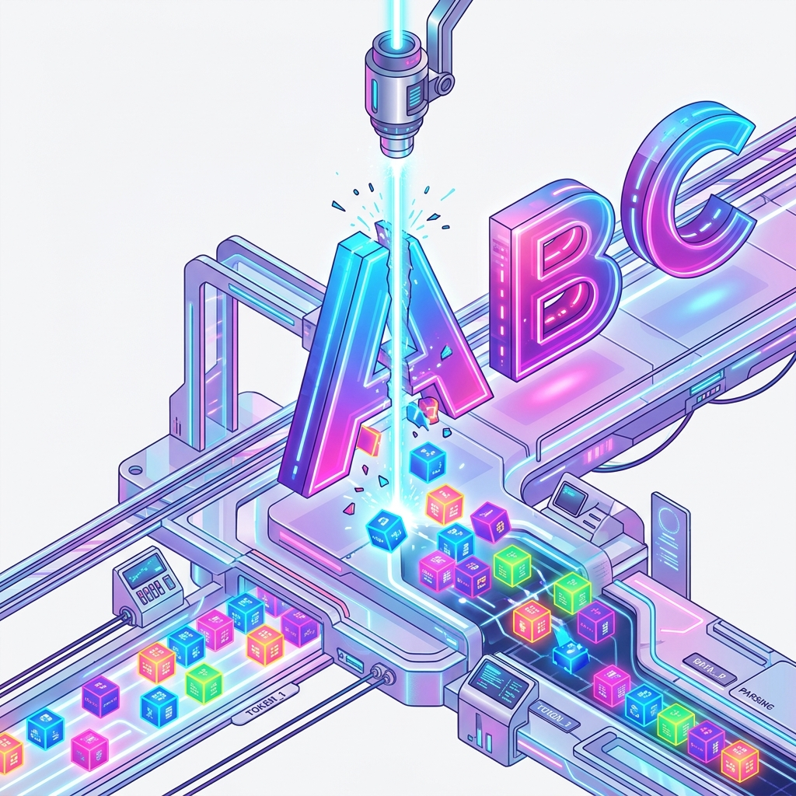
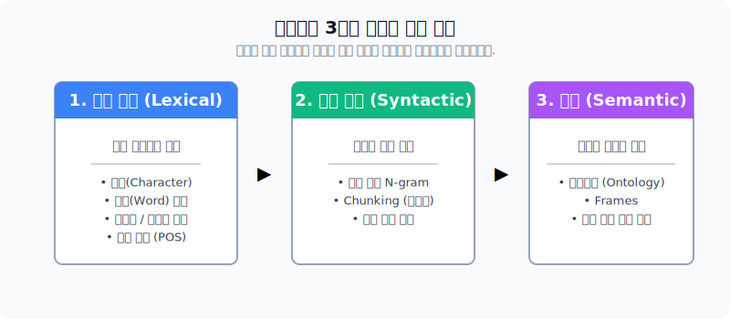
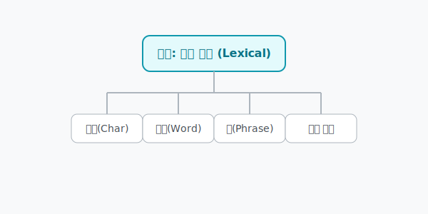
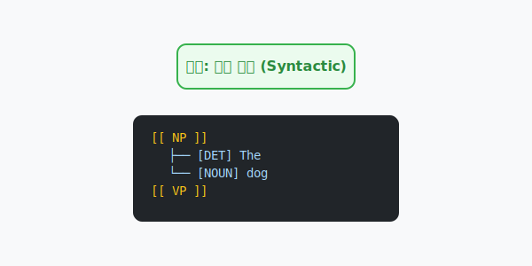
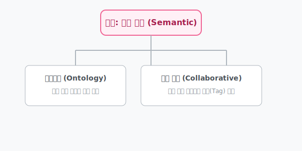
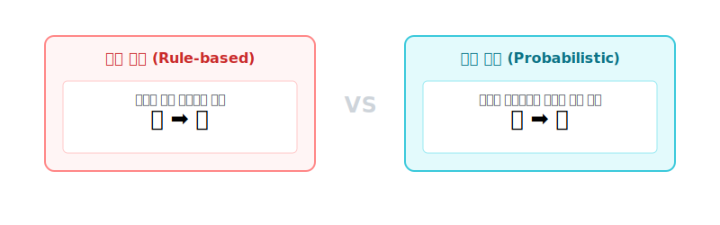
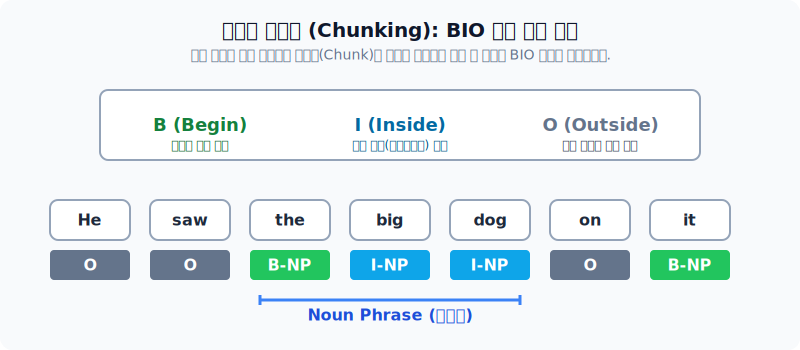
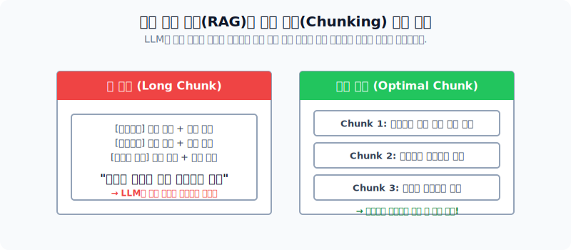
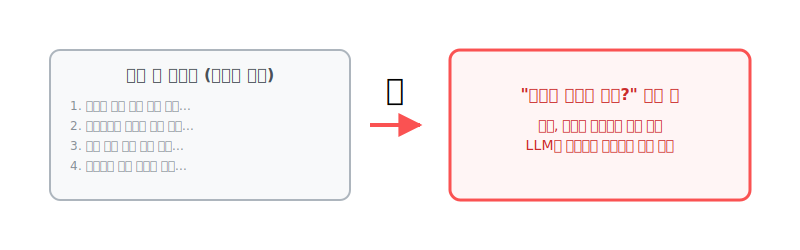
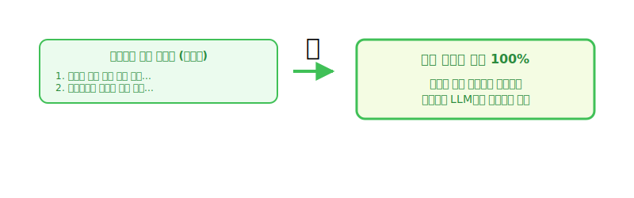

# 문자와 단어 표현 (어휘, 구문, 의미 표현)

이 문서에서는 프로그래밍 초보자가 텍스트 데이터를 어떻게 컴퓨터가 다루기 쉬운 조각으로 쪼개고(토큰화) 계층화하는지를 일상적인 비유를 통해 아주 쉽고 직관적으로 배웁니다.

---

## 00. 문자와 단어 표현
인간의 언어를 컴퓨터가 분석 가능한 단위로 부수는(쪼개는) 기법의 기초를 배웁니다.

> [!NOTE]  
> **📖 초심자를 위한 쉬운 해설**  
> 컴퓨터는 "안녕하세요 선생님" 이라는 긴 문장을 덩어리째 주면 절대 소화하지 못합니다. 마치 아기에게 스테이크를 통째로 먹이는 것과 같죠.  
> NLP의 첫 단추는 이 거대한 고기(문장)를 가장 먹기 좋은 크기(단어, 글자)로 사각사각 잘라주는 **칼질(토큰화)**에서 시작됩니다.

## 01. 텍스트의 3가지 표현 단위
자연어 텍스트는 크게 3가지 계층의 관점에서 바라볼 수 있습니다.

> [!TIP]  
> **📖 초심자를 위한 쉬운 해설**  
> 1.  `어휘` 단계는 낱말 카드 하나하나를 쳐다보는 것입니다. (예: "안녕", "사과")
> 2.  `구문` 단계는 카드를 조합해서 문장이라는 뼈대를 만드는 것입니다. (예: "나는 사과를 먹는다")
> 3.  `의미` 단계는 뼈대 뒤에 숨겨진 글쓴이의 진짜 시그널(감정, 의도)을 파악하는 것입니다.

## 02. 어휘 표현 (Lexical)
단어와 문자 그 자체가 가진 형태학적 특성에 집중하는 가장 밑바닥 기초 단계입니다.

> [!IMPORTANT]  
> **📖 초심자를 위한 쉬운 해설**  
> 마치 영어 사전의 가장 첫 페이지를 펼쳐놓고 'A'부터 'Z'까지 글자 자체의 스펠링이나 뜻만 달달 외우는 작업과 똑같습니다. 문장이 전체적으로 무슨 뜻인지는 이 단계에서는 전혀 관심이 없습니다. 오로지 "저 단어의 품사가 명사인가?"만 신경 씁니다.

## 03. 구문 표현 (Syntactic)
단어들이 모여 문장을 이룰 때 보여주는 구조적 또는 통계적 뼈대를 파악하는 단계입니다.

## 04. 의미론적 표현 (Semantic)
텍스트의 이면에 깔려 있는 진정한 뜻과 개념들을 도출해 내는 가장 고차원적인 최종 목적지입니다.

## 05. 문자 단위 텍스트 분석
글자 하나하나가 분석 단위 요소가 되는 방법입니다. (기본 '글자'와 '구분 기호'로 나뉨)

| 구분 | 설명 | 데이터 예시 |
|:---|:---|:---|
| **기본 글자** | 영문 알파벳, 한글 자모음 등 | `A, B, C`, `가, 나, 다` |
| **구분 기호** | 마침표, 쉼표 등 문장이 끊기는 곳 | `. , ? ! :` |

## 06. 단어 단위 텍스트 분석
[단어] 하나가 분석 요소가 되는 형태입니다. NLP에서 가장 널리 쓰이고 무난한 표준 방법입니다.

> [!TIP]  
> **📖 초심자를 위한 쉬운 해설**  
> 한국어는 띄어쓰기를 기준으로 숭덩숭덩 자르기만 해도 꽤 훌륭한 [단어 단위] 조각(토큰)들이 발생합니다. 이 조각들 하나하나를 바구니에 담아서 분석하는 것이 자연어처리의 가장 흔한 시작입니다.

## 07. 토큰화 (Tokenization)
주어진 원시 텍스트(문자열)를 분석에 유용한 조각 요소(**Token**)로 잘게 자르는 핵심 작업입니다.

## 08. 단어 단위 vs 문장 단위 토큰화 비교
스테이크(텍스트)를 얼마나 크게 자를 것인가에 대한 선택입니다.

| 단위 | 예시 ("Hello. I am Tom.") | 장단점 및 비유 |
|:---|:---|:---|
| **문장 단위** | `["Hello."]`, `["I am Tom."]` | 뼈째로 자르기. 문맥은 잘 유지되나 디테일 분석이 불가능합니다. |
| **단어 단위** | `["Hello", ".", "I", "am", "Tom", "."]` | 다지기로 잘게 썰기. 단어별 통계를 내기엔 무척 쉽지만 문장의 전체 느낌은 잃어버릴 수 있습니다. |

## 09. 품사 태깅 (POS Tagging)
나뉘어진 각각의 단어에게 "너는 명사야, 너는 동사야" 하고 알맞은 문법적 이름표(Labeling)를 붙여주는 작업입니다.

## 10. 품사 태깅의 두 가지 통계 기법 비교
과거 방식(사전)과 현재 방식(확률 모델)의 차이입니다.

> [!NOTE]  
> **📖 초심자를 위한 쉬운 해설**  
> `규칙 기반(과거)`은 수백쪽짜리 국어사전을 옆에 펴두고, 컴퓨터가 "어? '가다'는 무조건 동사네!" 라고 외워서 푸는 무식한 방식입니다.  
> `확률 모델(현대)`은 앞뒤에 어떤 단어가 왔는지를 슬쩍 보고 "음... 앞에 '맛있는' 이라는 형용사가 왔으니 지금 이 단어는 무조건 [명사] 품사이겠구나!" 라고 눈치껏(확률로) 맞춰버리는 고급 스킬입니다.

## 11. 구 표현: N-gram 이란?
단어 한 개씩만 자르면(Uni-gram) 앞뒤 맥락이 다 끊겨버리는 치명적인 문제를 막기 위해 등장했습니다. 여러 단어를 하나로 이어 붙여 기차량 칸으로 묶어버립니다.

> [!IMPORTANT]  
> **📖 초심자를 위한 쉬운 해설**  
> "나는 사과가 엄청 **싫다**" 라는 문장을 1단어(Uni-gram)로만 자르면 `[엄청]`, `[싫다]` 로 떨어집니다. 하지만 만약 문장이 "나는 사과가 엄청 **좋지는 않다**" 라면? 이걸 1단어씩 쪼개버리면 억울하게 `[좋지는]` 이라는 단어 때문에 컴퓨터가 "오! 긍정적인 글!" 이라고 오해합니다.  
> 이를 막고자 2량 기차표 테이프(Bi-gram)를 써서 아예 `[좋지는 않다]`를 하나의 묶음 덩어리로 잘라내면 의미가 파괴되지 않고 안전합니다.

## 12. N-gram 예시 실습
원문: `The future depends on what we do in the present`

* **uni-gram**: `[The]`, `[future]`, `[depends]`, `[on]`, ...
* **bi-gram**: `[The future]`, `[future depends]`, `[depends on]`, ...
* **tri-gram**: `[The future depends]`, `[future depends on]`, ...

## 13. 텍스트 단위화 (Chunking)
단순 무식한 N-gram 기차를 넘어, 어휘적으로 상호 관련이 깊은 단어들의 의미 덩어리(Chunk)로 유연하게 나누는 고급 기법입니다.

## 14. 텍스트 단위화 (트리 기반)
텍스트를 문법 규칙에 종속시켜 명사구(NP) 등 트리 구조의 가지 형태로 위에서 아래로 뻗어가며 그리는 클래식한 학술 분석 방법입니다.

## 15. 텍스트 단위화 (태그 기반 - BIO 태그 방식)
복잡한 그림(트리) 구조를 쓰지 않고, 단어 옆에 **[알파벳 라벨 기호]**만 붙여서 덩어리의 시작과 끝을 나타내는 매우 효율적인 기법입니다.

| 기호 | 의미 (Meaning) | 설명 |
|:---:|:---|:---|
| **B** | Begin | 의미 덩어리가 시작되는 첫 번째 단어 (머리) |
| **I** | Inside | 머리에 이어져 따라오는 꼬리 내부 단어들 |
| **O** | Outside | 지금 이 덩어리와 아무 상관없는 동떨어진 단어 |

## 16. 검색 증강 생성(RAG)에서의 최신 청킹(Chunking) 사례
최근 챗GPT 등 LLM에게 회사의 수백 장짜리 PDF 메뉴얼을 읽힐 때, 문서를 적절한 크기의 문맥 덩어리로 썰어서(Chunk) 먹여줘야 성능이 극대화됩니다.

## 17. RAG 청킹 예시: 긴 청킹 길이 (과도한 문맥 모호화)
만약 덩어리를 너무 길고 큼지막하게 대충 자르면 치명적인 부작용이 발생합니다.

## 18. RAG 청킹 예시: 짧은 청킹 길이 (적정한 정보 밀도)
청크를 적절하고 짧게 나누게 되면, 해당 의미의 문서 블록에 딱 맞는 검색 키워드를 매치시킬 확률이 비약적으로 점프합니다.

