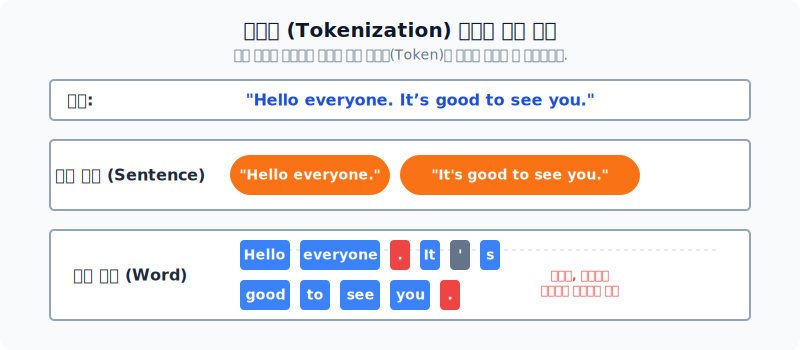
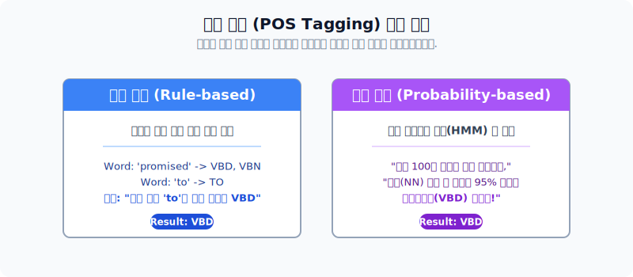

# 자연어 처리의 3가지 표현 단위: 문자와 단어 표현

어떤 복잡한 자연어 처리 시스템이라도 결국엔 사람이 입력한 **글자(Text)**를 어떻게 분해하고 이해할 것인가의 문제로 귀결됩니다. 텍스트를 컴퓨터가 이해할 수 있는 단위로 쪼개는 작업은 크게 어휘, 구문, 의미의 3가지 추상화 계층으로 나눌 수 있습니다. 이번 섹션에서는 그 기초 단계인 **어휘 표현(Lexical)** 과 **구문 표현(Syntactic)** 단위의 분석 기법들을 중점적으로 알아봅니다.

*텍스트가 처리되는 3단계의 계층 구조*

---

## 1. 토큰화 (Tokenization)

주어진 텍스트를 분석에 유용한 의미 체계를 가진 단위(Token)로 잘게 나누는 작업을 **토큰화**라고 합니다. 통계 모델에서는 보통 단어 기준 띄어쓰기 토큰화를 선호하지만, 목표에 따라 그 단위는 유동적으로 바뀝니다.

- **문자 단위 (Character)**: 글자 하나하나 쪼갭니다. 의미는 없지만 희귀단어 처리에 강점이 있습니다.
- **단어 단위 (Word)**: 자연어 분석의 가장 보편적인 쪼개기 방식입니다. 구두점이나 따옴표 역시 독립적인 토큰이 됩니다.
- **문장 단위 (Sentence)**: 여러 문장이 뭉쳐있는 긴 문단에서, 마침표(.)를 기준으로 문맥의 덩어리를 얻어냅니다.

---

## 2. 품사 태깅 (POS Tagging: Part-Of-Speech)

동일한 '배(Ship, Pear, Stomach 등)'라는 단어도 문맥에 따라 명사일 수도 있고, 전혀 다른 의미일 수도 있습니다. 형태소(토큰) 단위로 분리된 단어들에 알맞은 **품사(명사, 동사 등)** 를 달아주어 모호성을 지우는 작업입니다.

*인간의 문법 규칙을 입력하는 규칙 기반과, 말뭉치의 통계를 이용하는 확률 기반 기법*

- 최근의 품사 태깅은 막대한 코퍼스를 토대로 한 HMM(은닉 마르코프 모델) 기반의 **확률 기반 기법** 혹은 딥러닝 기반 태거가 주류를 이루고 있습니다.

---

## 3. 구문 표현: 청킹(Chunking)과 BIO 태깅

단어 그 자체의 품사만으로는 부족할 때, 의미적으로 뭉쳐 다니는 단어의 그룹 즉, **덩어리(Chunk)** 를 묶어주는 과정이 청킹입니다. 구문 분석(Parsing) 트리 모양으로 파악하는 방법과 함께, **BIO 태그** 방식이 가장 유명합니다. 

*Begin-Inside-Outside의 약자로, 청크 덩어리의 '시작-중간부분-나머지(밖)'를 구별합니다.*

---

## 4. [심화] LLM 프롬프트 검색(RAG)에서의 청킹 (Chunking) 전략

최근 ChatGPT와 같이 방대한 외부 지식을 텍스트로 참조해서 대답하는 **RAG(검색 증강 생성)** 기술에 있어서도 문서 쪼개기(청킹)는 필수 불가결한 핵심입니다.

- **긴 길이의 청크**: 문맥의 흐름은 잘 유지되지만, 청크 안에 상반된 너무 많은 정보(신혼부부 정책 + 청년통장 + 역세권 주택)가 얽혀 있어 모듈이 "이 문단이 정확히 무엇에 관한 문단인지" 검색의 정확도를 상실하기 십상입니다.
- **짧고 최적화된 청크**: 주제별로 예리하게 잘린 청크를 사용하면, LLM이 사용자의 질문(Query)에 부합하는 매칭 문서만을 쏙쏙 골라와 정확한 대답을 생성할 수 있습니다. 즉, 현대 AI 개발에 있어서 **의도와 문단에 맞춘 적절한 청킹 길이 설계**는 성능의 성패를 가릅니다.
