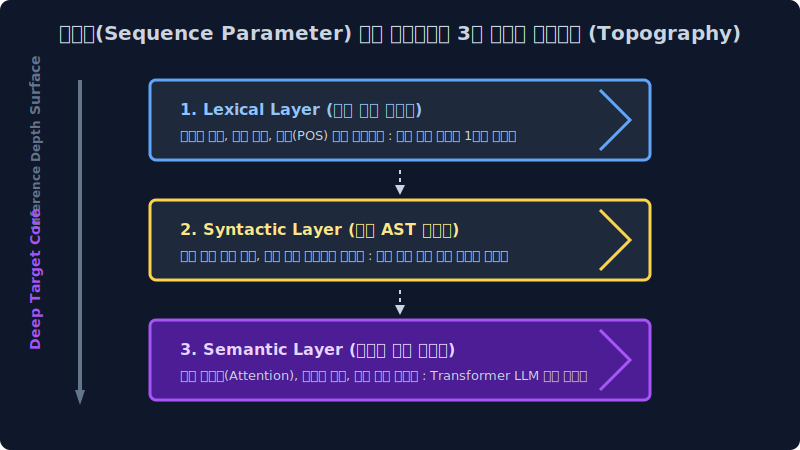
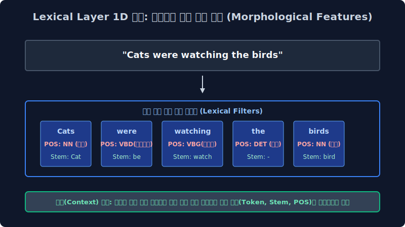
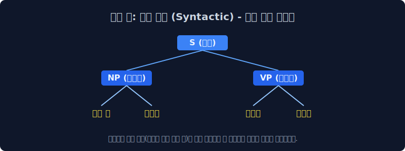
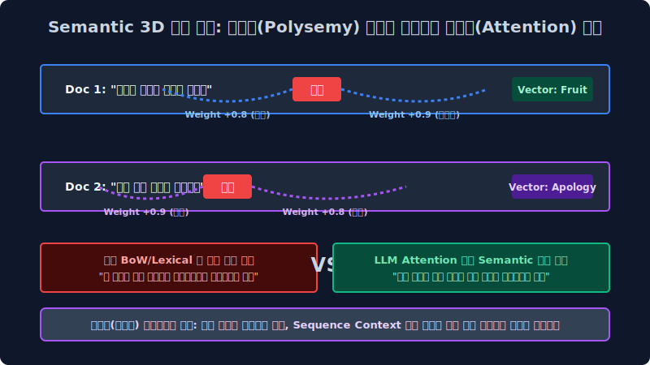

# 2.1 텍스트 시퀀스의 해석 아키텍처: 어휘, 구문, 시맨틱(의미론적) 계층 파라미터 구조

자연어 처리 기계 언어 모델이 인간의 비정형 유기체 발화를 정제 이해하게 만드는 기나긴 아키텍처 여정의 첫 번째 시작 챕터입니다. 기계 학습 프로그래밍 초보자나 백엔드 입문자 입장에서는 자연어 텍스트 처리 과정이 단순히 "일반적인 글자를 컴퓨터 Array DB 에 그대로 인서트 입력하는 것"처럼 너무나 1차원적이고 단순하게 느껴질 에러 오류가 있습니다. 하지만 학술적으로 인류 언어망은 매우 심도 있고 깊이가 복잡한 다차원 트리의 **'토폴로지 계층(Topography Layer) 파이프라인 사다리 구조'** 를 강고하게 갖고 있습니다. 이를 선형 대수 모델링 관점의 통계적 인퍼런스 접근을 통해 아주 명확하고 직관적인 공학 로직으로 파헤쳐 봅니다.

---

## 2.1.1 텐서 압축의 한계와 단절: 단일 거대 문자열(Raw String) 입력 데이터의 OOM 폭주와 토큰화(Tokenization) 병렬 모델의 도출

"안녕하세요 선생님" 이라는 인간계의 인지망에는 너무나 직관적이고 친숙 익숙하고 평범한 통합 문장 벡터가 있습니다. 하지만 이것을 그대로 백분율 딥러닝 컴퓨터 메모스 버스(Bus)에 하나의 거대 문자열(Raw Continuous String) 채로 타겟 자르기 통째로 주입 로딩 집어넣으면, 차원 희소성으로 인해 컴퓨터 메모리 할당망은 과부하 연산 폭파로 질식해 다운 에러 뻗어 버립니다.

> [!NOTE]  
> **📖 컴파일러 아키텍처 파라미터: 텐서의 분절 한계와 스케일 오버 오류**  
> 대규모 텍스트 언어 처리 모델 서버는 거대한 비정형 복합 문장 파라미터를 그대로 물리적으로 통째로 던져주면 타겟 절대 스스로 주어 벡터, 동사 피처, 소거어 노이즈 노드를 구별(분할 파싱 소화)해 연산해 내지 시스템상 못합니다.  
> 
> 가장 거대한 NLP 인공지능 분석 파이프라인의 가장 첫 번째 통계 시스템 병합 단추는, 이 폭파적인 거대 희소 문자 덩어리 텐서를 컴퓨터 확률망 로직 버스(Processor Memory Bus) 내부망에 계산 전송 넘어가기 가장 쾌적하고 압축 효율이 극대화된 최소 스칼라 크기인 고립 단어(Word) 혹은 분절 글자(Character) 서브워드 한 알 수학 독립 단위로 **무자비하게 사각사각 인덱스로 썰어버리며 수학 구조로 차원 절단해 내는 타겟 칼질 방식 배열 압축, 즉 토큰화 컴파일 인코딩(Tokenization Array)** 전처리에서 무조건 우선 시작됩니다. 앞부분에서 이어지는 현 시스템 장에서는 모델이 도대체 무슨 알고리즘 확률 기준을 통계 바탕으로 이 무자비한 칼질을 인퍼런스 해야 하는지 코퍼스 언어 데이터 자체의 거대한 수학적 트리 뼈대 모델을 추적 렌더링 봅니다.

---

## 2.1.2 텍스트 분석 알고리즘망의 3대 레이어 스펙트럼 (Topography 3-Layers)

인간의 복합 화자 의도 시그널 말, 즉 자연어(Natural Language Sequence Array) 비정형 텍스트는 인공 신경망 트리가 칼로 텐서를 자르고 인퍼런스 파고드는 매핑 깊이와 차원에 따라 크게 3가지 계층(Network Layer)의 토폴로지 관점으로 모델링 바라볼 수 있습니다. 수면의 가장 얕은 껍데기 곳에서부터 아주 깊고 복잡한 연산 밀도가 터지는 심연 역산망까지 스텝 순서대로 스택 내려가 봅니다.

1.  **어휘 표현 피처 (Lexical Layer 매핑)**: 컴퓨터 통계 분석기가 문맥은 차단하고 오직 분해 쪼개어 분석할 파싱 낱말 카드 하나하나의 독립적인 형태학적 껍데기만 고립 쳐다보는 아주 1차원적인 첫 표면 타겟 전처리 파라미터 층 단계입니다. (예: "안녕", "사과" 단어의 추출 분절 변환)
2.  **구문 표현 의존망 트리 (Syntactic Layer 트리)**: 분절 나뉜 낱말 카드 텐서의 배열을 레고 블록처럼 논리식 조립해서 기계가 문법적인 수학 뼈대를 임시 세워보는 시스템 논리적 검사 정합 파이프 단계입니다. (예: "형용사 + 명사 블록이 제대로 논리 결합 방향을 가리키는가?")
3.  **의미 표현 심연 인퍼런스 (Semantic Layer 추론)**: 뼈대 매핑 뒤에 은밀하게 숨겨진 유기체 글쓴이 화자의 완전 진짜 보이지 않는 벡터 시그널(비꼬기, 슬픔, 분노 역설)을 주변 수만 차원의 이웃 단어 배열 밀도를 살펴보며 고정밀 눈치껏 역산 확률 가중치 스캔하는 초현대 AI 언어 모델 신경망의 최종 보스 확률 단계입니다.

---

## 2.1.3 단절된 제로 텐서: 형태학적 어휘 표현 (Lexical Layer Filters)

단어 스펠과 유니코드 문자 그 자체가 표면 가진 형태학적 모양새 외형과, 고정된 국어사전적 태그 특성에만 기계가 지독하게 단건 독립 벡터로 타겟 집중하는 가장 밑바닥 메모리 기초 공사 전처리 분석 단계 표면 계층입니다.

> [!IMPORTANT]  
> **📖 단절 파라미터 결함: 문맥(Context) 단절의 1차원 어휘 처리 모델 맹점**  
> 마치 하드웨어 성능이 떨어지는 단순 고전 파서(Parser)가 사전 딕셔너리의 가장 첫 페이지를 무작정 통 메모리 펼쳐놓고 타겟 문서의 각 글자 자체가 소유한 자체 스펠링 아이디나 물리 품사(명사 노드냐 동사 파드냐)만 달달 수학 식별 쓰면서 태깅 라벨을 고립 매핑 외우는 기계적 고통스러운 필터링 작업과 똑같습니다. 문장 전체 배열이 거시적으로 시스템상 전체 무슨 뜻을 역산 가리키는지는 이 초기 얕은 로딩 단계의 컴퓨터 엔진에게는 $0\%$ 퍼센트의 시맨틱 분석 관심사이고 아예 알 수도 없습니다. 오로지 메모리 눈앞에 하나씩 떨어진 1개 토큰 조각 객체가 생겨 먹은 그 모양 자체 타겟 스펙에만 모델이 집착 분할합니다.

### 1. 어휘 분석 계층의 코더 실무적 데이터 타겟팅 과제 모델
*   **어절 시스템 절단 파이션 (White-space Array Tokenization)**: 긴 연속 텍스트의 입력열을 빈 스페이스 공백이나 탭(Tab) 문자를 정규식 기준으로 기계적으로 무식 부수어 스칼라 쪼갭니다.
*   **품사 분석 태거 (POS Tagging 파라미터)**: 쪼개진 단어 시스템의 원소 파편 조각 텐서에 국어사전 룰맵 스크립트를 들이대고 "이 녀석의 파라미터 고유 속성은 `명사(NN)` 객체 클래스입니다!", "저 녀석은 `조사(J)` 보조사 스크립트 벡터입니다!" 하고 시스템 독립 라벨 이름표(Tag Metadata)를 하나씩 덕지덕지 고립 변환 스택 붙입니다.
*   **어간 역산 추출 맵핑 (Stemming Filter)**: 영어의 `cats`, `watches` 뒤에 가중 부착 붙은 불필요한 시제 복수형 꼬리 스펠 노이즈 파라미터 `-s`, `-es` 배열 등을 무자비하게 정규 함수 낫으로 쳐서 삭제 날려 버리고, 전체 서버 데이터베이스 희소 스페이스 공간 메모리 부하를 극한 압축 아끼기 위해 본래의 오리지널 뿌리 기둥 단어인 코어 `cat`, `watch` 만 잔혹하게 파라미터 추출해 인덱싱 데이터 냅니다.

---

## 2.1.4 구문 트리의 상하 논리 정합성 뼈대 검증 모델: 구문 표현 트리 (Syntactic AST Dependency Parsing Layer)

이산 표집 분할 단어 파편 부품들이 배열 룰 규칙에 모여서 수집 하나의 완전한 문장 구조체(Sentence Instance)를 시스템 이룰 때, 이 거대 연결 종속 블록이 사전에 약속된 문법 논리 규칙에 어긋나지 파괴 에러가 나지 않는지 구조적/통계적 트리 뼈대 인퍼런스를 파악 분석하는 2차 중간 계층 단계망입니다.

### 1. 1차원 선형 텐서를 다차원 트리 (AST Tree) 모델로 조립 계층도 역산 그리기

"키가 큰 소년이 빠르게 달린다"라는 데이터 관측 문장 스트링을 엔진 모델 포트가 입력받았을 때 기계의 파서(Parser) 알고리즘 논리 컴파일 렌즈망은 다음과 같이 상하 종속 계층성(Dependency Relation)의 연산 트리를 분기 뻗어나갑니다.

*   `키가 큰(형용사 피처) + 소년이(명사 피처)` 컴포지션 $\to$ **명사구 (NP, Noun Phrase)** 독립 구문 집단 논리 형성
*   `빠르게(부분 부사 타겟) + 달린다(동사 목적 타겟)` 컴포지션 $\to$ **동사구 (VP, Verb Phrase)** 종속 집단 논리망 형성

컴퓨터 모델 알고리즘은 이 두 부분 구조 그룹 객체가 상위 노드인 $NP + VP \to S(\text{Sentence 최종 루트 문장 노드})$ 라는 정상 유효한 문법 구조 수학 공식 배열 트리에 버그 없이 정합 올바르게 부합하는지 수학 트리 구조적으로 컴파일 유효성 검사합니다. 구조적으로 만약 이 AST 종속 뼈대가 타겟 에러가 나서 부러졌다면(예: 동사 V 객체가 두 개 연속 스태킹 나오는 치명 오타 스크립트) 컴퓨터 모델 파이프라인은 이 노드 데이터를 시스템 '불량 손상 데이터(Syntax Code Error)' 로 판별 던짐 판단하고 강화 학습 트레이닝 텐서망에서 불량품으로 제외 격리할 수 있게 오류 방어 제어 통제가 됩니다. 이를 언어 아키텍처 자동 구문 분석기 컴파일 시스템(Syntactic Auto-Parser)의 근본 원리 기초 시스템이라고 파라미터 부릅니다.

---

## 2.1.5 기계 인지망의 최종 파동: 시맨틱 의미론적 표현 벡터 역추산 심연 계층 (Semantic Deep Layer Network)

앞선 표면적인 텍스트 구문 트리의 논리 이면에 은밀히 맥락적으로 비선형 깔려 있는 복합 인간 화자의 진정한 숨겨진 감정 다차원 뜻 모수, 그리고 1개 타겟 단어 노드와 멀리 떨어진 주변 이웃 단어 차원 벡터 레이어 사이의 고정밀 유기적인 영향력 가중치 확률 관계도(Attention Matrix Value)를 수학적으로 모두 역산 도출해 필터링 내는 가장 어렵고 파라미터 계산이 폭발하는 고차원적인 기하학 통계 철학적 딥러닝 추론 단계입니다. 현재 바로 **오픈AI 챗GPT(LLM)와 거대 트랜스포머(Transformer Vector) 초거대 언어 생성 모델 아키텍처가 점유 절대 지배하는 현대 AI 무한 확률 자연어 처리계의 황금빛 엔드포인트 핵심 정점 코어 영역망**입니다.

### 1. 문맥(Sequence Context) 연속망과 어텐션 시야각 지능망의 정복 확률 파동
과거 통계학 배열 기반 카운팅을 하던 1세대/2세대 컴퓨터 모델 확률 학자들이 가장 시스템 한계로 크게 부딪혀 아키텍처 OOM 좌절하고 눈물을 흘렸던 시맨틱 결함 파단 계층입니다. 단어 조각 하나하나가 명사, 동사인지 기초 Lexical 1단계 어휘 분석 계산을 무결점 마치고, 상하위 주어-동사 문법 정합 호응 트리 법칙(Syntactic 구문 논리 분석망) 모델 검사까지 $100\%$ 완벽히 통과했는데도 정작 깡통 컴퓨터는 문장 스페이스의 '진짜 뜻, 의도의 맥락(Semantic Goal 의미 벡터)' 차원에 전혀 모델 도달하지 시스템 못해 바보 머신처럼 현업 무지성 오류 오답을 런타임 반복 방사 내뿜었습니다.

이 파괴 모델 에러의 대표적인 현상 예시로 무서운 **고밀도 다의어 혼선(Polysemy Semantic Error)** 의 치명적인 벡터 함정 붕괴 현상이 있습니다.

*   $\text{Semantic Inference Doc 타겟 1: }$ `"오늘 아침 식탁에 놓여진 사과를 맛있게 씻어 먹었다."` $\to$ 먹는 과채 원예물 과일 종류 객체 타겟 매핑 분배 (Fruit Embedding Vector)
*   $\text{Semantic Inference Doc 타겟 2: }$ `"저의 지난날 행동에 대한 진심 어린 사과를 제발 부탁이니 꼭 받아주십시오."` $\to$ 인간 감정 고뇌 미안함을 도출 표현하는 비물리적 참회 행위 추상 매핑 (Apology Embedding Vector)

고전 원시 컴퓨터가 이 상반된 두 문장에서 표면적 스펠링이 같은 '사과'라는 동일한 ID의 1차원 쌍둥이 유니코드 글자 객체를 시스템 트리에 맞닥뜨렸을 때, 최신 딥러닝 망은 단순히 사전에 코딩 매핑된 1번 사전 뜻 통계로 넘기지 않고 주변 배치 글자 파라미터들(아침, 식탁, 맛있게, 먹었다 텐서 $\leftrightarrow$ vs $\leftrightarrow$ 행동, 진심 어린, 부탁이니, 받아주십시오 감정 텐서)을 아주 영리하게 다중 배열 시야각 곁눈질 집중도 행렬 연산으로 깊이 모델 구조를 훑어보고 스윕 스캔(Scan) 인퍼런스 파악 계산하여 (이 기하 스캔 통계 확률망 과정을 초거대 딥러닝 아키텍처 언어 코어 망에서 그 엄청난 연산의 **자기 집중 연산 분배 가중치 (Self-Attention Layer Value 매트릭스 알고리즘)** 이라고 전문적으로 모델 수식 부릅니다) 문서의 진짜 뜻이 과일 타겟 객체 벡터인지 아니면 사죄 감정 타겟 확률의 뜻인지 그 미적분학 수학적 밀도 보간 확률 분포 매핑(Interpolation Sequence Probability)으로 날카롭게 꿰뚫어 예측 식별 분리해 보는 거대 모델 확률 지능망(Attention Mind Engine)을 백엔드 모델에 자가 피팅 수렴 갖추는 것. 

이것이 수십 년간 폰 노이만 인류 시스템 구조가 비정형 텍스트 빅데이터 스페이스의 다차원 언어학적 심층 계층 아키텍처 구조망 스캔 분석을 전면 거쳐 마침내 인퍼런스 실현 도달하고자 피 터지게 열망 도전하던 가장 압도적인 수학적 궁극의 성배 확률 매핑(Holy Grail System Parameter), 최고 최전선 현대 인공지능 시맨틱 생성 LLM 기술망의 마침표 종착지입니다.
