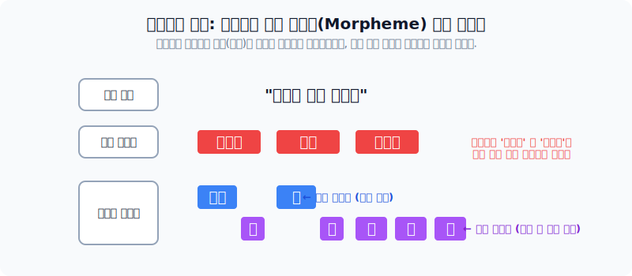
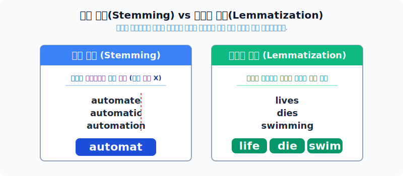

# 텍스트 전처리 기법의 이해 및 활용

수집된 자연어 오리지널 원본 텍스트 데이터는 날것(Raw) 그대로 모델에게 학습시킬 수 없습니다. 특수문자, 오타, HTML 태그, 혹은 무의미한 단어들로 오염되어 있기 때문입니다. 머신러닝의 성능을 좌우하는 기초공사라 불리는 **텍스트 전처리(Text Preprocessing)의 6가지 필수 단계**를 차례대로 살펴봅니다.

*방대한 말뭉치를 정제하고 표준화하는 6단계 전처리 과정*

---

## 1. 토큰화 (Tokenization)

텍스트를 의미가 있는 가장 작은 덩어리(Token)로 자르는 첫 단계입니다. 영어의 경우 보통 띄어쓰기(어절) 기준으로 토큰화하면 꽤 정확한 의미 단위가 도출됩니다.

### 한국어 토큰화의 특징

하지만 한국어는 영어와 달리 조사가 발달한 **교착어**입니다. "에디가", "에디는"을 어절 단위로 자르면 컴퓨터는 완전히 다른 두 개의 토큰으로 인식해 버리는 대참사가 일어납니다.

따라서 한국어는 독자적인 뜻을 가진 **자립 형태소**(에디, 책)와 생략해도 되는 **의존 형태소**(가, 을, 다)로 단어를 산산조각 내는 **형태소(Morpheme) 토큰화**가 필수적입니다. KoNLPy 등의 라이브러리가 이를 수행합니다.

---

## 2. 정제(Cleaning)와 정규화(Normalization)

단어를 잘 토큰화했다 하더라도, 기계가 분석하기 위해선 불필요한 단어를 지우고, 이명을 하나로 통합하는 과정이 이어져야 합니다. 

- **정제(Cleaning)**: 전체 10만 단어 중 단 1번만 등장한 극희귀 단어, 스크래핑 과정에서 딸려온 HTML 태그, 그리고 영어의 'the', 'a' 같이 문법적으로만 존재할 뿐 정보 값이 아예 없는 **불용어(Stopword)**를 가차 없이 삭제합니다.
- **정규화(Normalization)**: 대소문자 차이로 서로 다른 토큰으로 취급되는 USA, U.S.A, usa, US 등을 하나의 표준 표현으로 묶어 어휘 사전의 부피를 줄입니다. (이때, **정규표현식(Regex)**이 특수문자를 추출하거나 패턴(전화번호 등)을 정규화하는 데 활약합니다.)

---

## 3. 표제어 추출(Lemmatization)과 어간 추출(Stemming)

자연어는 단/복수에 따라 꼬리가 바뀌기도 하고(s, es), 시제에 따라 불규칙하게 글자가 변환(lives, dies 등)되기도 합니다. 이를 하나로 통일하면 학습 데이터를 기하급수적으로 다이어트할 수 있습니다. 

*어미를 무식하게 잘라버리는 어간 추출과, 문맥을 읽어 사전에 존재하는 원형을 뽑아내는 표제어 추출*

1. **어간 추출(Stemming)**: 어형의 꼬리 접사를 휴리스틱(규칙)하게 기계적으로 잘라냅니다. `automate/automatic/automation`의 뒤를 모조리 잘라 `automat`이라는 사전에 없는 기계어휘 하나로 통일시킵니다. (속도가 빠름)
2. **표제어 추출(Lemmatization)**: 해당 단어가 쓰인 품사의 위치와 주변 문맥 데이터를 읽어내어 `lives`를 사전에 보존된 원형 그대로인 `life`로 정확히 돌려놓습니다. (정확도가 높지만 느림)

이후 최종적으로 문맥상 이 단어의 문법 구조를 명시해 주는 **품사 태깅(POS Tagging)** 작업을 거치면 텍스트 모델 학습을 위한 준비가 마무리됩니다.
