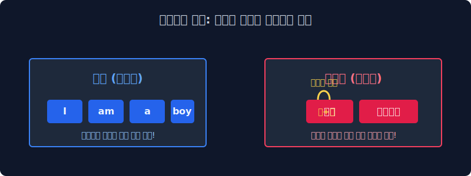
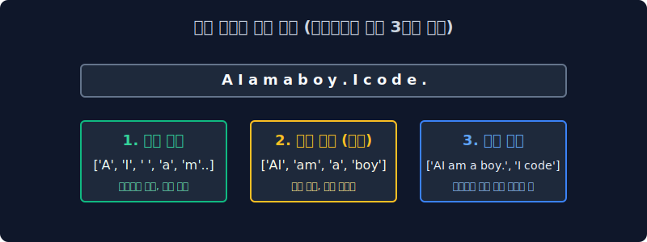

# 2.2 토큰화(Tokenization) 기술과 품사 태깅의 진화

자연어가 기계 분석의 제단에 오르기 위해 거쳐야 하는 가장 첫 번째 도축 과정인 토큰화(Tokenization)의 개념과 크기별 한계점, 그리고 나뉜 조각들에게 문법적 명찰을 달아주는 품사 태깅 기법을 살펴봅니다. 고전적인 무식한 사전 기반 방식에서 시작하여 현대의 눈치 백단 확률 모델(마르코프 연쇄 등)로 어떻게 교묘하게 진화했는지 스토리텔링으로 이해해 봅니다.

---

## 2.2.1 토큰화 (Tokenization): 칼질의 미학

토큰기(Tokenizer)는 주어진 원시 전체 텍스트(기나긴 String 문자열)를 통계 분석과 수학 연산에 가장 유용한 조각 요소, 즉 **토큰(Token)** 이라는 블록 단위로 사각사각 잘게 자르는 핵심 작업이자 소프트웨어 도구 그 자체를 의미합니다.

> [!TIP]  
> **📖 초심자를 위한 쉬운 해설: 영어의 축복과 한국어의 절망**  
> 가장 보편적이고 기초적인 시스템의 토큰화 방식은 "띄어쓰기(White-space)" 백스페이스 기준으로 문자열을 그냥 뎅강뎅강 잘라버리는 것입니다. 영어권 학자들에게는 너무나 축복받은 환경이죠. "I am a boy"를 공백으로 자르면 `['I', 'am', 'a', 'boy']` 라는 아주 아름다고 완벽하게 독립적인 4개의 의미 토큰 바구니가 완성됩니다.  
> 
> 하지만 한국어는 조사와 어미가 지독하게 달라붙는 교착어(Agglutinative language)입니다. "나는 소년이다"를 띄어쓰기로 자르면 `['나는', '소년이다']`가 됩니다. '나(대명사) + 는(조사)'가 끈적하게 붙어있기 때문에, 이 상태로 컴퓨터에 밀어 넣으면 나중에 등장하는 `['나도']`, `['나를']` 과 각각 모조리 다른 단어로 인식되어 통계 알고리즘 카운트 행렬이 산산조각이 나버립니다. 
> 
> 그래서 한국어는 훨씬 더 복잡하고 연산 비용이 비싼 '형태소 전용 토큰 분석기(KoNLPy 등)'가 무조건 필수로 요구됩니다.

---

## 2.2.2 토큰 단위의 크기 논쟁: 글자냐, 단어냐, 문장이냐?

고기 스테이크를 얼마나 크게 자를 것인가(단위 크기 규정)에 대한 선택은 전체 AI 시스템의 성격 방향성을 완전히 좌우합니다.

### 1. ️⃣ 문자(Character) 단위 분석
가장 극도로 잘게 고기를 다져버리는 원소 단위 방식입니다. 한글의 자음과 모음 하나하나, 혹은 영문 알파벳 한 알(A, B, C...) 혹은 마침표 기호 하나하나가 전부 수만 개의 독립된 토큰 배열이 됩니다.
*   **장점**: 컴퓨터가 세상의 모든 알파벳 철자는 이미 다 알고 있으므로, 사전에 없는 오타나 신조어가 들어와도 OOV(Out-of-Vocabulary) 에러 창이 절대 뜨지 않습니다.
*   **단점**: 한 단어의 거대한 맥락이 알파벳 단위로 박살 납니다. 문장 하나 기억하는데 배열 길이가 수천 칸으로 폭증하여 구시대 컴퓨터 메모리가 매번 터져 나갔습니다.

### 2. ️⃣ 단어(Word) 단위 분석
과거 고전 자연어 처리(NLP) 황금기 시대 전체에서 압도적인 점유율을 차지하고 널리 쓰여온 세계 표준이자 황금비율 크기 방식입니다.
*   `["Hello", ".", "I", "am", "Tom", "."]`
*   **장점**: 단어별 뜻 카운트 통계를 내기엔 무척 직관적이고 사람 눈에도 훌륭합니다.
*   **치명적 단점**: 조각이 너무 많아지면 옛날 컴퓨터 모델은 배열의 앞부분 단어를 까먹어서 전체적 느낌(순서와 문맥)을 잃어버리는 치명상이 있었습니다. (※ 이후 N-gram 사상과 트랜스포머 아키텍처가 이 기억상실증을 수학적으로 보완하게 됩니다.)

### 3. ️⃣ 문장(Sentence) 단위 분석
마침표나 느낌표(`. ! ?`) 문장 부호 기준으로만 통째로 크게 크게 덩어리를 썰어냅니다.
*   `["Hello!"]`, `["I am Tom."]`
*   **장단점**: 뼈대와 문장 전체를 한 번에 통으로 먹기 때문에 화자의 문맥 느낌과 호흡은 최대로 체득되나, 역으로 저 문장 안에 부정적인 단어(형용사)가 몇 개 들었는지 등의 세밀한 현미경 카운트 통계 분석이 아예 불가능합니다.

---

## 2.2.3 품사 태깅 (POS Tagging): 이름표 달아주기

시스템이 사정없이 잘라서 모아둔 수만 개의 단어 토큰들이 1차원 데이터베이스 배열 칸에 잔뜩 널브러져 있습니다. 컴퓨터는 아직 눈이 멀어 있어서, 자기 메모리에 들어있는 `[book]` 이 명사 "책"인지, 아니면 "예약하다"라는 동사인지 전혀 모릅니다. 

이때 알고리즘이 튀어나와서 단어들 등짝(메모리 속성값)에 **"너는 명사!", "너는 동사!" 하고 문법적 이름표 스티커(Labeling Info)를 강제로 붙여주는 작업**을 품사 태깅이라고 부릅니다. (POS: Part-of-Speech 태깅)

---

## 2.2.4 품사 태깅 프로세스의 진화 역사: 사방이 꽉 막힌 거대 사전 vs. 눈치 확률 베팅 게임

초창기 선배 학자들은 이 태깅 자동화 파이프라인을 어떻게 구현했을까요? 무식함에서 세련됨으로 진보한 두 가지 수학적 철학을 비교해 봅니다.

### 1. 규칙 기반 (Rule-based) 태깅 기법 - 고전의 지옥
컴퓨터 메모리 램(RAM) 안에 어마어마하게 두꺼운 수십만 쪽짜리 텍스트 파일 `<국어 문법 대백과사전>`을 하드코딩해서 우겨 넣습니다. 컴퓨터는 문장이 들어오면 CPU 사이클을 돌려가며 죽어라 사전을 뒤집니다.
*   **원리 파악**: 컴퓨터가 "어보자... '가다'는 무조건 동사로 수학 공식에 규정되어 있네! 합격!" 이라고 프로그래머가 입력한 대로 외워서 기계적으로 맞추는 무식한 조건문 분기(`if ~ else`) 방식입니다.
*   **몰락한 이유**: 이 지구상의 언어에는 학자들이 다 적어낼 수 없는 '무한대'의 예외 규칙과 변형이 존재합니다. 아이돌 팬카페의 '개이득', '킹받네' 같은 신조어나 은어 토큰이 배열망에 들어오면 사전 목록에 없으므로, 시스템이 `Value Error` 붉은 줄을 뿜으며 그 자리에서 기절(Crash)해 버립니다.

### 2. 확률형 수학 모델 (Probabilistic Model) 기법 - 현대 AI의 눈치 코치
전 세계의 사전을 메모리에서 싹 다 내다 버렸습니다. 대신 수백만 장의 '미리 정답(품사) 라벨링이 달린 과거의 빅데이터 문장'들을 수학적으로 극한 통계 내어 확률 전이 공식($P(t_i|t_{i-1})$)을 만들었습니다. 은닉 마르코프 모델(HMM; Hidden Markov Model) 같은 선진 알고리즘이 쓰이기 시작합니다.

*   **수학적 원리**: 모델이 태어나서 처음 보는 모르는 단어가 나와도 시스템은 절대 당황하지 않습니다. 바로 **앞단어와 뒷단어가 무엇이었는지의 맥락 확률을 슬쩍 계산(Self-Attention의 모태)** 합니다.
*   **추론 과정**: "으음... 사전에 없는 요상한 OOV 문자 배열이긴 한데... 통계적으로 보아하니 바로 앞 칸(`i-1`)에 '맛있는' 이라는 형용사가 왔네? 과거 내 100만 번의 학습 데이터 통계 경험상, 저 형용사 뒤에 등장한 녀석은 확률적으로 $98.7\%$ 확률로 $P(\text{명사})$ 였어. 그러므로 지금 내 앞의 이 듣도 보도 못한 외계어 단어는 무조건 [명사] 품사다 탕탕!"

이렇게 앞뒤 문맥 통계를 바탕으로 우아하게 확률 지수 베팅을 갈겨 품사 적중시켜버리는 놀랍도록 고급스럽고 유연한 스킬이 등장했습니다. 현재 거의 모든 형태소 전처리 분석 엔진(Mecab, Okt 등) 코어 깊은 곳에 흐르는 위대한 언어-수학적 사상입니다.
