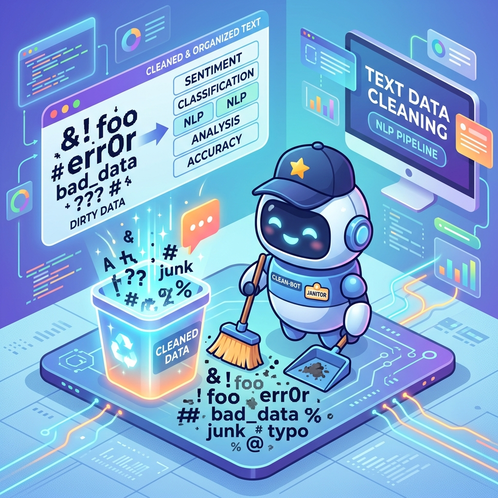
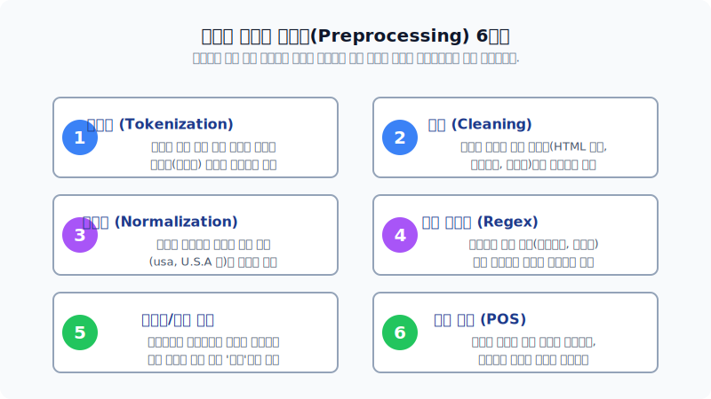
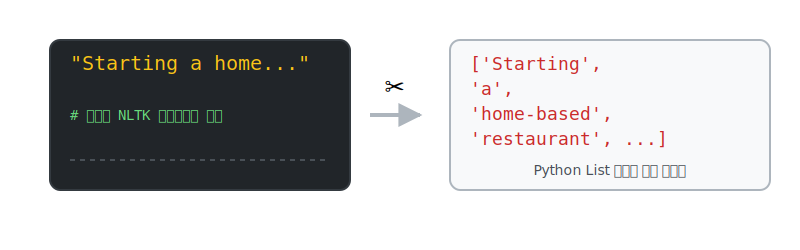
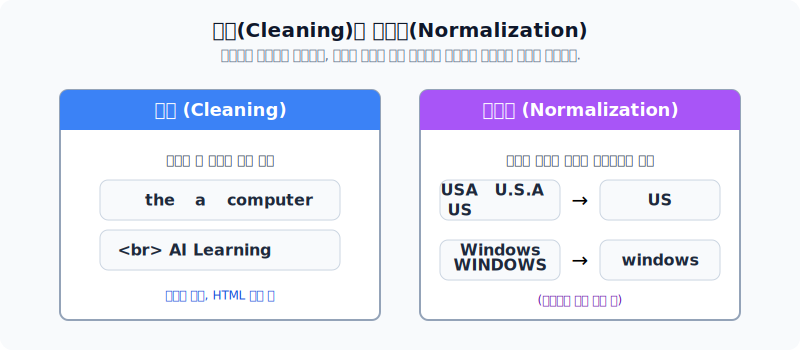
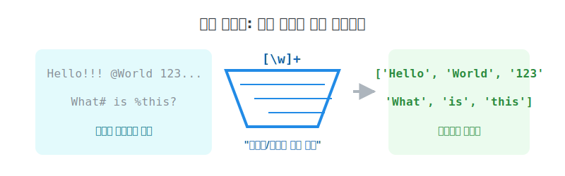
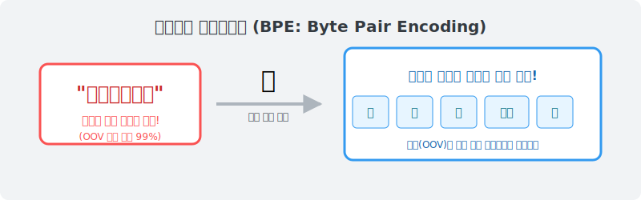

# 텍스트 전처리 파이프라인의 이해 및 활용

정형화되지 않은 더러운 텍스트(야생의 데이터)에서 쓰레기를 걸러내고, 기계가 학습하기 좋은 깔끔한 토큰 포맷으로 변형(Cleaning)하는 파이썬 전처리 코딩 실무의 심화 과정을 배웁니다.

---

## 00. 텍스트 전처리 기법의 이해
데이터 사이언티스트 삶의 80%를 차지하는, 가장 고통스럽지만 중요한 '데이터 청소 막노동'에 오신 것을 환영합니다!



> [!NOTE]  
> **📖 초심자를 위한 쉬운 해설**  
> AI는 천재 요리사입니다. 하지만 식재료인 텍스트가 흙(특수기호)이 잔뜩 묻어있고, 상한 부위(무의미한 ㅋㅋㅋ ㅎㅎㅎ 오타)가 가득하다면 음식이 망출 수밖에 없습니다. 개발자가 직접 뜰채와 가위를 들고 더러운 문자열들을 씻고 다듬는 이 모든 고된 청소 과정을 **전처리(Preprocessing)**라고 부릅니다.

## 01. 텍스트 전처리의 6단계 구조
텍스트 데이터를 인터넷 웹 등에서 수집한 직후 가장 먼저 거쳐야 할 정석 파이프라인(순서도)입니다.



## 02. 텍스트 전처리 - 토큰화 (Tokenization)
주어진 원시 텍스트(무한한 문자열)를 공백이나 구두점 기준으로 잘라서, 파이썬이 좋아하는 '리스트 배열(Token 리스트)'로 나누어 담습니다.



### Python 코드의 작동
```python
from nltk.tokenize import TreebankWordTokenizer
tokenizer = TreebankWordTokenizer()
text = "Starting a home-based restaurant may be an ideal."
print(tokenizer.tokenize(text))
# 결과: 영어 문장을 공백 기준으로 깔끔하게 칼질해서 파이썬 리스트[] 배열로 묶어줍니다!
# ['Starting', 'a', 'home-based', 'restaurant', 'may', 'be', 'an', 'ideal.']
```

## 03. 한국어 텍스트 전처리 - 교착어와 형태소의 악몽
영어는 스페이스(띄어쓰기)만 잘해도 토큰이 깔끔하게 떨어집니다. 하지만 한국어는 절대 불가능합니다!


> [!WARNING]  
> **📖 초심자를 위한 쉬운 해설**  
> 한국어는 `사과가`, `사과를`, `사과도`, `사과만` 처럼 하나의 영어 단어(Apple) 뒤에 수만 가지 조사나 어미가 찰싹 달라붙어 문장을 바꾸는 악랄한 **'교착어'**입니다.  
> 띄어쓰기로만 자르면 컴퓨터는 저 단어들을 모두 다른 파일로 분리해 세어버리는 사태가 일어납니다. 따라서 한국어는 무조건 **형태소 단위("사과" + "가") 로 미세하게 쪼개는 엔진(KoNLPy 등)**을 반드시 구입해 장착해야만 합니다.

## 04. 텍스트 전처리 – 정제 (Cleaning)
분석 목적과 상관없는 불필요한 시각적/의미론적 노이즈를 강력한 체망으로 걸러내서 버리는 작업입니다.



| 버려야 할 쓰레기들 | 특징 설명 및 비유 |
|:---|:---|
| **저빈도 찌꺼기** | "테스트우하핫" 처럼 1번 등장하는 무의미 체류 데이터. 공간 낭비 방지를 위해 싹 다 버립니다. |
| **짧은 단어** | 글자 수가 아예 1개 길이인 `I`, `a` 는 구문 분석 가치가 적어 지워버립니다. |
| **불용어 (Stopwords)** | `of`, `the`, `아이고`, `그게 참` 등 해석에 1g의 도움도 안 되는 감탄사 전치사 (미리 폐기물 리스트를 설정함) |
| **태그 찌꺼기** | `div`, `span`, CSS 코드 같은 수집기 스크래핑 파편들 |

## 05. 텍스트 전처리 – 정규화 (Normalization)
정규화는 같은 의미인데 꼴랑 철자 대소문자나 표기가 달라서 서로 남남 행세를 하는 단어들을 강제로 **가족(하나)으로 호적 통합** 시켜버리는 작업입니다.

*   `USA` 와 `US` 와 `U.S.A` -> 무조건 전부 `USA` 로 강제 통일!
*   `AI` 와 `ai` 와 `Ai` -> 무조건 전부 가장 작은 `ai` (소문자) 로 강제 통일!

> [!CAUTION]  
> 무조건 싹 다 소문자로 바꾸는 정규화 함수(`lower()`)를 잘못 쓰면 코딩 회사의 **'Apple'**과 과일의 **'apple'**이 믹스되어 모델이 완전히 파괴될 수 있습니다! 조심해서 사용하세요.

## 06. 텍스트 전처리 – 정규 표현식 (Regular Expression)
파이썬 문자열 검색의 제왕 스킬입니다! 기호 문법으로 특정 문자만 한 번에 싹 잡아내는 사기적인 마법 그물망입니다.



### Python 코드의 작동
```python
from nltk.tokenize import RegexpTokenizer
text = "Help!! I want #1 apple_% @here!!"

# [마법의 뜰채]: 영문 알파벳과 숫자(\w)만 통과시키고 기호는 버려주세요!
tokenizer = RegexpTokenizer('[\w]+') 

print(tokenizer.tokenize(text))
# 결과물: 지저분한 기호가 마법같이 날아갑니다.
# ['Help', 'I', 'want', '1', 'apple_', 'here']
```

## 07. 텍스트 전처리 – 표제어 추출과 어간 추출 (어원 찾기)
이것도 정규화의 한 종류입니다. 다양한 동사 과거형/미래형 변형들 뒤의 꼬리를 싹둑 잘라서 **태초의 기본 단어(원형)** 로 압축해버리는 무시무시한 다이어트 기법입니다.


*   **어간 추출 (Stemming)**: 무자비한 기계식 톱니바퀴. `automatic`, `automation` 뒷부분을 무식하게 잘라서 그냥 `automat` 이라는 이상한 외계어를 사전에 등록시킴 (속도는 빠름).
*   **표제어 추출 (Lemmatization)**: 똑똑한 교과서. `lives` 를 보면 문맥을 읽어서 "이거 살다의 `life` 구나?" 라며 완벽한 원형 영어명사로 복원시킴 (정확하지만 느림).

## 08. 텍스트 전처리 – 한국어 품사 태깅 (KoNLPy)
한국어를 처리할 때 이 모듈(`KoNLPy`)이 없다면 지옥을 맛보게 됩니다.

```python
from konlpy.tag import Kkma  # 꼬꼬마(Kkma) 한국어 분석기 클래스 로드!
kkma = Kkma()

# 한국어 텍스트 문장을 넣으면, 무려 알아서 쪼개고 한자/영어 약호 태그표를 다 달아줍니다.
print(kkma.pos(u"오류보고는 설명을 최대한 상세히 해라"))

# 결과 리스트 반환: [('오류', '명사'), ('보고', '명사'), ('는', '조사'), ('설명', '명사')...]
```

## 09. LLM의 최강 무기: 서브워드 토큰화 (BPE)
현대의 챗GPT 같은 초거대 모델들은 1단어(띄어쓰기) 단위로 자르거나 국어사전에 집착하지 않습니다! 단어를 그냥 **원자 레벨(글자 알파벳)**로 산산조각 내서 **미지의 외계어(OOV)**를 아예 원천 방어합니다.



> [!NOTE]  
> **📖 초심자를 위한 쉬운 해설**  
> 과거엔 `존맛탱` 이라는 신조어가 들어오면 엑셀 국어사전에 "여...이런게 없습니다!" 하며 **에러(OOV, 미등록 단어 에러)**를 뿜고 컴퓨터가 죽었습니다.  
> 현대 BPE(Byte Pair Encoding) 방식은 그 단어를 `[존]`, `[맛]`, `[탱]` 세 글자로 뜯어내버린 뒤 자기가 아는 "맛" 이라도 통계에 써먹기 때문에 절대 죽지 않는 진공청소기입니다. 전 세계 LLM들이 쓰는 필수 1순위 기술입니다.

## 10. 파이썬 코드 실습 안내
파이썬 NLTK의 무한한 전처리 스킬들을 직접 눈으로 보고 두드려보세요!

동봉된 실습용 쥬피터 노트북 코드 팩 파일(`Week_2_grad_text_preprocessing.ipynb`)을 열람하면, 이 복잡한 파이프라인 과정을 눈 깜짝할 사이에 치워버리는 코딩 마술을 경험하실 수 있습니다.
