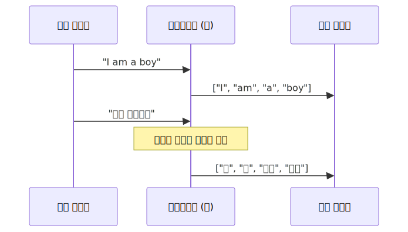

# 토큰화(Tokenization) 기술과 품사 태깅의 진화

자연어가 분석의 제단에 오르기 위해 거쳐야 하는 가장 첫 번째 도축 과정인 토큰화(Tokenization)의 개념과, 나뉜 조각들에게 명찰을 달아주는 품사 태깅 기법을 살펴봅니다. 고전 사전 기반 방식에서 눈치 백단의 확률 모델로 어떻게 진화했는지 스토리로 이해해 봅니다.

---

## 00. 토큰화 (Tokenization): 칼질의 미학
토큰기(Tokenizer)는 주어진 원시 텍스트(기나긴 문자열)를 분석에 유용한 조각 요소, 즉 **토큰(Token)**이라는 단위로 사각사각 잘게 자르는 핵심 작업이자 도구 자체를 의미합니다.

> [!TIP]  
> **📖 초심자를 위한 쉬운 해설: 영어의 꿀과 한국어의 독**  
> 가장 보편적이고 기초적인 토큰화 방식은 "띄어쓰기(공백)" 기준으로 문자열을 잘라버리는 것입니다. 영어권 학자들에게는 너무나 행복한 환경이죠. "I am a boy"를 공백으로 자르면 `['I', 'am', 'a', 'boy']` 라는 아주 아름다고 독립적인 4개의 의미 토큰 바구니가 완성됩니다.  
> 하지만 한국어는 교착어입니다. "나는 소년이다"를 띄어쓰기로 자르면 `['나는', '소년이다']`가 됩니다. '나(대명사) + 는(조사)'가 끈적하게 붙어있어, 이대로 분석기에 넣으면 단어 카운트 통계가 모조리 망가져 버립니다. 그래서 한국어는 더 복잡하고 비싼 '형태소 토큰 분석기'가 무조건 필요합니다.

## 01. 토큰 단위의 크기 논쟁: 글자냐 단어냐 문장이냐?
스테이크를 얼마나 크게 자를 것인가에 대한 선택은 시스템의 방향성을 좌우합니다.

### 1️⃣ 문자(Character) 단위 분석
가장 극도로 잘게 다져버리는 방식입니다. 한글의 자음과 모음, 혹은 영문 알파벳 한 알(A, B, C...) 혹은 마침표 기호 하나하나가 독립된 토큰이 됩니다.
*   **장점**: 사전에 없는 오타나 신조어가 들어와도 에러 창이 뜨지 않습니다. 알파벳은 다 아니까요.
*   **단점**: 단어의 거대한 맥락이 박살 납니다. 컴퓨터 메모리가 터져 나갑니다.

### 2️⃣ 문장(Sentence) 단위 분석
마침표나 느낌표(`. ! ?`) 기준으로만 통째로 크게 덩어리를 썰어냅니다.
*   `["Hello!"]`, `["I am Tom."]`
*   **장단점**: 뼈째로 자르기 때문에 화자의 문맥 느낌은 최대로 유지되나, 저 문장 안에 부정적인 단어가 몇 개 들었는지 등의 세밀한 현미경 디테일 분석이 아예 불가능합니다.

### 3️⃣ 단어(Word) 단위 분석
현재 고전 NLP 시대 전체에서 압도적인 점유율을 차지하고 널리 쓰이는 표준이자 황금비율 방식입니다.
*   `["Hello", ".", "I", "am", "Tom", "."]`
*   **장단점**: 단어별 빈도 통계를 내기엔 무척 직관적이고 훌륭하지만, 옛날 컴퓨터는 이런 식으로 자를 경우 문장의 전체적 느낌(순서)을 잃어버리는 치명상이 있었습니다. (※ 이후 N-gram과 트랜스포머가 이를 보완함)

## 02. 품사 태깅 (POS Tagging): 이름표 달아주기
사정없이 잘라낸 단어 토큰들이 눈앞에 잔뜩 널브러져 있습니다. 컴퓨터는 이게 명사인지, 조사인지 아직 모릅니다. 이때 나타나서 단어들 등짝에 **"너는 명사!", "너는 동사!" 하고 문법적 이름표 스티커(Labeling)를 강제로 붙여주는 작업**을 품사 태깅이라고 부릅니다. (POS: Part-of-Speech)

## 03. 품사 태깅의 역사: 사방이 꽉 막힌 거대 사전 vs. 눈치 확률 게임
초창기 학자들은 태깅 자동화를 어떻게 구현했을까요? 무식함에서 세련됨으로 진화한 두 가지 철학을 비교해 봅니다.

### 1) 규칙 기반 (Rule-based) 기법 - 고전의 지옥
컴퓨터 메모리 안에 어마어마하게 두꺼운 수십만 쪽짜리 <국어 문법 대백과사전>을 하드코딩해서 우겨 넣습니다. 컴퓨터는 문장이 들어오면 돋보기를 들고 사전을 뒤집니다.
*   **원리**: 컴퓨터가 "어보자... '가다'는 무조건 동사로 규정되어 있네! 합격!" 이라고 외워서 기계적으로 푸는 무식한 조건문(`if ~ else`) 방식입니다.
*   **몰락 이유**: 이 세상의 언어에는 무한대의 예외 규칙이 존재합니다. 방탄소년단의 '다이너마이트' 같은 신조어나 은어가 나타나면 사전 목록에 없으므로 시스템이 에러를 뿜으며 기절해 버립니다.

### 2) 확률형 모델 (Probabilistic Model) 기법 - 현대의 눈치 코치
사전을 내다 버렸습니다. 대신 수백만 장의 '미리 정답(품사)이 달린 문장'들을 수학적으로 통계 내어 확률 공식을 만들었습니다. 마르코프 체인(HMM) 같은 알고리즘이 쓰입니다.
*   **원리**: 모르는 단어가 나와도 당황하지 않습니다. 앞뒤에 어떤 단어가 왔는지를 슬쩍(Self-Attention) 눈치 봅니다. "으음... 사전에 없는 요상한 단어이긴 한데, 바로 앞에 '맛있는' 이라는 형용사가 왔으니 지금 이 단어는 무조건 확률적으로 [명사] 품사이겠구나!" 라고 우아하게 수학적 베팅을 갈겨 적중시켜버리는 고급 스킬입니다. 현재 대부분의 전처리 엔진 코어 사상입니다.
