# 문맥의 보존 기술: N-gram과 RAG 청킹

단어를 무자비하게 쪼개버리면 과거의 컴퓨터는 문장의 흐름(문맥)을 다 잃어버리는 치매에 걸립니다. 컴퓨터의 단기 기억 상실을 막기 위해 단어들을 두세 개씩 쇠사슬로 묶어버리는 N-gram 기술과 현대 RAG(검색 증강) 시스템에서 쓰이는 최신 청킹 지식을 다룹니다.

---

## 00. 고전 NLP의 치매 증상
단어 단위로 토큰을 쪼개놓으면 빈도수는 알 수 있지만, 글의 원래 '순서'가 파괴됩니다.
`"이 영화는 정말 재미없다"` 를 쪼개서 `['이', '영화는', '정말', '재미없다']` 로 넣으면, 옛날 컴퓨터는 저 단어들의 원래 순서를 까먹습니다. 그래서 부정적인 리뷰인지 긍정적인 리뷰인지 문맥을 잡지 못하고 헷갈리는 오류를 자주 범했습니다.

## 01. 구 표현의 혁명: 매듭 묶어주기 (N-gram)
이를 막기 위한 아주 엄청난 잔머리가 바로 **N-gram**입니다. 단어를 1개씩 썰어버리지 않고, 컨베이어 벨트에 쇠사슬을 묶듯이 **연속된 $N$개의 단어를 하나로 묶어서** 토큰 바구니에 담아버리는 편법입니다.

*   **Uni-gram (1-gram)**: `['이', '영화는', '정말', '재미없다']` (완전 치매 상태, 순서 모름)
*   **Bi-gram (2-gram)**: `['이 영화는', '영화는 정말', '정말 재미없다']` (기억력이 2배 증가! '재미없다' 앞에 '정말'이 붙었다는 사실을 묶어서 보존함)
*   **Tri-gram (3-gram)**: `['이 영화는 정말', '영화는 정말 재미없다']` (시야가 넓어져 문장을 훨씬 우아하게 파악함)

이러한 N-gram 토큰 모델은 문맥을 살려냅니다. (하지만 나중에 배우겠지만, $N$을 무식하게 늘리면 메모리가 즉시 터져버린다는 차원의 저주를 가져옵니다.)

## 02. 이름셔틀 텍스트 덩어리화: Chunking과 BIO 태그
문장을 썰어놓고 보니, 어떤 명사들은 쪼개면 아예 의미가 소멸합니다. 
예: `'미국'`(명사) + `'대통령'`(명사) = `'미국 대통령'` (사람)

이를 위해 나타난 기술이 **청킹(Chunking)** 입니다. 한마디로 떨거지 품사들을 모아 모아서 **'크고 무거운 의미를 지닌 거대한 한 덩어리'**로 억지로 압축 포장하는 작업입니다. 주로 구문 분석이나 장소, 인물 이름을 탐지하는 NER(개체명 인식) 작업에 주로 쓰입니다.

### 알파벳 비밀 요호: BIO 태그법
개체명 인식을 할 때 컴퓨터가 이 단어가 단독인지 덩어리인지 인식하게 만드는 이름표 시스템입니다.
*   `B` (Begin): "여기서부터 청크 덩어리 시작이다!"
*   `I` (Inside): "방금 앞 단어랑 나랑 한 몸탱이다 계속 이어져라!"
*   `O` (Outside): "나 명사 아니야 쓰레기야 지나가!"

> **예시**: `"스티브 잡스는 애플을 창립했다"`
> * `스티브` $\to$ **B-PERSON** (사람 이름 시작)
> * `잡스는` $\to$ **I-PERSON** (아까 걔 이름의 끝!)
> * `애플을` $\to$ **B-ORG** (조직 이름 시작)
> * `창립했다` $\to$ **O** (의미 없음)

## 03. 현대 딥러닝 시대의 청킹 (RAG 검색 증강 시스템)
요즘 화제가 되는 "내 PDF 문서를 읽고 대답해 줘" 챗봇(RAG) 시스템에서 이 청킹 기술은 회사의 생사를 가릅니다. 
100장짜리 PDF 메뉴얼을 통째로 챗GPT 입천장에 쑤셔 넣으면 에러가 납니다. 따라서 문서를 적당한 크기(예: 500자)의 **청크(Chunk)**로 미리 예쁘게 잘라서 데이터베이스에 저장해 두어야 합니다.

### 청킹 크기의 딜레마
*   **너무 작게 자르면**: (예: 한 문장씩) $\to$ 검색 확률은 미친 듯이 올라가는데, 로봇의 대답이 짤막하고 문맥을 이해하지 못해 앞뒤가 안 맞습니다.
*   **너무 크게 자르면**: (예: 한 페이지씩) $\to$ 문맥은 아주 풍성한데, 내가 원하는 검색어(키워드)가 희석되어서 문서 매칭을 영원히 실패합니다.

이처럼 토큰화와 청킹은 자연어를 컴퓨터의 입속 규격에 맞추어주는 가장 위대하고도 논쟁적인 식사 준비 과정이라 볼 수 있습니다.
