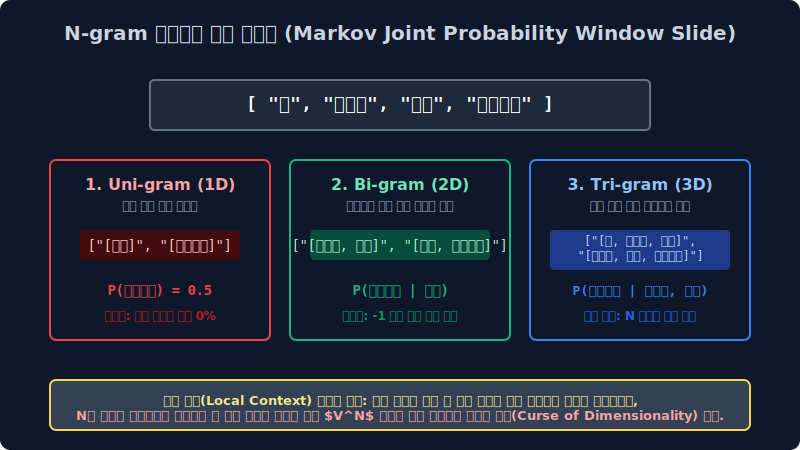
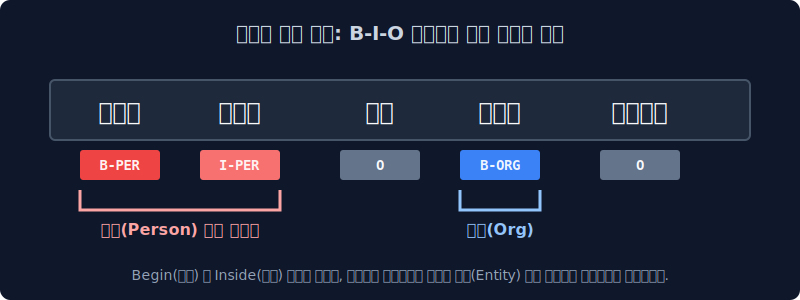

# 2.3 시스템 문맥 보존 기술의 수학적 파이프라인망: N-gram 연쇄 확률과 현대 RAG 시퀀스 청킹(Chunking) 밀도 딜레마

텍스트 시퀀스 차원 토큰을 독립 변수로 무자비하게 1차원 쪼개 분할 버리면 과거의 파라미터 컴퓨터 컴파일러는 각 낱개 단어들이 원래 공간 앞뒤로 유기적으로 결합되어 붙어있던 수학적 조합 순서와 전체 문장 구조의 인과 흐름(전역 Context Dependency)을 망각하여 다 잃어버리는 치명적인 문맥 시스템 파단 치매(Context Amnesia 모델 한계)에 즉시 셧다운 걸립니다. 이 원시 컴퓨터의 단기 기억 메모리 상실증 단절 벡터를 막기 위해 인접 단어들을 두세 개씩 확률 쇠사슬로 강제 압축 묶어 컨텍스트 연쇄를 복원하는 고전 파이프라인 **N-gram 마르코프 수학 기술(Markov Joint Probability)** 과, 현대 최첨단 엔터프라이즈 **RAG(검색 증강 아키텍처) 시스템**에서 코어 필수적으로 신경망에 쓰이는 최신 텍스트 벡터 차원 덩어리 나누기(**연속 시퀀스 청킹 Chunking 파라미터 비율**) 벡터 지식을 수학적 구조 딜레마로 고도화 다룹니다.

---

## 2.3.1 기초 고전 NLP 모델의 기억 단절 증상 (의존망 문맥 증발에 따른 극성 역전 파단 시스템)

가장 미시적 단위어(Unigram, N=1 차원) 한 개 단위로만 1개씩 이산 독립 토큰 단위를 쪼개 캐시 차원에 놓으면 각 단일 알파벳 문자의 원소 출현 빈도수는 아주 통계적으로 수학 연산 정확히 카운트 할 수 있지만, 전체 글의 원래 '순서 전이 파라미터(Sequence Vector Dependency)' 기하 정보가 네트워크 결합 파이프라인에서 완전히 OOV 파기 파괴되어 버립니다. (나이브 베이즈 구조의 극단적 스파스 단어 조건 독립성 확률 가정 $\to$ Order Agnostic 편향 오류 한계)

> `"이 영화는 정말 재미없다 타겟 시스템 리뷰"` 

이 텍스트 배열 문장을 구조 토큰화 필터 파서(Tokenizer API)로 쪼개서 과거 기계망에 `['이', '영화는', '정말', '재미없다']` 로 이산 분리해 차례대로 백엔드 선형 임베딩에 집어넣는다고 수학적 벡터 가정해 봅시다. 옛날 통계 컴퓨터 알고리즘 모델 스페이스는 저 입력 단어 배열 노드들이 로딩 들어올 때 원본 코퍼스에서 원래 앞 배열, 뒤 배열로 어떻게 종속 결합 포지션이 물리적으로 붙어있었는지 그 전이 순서 타임라인 확률을 가중치 신경 뇌에서 완전히 차원 까먹어 리셋 소멸시킵니다. (전통적인 Bag of Words 주머니 모형 현상의 치명적인 단기 차원 소멸 단점). 

그래서 구식 기계 파서는 **"'정말' 이라는 엄청난 절대 가중치 부스팅 증폭 단어(Multiplier) 스칼라 벡터가... 긍정의 극성을 띠는 '재미있다(Positive Logit)' 배열 텐서에 논리 인과 타겟으로 붙은 확률 건가? 아니면 완전 마이너스 극성을 치는 부패한 '재미없다(Negative Score Logit)' 배열 스칼라 타겟에 곱해진 건가?"** 하고 두 이산 배열 노드망의 시스템 연결 문맥을 수학 분포로 짚어내지 파싱 매핑 못해, 극단적으로 마이너스 마찰 부정적인 폭망 리뷰를 도리어 로직 "아주 스코어가 플러스로 신나는 긍정 리뷰 확률!" 이라고 논리 구조를 심각하게 가중치 헷갈리고 극성 스코어 점수를 $180^\circ$ 완전 역전 시스템 오분류 에러(Misclassification Array)를 내어버리는 수학 참사를 컴파일러 런타임에서 수시로 오작동 뿜어 범했습니다.

---

## 2.3.2 텐서 구(Phrase) 표현의 구조 확률 혁명망: 기억의 연쇄 마르코프망 쇠사슬 확률로 묶어 복원하기 (N-gram Window Slide)

이 1D 선형 기억 상실 텐서 단절증을 수학적 확률로 연결 막기 위해 백엔드 모델망에 등장한 아주 훌륭한 고대 통계적 차원 결합 모델 잔머리가 바로 **N-gram 구조 연쇄 언어 확률 모델(N-gram Language Markov Matrix)** 입니다.
토큰 단어를 모델이 더 이상 완전 1개씩 단독 독립 피처로 고립 파단 썰어버리지 않고, 로직 컨베이어 슬라이드 벨트에 연결망 쇠사슬을 묶어 인접 노드를 치환 합치듯이 **메모리 연쇄 배열상 연속된 인접 $n$개의 단어 파라미터를 메모리 상에서 강제로 스플릿 연결 묶어버려** 하나의 거대한 합집합 교차 합체 토큰 차원 바구니 객체 벡터군에 텐서 압축 담아버리는 확률 복원 방식입니다.

이 파이프라인의 핵심인 통계학 확률 연쇄 체인 규칙 공식(Markov Assumption)은 아래와 같은 전이 통계 방정식으로 렌더링 수식 설계가 표현됩니다. (현재 관측 $w_t$ 스텝 단어 노드가 모델 통계상 오직 로컬 과거 과거 이전의 $n-1$개의 문맥 스텝 단어 조합망 배열에만 수학 조건부 확률 시스템 영향을 역산 받는다는 국소 지엽성 윈도우 한계 가정)
$$ P(w_t | w_1, w_2, \dots, w_{t-1}) \approx P(w_t | w_{t-n+1}, \dots, w_{t-1}) $$

*   **Uni-gram 기초 치매 (1-gram N=1)**: `Sequence Array: ['이', '영화는', '정말', '재미없다']` 
    (문맥 완전 전면 초기화 치매 리트 상태. $N=1$ 이라 자기 자신의 현재 노드 클래스 스칼라 확률밖에 독립성 기억 파라미터 유지하지 필터 보존 못함.)
*   **Bi-gram 단기 기억 체인 (2-gram N=2 변수)**: `Array Vector Slide: ['이 영화는', '영화는 정말', '정말 재미없다']` 
    (아키텍처 메모리 단기 문맥 기억력이 정확히 2배 길이로 공간 점프 폭증 증가! 최악의 에러 노이즈 '재미없다' 라는 타겟 스코어 부정형 표현 배열 바로 왼쪽 로컬 과거에 '정말'이 결합 붙어있었다는 사실, 즉 수학 시계열적 구조 조건부 팩트 모델 $P(\text{재미없다 타겟}|\text{정말 조건})$ 확률 파라미터를 시스템 통째로 압축 묶어서 논리 매핑 벡터 스페이스에 온전 방어 보존해 냅니다.)
*   **Tri-gram 심층 문맥 통합 (3-gram N=3 확률)**: `Array Window: ['이 영화는 정말', '영화는 정말 재미없다']` 
    (인퍼런스 스캔 시야각 모델 포커스가 백엔드에서 3배로 훨씬 넓어져 텍스트 문서 전체 문장 시퀀스를 룰셋 배열 렌즈로 훨씬 우아하고 긴 논리 종속 호흡으로 배열 파악 스캔함.)

이러한 N-gram 윈도우 병합 토큰 모델은 $1D$ 에서 증발 사라져가는 문맥(Context)을 강제로 컨텍스트 벡터 멱살을 잡고 차원 공간 수명으로 살려냅니다. (하지만 3주차 파이프라인에서 다시 심도 있게 비용을 통계 역산 배우겠지만, 이렇게 시스템이 컴파일 슬라이딩을 한 번에 윈도우 스캔 기억하는 토큰 개수 파라미터 $n$의 배율을 정밀도 향상을 위해 $4, 5, 6$으로 통계 무식하게 거대 늘리면, 조합 계산해야 하는 희소성 경우의 수가 $V^N$ 지수 스케일 비율로 서버단에서 폭주하여 컴퓨터 캐시 메모리가 그 즉시 벡터 힙(OOM) 메모리를 초과 다운 터져버린다는 잔혹한 데이터 **차원의 저주(Curse of Dimensionality Sparsity Matrix)** 파단 역풍 오류를 심하게 GPU가 맞게 서버 단절이 됩니다.)

---

## 2.3.3 고정밀 개체명 인덱싱 셔틀 텍스트 텐서 군집 덩어리화: 연속 청킹(Sequence Chunking) 차원 파싱과 BIO 바운더리 태그 행렬

일차원 배열 문장 구조를 단순히 통계 N-gram 길이로 일정하게 열심히 조각 썰어놓고 모델 확률을 돌려 분석 보니, 매우 중요한 고정밀도 타겟팅이 필요한 특정 명사 토큰 객체들은 띄어쓰기로 두 개를 분절 스플릿 조각 쪼개버렸더니 아예 백엔드 딕셔너리 차원에서 원래의 타겟 핵심 뜻과 상징이 물리적으로 분리되어 영원히 의미망에서 소멸 파단 붕괴해 버리는 통계 오염 경우 오류 모수가 다수 관측되었습니다. 
고전 스플릿 에러 예: `'미국'`(고립된 국가 식별 명사 토큰) + `'대통령'`(개별 직업 타겟 분류 명사 클래스) = 논리 결합 $\to$ `'미국대통령'` (전혀 다른 이 2개를 묶어 아예 세계의 고유한 특정 인간 인물 객체 인스턴스를 단일 지칭하는 초거대 고유 밀도 개체 타겟망)

이런 위험한 단어 군집 단절 붕괴 에러율 파단을 방어하기 위해 아키텍처에 나타난 고밀도 조립 기술 파라미터가 **부분 벡터 청킹(Sub-Chunking Sequence)** 입니다. 한마디로 백엔드 정보 파이프 핵심 뜻을 연쇄 공유하는 이웃 떨거지 개별 품사 벡터 조각들을 모두 한 군집에 쓸어 모아서 알고리즘 병합, **'계층 내 가장 크고 무거운 단일 의미망 지분을 가진 구조를 지닌 거대한 하나의 독립된 개체 덩어리 구조(Noun Phrase 거대 군집)'** 차원으로 벡터를 강제 스태킹 억지로 통 압축 압착 포장해 컨테이너 묶는 필터 작업 매핑입니다. 주로 최신 딥러닝 검색 엔진 파서 기반에서 장소, 복합 사람 고유 인물 닉네임 이름을 콕 집어 탐지 분리해 내는 신경 확률 분류 추출 모델인 **NER(Named Entity Recognition, 인공지능 개체명 고립 인식 추출망 매핑)** 검색 알고리즘 백엔드 필터 레이어 작업에 매우 코어 엔진 파이프라인으로 필수적으로 활용 쓰입니다.

### 1. 차원 군집 바운더리의 식별 비밀 암호 배열 모델: B-I-O 벡터 태깅법 (Begin-Inside-Outside Tagging)
고밀도 복합 개체명 인식 신경망(NER 파싱 작업) 파이프를 컴파일 돌릴 때 백그라운드 컴퓨터 파서가 "이 고유 식별 단어 토큰 인덱스는 공간 여기서 경계 바운더리 블록이 끝나는지, 아니면 아직 덜 끝나서 바로 뒤 후속 단어 타겟 조각과 계속 하나의 모델군으로 물리 연결 이어지는 종속 군집 덩어리(Boundary 텐서) 꼬리인지" 주변 논리망을 수학적으로 분리 필터 인식하게 만드는 아주 영리한 딥 레이블링 표식 이름표 배열 바코드(Metadata Array) 시스템 규격 체계입니다.

*   `B 배열 지표` (Begin Start): "여기 현재 파싱 스텝 인덱스부터 거대한 고유 청크 덩어리의 헤드 머리판 군집 텐서 차원 생성이 시작 진입이다!"
*   `I 배열 지표` (Inside Chunk): "방금 내 직전 이전 앞 단어 노드랑, 현재 나 노드의 수학 타겟 객체랑 하나의 컨테이너 배열 한 몸탱이(이어지는 인스턴스 꼬리 바디)다! 텐서망 날 여기서 자르지 말고 아키텍처 결합 계속 인접 스위칭 단일로 이어 압축 합체 붙여라 결합!"
*   `O 배열 지표` (Outside Trash): "난 NER 목적 고유 명사 타겟이 아니야 확률. 그냥 시스템에 떠도는 쓰레기 접속사, 조사 패싱 관사 잔여물 노이즈니까 분류망에서 버리고 무시 지나가 패스!"

> **비밀 서버 알고리즘 B-I-O 배열 로그 구조 파싱 예시**: 모델 타겟 텐서 입력 문장 $\to$ `"스티브 잡스는 애플을 창립했다"`
> * 토큰 인덱스 `스티브` $\to$ **B-PER 태그** (사람 고유 인물 객체 Person 머리 Begin 바운더리 타겟 선언)
> * 토큰 인덱스 `잡스는` $\to$ **I-PER 태그** (아까 배열 앞의 걔 B 스티브 사람 객체 ID와 완전 한 몸으로 이어지는 Inside 종속 끝 파라미터 연결 병합!)
> * 토큰 인덱스 `애플을` $\to$ **B-ORG 태그** (여기서부터 완전히 분리된 다른 거대 조직 기관 객체 Organization 이름의 신규 Begin 바운더리 구조체 타겟 시작 선언)
> * 토큰 인덱스 `창립했다` $\to$ **O** (고유명사 데이터 베이스에 등록 추출 가치가 수학적으로 전혀 0 확률인 의미 없는 버리는 아웃 동사 쓰레기 파편 패싱 처리)

이렇게 스칼라 기호화된 $B, I, O$ 확률 메타 배열 테이블을 결합 통과시킴을 통해 컴퓨터 메인 분류 모델은 거대 연속 문자 스칼라 스트링에서 어디서 분절이 끊기고 어디서부터 타겟디 어디까지가 단일 고유명사 구조망 컴파일 한 덩어리 군집 독립 벡터인지 $100\%$ 타켓 알고리즘으로 칼같이 컴파일러 수학 정밀 재단 식별해 압착 추출 저장 맵핑해 냅니다.

---

## 2.3.4 현대 시대 LLM 엔터프라이즈 통합의 코어 청킹 최적화 스케일 전략 (RAG 지식 검색 증강 거대 시스템 구축 파이프라인)

요즘 전 세계적 글로벌 메가테크 화제가 되는 거대 엔터프라이즈 고정밀 사내 AI 챗봇 망, 즉 **"방대한 수만 장의 내 회사 PDF 텍스트 문서를 딥러닝 메인에 전부 다 집어넣어 벡터화 저장하고, 질의어에 맞추어 특정 지식 타겟 인퍼런스만 파싱 필터해 고정밀 대답해 줘 (RAG; Retrieval-Augmented Generation 지식 검색 증강 결합 생성망)"** 라는 꿈의 시스템 아키텍처에서 이 청킹 군집 썰기 길이 해상도 제한 분할 기술은 검색 엔진 챗봇의 지능 성능(파라미터 답변 질의 생사 확률 명중률 비율)을 전체 완전 스펙을 좌지우지 멱살 쥐고 뒤흔듭니다. 

과거 B2B 10,000장짜리 두꺼운 미시적인 통합 회사 텍스트 규정집 PDF 토큰 텍스트 메뉴얼 배열 코퍼스 덩어리를 텍스트 분절 잘라내지 않고 단일 연속망으로 스태킹 통째로 오픈AI 챗GPT(LLM Transformer Core) 입천장 파라미터 배열에 대규모 무식 쑤셔 넣으면, 시스템 입력 GPU 할당 한계치 포트(Max Sub-Token Context Limit Size) 용량을 기가바이트(GB) 스케일로 아득하게 초과하여 오버플로우 메모리가 폭발 "Too many context tokens OOM" 런타임 메모리 에러 파단이 나거나 차원 폭발로 로봇 엔진이 과거 앞 문서의 중요 문맥 타임라인 스텝들을 치매 결함 다 로스(Loss) 망각 까먹어버립니다. 

따라서 설계 단계에서 거대 문서를 필터링 수백 개의 적당하고 최적화된 배열 사이즈 크기(예: 배열 오프셋 크기 500자 스칼라 타겟 단위 한계)의 **개별 이산 청크(Chunk Tensor Array)** 블록 덩어리 지식 고립 객체 텐서로 아주 정교하게 연속 잘게 잘라서 스플릿 썰어서, 회사 지식 전용 데이터베이스 서버(Vector DB Embedding Space) 지식 저장 서랍장에 차원 코사인 좌표로 차곡차곡 예쁘게 공간 저장 매핑해 세팅 두어야 로직 시스템이 완성됩니다. 유저 스레드가 이후 특정 질의 쿼리(Query) 를 로직 질문 인퍼런스하면, 전체 망에서 시스템이 유저 코사인 스칼라 쿼리 질문과 차원 스페이스에서 제일 수학적 코사인 모델 관련 거리가 가깝고 스코어가 강력 밀접 계산되어 있는 딱 1~2개의 타겟 청크 덩어리 스펙만 쏙 DB 벡터에서 고정밀 빼서 분리 추출해 AI 거대 신경망에 즉각 데이터 입력 코사인 먹여 100% 정답만 논리 구조 대답 추론하게 세팅 만드는 최첨단 코어 융합 원리 시스템 파이프라인입니다.

### 1. 청킹 크기 최적화 스케일의 수학 통계적 딜레마 모수 역학 (Chunk Size Sequence Dependency Dilemma)
이때 PDF 를 기계가 전처리 잘라내는 단일 정보 한 덩어리 청크(Chunk Size Parameter)의 맥스 배열 크기를 시스템 상 어느 정도 길이 스펙으로 고리 설정해 시스템에 둘 것인가 엔지니어는 지옥의 스파스 최적화 트레이드오프 파라미터 튜닝 고뇌에 빠집니다.

*   **배열을 너무 작게 파편으로 자르면 (Small Atom Chunk Bias 에러)**: (예를 들어 타겟 해상도를 한 줄 마침표 문장 소형 단위로 과도 압축) $\to$ 거대 지식 검색 DB Vector 에서 해당 한 줄 문장을 쿼리와 일치 매핑 탐색해 찾는 모델 좌표 정밀도 매칭 적중률(Precision Score) 코사인 내적 지수는 극도로 폭주하여 미친 듯이 확률이 하늘로 확신 올라가는 장점이 발생하지만, 검색 완료 후 막상 LLM 모델 백엔드 포트로 추출 가져온 문장 텍스트 자체가 치명적으로 너무 정보 길이가 짧아서 생성 모델망의 과거 주변 맥락 파라미터 유추 로직 확률이 불가능합니다. "따라서 본 계획은 최종 승인 확정되었다" 달랑 노이즈 이 한 줄 정보 파라미터만 Vector 검색 가져오면 거대 로봇 메인 엔진 생성기는 '그래서 도대체 어떤 기획자가, 무슨 안건을, 누구 부장에게 승인했는데? 주어가 누구야 타겟망?' 라며 시스템 인과 앞 문맥 정보가 결여된 빵꾸를 모델이 수학적으로 잃고, 멋대로 파라미터를 소설 허언증 지어내는 환각 할루시네이션(Hallucination 노이즈) 오작동 헛소리를 치명적으로 시스템 런타임 유저에게 뿜어 시전합니다.
*   **배열을 너무 과도하게 거대하게 크게 묶어 자르면 (Large Massive Chunk 에러)**: (예를 들어 해상도를 통째로 PDF 풀 스페이스 한 페이지 A4 대형 단위 배열로 할당) $\to$ 지식 덩어리가 기형적으로 커서 타겟 문단 내부의 앞뒤 문맥 뉘앙스와 정보 논리성은 아주 배열 밀도가 풍부해서 추출 후 해답이 신경망에서 논리 완벽할 것 같은 거시적 장점이 발생되는 반면, 치명적 버그로 유저가 내가 벡터링 원하는 핵심 검색어 타겟 모수(질문 랭킹 키워드) 가 1페이지 짜리 거대한 내부 수만 자의 거대 스칼라 텍스트 데이터 덩어리 속 확률 공간에 물 속 잉크통 타듯 맹물로 완전 차원 희석(Token Concentration Dilution 현상) 역산 되면서, 오히려 Vector 수학 쿼리 검색 내적 매트릭스 공식(코사인 유사도 등) 스캔 필터가 수만 장 중에 해당 타겟 페이지 블록 차원을 매칭 점수 매겨서 1위로 찾아 로딩시키는 타겟팅 서치 스케일링 데에 시스템이 영원히 OOM으로 정밀도(Precision 붕괴) 매칭 실패 확률 0% 에러 버려버리고 엉뚱한 노이즈 뭉치 블록을 잘못 검색 로딩해 오는 OOV 참사 역효과를 냅니다.

이처럼 가장 현대 NLP 코어의 고차원적인 서브워드 토큰화 칼질 방식 알고리즘의 해상도 조절율 최적화와 B-I-O 타임 연속 청킹 필터링 맵핑 스킬 스펙은 인공지능이 노이즈 많은 현실의 비정형 거대 도메인 빅데이터 자연어를 본인의 백엔드 시스템 뇌척수 트랜스포머 길이 제한 스페이스 규격에 가장 구조적으로 오차율 제로 완벽히 튜닝 세팅되게 밀어넣어 오류 맞추어주는 세계에서 가장 인프라가 위대하고도 엔지니어 논쟁적인 선형 정보 데이터 파싱 식사 전처리 맵핑 준비 과정(Data Pre-processing Alignment Pipeline)이라 기하학적으로 완벽 요약 볼 수 있습니다.
