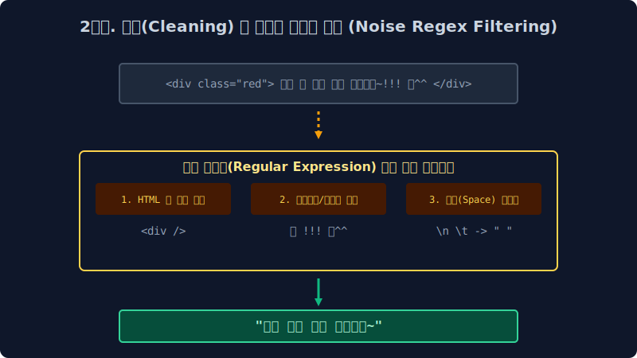

# 2.4 전처리 지옥의 6단계 파이프라인과 정제

현장에서는 오물을 제대로 청소하지 않고 텍스트를 기계의 뇌에 냅다 꽂으면, 그 AI는 영원히 오물만 말하게 된다고 경고합니다. **"Garbage IN, Garbage OUT!"** 이 기조 아래, 빅데이터 전문가들이 밤새워 피눈물을 흘리며 수행하는 텍스트 전처리(Preprocessing) 6단계 막노동 파이프라인 공정을 배웁니다.

---

## 2.4.1 Garbage In, Garbage Out (절대 불변의 법칙)

인공지능 딥러닝 신경망($Wx+b$) 모델의 코어 튜닝은 단 며칠 하루 만에 끝날지 몰라도, 그 신경망이 먹을 데이터를 기계의 장기 규격에 맞게끔 때를 벗기고 썰어내는 텍스트 전처리 준비 작업은 무려 전체 기간의 $80\%$ 에 달하는 엄청난 막노동(수개월)이 걸립니다. 이것이 NLP 실무자들의 일상입니다.

데이터 전처리 파이프라인은 보통 6단계의 철저한 살균 공정을 거칩니다.

## 2.4.2 파이프라인 1단계: 말뭉치 수집 (Corpus Collection)

가장 먼저 지구의 거대한 강물, 즉 인터넷 웹스페이스(WWW)에서 텍스트 데이터(뉴스 기사, X(트위터), PDF 문서)를 대량으로 그물을 쳐서 긁어옵니다. 이를 크롤링(Crawling) 또는 스크래핑(Scraping) 작업이라고 부릅니다.
수집된 초기의 이 원시 데이터 모음집을 날것의 **코퍼스(Raw Corpus, 말뭉치)** 라고 부르는데, 개발자가 소스코드를 열어보면 HTML 태그부터 시작해 `
` 같은 외계어로 극심하게 엉켜버린 괴물 같은 데이터를 마주하게 됩니다.

## 2.4.3 파이프라인 2단계: 정제 (Cleaning) - 쓰레기 소각장

수집된 데이터에 가장 먼저 하는 일은 인공지능이 사레들릴 수 있는 치명적인 오물 노이즈를 닦아버리는 무식한 1차 청소입니다.

*   **HTML/XML 태그 제거**: ` `, `<li>` 같은 프로그래밍 코드 블록을 찾아서 모조리 다 지워버립니다.
*   **특수 기호 탈각**: `@!#$%^` 같은 통계 분석에 쓸모없는 문자, 이모티콘 기호 표정들을 불도저처럼 다 밀어버립니다. (※ 다음 장에서 배울 **정규표현식(Regex)** 함수가 이 작업의 무적 무기로 사용됩니다.)

## 2.4.4 파이프라인 3단계: 정규화 (Normalization) - 호적 통일

정규화란 "글자 스펠링 모양은 조금씩 다른데 사실 뜻은 완전히 똑같은 놈들"을 찾아내어 **단 하나의 표기법으로 강제 통일시켜서 엑셀 1칸으로 모으는 통계적 가성비 군기 반장 작업**입니다.

> [!WARNING]  
> **📖 초심자를 위한 쉬운 해설: 미국인 이름 통일시키기와 차원의 저주**  
> 영어권 뉴스 데이터를 무작위로 수집해보면, 국가 `미국`을 뜻하는 단어로 `USA`, `U.S.A.`, `US`, `United States` 등이 난무합니다.  
> 인공지능 알고리즘은 기본적으로 저 4가지 단어가 컴퓨터 메모리에 할당될 때 각각 **스펠링이 다르니 완전히 다른 외계어 4개** 로 취급하여 다차원 공간 배열의 칸을 각기 따로 잡고 자원을 사분오열 낭비합니다! (이를 Sparsity 차원의 저주라고 합니다.)  
> 
> 그래서 개발자는 정규화(Normalization) 수학 필터를 걸어서, 저 4개 문자가 보이기만 하면 강제로 `usa` (소문자) 한 표기법으로 다 덮어 씌우고 매핑해 버립니다. 이것이 호적 통일의 미학입니다.

## 2.4.5 파이프라인 4단계: 토큰화 (Tokenization)

앞 장(2.2장)에서 자세히 배웠던 그 핵심 기술입니다. 정규화로 예뻐지고 통일된 문장 덩어리들을 컴퓨터가 소화하기 좋게 최적의 `[단어]` 혹은 `[서브워드]` 단위 조각(Token)으로 미세하게 썰어버립니다.

## 2.4.6 파이프라인 5단계: 불용어 제거 (Stop Words Removal)

불용어(Stop Words)란 텍스트 문서 전체에 빈도수는 무지막지하게 높게 나타나지만, 실상 문맥을 파악하고 핵심 논리를 분석하는 데에는 $1\%$ 도 도움 안 되는 쓰레기 관사를 의미합니다.

*   **영어 불용어**: `the`, `is`, `a`, `in`, `to` 등 (문법적 연결고리일 뿐 뜻이 빈약함)
*   **한글 불용어**: `은`, `는`, `이`, `가`, `그리고`, `그래서` 등

"사과 **그리고** 배 **가** 냉장고 **인** 곳에" 
개발자는 이 불용어들을 전용 사물함(NLTK 라이브러리가 등재해 놓은 수십 개의 삭제 블랙리스트)에 등록해 두었다가, 4단계 토큰 리스트 검사망에서 발견되는 즉시 가차 없이 체에 쳐서 우주 밖으로 날려 버립니다. 모델의 연산 속도를 비약적으로 끌어올리는 아주 중요한 가벼운 작업입니다.

## 2.4.7 파이프라인 6단계: 정수 인코딩 (Integer Encoding)

드디어 단어 토큰들이 뽀송뽀송하게 씻겨졌습니다. 이제 이 인문학적 알파벳 글자 스펠링을 인공지능 신경망이 가장 사랑하는 수학 **정수 숫자(ID Number)** 로 최종 치환합니다. 컴퓨터는 String(문자열)을 끔찍하게 싫어하기 때문입니다.

*   단어 사전 발급 프로세스: `['사과', '배', '바나나', '사과']` $\to$ 빈도수 내림차순 등으로 단어별 고유한 신분증 넘버 인덱스(Dictionary Index)를 발급합니다.
*   최종 변환된 데이터 매핑 모습: `[10, 24, 7, 10]` 

드디어 기나긴 6단계 전처리 필터 터널이 완결되었습니다! 기계는 이 완벽한 `[10, 24..]` 정수 시퀀스 숫자 배열을 받아먹고 거대한 뇌 속 안티-에일리어싱 공간에서 복잡한 신경망 미분 공식을 굴리기 시작합니다.
