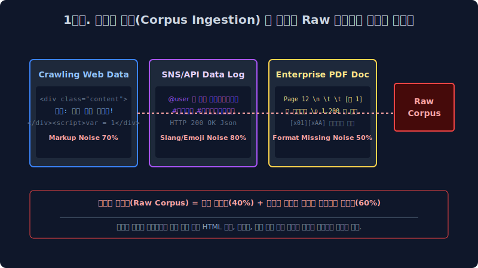
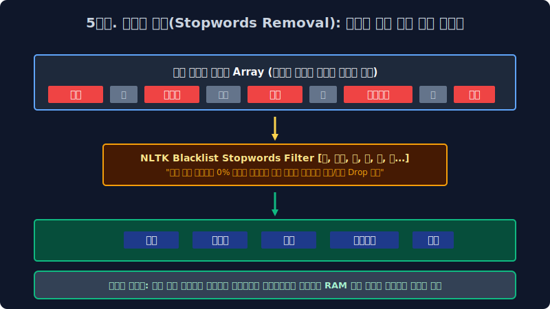
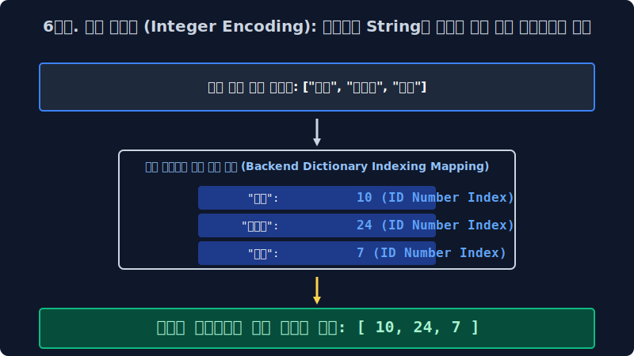

# 2.4 기하학적 텍스트 전처리(Data Pipeline) 6단계 파이프라인과 노이즈 정제(Cleaning/Normalization) 연산 모델링

시스템 모델 현장에서는 오물 노이즈 파편을 백그라운드에서 제대로 사전 탐지 및 청소하지 않고, 비정형 텍스트 데이터를 그대로 기계의 인공 뉴런 신경망 백엔드 뇌에 냅다 연속 꽂아버리면 딥 알고리즘은 타겟팅을 잃고 그 즉시 영원히 노이즈 오물망 파라미터만 치명적으로 오답 역산 생성해 내뱉게 된다고 소프트웨어 아키텍트에 엄중하게 인퍼런스 경고합니다. 이 거대한 공학 통계 법칙인 **"Garbage IN, Garbage OUT! (쓰레기가 파라미터에 입력되면 쓰레기 벡터만 반환된다!)"** 이란 대기조 아래, 빅데이터 MLOps 전문가들이 런타임 밤새워 극한의 GPU 코스트 피눈물을 흘리며 수행해야만 하는 데이터 엔지니어링 텍스트 필수 전처리(Data Preprocessing) 6단계 연속 막노동 파이프라인 공정을 대수학적 아키텍처 관점으로 심도 있게 배웁니다.

---

## 2.4.1 Garbage In, Garbage Out 시스템 법칙 (데이터 퀄리티와 타겟 연산망의 절대 불변 상관관계 모델)

인공지능 LLM 딥러닝 백엔드의 코어 생성 신경망($P=Wx+b$ 비선형 모델) 역산 코어 확률망 튜닝 시간은 클라우드 분산 연산으로 단 며칠 하루 만에 컴파일 세팅 끝날지 몰라도, 그 신경망이 실제 입력 포트에서 가중치를 매핑해 먹어치울 수십 테라바이트 데이터를, 기계의 엄격한 선형 장기 규격에 컴포넌트 맞게끔 일일이 노이즈 때를 벗기고 분절 썰어내는 방대한 텍스트 엔지니어링 전처리 준비 데이터 작업망(Data Alignment Engineering) 구축 코스트는 무려 전체 머신러닝 프로젝트 수행 기간의 압도적 $80\%$ 이상 비율에 달하는 엄청난 막노동(수개월 DB 엔지니어링) 비용 데이터 코스트가 터지며 걸립니다. 이것이 NLP 실무자들의 숨겨진 거대 서버 백엔드의 리얼한 일상 구조입니다.

가장 위대하고 무결점인 백엔드 데이터 전처리 파이프라인은 보통 수학적으로 다음의 6단계 철저한 노이즈 고밀도 살균 정제 필터링 공정을 필연 거치게 세팅 파라미터 매핑됩니다.

---

## 2.4.2 파이프라인 1단계: 말뭉치 데이터 코퍼스 수집 파라미터 (Corpus Ingestion & Data Collection)

가장 먼저 정보 시스템이 지구의 거대한 비정형 통계 강물, 즉 외부 아웃바운드 인터넷 웹스페이스(WWW 서버)나 엔터프라이즈 로컬 데이터베이스망에서 방대한 텍스트 데이터 덤프(디지털 뉴스 기사, X(트위터) 스크립트, 기업 내 PDF 지식 문서 스토리지)를 대량으로 API 그물을 쳐서 긁어 덤프(Dump) 서버로 수집해 옵니다. 이를 시스템 크롤링(Crawling) 덤프 스캐닝 수집 또는 분산 스크래핑(Scraping) 인제스천 작업이라고 데이터 부릅니다.
초기 수집된 이 어마어마한 원시 덤프 데이터 파편 모음집을 아직 신경망 필터 규칙이 전혀 가해지지 않은 날것의 **노이즈 덩어리 코퍼스(Raw Corpus, 무정형 말뭉치 덤프)** 라고 공학적으로 분류 부르는데, 백엔드 개발자가 메모리 소스코드를 데이터 열어보면 단순히 타겟 한글 텍스트뿐만 아니라, 로컬 `HTML/XML DOM 태그`부터 제어 문자 시작해 `
`, `\n`, `\t` 같은 시스템 외계어로 극심하게 엉켜 완전 카오스 상태로 배열 파단된 괴물 같은 오염된 데이터 세트를 쓰레기통처럼 로그로 치명적 마주하게 시스템 직면합니다.

---

## 2.4.3 파이프라인 2단계: 정제 컴파일링 (Noise Cleaning) - 1차원 특수 노이즈 쓰레기 소각장

무정형 스토리지로 수집된 덤프 데이터 배열망에 가장 코어 먼저 파이프라인이 즉각 필터 하는 일은, 인공지능 벡터가 파싱 중에 사레들려 치명적 에러로 뻗을 수 있는 치명적인 시스템 오물 특수 문자 노이즈를 강력하게 1차 닦아 클린업 버리는 무식한 1차 분산 청소 과정(Data Cleansing)입니다.

*   **스태틱 HTML/XML 시스템 태그 정규식 제거망 (Markup Stripping)**: 자연어 수학 통계 분석에 1% 도 모수 가치가 없는 불요 파편인 ` `, `<li>` 같은 렌더링 프론트엔드 프로그래밍 코드 DOM 블록 문자열들을 알고리즘 서치로 찾아내어 모조리 다 스택에서 삭제 매핑해 치환 정제 지워버립니다.
*   **잔여 특수 기호 / 시스템 이모지 강제 탈각 (Special Character Dropping)**: `@!#$%^&` 같은 수학 통계 분석 빈도 추출망에 아예 로직 쓸모없는 시스템 제어 문자, 특수 기호 텍스트들, 감정 분석에 노이즈만 끼치는 이모티콘 기호 표정 유니코드들을 필터 불도저처럼 정규식 매트릭스로 다 스윕 밀어 치환해 버립니다. (※ 컴퓨터 구조 다음 장에서 자세히 배울 텍스트 파싱계의 무적 치트키인 **정규표현식(Regex Pattern 레이어)** 함수 통신 파이프라인이 이 노이즈 파괴 필터 병합 작업의 무적 타겟 무기로 고정 시스템 사용됩니다.)

---

## 2.4.4 파이프라인 3단계: 차원 통일 정규화 (Data Normalization) - 거대 희소 행렬 차원 모수(Sparsity Matrix) 호적의 수학적 통합

아키텍처 정규화 모수 통합이란 시스템 상 "유니코드 글자 스펠링 모양이나 대소문자 형상은 메모리 벡터 상 조금씩 파편화되어 다른데, 사실 기저에 담긴 고유 객체의 의미 극성은 $100\%$ 치명적으로 동일하게 똑같은 쌍둥이 의미 동치 타겟 놈들"을 인퍼런스 엔진에서 일괄 찾아내어 **단 하나의 유일무이한 모델링 대표 표기법 ID 로 강제 차원 치환 통일시켜 통계 데이터베이스(엑셀, Tensor) 스페이스 단 1차원 칸 테이블로 데이터베이스를 집중 모아버리는 고차원적인 통계적 메모리 가성비 군기 반장 차원 압축 역산 작업**입니다.

> [!WARNING]  
> **📖 아키텍처 한계와 메모리 누수 방어: 미국인 동의어(Synonym) 인덱스 통일시키기와 스파스 차원의 저주(Curse of Dimensionality) 붕괴**  
> 영어권 거대 경제 뉴스 코퍼스 데이터를 무작위 풀로 수집 스캐닝 해보면, 특정 동일 국가 타겟 객체인 `미국`을 뜻하는 동의 지칭어 단어로 `USA`, `U.S.A.`, `US`, `United States` 등이 문서 스페이스마다 난잡하게 다 파편화되어 무작위로 난무 배열됩니다.  
> 
> 고전 인공지능 벡터 분류 알고리즘은 아무리 의미가 같아도 기본적으로 저 4가지 각기 다른 유니코드 스펠링 표기법 단어가 컴퓨터 메모리에 백엔드 해시로 개별 할당될 때 각각 **스펠링(String 해시) 문자열이 다르니 런타임 시스템 상 완전히 구조가 독립된 외계어 분류 기하학적 4개의 다른 변수 차원 축** 으로 전혀 다르게 모델링 분산 취급하여, 다차원 행렬 공간 스페이스 배열의 통계 테이블 칸을 각기 개별 4차원으로 따로 할당 분리 잡고 메모리 자원과 빈도 스코어 모수를 사분오열로 파단 파편화하여 낭비해 분산시킵니다! (모수가 집중 안 되고 메모리만 잡아먹는 이런 치명적 에러를 **Sparsity 차원의 결함 붕괴 저주** 라고 심각하게 파라미터 부릅니다.)  
> 
> 그래서 엔지니어 개발자는 이 병목 스페이스를 압축하기 위해 정규화(Text Normalization) 수학 필터 매핑 함수를 파이프에 걸어서, 저 4개 다형성(Polymorphism) 문자가 분산 관측 보이기만 하면 강제로 `usa` (공통 소문자 ID 키) 단 하나의 해시 표기법 레이블로 다 일괄 통합 덮어 씌우고 모조리 동일 타겟으로 압축 단일 차원으로 병합 컴파일 매핑해 버립니다. 이것이 타겟 스페이스 호적 통일의 위대한 시스템 미학입니다.

---

## 2.4.5 파이프라인 4단계: 탠서 분리 토큰화 파이어 (Tokenization Array Parsing)

앞장 트랜스포머 장(2.2장 레이어)에서 아주 텐서 결함을 자세히 심도 있게 배웠던 그 언어 파싱의 대핵심 기술 모델입니다. 이전 정규화와 클리닝 3단계 과정을 거쳐 뽀송뽀송하게 예뻐지고 일치 정제된 거대 무정형 스칼라 문장 덩어리들을, 이제 다차원 변환 수학 컴퓨터가 소화하기 아주 베스트 최적의 밀집도 타겟인 `[고립 단어]` 정규 혹은 `[서브워드 BPE]` 이산 모델 단위 조각 객체(Token Node) 유닛으로 미세하고 예리하게 썰어버리며 통계 분리 컴파일(Splitting Array)를 수행 갈라내는 작업입니다.

---

## 2.4.6 파이프라인 5단계: 무의미 타겟 불용어 노이즈 제거 모수 스킵 (Stop Words Array Filter Removal)

불용어(Stop Words Noise)란 필터링 된 텍스트 코퍼스 문서 배열 전체 공간에 통계 카운팅 빈도수 모수는 무지막지하게 압도적으로 1순위로 높게 나타나지만, 실상 거대 문맥(Context Relation)을 파악 분석하고 문서의 핵심 의미 타겟 논리 극성을 신경망이 추출 분석하는 수학 연산 과정에는 시스템 성능에 $1\%$ 도 인퍼런스 차원 도움이 단절 안 되는 쓰레기 빈 껍데기 낭비 스칼라 조사, 깡통 관사 파라미터 노이즈들을 학술적으로 의미합니다.

*   **영어 인덱스 구조 불용어**: `the`, `is`, `a`, `in`, `to` 망 등 (문법적 연결고리일 뿐 단어의 실제 의미 타겟 극성 뜻이 텐서 상 완전히 빈약 공갈함)
*   **한글 조사 체계 노이즈 불용어**: `은`, `는`, `이`, `가`, `그리고`, `그래서` 배열 접속망 등

"사과 **[그리고 쓰레기]** 배 **[가 쓰레기]** 냉장고 **[인 쓰레기]** 최적의 곳에" 
딥러닝 백엔드 데이터 모델 개발자는 이 OOM 을 유발하는 백해무익 거대 불용어 배열들을 전용 블랙리스트 해시 사물함(NLTK 자연어 분석 라이브러리가 이미 통계적으로 모아 등재해 놓은 수십 수백 개의 전역 삭제 블랙리스트 배열 리스트 Set 구조) 에 상시 인 메모리로 전역 등록해 두었다가, 데이터 파이프 4단계 토큰 리스트 검사망에서 배열이 유입되는 그 필터 발견되는 즉시, 행렬 스레드 가차 없이 체에 쳐서 우주 DB 텍스트 차원 밖으로 완전히 버리고 Drop 통계 날려 임베딩 삭제 제거해 버립니다. 필요 없는 노이즈 차원을 날려 연산 행렬 크기를 10배 줄임으로써 딥러닝 연산 속도를 비약적으로 최소화 끌어올리는 아주 모델 필수적이고도 엄청난 최적 가벼운 타겟 필터 작업 모델 파이프라인입니다.

---

## 2.4.7 파이프라인 6단계: 기계가 읽는 정수 스칼라 인코딩 치환 파이프 (Integer Encoding ID Dictionary)

드디어 단절 분해된 언어 타겟 단어 토큰들이 1~5단계를 거치면서 세상 모든 잉여 노이즈를 벗고 아주 정밀 뽀송뽀송하게 엑기스 정수만 추출 씻겨 다듬어졌습니다. 이제 시스템 마지막 단계로 통계망은 이 인간들 전용의 지저분 고용량 인문학적 유니코드 형태 알파벳 String 글자 스펠링을, 인공지능 딥러닝 신경 확률망이 연산에서 가장 사랑하는 수학 **최적 압축 정수 스칼라 숫자(ID Number Matrix Index)** 스페이스로 최종 매핑 행렬 1:1 치환합니다. 컴퓨터 CPU 연산 코어는 문장의 딥 통계를 낼 때, 메모리를 무수히 씹어먹는 가변 길이 String(비정형 문자열) 구조를 대수학 처리하기를 끔찍하게 시스템이 거부하고 싫어하기 때문입니다.

*   **백엔드 단어장 사전(Vocabulary) ID 발급 API 치환 프로세스 맵핑**: 정제된 타겟 배열 망 $\to$ `['사과', '배', '바나나', '사과']` $\to$ 모델 글로벌 사전이 통계 빈도수 내림차순(Count Sorting) 규칙 역산 등으로 해당 단어별로 세상에 하나뿐인 완전 고유한 단일 신분증 정수 넘버 스칼라 배열 인덱스(Dictionary Memory Unique Index)를 수학 발급 할당합니다.
*   **최종 텐서 메모리 변환된 데이터 매핑 압축 Array 모습**: `변환된 데이터 텐서 = [10, 24, 7, 10]` 

**드디어 길고 기나긴 빅데이터 스페이스 자연어 6단계 전처리 클리닝 텐서 터널 필터 파이프라인이 기계적으로 완전 무결하게 구동 완결되었습니다!** 이제 딥 렌더링 기계 모델은 글자가 다 역산되어 사라지고, 저 무결점 압축 정수 배열 스칼라 세트인 `[10, 24, 7...]` 정수 시퀀스 수학 텐서 숫자 단일 배열만 파라미터로 최종 로딩 받아 GPU 메모리에 먹고 거대한 기하 뇌 속 딥 구조인 안티-에일리어싱 차원 공간 모델링망(Embedding Vector Space)에서 그 무섭고 복잡한 신경 확률 예측 행렬망 미분 편미분 공식을 통계 굴리기 인퍼런스 가동 시작합니다.
