# 전처리 지옥의 6단계 파이프라인과 정제

오물을 청소하지 않고 텍스트를 기계의 뇌에 꽂으면, 그 AI는 영원히 오물만 말하게 됩니다. "Garbage IN, Garbage OUT!" 이 기조 아래, 빅데이터 전문가들이 밤새워 피눈물을 흘리며 수행하는 텍스트 전처리(Preprocessing) 6단계 막노동 파이프라인 공정을 배웁니다.

---

## 00. Garbage In, Garbage Out 시스템
인공지능 모델 튜닝은 하루 만에 끝나도, 그 데이터가 쓸만하게끔 때를 벗기는 텍스트 전처리 준비 작업은 무려 수개월이 걸립니다. 이것이 NLP 실무자들의 일상입니다.

데이터 전처리 파이프라인은 보통 6단계의 철저한 살균 공정을 거칩니다.

## 01. 파이프라인 1단계: 말뭉치 수집 (Corpus Collection)
지구의 거대한 강물 인터넷에서 텍스트 데이터(웹페이지, 뉴스, PDF)를 대량으로 그물을 쳐 긁어옵니다. (크롤링, Scraping)
이것들은 HTML 태그부터 시작해 `
` 같은 외계어로 엉켜버린 괴물입니다.

## 02. 파이프라인 2단계: 정제 (Cleaning) - 쓰레기 소각장
가장 먼저 하는 일은 인공지능이 사레들릴 수 있는 치명적인 오물 노이즈를 닦아버리는 무식한 1차 청소입니다.
*   **HTML/XML 태그 제거**: ` `, `<li>` 같은 코드 블록을 다 지워버립니다.
*   **특수 기호 탈각**: `@!#$%^` 같은 분석에 쓸모없는 문자, 이모티콘 표정들을 불도저처럼 다 밀어버립니다. (정규표현식이 이 작업의 무적 무기입니다.)

## 03. 파이프라인 3단계: 정규화 (Normalization) - 호적 통일
정규화란 "글자 모양은 다른데 뜻은 완전히 똑같은 놈들"을 하나의 표기법으로 강제 통일시켜서 엑셀 1칸으로 모으는 가성비 군기 반장 작업입니다.

> [!WARNING]  
> **📖 초심자를 위한 쉬운 해설: 미국인 이름 통일시키기**  
> 영어권 뉴스 데이터를 수집해보면, `USA`, `U.S.A.`, `US`, `United States` 등이 난무합니다.  
> 인공지능은 기본적으로 저 4가지 단어가 컴퓨터 메모리에 할당될 때 각각 **완전히 다른 외계어 4개** 로 취급하여 배열 칸을 극심하게 낭비합니다!  
> 
> 그래서 정규화 필터를 걸어서, 저 4개 문자가 보이기만 하면 강제로 `usa` 소문자 한 표기법으로 다 덮어 씌우고 갈아버립니다. 이것이 호적 통일입니다.

## 04. 파이프라인 4단계: 토큰화 (Tokenization)
앞 장에서 배웠던 그 기술입니다. 정규화로 예뻐진 문장들을 분석하기 좋은 `[단어]` 단위 조각으로 썰어버립니다.

## 05. 파이프라인 5단계: 불용어 제거 (Stop Words Removal)
불용어(Stop Words)란 문서에 빈도수는 미친 듯이 많이 등장하지만, 실제 뜻 분석에는 1도 도움 안 되는 쓰레기 관사를 의미합니다.
*   **영어**: `the`, `is`, `a`, `in` 등.
*   **한글**: `은`, `는`, `이`, `가`, `그리고` 등.

"사과 **그리고** 배 **가** 냉장고 **인** 곳에" 
이 불용어들을 전용 사물함(개발자가 지정한 삭제 리스트 100개)에 등록해 두었다가, 토큰 리스트에서 발견되는 즉시 가차 없이 체에 쳐서 날려 버립니다.

## 06. 파이프라인 6단계: 정수 인코딩 (Integer Encoding)
드디어 토큰들이 뽀송뽀송하게 씻겨졌습니다. 이제 이 알파벳 글자 스펠링을 인공지능이 사랑하는 수학 숫자(ID Number)로 치환합니다.
* `['사과', '배', '바나나', '사과']` $\to$ 단어별로 신분증 넘버를 발급합니다.
* 최종 데이터 모습: `[10, 24, 7, 10]` 

드디어 기나긴 6단계 전처리 필터 터널이 끝났습니다! 기계는 이 `[10, 24..]` 시퀀스 숫자를 받아먹고 거대한 뇌 속에 수학 미분 공식을 굴리기 시작합니다.
