# 마법의 그물망 정규표현식과 형태소 다이어트

만약 여러분의 상사가 1만 페이지짜리 문서에서 이메일 양식(`@`)과 전화번호(`010-0000-0000`)만 남기고 싹 다 지우라고 지시했다면 어떻게 할까요? 이 불가능한 정제 작업을 단 1줄의 우아한 마법 코드로 끝내는 **정규표현식(Regex)**과, 단어의 뱃살을 빼버리는 **어간 추출** 필터를 배웁니다.

---

## 00. 문자열 검색의 제왕: 정규표현식 (Regular Expression)
텍스트 정제(Cleaning)의 본질은 "내가 원하는 문양과 패턴"을 찾아내서 삭제하거나 발라내는 막노동입니다. 이 작업을 신의 경지에서 수행하는 미친 수식이 바로 정규표현식입니다.

### 정규식 언어 체계의 마법
*   `[0-9]+` : "문서 안에 숨 막히게 흩뿌려진 모든 아라비아 숫자 덩어리들을 싹 다 긁어모아라!"
*   `[a-zA-Z]` : "모든 영어 알파벳(대소문자 다큐)들을 다 잡아들여!"
*   `[^가-힣]` : "한글만 쏙 빼고, 나머지 이모티콘이랑 영어 특수기호는 몽땅 모아서 파괴해 버려!"

> [!WARNING]  
> **📖 초심자를 위한 쉬운 해설: 데이터 노가다 해방문**  
> 인공지능 학자들에게 정규표현식은 호흡과도 같습니다. 데이터 수집 단계에서 가져온 텍스트는 `<html src=..>` 등 끔찍하게 꼬여있습니다. 파이썬의 `re` 패키지로 정규식을 한 줄 돌리면, 1초 만에 깔끔한 알맹이 한글 문장을 추출할 수 있습니다. 

## 01. 다이어트 성형수술 1: 표제어 추출 (Lemmatization)
아까 전처리 3단계로 배운 호적 통일(정규화)을 수행하기 위해 사용되는 가장 고급스런 가지치기 기술입니다. 단어들이 시대와 상황에 따라 지저분하게 달고 있는 꼬리를 싹 떼어내고, 근본적인 사전적 원형 **(표제어, 레마)** 만 수술로 도출해 냅니다.

*   `am`, `are`, `is` $\to$ 다이어트 $\to$ 뿌리인 **`be`** 기둥 동사 하나로 전부 강제 호적 통일합니다.
*   `has`, `had` $\to$ 다이어트 $\to$ **`have`** 로 통일.

언어학 사전을 이용해서 아주아주 정교하고 의미를 지키며 자르기 때문에 연산이 무겁고 시간이 꽤 걸립니다.

## 02. 다이어트 성형수술 2: 어간 추출 (Stemming)
표제어 추출을 할 시간이 없을 때 컴퓨터가 사용하는 무자비하고 차가운 기계식 칼부림입니다. 사전을 보지 않고, 어림짐작으로 글자 뒷부분 스펠링을 그냥 막 잘라버립니다!

*   `formalize` $\to$ 꼬리 자르기 $\to$ `formal`
*   `allowance` $\to$ 꼬리 자르기 $\to$ `allow`

**맹점**: 너무 무식하게 글자 규칙(ing, ed)만 보고 스펠링을 썰어버리다 보니, 잘려 나간 글자가 사전에 없는 완전 파괴된 외계어 찌꺼기가 되는 경우가 부지기수입니다. 극강의 스피드로 대충 데이터 카운트를 맞출 때만 쓰는 필살기입니다.

## 03. 최강 난이도 한글 전처리: 교착어의 분해
전 세계 자연어 처리 학자들이 공포에 떠는 우주 최강의 문법, 바로 한국어(Korean) 형태소 분석의 시간입니다. 한국어는 주어 뒤에 조사가 껌딱지처럼 들러붙는 **교착어**이기 때문에, 띄어쓰기(`Split()`) 하나만으로 전처리를 시도하면 앞서 말한 대로 데이터가 박살 납니다.

### 한국어 전용 지팡이: KoNLPy 구조
그래서 한국어는 영어처럼 공백으로 자르지 않고, **KoNLPy(코엔엘파이)** 라는 한글 형태소 단위 분해 도끼를 무조건 설치하여 파이프라인에 이식해야 합니다.

*   **Okt (Open Korean Text)**: 속도가 엄청나게 빠르고 신조어 "ㅋㅋㅋㅋ", "오존좋" 같은 캐주얼한 통신어 인터넷 텍스트 전처리에 매우 강력한 성능을 뽐내는 형태소 파괴기입니다.
*   **Mecab (은전한닢)**: 속도와 안정성이 가장 뛰어나 실무 기업에서 가장 많이 돌리는 한국어 분석의 일인자입니다.

결론적으로, 아무리 훌륭한 LLM 신경망을 설계하더라도, 이 파이프라인(정규식, 토큰화, 어간 추출, 형태소 쪼개기) 바닥 작업에 피눈물을 쏟지 않으면 결과물은 깡통에 불과합니다.
