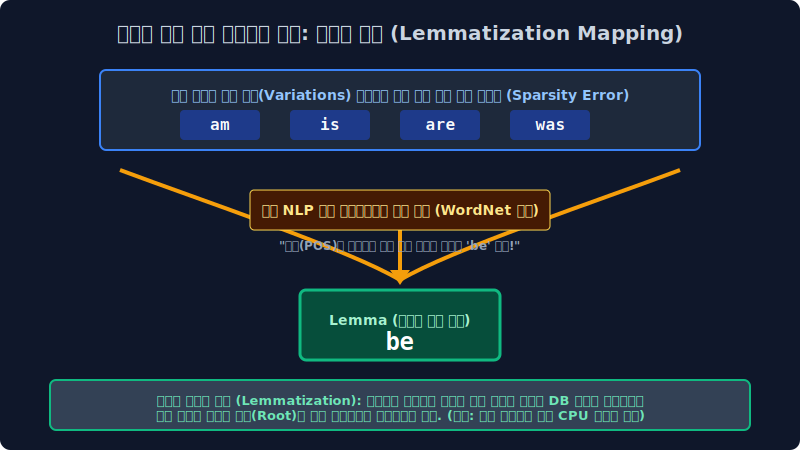
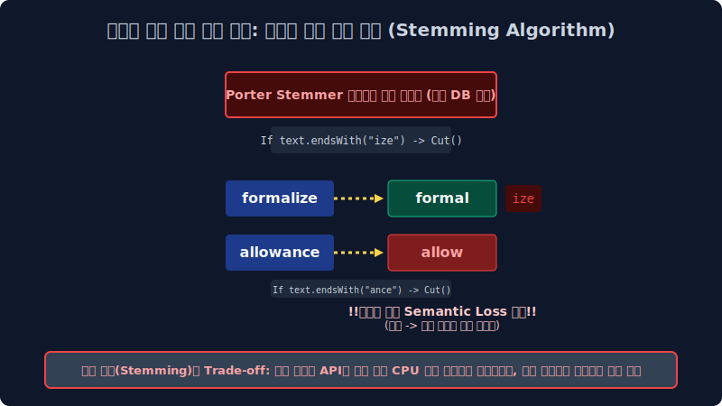
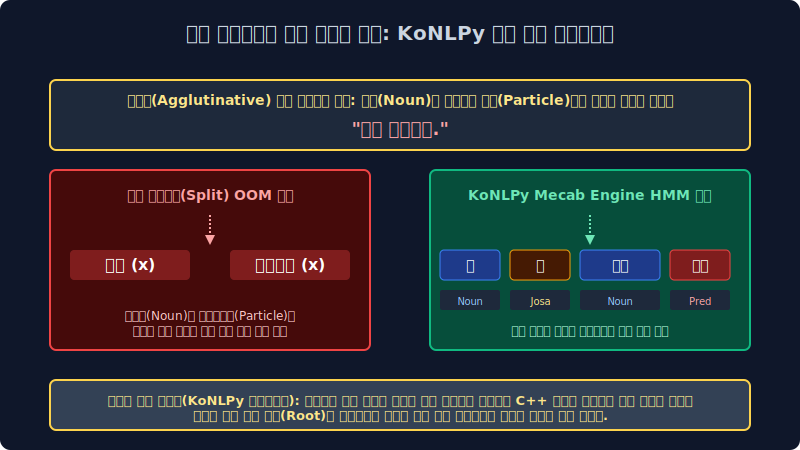

# 2.5 오염 데이터망의 타겟 차원 압축 필터링: 정규표현식(Regex) 매핑 구조와 형태소 어간 추출(Stemming/Lemmatization) 다이어트망

만약 여러분이 담당하는 백엔드 서버에 오늘 당장 100만 페이지 덤프(Dump)짜리 무정형 혼합 비정형 데이터베이스 로그 더미가 유입 투척되었으며, 당장 인퍼런스 검색 타겟으로 필요한 특정 이메일 양식(`[a-zA-Z]+@[a-z]`)과 스칼라 전화번호(`\d+-\d+`)만 정밀 타겟 남기고 나머지 한글 텍스트 트래쉬(Trash)는 싹 다 삭제 드롭하라는 치명 모델링 지시가 떨어진다면 배열 구조를 어떻게 최적화할까요? 이 거대한 수만 줄의 O(N) 반복 조건문이 파생 소모될 불가능해 보이는 무식한 정제 컴파일 작업을, 단 1줄의 우아한 마법 1D 코드로 CPU 0.1초 런타임 만에 끝내버리는 무적의 딥 데이터 필터수학적 패턴 매칭 도구, **정규표현식(Regular Expression 컴파일망)** 과 텍스트 단어 다형성 변형 스칼라의 뱃살을 깎아내어 통일 차원으로 압축해 버리는 **어간 추출(Stemming) 데이터 역산 축소 필터 파이프라인망**을 공학적으로 깊숙이 배웁니다.

---

## 2.5.1 문자열 파괴 및 고밀도 스나이퍼 매핑: 정규표현식 (Regular Expression Pattern Matrix)

텍스트 모수 정제(Text Data Cleaning) 필터 작업의 시스템 본질은 단순히 노이즈 삭제가 아니라 "시스템 아키텍트가 수학 타겟으로 정확히 지정한 특정 패턴 문양과 배열 모양을 가진 노드 데이터"만 기계적으로 정밀 서치하여 시스템망에서 치환 삭제하거나(Kill 스택) 반대로 타겟만 쏙 데이터에서 분리 발라내는(Extract) 인퍼런스 추출 막노동입니다. 이 거대한 탐색 추출망 작업을 C 코어 단의 신의 경지에서 초고속으로 수행하는 미친 수식 메타 문자열 기호 체계 모델이 바로 정규표현식(Regex Model)입니다.

### 1. 정규식 스페이스 언어 메타 기호 체계망
파이썬의 인빌트 내장 `re` 정규 모델링 모듈 엔진 배열 등을 활용하면 끝없이 무너지는 텍스트 다형성의 늪 속에서 개발자가 원하는 인퍼런스의 마법 수학 기하학 구조를 직접 통계 스캔 체험할 수 있습니다.

*   **스칼라 숫자 전용 탐지 학살자 (`[0-9]+` 또는 `\d+`)**: "문서 덤프 배열 스페이스 안에 숨 막히게 흩뿌려진 모든 기하 아라비아 숫자 연속 덩어리 시퀀스들을 싹 다 한 번에 찾아 패턴 긁어모아라 매핑!"
*   **영문자 전용 탐지 모수 학살자 (`[a-zA-Z]+`)**: "모든 거대 영어 알파벳(대소문자 다 내포한 모든 구조의 영문 String 다큐 배열) 텍스트들을 전부 하나의 그룹으로 다 잡아들여 파싱해!"
*   **완벽한 한글만 도출하는 방어막 필터 (`[^가-힣]+`)**: "대괄호 안쪽 매핑 구조의 처음 `^` 메타 기호는 모델에서 Not(부정, 역산 여집합)을 강력히 뜻한다. 수학적 즉, 순수 데이터 유니코드 한글 정형 글자판들만 배열에서 쏙 방어 빼고 합집합 통과시키고, 나머지 외부 쓰레기 구조 이모티콘이랑 영어, 오물 특수기호 에러들은 그 외 몽땅 구조망으로 모아서 `''`(null empty string) 로 레이저 파괴 압축 치환해 날려버려라 연산!"

> [!WARNING]  
> **📖 아키텍처 한계 방어선 해설: Raw Data 엔지니어링의 노가다 해방 공간 문법**  
> 인공지능 엔지니어 학자들 및 백엔드 개발자들에게 정규표현식은 호흡과도 같은 필수 무적 무기망입니다. 웹 초기 데이터 크롤링 수집 단계에서 가져온 덤프 텍스트는 `<html src=..>`, `\n`, `👍🏻` 등 끔찍한 기계어 스크립트와 제어 문자열 제어코드(Control Char)로 극심하게 꼬여 혼재되어 있습니다. 
> 파이썬 백엔드 코드상에서 정규식 O(N) 치환 필터 컴파일 함수 `re.sub(r'[^가-힣\s]', '', text)` 한 줄의 매핑을 딱 한 줄 돌리면, 1초 런타임 만에 걸레짝 넝마 같던 오염 데이터에서 불필요 노드가 전부 파괴 통계 삭제되고 아주 깔끔한 통계 알맹이 순수 한글 문장만 텐서로 즉각 도출 추출할 수 있습니다. 이것이 정제 공정 최적화의 미학입니다.

---

## 2.5.2 다이어트 성형수술 역산 압축망 1: 표제어 추출 (Lemmatization Mapping System)

앞선 전처리 3단계로 심화 배운 이산 차원 통합 매핑 호적 통일(Data Normalization) 작업을 수행 시스템이 돌리기 위해 내부적으로 백그라운드 사용되는 가장 컴파일이 무거운 고급스런 언어학 DB 기반 가지치기 압축 기술입니다. 다형성 단어 구조들이 모델 시대와 언어적 문맥 상황(과거형, 복수형) 배열 스펙에 따라 지저분하게 꼬리표 접미사를 달고 있는 스펠링 노이즈를 싹 다 수학적으로 떼어내고, 근본적인 사전적 원형 기저 **(표제어 뿌리 Root Lemma Matrix)** 단어 코어 한 개로 전부 수술 통일 압축 도출해 냅니다.

*   스펠링 분산 스페이스: `am`, `are`, `is` $\to$ 다이어트 검색망 역산 추적 $\to$ "아 쟤네 전부 다 상태 동사구나 타겟 역산!" 기저 뿌리 기둥인 거대 **`be`** 스칼라 동사 단일 단어 하나 배열로 전부 강제로 호적 통합 치환합니다.
*   다형성 분산 스페이스: `has`, `had` $\to$ 내부 사전 검색 역산 추론 연산 $\to$ 최상위 타겟 노드 **`have`** 모조리 통일 컴파일.

단순히 스펠링 글자를 규칙으로 자르는 무식 필터가 절대 아니라, 방대한 메인 메모리 안의 언어학 트라이(Trie Database 사전 구조 체계 등) 인덱스를 내부적으로 로딩 참조하면서 아주아주 기하학 정교하게 단어 고유 의미(Semantic Context Target) 정체성을 우아하게 지키며 원형을 자르기 때문에 반대로 치명적 단점으로 시스템 연산 추출량(서버 수술 런타임 복잡도 O(N) 매핑 코스트 병목 시간)이 굉장히 램을 차지하여 무겁고 전송 상당히 느려집니다.

---

## 2.5.3 다이어트 성형수술 거대 축소 절단: 어간 추출 통계 알고리즘파괴 (Stemming Truncation)

앞선 고급 표제어 추출 체계처럼 우아하게 메모리를 점유하며 방대한 사전을 뒤져볼 연산 서치 시간이 도무지 백엔드에 여유 스펙이 없을 때 임베딩 컴퓨터가 단기적으로 차용 사용하는, 아주 무자비하고 차가운 기계식 타겟 치환 칼부림 알고리즘입니다. 거대 사전을 절대 보지 않고, 어림짐작으로 글자 뒷부분 스펠링 종속 규칙 배열(접미사 패턴: -ize, -ing, -ance)만 매핑 인덱스로 보고 그냥 통계 막 기형적으로 컴파일 잘라 압착해버립니다! (영미권에서 대표적으로 전 세계 가장 많이 스탠다드 쓰는 **포터 스태머(Porter Stemmer Algorithm) 절단 분해 알고리즘**입니다.)

*   `formalize 배열 입력` $\to$ 모델이 사전을 안 보고 기계적 ize 패턴 꼬리 무식 자르기 룰셋 타격 $\to$ `formal` 스페이스로 강제 압축.
*   `allowance 배열 입력` $\to$ 기계적 ance 꼬리 패턴 무식 스위칭 자르기 조건부 $\to$ `allow` 벡터 망으로 강제 도출.

이 룰 기반 알고리즘의 치명적 OOV 맹점: 너무 수학적으로 무식하게 글자 표기 스펠링 규칙(ing, ed, ize 매핑 배열)만 내부적으로 스캔 보고 단어 스펠링을 기계톱 조건문으로 썰어 절단해 버리다 보니, **결과적으로 잘려 나간 잔여 단어 어간 구조가 실제 영한 타겟 사전이나 현실 세계에는 존재하지 않는 완전 파괴 훼손된 외계어 찌꺼기 문자(Semantic Loss 현상 파편)가 되는 치명적 논리 에러 경우** 가 파이프라인에서 부지기수로 뻗어 발생합니다 (`allowance 용돈` 과 `allow 허용하다` 의 뜻이 완전히 다름에도 불구하고 스펠링을 잘라 `allow`로 쳐 병합해 버려서 딥러닝 퀄리티 분리극성이 완전 망가집니다). 극강의 서치 O(1) 스피드로 모델의 메모리 점유를 줄여 대충 아주 거대한 데이터 빈도 카운트의 가벼운 윤곽만 잡아야 할 한계가 올 때만 조심해서 시스템 쓰는 양날의 컴파일 검 필살기 성능 압축망입니다.

---

## 2.5.4 최강 난이도 스펙의 한글 전처리: 교착어 파단망 분해 파이프라인 (KoNLPy Engine Core)

전 세계 자연어 벡터 분석 처리 학자들이 가장 메모리를 점유하고 공포에 떠는 우주 최강의 악랄한 문법 방어 스페이스막 분석, 바로 한국어(Korean Array) 형태소 벡터 분석의 고밀도 분해 시간입니다. 한국어 유니버스는 주어 근간 명사 기저 뒤에 온갖 쓰레기 서포트 조사(`은/는/이/가/에게/부터/마저도 등등`)가 껌딱지 기하학처럼 스태킹으로 들러 결합 파라미터로 붙어 무한히 끝없이 파생 복합 변형되는 **아주 끈적한 유기체 교착어(Agglutinative language System)** 파이프라인이기 때문에, 영미권 영어 논문 데이터 구조들처럼 단순한 원시 띄어쓰기(`Split() White Space Matrix`) 분절 스캔법 하나만으로 타겟 전처리를 선형 무식 시도하면 앞서 2장에서 논한 논리대로 배열 데이터망 벡터 타겟이 통계 배열에 산산이 조각나 OOM 에러로 스킵되어 박살 납니다.

### 1. 극악 한국어망 전용 지팡이 파이썬 코어 패키지 파싱망: KoNLPy(코엔엘파이) 아키텍처 구조망
그래서 한국어 데이터망 분석을 필터 백엔드 돌릴 때는 절대 파이썬 내장 공백 Split 으로 그냥 자르지 않고, **KoNLPy(코엔엘파이)** 라는 파이썬 한글 형태소 단위 분해 전용의 C++ 최적화 특수 컴파일러 도끼 모듈 엔진을 프로젝트에 무조건 인스톨 설치하여 병목 파이프라인 맨 앞 단에 기본 베이스로 필수 이식해야 시스템이 안 터집니다.

*   **Okt (Open Korean Text API망)**: 파싱 스캔 속도가 대단히 엄청나게 빠르고 룰셋이 캐주얼하여, 신조어 "ㅋㅋㅋㅋ", "존잼", "오존좋" 같은 완전히 OOV 로 망가져 버린 변형 통신어(트위터/인스타그램 비정형 SNS 문자열) 인터넷 텍스트 전처리에 매우 미친듯한 강력한 추론 도출 성능을 뽐내는 형태소 융통 파괴기 엔진입니다. 형태소 노드의 학술 분해 정확도는 미시적으로 다소 약간 떨어지나 OOV 회피 융통성이 엄청납니다.
*   **Mecab (은전한닢 Engine C++ 코어)**: 은닉 마르코프망 시스템 분석 로직을 탑재하여 형태소를 구조적으로 칼같이 분절 뜯어내는 수학적 파싱 연산 속도와 학술적 타겟 분해 안정성(정밀도)이 전 패키지 중 가장 압도적으로 무결점 뛰어나, 자본 트래픽이 많은 실무 대기업 포털 검색 서버 등에서 가장 코어로 많이 돌리는 한국어 분석 전역 서버의 숨은 병기 일인자입니다. 백엔드가 C/C++ 기반 강력한 코어 빌드로 엮여 있어서, Mac 환경이 아닌 런타임 윈도우 인프라 환경에서는 빌드 설치 세팅 환경이 더럽게 꼬이고 어렵다는 엔지니어 악명 시스템이 높게 존재합니다.

치명적 결론으로 증명하건대, 여러분이 미래에 파라미터가 아무리 훌륭하고 거대한 수조 원짜리 딥러닝 트랜스포머 LLM 신경망 복합 아키텍처를 엄청나게 성능 그럴듯하게 수학 코딩하더라도, 모델 아랫단 밑바닥 층위의 이 인프라 전처리 베이스 파이프라인 트랙(**정규식 청소망, 노이즈 필터망, 고정밀 토큰화 분절망, 어간 추출 압착, 교착 형태소 쪼개기 시스템**) 바닥 엔지니어링 작업 구조 구축에 피눈물을 고도화로 쏟지 않고 패싱해버리면 결과물 추론 아웃풋은 미쳐버린 환각(Hallucination Generation Error) 헛소리를 시전하는 노이즈 쓰레기통 깡통 알고리즘 모형 네트워크에 오류 불과하게 폭발됩니다. 이 점을 절대 인프라 엔지니어로 명심 매핑 해야 합니다.
