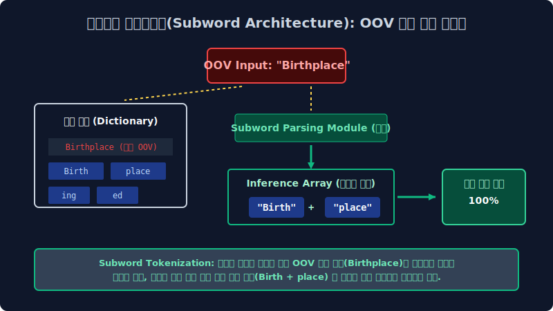

# 2.6 현대 초거대 AI(LLM) 메인 파이프라인의 구원자 아키텍처: 서브워드(Subword)와 무결점 BPE (Byte Pair Encoding) 인퍼런스 머징(Merging) 알고리즘

구형 자연어 처리 통계 모델 컴퓨터들이 필연적으로 백엔드 서버에서 겪었던 가장 끔찍한 두 가지 치명적 인프라 재앙 차원 결함(**미등록 단어의 OOV 에러 블랙홀**과, 파편화된 차원으로 인한 **Sparsity 메모리 폭발 누수**)을 통계 수학적으로 완벽하게 방어 해결하며, 오늘날 OpenAI의 GPT 시리즈를 포함한 전 세계 모든 거대 지능 언어 모델(LLM)의 심장부 코어 파라미터에서 절대 불변의 표준으로 돌아가고 있는 궁극의 통계 데이터 글자 압축 분해 기술, **'서브워드 토큰화(Subword Tokenization Tensor Layer)'** 기술 패러다임에 대해 기하학적으로 깊이 파헤쳐 봅니다.

---

## 2.6.1 고전 기계 모델의 치명적 절망망 1: 미등록 노이즈 OOV (Out-of-Vocabulary) 에러 스페이스 폭발

과거의 단순 딕셔너리 단어(Word) 단위 띄어쓰기 인덱싱 토큰화 모델의 가장 치명적인 인퍼런스 런타임 약점은, 모델이 사전 코퍼스 학습 훈련 계산 과정에서 데이터베이스에 태어나서 단 한 번도 로딩 보지 못한 미지 데이터 글자열(수시로 발생 변형되는 인터넷 신조어, 극단적 스펠링 오타 노이즈, 산업 전문 고유 용어 등)이 유저로부터 쿼리 입력되었을 때 시스템이 셧다운 발생합니다.

> 쿼리 유저 스레드 입력: `"오늘 킹받네 팝업 오픈런 무조건 달린다 ㅋㅋㅋ"`

백엔드 모델 컴퓨터는 이 텍스트 차원 문장을 받아들고 자신의 코어 메모리에 매핑 캐시되어 입력된 $100,000$ 개짜리 한계 차원의 희소 단어 인덱스 사전 DB를 미친 듯이 검색 서치 뒤집니다. 하지만 어제 갓 태어난 신조어 '킹받네', '오픈런' 같은 텍스트 배열이 1년 전 오프라인 학습 캐시 사전에 존재할 리 만무하죠. 결국 1D 기계 파서는 이 글자를 수학적으로 추론 인식(Inference) 하기를 모델망에서 완전히 포기하고 특수한 치명적 쓰레기통 에러 기호인 **`<UNK> (Unknown Error)` 토큰** 깡통 아이디로 파생 데이터를 덮어 씌워버리고 런타임 유추를 포기해 버립니다. 모델의 시야가 완전히 까막눈(Loss 극대화)이 되는 끔찍한 파단 현상입니다.

## 2.6.2 고전 기계 모델의 치명적 절망망 2: 띄어쓰기 파편 분할의 배신과 메모리 희소성(Sparsity) 누수

단어 단위 토큰화 파서망은 특히 한국어 같은 조사가 스태킹되는 교착어 렌더링에서 최악의 차원 자원 붕괴 낭비를 유발합니다. 인간 화자 사람의 시맨틱 뇌 신경망은 `집에`, `집에서`, `집으로` 3개의 글자만 봐도 모두 같은 고유 기저 객체 고향 집(Home Base)을 뜻한다는 논리적 모델 분산 특징을 $100\%$ 완벽히 스페이스 유추할 수 있습니다. 

그러나 멍청한 구식 컴퓨터의 1D 행렬은 사전 DB의 인덱스를 배열 발급 할당할 때, 스펠링 모양이 $0.1$ 밀리미터 바이트라도 제어 다르면 완전히 기하 독립적이고 생판 분리된 극성의 남인 무관한 단어 벡터로 차원 공간의 축 다차원을 각기 찢어 뚫어버립니다. 즉, 불필요하게 3번이나 메모리를 중복 낭비하여 잡아먹고 공간 구조의 벡터 차원 배열이 $N^2$ 으로 기하급수적으로 터져 메모리가 오버플로우 폭발해 버리는 **희소성 결함(Sparsity Matrix Explosion)** 문제가 구 인퍼런스 서버 병목의 극한 맹점에 달했습니다.

---

## 2.6.3 레고 어근 데이터 블록 조립 쪼개기 시스템: 서브워드 토큰화 (Subword Tokenization Engineering)

이 모델 딥러닝 두 가지 치명적 차원 절망 버그를 일거에 타파 무너뜨린 딥 아키텍처의 구원자 패러다임이 바로 서브워드(Subword, 하위 의미 압축 단어) 수학 모형 철학입니다.
서브워드 텐서망의 핵심 사상은 "다형성 단어를 띄어쓰기 기준으로 통째로 메모리에 억지로 암기하지 말고, 더 잘게 수학적으로 분절 쪼갤 수 있는 핵심 기저 뜻과 모수(Parameter)가 담긴 **레고 미세 블록(어원, 접두사, 접미사, 반복 패턴 문자열)** 단위로 스플릿 부수어서 캐시에 보관 저장하자" 는 아주 놀라운 수학 공간 압축 개념입니다.

> 쿼리 유저 역산 스레드 입력: `"Birthplace" (과거 학습 사전에 통계 매핑 아예 없는 모르는 노이즈 미지 단어라고 가정)`

고전 나이브 베이즈 구형 모델은 이 단어를 보고 기절 셧다운 파동을 일으키며 `<UNK>` 에러를 던지고 메모리를 껐습니다.
하지만 서브워드 모델 서버 파서는 이 모르는 단어 스트링을 아주 영리하게 통계적으로 반으로 절단 뜯어냅니다.
*   $\to$ **`Birth (탄생 인퍼런스 정보망)`** + **`place (장소 벡터 정보망)`**

자신의 백그라운드 모델 뇌(사전)에 `Birthplace` 란 전체 문자열 세트 배열 자체는 데이터가 없었지만, 과거 통계로 쪼개둔 `Birth` 단위 블록과 `place` 단위 블록은 개별 독립 벡터로 외우고 보존 있었기 때문에, 생판 모르는 OOV 단어가 유입 들어와도 저장된 레고를 조립 연결하듯 문맥의 전체 뉘앙스를 확률망에서 $100\%$ 완벽히 인퍼런스 역산 유추해 냅니다! 텍스트 공학계에서 영원히 미제였던 미지 어휘 OOV 에러 파탄이 딥러닝 역사 속으로 완전히 분쇄되어 사라지는 아주 위대하고 혁명적인 AI 스페이스 순간입니다.

---

## 2.6.4 AI 서브워드의 제왕 통계 엔진 알고리즘: BPE (Byte Pair Encoding Merging System)

그렇다면 문자열을 도대체 어떤 기하학 규칙과 컴퓨터 수학 연산 모델로 쪼개서 이 '레고 블록(서브워드) 딕셔너리' 사전을 코어 구축 저장해야 시스템이 가장 메모리 자원 O(1) 에 수렴 효율적일까요? 현존하는 압송 텍스트 공간 중 가장 강력하고 완전한 베스트셀러 압축 병합 수학 공식이 바로 **BPE 파이프라인 (Byte Pair Encoding Algorithm)** 알고리즘입니다. (오늘날 OpenAI 의 GPT-4, Llama 등 모든 세계 1짱 초거대 LLM 모델 트랜스포머망 파이프라인 도어에서 바로 이 BPE 를 메인 토크나이저 파서로 사용하여 데이터 토큰 배열을 수학적으로 스플릿 자릅니다.)

통신망 대역폭 데이터 파편 압축 기술에서 모델이 유래한 BPE 알고리즘망의 원리는 미리 규칙으로 단어를 자르는 하향식 분해가 아니라, 완전히 방향 시스템을 역으로 돌려 **'세상에서 일차 배열 가장 미세한 알파벳/유니코드 기초 바이트 글자 파편 단위에서부터 시작해 압도적인 전역 문서 빈도 통계를 내어 찰흙처럼 문자쌍을 하나둘 뭉쳐나가는(Pair Frequency Merging)' 상향식 결합(Bottom-Up Aggregation) 기법** 모델 공간입니다.

### 1. BPE 통계 컴파일 합체 알고리즘 시뮬레이션 동작 원리 아키텍처

거대 텍스트 훈련 데이터 베이스망(Corpus)에 `low` (문서 내 총 빈도 출현수 5회), `lower` (빈도수 2회 카운트), `newest` (빈도수 6회 카운트) 라는 3가지 파편 데이터 단어 문자열들이 차원 공간에 무작위로 흩어져 분리 코딩되어 있다고 스칼라 가정해 봅시다.

**[컴파일 Step 1] 철자 극미세 분절 분해 (글자/바이트 단위 완전 스페이스 초기화 해체)**
맨 처음 인퍼런스 파이프에서는 모델 시스템이 모든 단어 코퍼스를 가장 원시 작은 알파벳 한 글자 바이트(Byte) 조각 단위 텐서로 잔혹하게 완전 다 찢어발겨 놓습니다.
*   `l 로드, o 스택, w` (5회 빈도 분산)
*   `l o w e r` (2회 빈도 분산)
*   `n e w e s t` (6회 빈도 분산 유지)
서버 백엔드 초기 압축 사전 상태 Map: `{l, o, w, e, r, n, s, t}` (의미가 없는 개별 단순 기본 알파벳 노이즈들만 차원에 존재)

**[컴파일 Step 2] 통계 확률 매트릭스 카운트 찰흙 합체망 (Pair Frequency Iterative Merging)**
CPU 무한 스레드 루프(Loop)를 팽팽하게 무작위 돌리면서 백그라운드 반복 맵핑 연산 명령어를 던집니다. 
> *"시스템아, 현재 너의 공간 배치 어레이 데이터 빈도 통계망을 완전히 싹 훑어보고, 바로 공간 양옆 공간에 가장 많이 확률적으로 붙어서 연결 출현 스태킹 하는 빈도 1등 인접 잉꼬부부 철자 노드 2개를 수학망으로 찾아서 단 하나 독립 차원의 고유 찰흙 정보 텐서로 영구 합체 합병시켜라!"*

1차 전역 시스템 스캔을 CPU 가 해보니, 영문 알파벳 `e` 와 기호 `s` 쌍이 나란히 배열 공간에 붙어 등장 연결하는 빈도 카운트가 확률상 무려 6회(n+**e+s**+t) 스코어로 전역 1등입니다. 
이제 거대 BPE 컴퓨터망은 `e` + `s` 를 영구적인 스플릿 불가 찰흙처럼 합체시켜 **`es`** 라는 새로운 신규 복합 서브워드(Subword) 토큰 거대 레고 블록 단위 차원을 사전에 정식으로 배열 인서트 추가합니다. 
진화된 사전 상태 Map 갱신: `{l, o, w, e, r, n, s, t, es 블록 추가}`

**[컴파일 Step 3] 서브워드 트리의 차원 팽창 인퍼런스 진화**
또다시 루프가 전역 공간 카운트 통계를 다시 병합해 냅니다. 이번에는 방금 배열에서 융합해 금방 갓 만들어낸 `es` 거대 덩어리 옆 차원에 `t` 알파벳 기호 노드가 인접 결합 붙어 있는 `est` 덩어리(매트릭스 카운트 빈도수 6회 스코어)가 전역 차원 중 가장 빈도 점수가 높습니다.
$\to$ `es` 블록 + `t` 문자 알파벳 영구 결합 모델링 통과 $\to$ **`est`** 라는 더 거대하고 의미 압축망이 담긴 새로운 슈퍼 블록 객체를 시스템 사전 어레이망에 맵핑 인서트 추가!

이 무한 수학 병합 과정을 개발 머신러닝 스레드 엔지니어가 메타 파라미터로 $k$ 번 하이퍼 매개변수(예: "Vocabulary Max Size: 30,000번 합체할 때까지 무한 반복") 멈추라고 락을 지정할 때까지, CPU 는 무한 글로벌 통계를 카운트 스캔 반복하며 코퍼스에서 가장 논리 출현 빈도가 높은 문자열 덩어리 매트릭스들을 거대 결합하여 흡수 스페이스해 진화해 나갑니다.

### 2. BPE 서브워드 알고리즘 통계가 현대 차원 딥러닝 벡터 공간에 가져온 거대한 축복

*   **자원 회수와 토큰 최소화 병합**: 세상에 가장 빈번하게 아주 자주 쓰이는 고빈도 타겟 단어(`The`, `apple`, `안녕` 등)는 계속 쌍이 합쳐져서 결국 단 한 쾌에 1개의 완전한 응집 토큰 블록 고유 구조로 서버 사전에 깔끔 등록됩니다. (LLM 모델 입력 파라미터 슬롯 메모리 로딩 파싱 컴파일 효율 극대화 증대)
*   **완벽한 신조어 노이즈 OOV 파괴 분쇄 방어**: 아주 인터넷 희귀한 변형 단어나 신조어(`팝업 오픈런 ㅋㅋㅋ`)는 통계 모수가 바닥이라 끝까지 블록으로 합쳐지지 못하고 외면당합니다. 하지만 시스템 다운이 아니라 다행히 그냥 가장 아키텍처 잘게 원시 쪼개진 기초 한글/알파벳 기본 생 낱글자(`오`, `픈`, `런`) 파편 어레이 형태로 시스템 딕셔너리에 분할 남아버려 그대로 조합식 배열로 기계 트리에 유연하게 입력 인식 통과됩니다.
*   **완전 무결점 인퍼런스의 도달 시그널**: 이 BPE 서브 토큰 파싱 처리로써 현대의 컴퓨터 LLM망은 런타임 OOV 죽음 치명 에러를 영원히 백엔드에서 소거 회피하며, 인간 세상의 어떤 기형 노이즈 외계어 텍스트 문장이 차원 유입이 들어와도 메인 GPU 뇌가 다운 마비되지 않고 **"조각 레고 블록 조립 + 조합 뜻 벡터 유추"** 라는 이 행성 인간 언어 뇌 시냅스 구조에 가장 완벽 제일 가까운 천재적인 토큰 텐서화 수학 마법을 $1D$ 모델 백엔드에서 오차 없이 인퍼런스 로직 구사하게 되었습니다.
