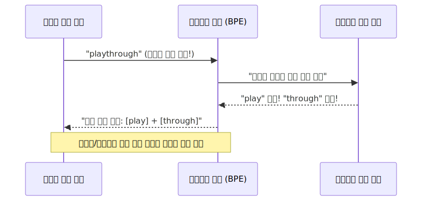

# LLM의 미지 언어 방어막: 서브워드 토큰화 (BPE)

옛날 컴퓨터들은 "애플"이라는 단어는 완벽하게 알아듣지만, "애플페이"라는 단어가 새로 등장하면 사전에 없다며 에러를 뿜으며 기절했습니다. 이 치명적인 멘붕(OOV 문제)을 방어하기 위해 최근 챗GPT 등 거대 언어 모델들이 쓰는 영리한 글자 쪼개기 마법, 서브워드 토큰화를 학습합니다.

---

## 00. 고전 기계의 치명적 오류: OOV (Out-Of-Vocabulary)
통계 기반의 예전 언어 모델들의 가장 큰 맹점은 "단어사전 컬렉션"을 들고 다녔다는 점입니다. 10만짜리 단어 엑셀 사전을 들고 다니다가, 자기가 태어나서 처음 보는 희한한 단어(오타나 신조어)가 들어오면, 눈알을 뒤집으며 사전을 다 뒤져도 못 찾겠다고 `OOV 에러 (Out-of-Vocabulary)` 또는 `<UNK> (Unknown)` 라벨을 던져버리고 파업을 선언합니다.

> **에러 상황 (OOV의 절망)**  
> User: `"오늘 킹받네 ㅋㅋㅋ 억텐 뭐임?"`  
> 구형 AI: "(에러) 킹받네? 억텐? 사전에 없는 외계어입니다. 분석을 중단합니다." 

인터넷상에는 매일 신조어가 수십 개씩 생겨나고 미친 듯이 오타가 범람하는데, LLM(챗GPT)이 등장할 때마다 사전을 수백만 개로 늘릴 수는 없었습니다. 차원의 저주(메모리 초과 폭발) 때문입니다.

## 01. 띄어쓰기의 배신: 구시대 단어 토큰화의 멸망
그렇다고 공백(띄어쓰기) 단위로 자르자니, 의미론적으로 엄청난 데이터 누수가 생깁니다.
`"집에"`, `"집에서"`, `"집으로"` 라는 단어는 사실 공간적 **`집(Home)`** 이라는 공통된 부모 의미를 갖고 있지만, 띄어쓰기로 토큰을 내면 기계는 이 3개를 **"스펠링이 다르니 완전히 다른 3개의 생판 남남 단어구나!"** 라고 생각하고 사전에 제각기 낭비하며 등록해 버립니다.

## 02. 서브워드 토큰화 (Subword Tokenization) 란?
이 절망적인 에러와 메모리 폭발을 동시에 틀어막기 위해, 현대 딥러닝 학자들은 "어원을 아작내자" 는 파괴적 혁신을 이뤄냅니다.
단어를 통째로 암기하지 않고, 레고 블록처럼 **의미가 있는 더 작은 철자 조각(Subword)** 단위로 산산조각 내서 암기시키는 전략입니다.

> [!TIP]  
> **📖 초심자를 위한 쉬운 해설: 영어 어원의 쪼개기 마법**  
> `Birthplace` 라는 영단어 토큰이 있습니다.  
> * 옛날 AI: "`Birthplace`? 사전에 없네. 에러! (OOV 멘붕)"
> * **서브워드 AI**: "흠... 처음 보는 단어긴 한데... 가만 보자, 내가 아는 글자 조각으로 좀 쪼개볼까? 👉 `Birth(탄생)` + `place(장소)`! 아하! **태어난 장소(고향)** 구나!"
> 
> 이처럼 기계에게 **자주 등장하는 글자 패턴 조각**들을 가르치면, 처음 보는 듣보잡 신조어가 나와도 기절하지 않고 자기가 아는 서브워드 단위로 산산조각 내서 억지로라도 뜻을 유추해 내는 가공할만한 생존력을 뽐냅니다.

## 03. 서브워드의 제왕: BPE 알고리즘 (Byte Pair Encoding)
서브워드 조각을 만드는 방법 중에서, 수많은 딥러닝 LLM 모델(GPT 연산)의 밑바탕이 되는 구글의 가장 전설적인 알고리즘입니다.

BPE의 모토는 이것입니다: **"가장 자주 같이 등장하는 글자 두 개 묶음을, 하나의 새로운 글자 덩어리(토큰)로 묶어버리자!"**

### BPE 아작 내보기 작동 원리
1.  맨 처음 훈련 데이터의 모든 알파벳 철자를 시크하게 하나씩 다 따로 분리합니다. `(l, o, w, e, r)`
2.  데이터를 쭉 훑어봅니다. "어? `e` 랑 `r`이 심심하면 항상 뒤에 같이 붙어 다니네? 빈도수 1등이다!"
3.  `e` 와 `r` 두 알파벳을 하나로 합쳐서 **`er`** 이라는 **합체 레고 블록(새로운 서브워드)** 을 하나 만들고 사전에 등록합니다.
4.  이 과정을 내가 정해둔 횟수만큼 미친 듯이 빙글빙글 계속 반복합니다!

### BPE 반복의 기적
반복 횟수가 지날수록, 짧았던 `e` + `r` 로마자가 $\to$ `est` $\to$ `low` $\to$ `lowest` 형태로 점점 뭉치면서 진짜 영어 단어스럽게 변해갑니다. 

결국 모든 단어를 뇌에 저장하지 않더라도, 이 BPE가 만들어낸 **"마법의 어원 조각 블록"** 들만 있으면 세상의 어떤 미지 신조어(OOV) 모르는 단어가 튀어나와도 전부 레고 조립하듯이 분석망에 집어넣어 버릴 수 있게 되었습니다! 이로써 인공지능은 두려울 게 없는 전처리 황금기를 맞이합니다.
