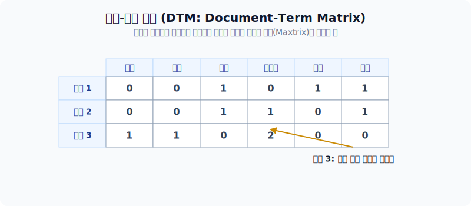
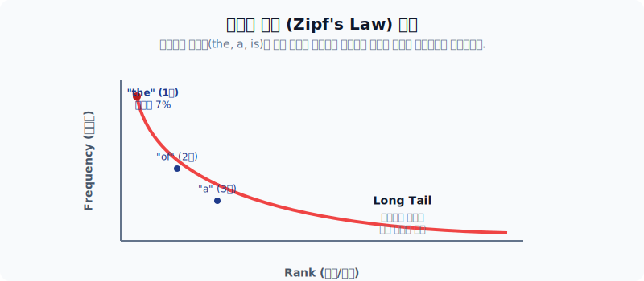

# 텍스트의 벡터 표현 (통계 기반 모델)

자연어 처리의 첫 관문은 사람이 사용하는 일상적인 '언어'를 컴퓨터가 무리 없이 소화할 수 있도록 수학적인 '숫자' 모음으로 변환하는 것입니다. 본 섹션에서는 컴퓨터가 문서를 통계적으로 이해하기 위해 텍스트를 대수적 좌표계(Vector Space)로 옮겨 놓는 **벡터 공간 모델(Vector Space Model)** 과 가장 밑바탕이 되는 **카운트(등장 빈도) 기반 기법**들을 알아봅니다.

---

## 1. 글을 이해하는 방식의 차이: 사람 vs 컴퓨터

인간은 문법과 구조, 행간의 의미를 살피며 글을 '처음부터 끝까지 순서대로' 읽어 내려갑니다. 하지만 초기 컴퓨터 알고리즘은 이렇게 맥락을 파악할 능력이 없었습니다. 대신, 특정 단어가 문서 내에 '몇 번이나 나타나는지'를 헤아린 **빈도수(통계)** 를 통해 문서의 특징을 짐작합니다. 

*순차적으로 읽어들이는 사람의 방식과 단순히 단어의 카운트만 수집하는 컴퓨터의 통계 기반 방식 비교*

---

## 2. 벡터 공간 모델 (Vector Space Model)

문서는 더 이상 단순한 글씨가 아니라 수학적 연산(코사인 유사도 계산 등)이 가능한 벡터(Vector)로 탈바꿈되어야 합니다. 이때 문서에 쓰인 각각의 단어들은 벡터를 이루는 '차원(Dimension)' 하나하나로서 대응됩니다.

### 원-핫 인코딩 (One-hot Encoding)

가장 직관적인 방법은, 만들고 싶은 전체 단어 사전(Vocabulary)을 구성한 뒤, 해당 단어가 차지하는 순서(인덱스) 칸에만 1을 주고 나머지 모든 수만 개의 칸은 0으로 도배하는 방식입니다. 

*직관적이지만 차원의 압박과 '희소성'이라는 엄청난 메모리 제약을 야기하는 원-핫 인코딩*

이처럼 대부분의 공간이 아무 쓸모없는 0으로 가득 차 있는 벡터들을 가리켜 **희소 벡터(Sparse Vector)** 라고 부릅니다. 

---

### 문서-단어 행렬 (DTM: Document-Term Matrix)

원-핫 인코딩을 기반으로 문서를 단어의 바구니(Bag-of-Words, BoW)로 취급하면, 여러 개의 문서가 모였을 때 거대한 하나의 행렬(Matrix)로 만들 수 있습니다. 가로축은 전체 단어, 세로축은 각각의 문서들로 채워 넣으면 **문서-단어 행렬(DTM)** 이 완성됩니다.

하지만 **DTM 역시 치명적인 한계점**들을 가집니다.
1. **메모리 낭비 (희소성)**: 10만 개의 단어장에 1만 개의 문서가 모이면 $100,000 \times 10,000$ 의 공간이 필요하지만, 그 안의 무려 99% 이상이 전부 빈도수 0인 상태(희소 행렬)로 방치되어 하드웨어 계산이 무척 느려집니다.
2. **문맥 파괴**: 오로지 '등장 숫자의 크기'만 남으므로 단어의 시퀀스 순서(문맥 정보)가 모조리 파괴됩니다.
3. **무의미한 빈도로 인한 착시**: '먹고, 싶은' 처럼 문장 내에서 중요한 뜻을 가지는 단어와, 한국어의 '은, 는, 이, 가'나 영어의 정관사 'the'처럼 아무런 뜻거리도 없이 습관적으로 많이 튀어나오는 무의미한 단어들을 구별할 수 없습니다.

---

## 3. 지프의 법칙 (Zipf's Law)

'자주 나오는 단어일수록 핵심 키워드겠지'라는 카운트 기반 모델의 소박한 환상은 **지프의 법칙(Zipf's law)** 앞에서 무너집니다.

언어학자 지프가 발견한 바에 따르면, 인간의 자연어 문서 어딘가를 열어보아도 상위 1~3위에 랭크되는 소수의 관사 및 조사('the', 'of', 'a' 등)들이 전체 문서의 절반 가까이를 차지할 정도로 극단적으로 빈번히 발생합니다.

*어떤 언어, 어떤 분야의 문서를 가져와도 빈도수 랭킹 1위의 단어가 압도적인 횟수를 점유하는 파워 로우(Power law) 커브 현상*

결국 단순 빈도수에만 의지한 DTM 행렬은, 사실상 'the'나 'of' 같이 문서의 진짜 주제와 상관없이 습관적으로 나온 불용어(Stopword)들에게 가장 높은 점수를 주는 바보 같은 모델이 되어버리는 것입니다. 따라서 이를 조율할 보다 논리적인 평가 방법론이 필요하게 되었으며, 이것이 바로 다음 장에서 다룰 **TF-IDF 기법의 탄생 배경**입니다.
