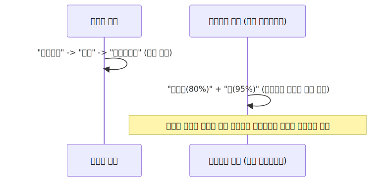

# 단어 임베딩의 기초: 카운트 기반 텍스트 표현

기계가 이 세상을 이해하기 위해 자연어를 아주 차가운 수학적인 공간(Vector Space)으로 맵핑하는 여정의 첫걸음을 뗍니다. 가장 무식하지만 직관적인 수식인 '단어 빈도수(Count) 세팅'의 세계를 파헤쳐 봅시다.

---

## 00. 단어의 숫자로의 변이 (Word to Mathematics)
"사과라는 글자가 문서에 3번 등장했네!" 
인문학적인 문장을 수학 기호열(벡터)로 바꾸어 기계의 뇌에 주사하는 모델링의 시작입니다.



> [!NOTE]  
> **📖 초심자를 위한 쉬운 해설: 컴퓨터는 문맹이다**  
> AI는 한글이든 영어든 단어 그 자체를 절대 읽지 못합니다. 무조건 '숫자'로 바꿔줘야만 연산(덧셈, 곱셈)을 하고 딥러닝 미분을 할 수 있습니다. 
> 이번 3주차에서 배울 **'카운트 기반 방식'**은 문장 속 단어의 숨겨진 의미나 감정은 다 무시하고, 가장 단순무식하게 **"야, 이 단어가 몇 번 나왔냐?"** 에 따라 가산 숫자를 부여하는 원초적인 고전 기법입니다.

## 01. 글을 이해하는 방식 - 사람 (Human)
사람은 글을 읽을 때 앞에서부터 뒤로 순서대로 단어들을 읽어가면서 문맥의 흐름과 화자의 뉘앙스를 자연스럽게 파악합니다. 이것은 대단히 고차원적인 지능입니다.

## 02. 글을 이해하는 방식 – 컴퓨터 (트랜스포머 기반)
현대의 최첨단 딥러닝 LLM 모델(트랜스포머 기반) 또한 사람을 흉내 냅니다. 기본적으로 문장이 주어지면, 숨겨진 뉘앙스(Context)와 연결성을 파악하려고 미친 듯이 노력하고 그 관계도를 숫자 행렬로 엮어냅니다.



## 03. 글을 이해하는 방식 – 고대 컴퓨터 (통계 기반 모델)
그러나 10년 전, 딥러닝 이전 시대의 전통적인 고전 통계 모델은 이럴 능력이 안 되었습니다. 문장이 주어지면 그저 단어의 **얼마나 자주 등장했는가(단순 카운트 조회)**만을 가지고 눈치껏 문서의 주제를 때려 맞추고자 시도했습니다.

> [!TIP]  
> **📖 초심자를 위한 쉬운 해설: 눈치 백단 무당 방식**  
> 통계 모델은 사실 내용을 안 읽습니다. "어... 이 100장짜리 문서에 `우울하다`는 단어가 70번, `주식차트`라는 단어가 40번, `청산`이 20번 쓰였네? 앞뒤 문맥은 모르겠지만 100% 한강 주식 투자자의 슬픈 글이구나!" 라고 빈도수로 바로 진단을 내려버립니다. 말의 순서는 놓치지만 계산 속도가 압도적으로 빨라서 가성비가 매우 훌륭했습니다.

## 04. 카운트 기반 텍스트 표현 (수학적 공간)
이 눈치 백단 카운트 횟수표를 숫자로 이루어진 **벡터(Vector)** 괄호묶음으로 만들어서 기하학적인 좌표계, 즉 **수학적 공간(Vector Space)**으로 쏘아 올립니다.

$$ \mathbf{v} = [c_1, c_2, c_3, \dots, c_n] $$

여기서 $c_i$는 해당 사전에서 단어가 '등장한 횟수(Count)'를 뜻합니다. 이렇게 화살표 하나를 만들면 우주 공간(좌표축) 어딘가에 점을 찍을 수 있게 됩니다.

## 05. 텍스트의 특성 (Feature) 벡터 공간 매핑하기
이 수학적 공간은 과연 어떻게 생겼을까요? 공간의 축(Feature)은 우리가 수집한 **단어 사전(Vocabulary)** 전체 길이로 규정되며, 그 좌표축으로 나아가는 눈금값은 단어가 텍스트에 나타나는 **카운트 숫자**가 됩니다.

```math
\begin{array}{c|ccccc}
\text{문서 (Docs)} & \text{text} & \text{mining} & \text{process} & \text{apple} & \text{korea} \\
\hline
\text{Doc 1} & 2 & 1 & 1 & 0 & 0 \\
\text{Doc 2} & 0 & 0 & 0 & 5 & 1 \\
\text{Doc 3} & 1 & 1 & 1 & 1 & 0 \\
\end{array}
```

### 🐍 파이썬 딕셔너리로 이해하기
문장: `"text mining is the process of deriving high quality information from text"`
```python
# 'text' 라는 단어는 위 문장에서 2번 등장했으므로 값(수학 축 눈금)이 2를 갖게 됨.
# 나머지 단어들은 각각 1번씩만 언급되어 1을 가집니다.
feature_vector = {
    'text': 2, 'mining': 1, 'is': 1, 'the': 1, 'process': 1, 'of': 1, 
    'deriving': 1, 'high': 1, 'quality': 1, 'information': 1, 'from': 1
}
```

이런 식으로 각 단어의 카운트를 하나의 화살표 패키지로 묶어 놓은 다음, 다른 글뭉치 패키지들과 서로 수학적인 거리를 비교하며 문서 분류, 감성 분석 등을 해내는 것이 바로 NLP의 태동이었습니다.
