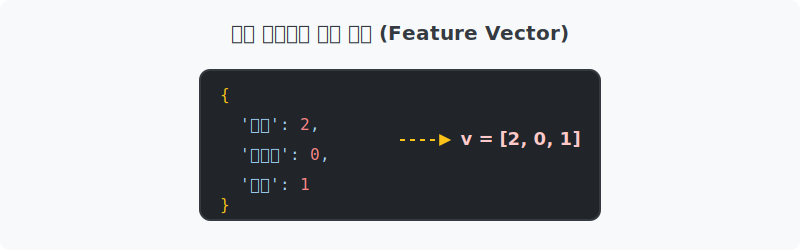
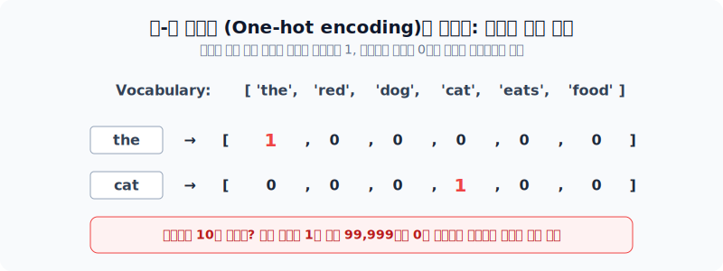
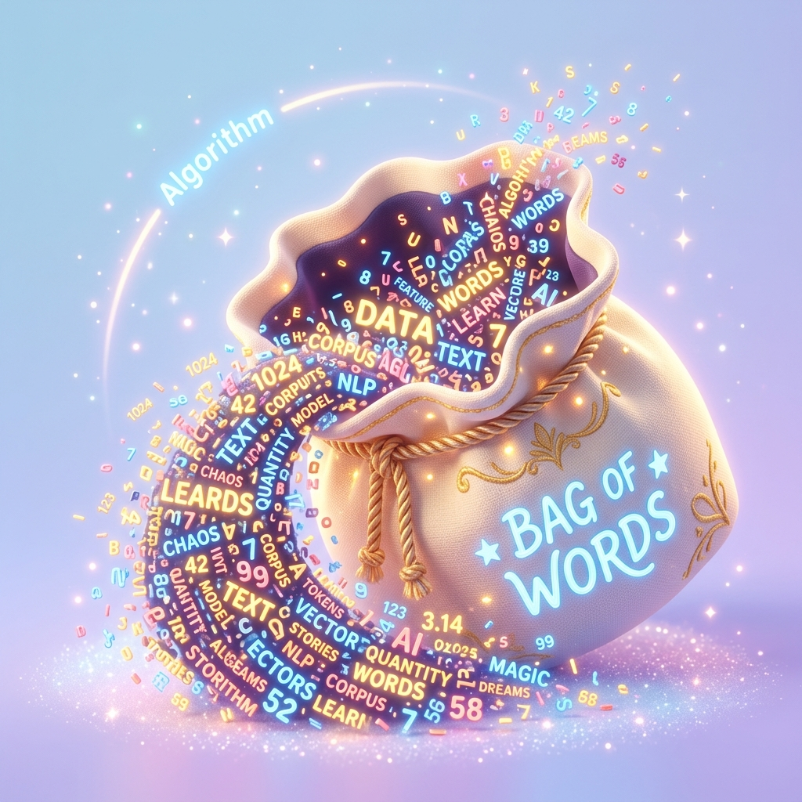
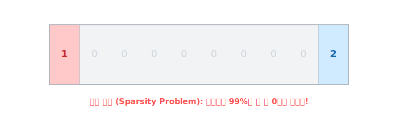

# 단어 임베딩의 기초: 카운트 기반 텍스트 표현

기계가 이 세상을 이해하기 위해 자연어를 수학적인 공간(Vector Space)으로 맵핑하는 '고전 통계 기반' 기법의 첫걸음을 뗍니다. 가장 쉬운 수식인 빈도수 카운트부터 시작해 봅시다!

---

## 00. 카운트 기반 텍스트 표현
"사과라는 글자가 문서에 3번 등장했네!" 텍스트를 숫자로 바꾸어 기계에 알려주는 모델링의 시작입니다.


> [!NOTE]  
> **📖 초심자를 위한 쉬운 해설**  
> AI는 한글이든 영어든 단어 그 자체를 절대 읽지 못합니다. 무조건 '숫자'로 바꿔줘야만 연산(덧셈, 곱셈)을 할 수 있습니다. 
> 오늘 배울 '카운트 기반 방식'은 가장 단순무식하게 **"단어가 몇 번 나왔냐?"** 에 따라 숫자를 부여하는 원초적인 기법입니다.

## 01. 글을 이해하는 방식 - 사람
* 사람은 글을 읽을 때 앞에서부터 뒤로 순서대로 단어들을 읽어가면서 문맥의 흐름과 뉘앙스를 파악합니다.

## 02. 글을 이해하는 방식 – 컴퓨터 (딥러닝 트랜스포머 기반)
* 현대의 최첨단 딥러닝 LLM 모델(트랜스포머 기반) 또한 기본적으로 문장이 주어지면, 숨겨진 뉘앙스(Context)와 연결성을 파악하려고 미친 듯이 노력합니다.


## 03. 글을 이해하는 방식 – 컴퓨터 (통계 기반 모델)
* 반면 딥러닝 이전 시대의 전통적인 고전 통계 모델은, 문서에 나타나는 단어의 **얼마나 자주 등장했는가(단순 빈도수)**만을 가지고 눈치껏 문서의 주제를 파악하고자 시도합니다.

> [!TIP]  
> **📖 초심자를 위한 쉬운 해설**  
> 통계 모델은 "어... 이 100장짜리 문서에 우울하다는 단어가 70번, 주식차트라는 단어가 40번 쓰였네? 그럼 100% 한강 주식 투자자의 글이구나!" 라고 빈도수로 때려잡는 방식입니다. 앞뒤 문맥(문장 순서)을 모두 놓치지만 빠르고 가벼워서 가성비가 훌륭합니다.

## 04. 카운트 기반 텍스트 표현 (수학적 공간)
텍스트의 통계적 빈도를 숫자로 이루어진 **벡터(Vector)**로 만들어 기하학적인 좌표계, 즉 **수학적 공간(Vector Space)**으로 쏘아 올립니다.

$$ \mathbf{v} = [c_1, c_2, c_3, \dots, c_n] $$

여기서 $c_i$는 해당 사전에서 단어가 등장한 횟수(Count)를 뜻합니다.

## 05. 텍스트의 특성 (Feature) 벡터 공간 매핑
* 특성(Feature)은 **단어 사전(Vocabulary)**으로 규정하며, 좌표축의 값은 단어가 텍스트에 나타나는 **횟수(카운트)**가 됩니다.



### 파이썬 프로그래밍 예시 (딕셔너리 구조)
문장: `"text mining is the process of deriving high quality information from text"`
```python
# 'text' 단어는 2번 등장했으므로 값(수학적 좌표 축)이 2를 갖게 됨.
feature_vector = {
    'text': 2, 'mining': 1, 'is': 1, 'the': 1, 'process': 1, 'of': 1, 
    'deriving': 1, 'high': 1, 'quality': 1, 'information': 1, 'from': 1
}
```

## 06. 벡터 공간 모델 (Vector Space Model) 이란?
* 여러 텍스트 문서들을 통계적으로 집계하여 대수적인 공간 좌표의 '점' 이나 '화살표'로 나타내는 모델입니다.
* 대표 기술: 원-핫 인코딩(One-hot), 백 오브 워즈(BoW), DTM, TF-IDF 등

## 07. 원-핫 인코딩 (One-hot encoding) - 개념
문서에 존재하는 모든 단어의 사전을 짠 뒤, 나를 뜻하는 칸 하나에만 불이 들어오게(Hot)하는 방식입니다.



## 08. 원-핫 인코딩 - 정수 희소 벡터 표현
내가 원하는 단어의 인덱스에만 `1`을 켜고, 나머지 모든 단어 지점에는 모조리 `0`을 때려 박습니다.

문장: `"나는 자연언어 처리를 배운다"`
단어 사전: `{'나': 0, '는': 1, '자연언어': 2, '처리': 3, '를': 4, '배운다': 5}`

$$ \mathbf{v}_{\text{자연언어}} = [0, 0, 1, 0, 0, 0] $$
(3번째 인덱스 위치(자연언어)만 뜨겁게 불이 켜진 1을 가짐)

## 09. 백 오브 워즈 (Bag-of-Words, BoW) - 문장의 표현
* 단어들이 문서에 등장하는 **순서, 문법은 완전히 깡그리 개무시**하고, 오직 **출현 빈도수**만 세는 무식하지만 강력한 기법.



> [!WARNING]  
> **📖 초심자를 위한 쉬운 해설**  
> 명사와 동사를 거대한 쓰레기 봉투(Bag) 안에 다 쓸어 담고 마구마구 흔들어 섞어버립니다.  
> 문법 질서가 다 파괴된 채 봉투 안에서 손을 집어넣어 "어? 빨간색 단어 3개 나왔네." 하고 숫자만 세는 것입니다.

## 10. 백 오브 워즈 (Bag-of-Words, BoW) - 문서의 표현
* 원-핫 인코딩은 단어 1개 밖에 표현 못하지만, BoW는 긴 문장 혹은 100페이지짜리 책 전체를 단 하나의 벡터($V$)로 압축시킵니다.

$$ \text{Book Vector} = [6, 3, 2, 0, 1, \dots, 5] $$
(The가 6번 등장, red가 3번, dog가 2번... 으로 거대한 문서 벡터 수식 완성)

## 11. 문서-단어 행렬 (Document-Term Matrix, DTM)
* 다수의 문서(Document)와 각 단어(Term)들을 하나의 커다란 엑셀 시트 행과 열 모양의 **2차원 행렬(Matrix)** 수식으로 합쳐버립니다.


$$
D = 
\begin{pmatrix}
1 & 0 & 2 & \cdots & 0 \\
0 & 3 & 1 & \cdots & 1 \\
\vdots & \vdots & \vdots & \ddots & \vdots \\
0 & 0 & 5 & \cdots & 2 
\end{pmatrix}
$$

## 12. DTM의 엄청난 한계점 - 공간적 낭비와 희소성
전 세계 모든 영단어가 10만 개라고 해봅시다. 오늘 제가 쓴 일기장에는 딱 50개의 단어만 사용되었습니다. 



> [!CAUTION]  
> **📖 초심자를 위한 쉬운 해설 (희소 행렬 문제)**  
> DTM은 규격(차원)을 맞춰야 하므로 무조건 10만 칸짜리 배열표를 메모리에 그려야 합니다!!!  
> 50칸엔 제가 쓴 단어가 숫자로 적히지만, 나머지 무려 99,950개의 칸에는 죽을 때까지 쓰지 않을 **거대한 `0`** 들이 채워지면서 컴퓨터 램(RAM) 용량을 미친 듯이 갉아먹는 치명타(Sparsity)를 입힙니다.

## 13. DTM의 한계점 - 연관성의 제한
* 가장 쓸모없는 단어인 `the`, `a`, `is` 같은 녀석들이 무조건 가장 많은 빈도수 카운트 점수를 독점해 버립니다.
* 기계가 볼 때는 중요한 핵심 키워드(예: 자동차)보다 의미 없는 관사(the)를 더 중요한 핵심 단어라고 오판하게 됩니다!

## 14. 지프의 법칙 (Zipf’s law) - 통계학적 증명
어느 언어든, 제일 자주 쓰는 단어 1위가 전체 말뭉치 등장 횟수를 비정상적으로 홀로 빨아먹는다는 롱테일(Long-tail) 수리통계 법칙입니다.


$$ f \propto \frac{1}{r} $$
*(단어의 등장 빈도수 $f$는 사용 순위 $r$에 반비례한다)*

## 15. 지프의 법칙과 단순 빈도 기반의 패배 요인
이 법칙에 따르면 사용 빈도 1위(영어 관사 'the')는 단 하나가 전체 문서의 7% 지분을 먹어치웁니다.
따라서, 그냥 무식하게 숫자 방문 횟수만 세는 **단순 카운트 기반 예측 모델(BoW, DTM)**은 너무 자주나오는 'the' 같은 쓰레기 단어를 제거하지 않으면 절대 똑똑해질 수 없습니다.

**(이 억울함을 타개하기 위해 다음 시간에 `TF-IDF`라는 보정 공식을 배우게 됩니다!)**
