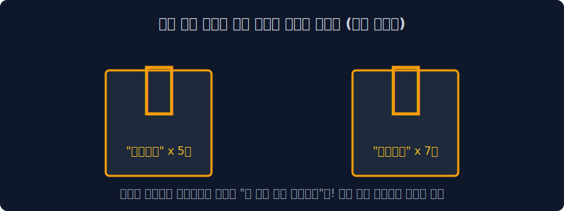
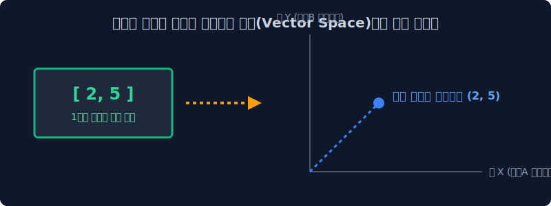
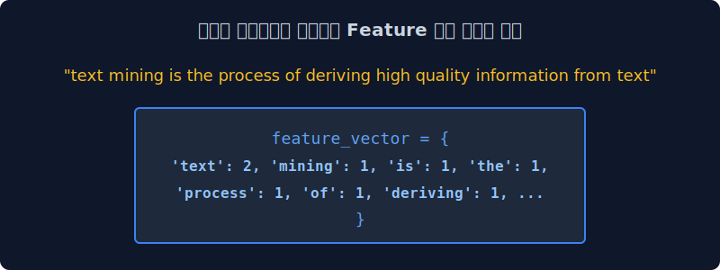

# 3.1 단어 임베딩의 기초: 카운트 기반 텍스트 표현

기계가 이 세상을 이해하기 위해 자연어를 아주 차가운 수학적인 공간(Vector Space)으로 맵핑하는 여정의 첫걸음을 뗍니다. 인공지능 역사상 가장 무식하지만 직관적인 수식인 '단어 빈도수(Count) 세팅'의 세계를 파헤쳐 봅시다.

---

## 3.1.1 단어의 숫자로의 변이 (Word to Mathematics)


> **"사과라는 글자가 이 문서에 3번 등장했네! 넌 이제부터 [3] 이다."** 

아름다운 인문학적인 문장을 차가운 수학 기호열(1차원 배열 벡터)로 바꾸어 기계의 뇌에 주사하는 통계 기반 모델링의 첫 시작입니다.

> [!NOTE]  
> **📖 초심자를 위한 쉬운 해설: 컴퓨터는 완전한 문맹이다**  
> AI는 한글이든 영어든 단어의 감정이나 뉘앙스는 절대 읽지 못합니다. 무조건 전기신호인 '숫자'로 바꿔줘야만 연산(덧셈, 곱셈)을 하고 딥러닝 미분을 수행할 수 있습니다. 
> 이번 3주차에서 배울 **'카운트 기반 방식'**은 문장 속 단어의 숨겨진 의미는 다 무시하고, 가장 단순무식하게 **"야, 이 단어가 몇 번 쓰였냐?"** 에 따라 가산 숫자를 부여하는 원초적인 고전 기술입니다.

---

## 3.1.2 글을 이해하는 방식 - 사람 (Human)


사람은 글을 읽을 때 문장의 왼쪽(앞)에서부터 오른쪽(뒤)으로 순서대로 단어들을 읽어가면서 문맥의 시계열적인 흐름과 화자의 뉘앙스, 숨겨진 비유 등을 자연스럽게 유기적으로 파악합니다. 이것은 인간 뇌의 대단히 고차원적인 지능 설계입니다.

---

## 3.1.3 글을 이해하는 방식 – 컴퓨터 (트랜스포머/LLM)


현대의 최첨단 딥러닝 LLM 모델(Chat GPT 등 트랜스포머 구조) 또한 사람과 묘하게 흉내를 냅니다. 문장 전체가 통째로 주어지면, 멀티-헤드 어텐션(Multi-Head Attention)이라는 거미줄을 쳐서 숨겨진 뉘앙스(Context)와 연결성을 공간적으로 파악하려고 미친 듯이 노력하며, 그 다차원 관계도를 거대한 숫자 행렬로 엮어냅니다.

> [!NOTE]  
> **🧠 멀티-헤드 어텐션(Multi-Head Attention)이란?**  
> 문장 속 단어들이 서로 어떤 연관성을 가지는지 **'여러 명의 특화구역 전문가(Head)'** 그룹이 동시에 다각도로 분석하는 주의력 집적 기법입니다.  
> 예를 들어 "배가 고파서 배를 먹고 배를 탔다"라는 문장이 주어지면:
> - 1번 전문가 패널은 **'신체 부위(생리적 상태)'**의 문맥을 집중적으로 추적하고,
> - 2번 전문가 패널은 **'먹을 수 있는 과일'**의 문맥을 색출하며,
> - 3번 전문가 패널은 **'해상 이동 수단'**의 교통 문맥을 각각 독립적으로 계산합니다.  
> 이렇게 여러 갈래의 전문가 시선을 마지막에 하나로 종합하여, 문장 구조 안에서 해당 단어가 지닌 복합적이고 다차원적인 진짜 의미를 입체적이고도 정확한 수학적 행렬로 구워내는 것이 트랜스포머 아키텍처의 위력입니다.

---

## 3.1.4 글을 이해하는 방식 – 고대 컴퓨터 (통계 기반 모델)



그러나 10년 전, 딥러닝 이전 시대의 전통적인 고전 통계 모델은 이럴 능력이 안 되었습니다. 문장이 주어지면 문법이나 순서는 모두 찢어버린 뒤, 오직 단어들이 **얼마나 자주 튀어나왔는가(단순 카운트 조회)** 만을 가지고 눈치껏 문서의 주제를 때려 맞추고자 시도했습니다.

> [!TIP]  
> **📖 초심자를 위한 쉬운 해설: 눈치 백단 무당 집계 방식**  
> 고전 통계 모델은 사실 책 내용을 안 읽습니다. "어... 이 100장짜리 문서 뒷조사를 해보니 `우울하다`는 단어가 70번, `주식차트`라는 단어가 40번, `파산납니다`가 20번 쓰였네? 앞뒤 문맥 뉘앙스는 하나도 모르겠지만 이건 100% 한강 주식 투자자의 슬픈 글이구나!" 라고 빈도수로 바로 진단을 내려버립니다. 화자의 의도나 순서는 놓치지만 계산 속도가 압도적으로 빨라서 당대에는 가성비가 훌륭했습니다.

---

## 3.1.5 카운트 기반 텍스트 표현 (수학적 공간)



이 눈치 백단 카운트 횟수표를 숫자로 이루어진 **벡터(Vector)** 괄호 묶음으로 만들어서 기하학적인 좌표계, 즉 점을 찍을 수 있는 **거대한 수학적 공간(Vector Space)** 으로 쏘아 올립니다.

$$ \mathbf{v} = [c_1, c_2, c_3, \dots, c_n] $$

여기서 $c_i$는 해당 사전에서 특정한 단어가 '등장한 빈도 횟수(Count)'를 뜻합니다. 이렇게 1차원 숫자들이 차곡차곡 담긴 배열 패키지를 수학에서는 **벡터(Vector)**라고 부릅니다. 이 벡터를 다차원 우주 공간 좌표계 어딘가에 점을 '딱' 하고 찍는 행위를 **매핑(Mapping)**이라고 합니다.

> [!NOTE]  
> **🌌 대체 왜 '배열'을 '수학적 공간(Vector Space)'으로 쏘아 올려야 하나요?**  
> 컴퓨터는 "사과" 문서와 "바나나" 문서가 비슷하다는 것을 한글 텍스트만 보고는 죽었다 깨어나도 알 수 없습니다. 하지만 각 문서를 구성하는 단어들의 등장 빈도수를 배열로 묶어 기하학적 공간에 `[x, y, z...]` 좌표 점으로 쏘아 올리게 되면, 놀라운 마법이 일어납니다!
> 
> 1. **컴퓨터가 '거리'를 잴 수 있게 됩니다:** 공간 좌표계에 점이 찍히면, '사과 문서'의 좌표와 '바나나 문서'의 좌표 사이의 물리적인 거리를 자(Ruler)로 정확히 잴 수 있습니다. 만약 두 점이 가까이 붙어있다면 컴퓨터는 "유레카! 두 문서는 주제가 매우 비슷하구나!" 하고 수학적으로 확신할 수 있습니다.
> 2. **'방향(각도)'을 알 수 있습니다:** 원점에서 공간의 점을 향해 뻗어나가는 두 화살표(벡터)의 사이 각도(코사인 유사도)를 측정하여 단어들의 쓰임새 방향성이 일치하는지 비교할 수 있습니다.
>
> 즉, 인문학적인 **'문맥의 유사성'**을 문맹인 기계가 직접 계산하고 비교할 수 있는 형태인 **'물리적인 좌표 거리와 각도'**로 완벽하게 치환해내기 위해, 거대한 허공(Vector Space)으로 배열을 쏘아 올리는 작업이 반드시 선행되어야만 하는 것입니다.

---

## 3.1.6 텍스트의 특성(Feature) 벡터 공간에 매핑하기



이 수학적 공간은 과연 어떻게 생겼을까요? 공간의 기준 축(Feature)은 우리가 수집한 **단어 사전(Vocabulary)** 전체 종류의 길이로 규정되며, 그 좌표축 공간으로 나아가는 칸막이 눈금 값은 단어가 텍스트에 나타나는 **절대적인 카운트 숫자**가 됩니다.

$$
\begin{array}{c|ccccc}
\text{문서 (Docs)} & \text{text} & \text{mining} & \text{process} & \text{apple} & \text{korea} \\
\hline
\text{Doc 1} & 2 & 1 & 1 & 0 & 0 \\
\text{Doc 2} & 0 & 0 & 0 & 5 & 1 \\
\text{Doc 3} & 1 & 1 & 1 & 1 & 0 \\
\end{array}
$$

### 1. 🐍 파이썬 딕셔너리 코드로 이해하기
실제 파이썬 코드 상에서는 각 단어가 키(Key)가 되고 횟수가 값(Value)이 됩니다.
문장: `"text mining is the process of deriving high quality information from text"`
```python
# 'text' 라는 단어는 위 문장에서 2번 등장했으므로 값(수학 우주 축 눈금)이 2를 갖게 됨.
# 나머지 단어들은 각각 1번씩만 언급되어 1을 가집니다.
feature_vector = {
    'text': 2, 'mining': 1, 'is': 1, 'the': 1, 'process': 1, 'of': 1, 
    'deriving': 1, 'high': 1, 'quality': 1, 'information': 1, 'from': 1
}
```

이런 식으로 각 단어의 카운트를 하나의 화살표 수치 패키지로 묶어 놓은 다음, 다른 글뭉치 패키지들과 서로 수학적인 유클리드 거리나 코사인 각도를 물리적으로 비교하며 문서 분류, 감성 분석 등을 해내는 것이 바로 원시적인 형태의 NLP 자연어 처리의 태동이었습니다.
