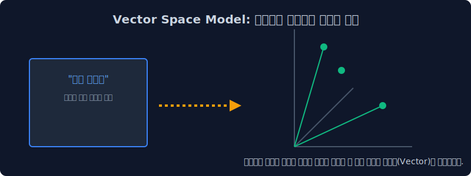
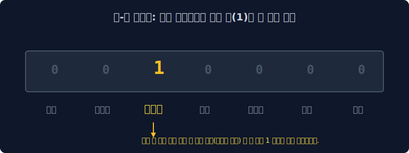
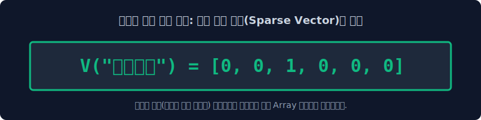
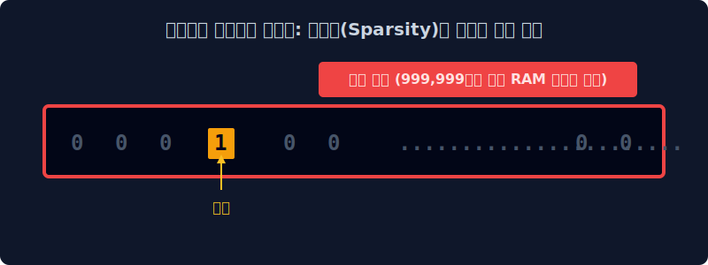

# 3.2 가장 단순한 치환: 원-핫 인코딩(One-hot)의 저주

단어를 기계가 읽을 수 있는 숫자로 바꾸기 위해 학자들이 맨 처음 생각해 냈던 가장 1차원적인 모델, 즉 원-핫 인코딩(One-hot Encoding)을 먼저 살펴봅니다. 알고리즘 구현이 너무나 쉽다는 장점 이면에 숨겨져 있는 메모리 폭발(Sparsity)이라는 치명적인 저주를 해부해 봅니다.

---

## 3.2.1 벡터 공간 모델 (Vector Space Model) 이란?

우리가 평소에 스마트폰으로 작성하는 이런 평범한 텍스트 문장들을 통계적으로 낱낱이 집계하여, 거대한 대수학 수학 공간 좌표계에 **'물리적인 화살표(Vector)'나 '좌표 점'** 으로 변환시켜 매핑하는 기법을 벡터 공간 모델이라고 부릅니다. 이 벡터를 컴퓨터 친화적으로 예쁘게 만들어내기 위해 대표적으로 원-핫 인코딩(One-hot), 백 오브 워즈(BoW), TF-IDF 등의 고전 NLP 기법들이 시대순으로 개발되었습니다.

오늘은 가장 오래된 통계 모델의 조상님을 만납니다.

---

## 3.2.2 원-핫 인코딩 (One-hot encoding)의 직관적 개념

원-핫, 즉 "자신의 번호 딱 하나에만 뜨겁게 불이 켜져 있다"는 직관적인 네이밍입니다. 
문서에 존재하는 모든 단어의 사전을 엑셀의 가로축 헤더로 기나길게 쭉 짜놓은 뒤, 자신을 뜻하는 딱 1개의 칸에만 전구 불(`1`)이 들어오게 하고 나머지 모든 칸은 철저하게 암전(`0`) 시키는 극단적인 1차원 할당 방식입니다.

$$
\begin{bmatrix}
\text{나} \\
\text{는} \\
\text{자연어} \\
\text{처리}
\end{bmatrix}
\implies
\begin{array}{c|cccc}
\text{Index 카운트} & \text{나} & \text{는} & \text{자연어} & \text{처리} \\
\hline
v(\text{나}) & \mathbf{1} & 0 & 0 & 0 \\
v(\text{는}) & 0 & \mathbf{1} & 0 & 0 \\
v(\text{자연어}) & 0 & 0 & \mathbf{1} & 0 \\
v(\text{처리}) & 0 & 0 & 0 & \mathbf{1} \\
\end{array}
$$

---

## 3.2.3 정수 희소 벡터 표현 (희박한 데이터 매핑)

내가 원하는 단어의 인덱스 칸에만 `1`을 켜고, 나머지 모든 우주 공간 단어 지점에는 모조리 블랙홀처럼 `0`을 때려 박아서 배열표(Array)를 만듭니다.

### 1. 전산학적 파이썬 변환 예시
문장: `"나는 자연언어 처리를 배운다"`
단어 사전 등록: `{'나': 0, '는': 1, '자연언어': 2, '처리': 3, '를': 4, '배운다': 5}`

이때 사전에 있는 '자연언어(인덱스번호 2)' 라는 단어를 원-핫 벡터 수식 구조로 통째로 바꾸어 선언하면 이렇게 됩니다.
$$ \mathbf{v}_{\text{자연언어}} = [0, 0, \textbf{1}, 0, 0, 0] $$
*(세 번째 칸에만 빛나게 `1`이 켜져 있고 나머지 좌우는 차가운 `0` 공간으로 덮여 수열을 유지합니다.)*

---

## 3.2.4 한계점: 단어 간의 기하학적 유사도(관계) 붕괴

원-핫 벡터는 단어마다 고유하고 독립적인 기하학적 수직 축(차원)을 쪼개서 하나씩 할당합니다.
우리가 아는 "강아지"와 "개"는 서로 의미가 완전히 동일한 단어지만, 원-핫 모델에게 이 둘은 그저 인덱스가 3번, 8번인 아예 생전 처음 보는 남남입니다. 컴퓨터 모델이 볼 때 "강아지"와 "개" 사이의 수학적 거리는, 뜬금없는 "강아지"와 "노트북" 사이의 거리와 똑같이 완벽하게 멉니다. 

기계 입장에서는 단어 간의 유의미한 관계 점수가 $0$도(직교, Orthogonal) 상태로 영락없이 붕괴되어 버립니다.

---

## 3.2.5 끔찍한 파국 (Sparsity)과 차원의 저주

원-핫 인코딩이 극단적으로 쉽고 단순함에도 불구하고, 오늘날의 모던 트랜스포머 혹은 딥러닝 언어 모델 설계에서 완전히 멸종된 이유는 바로 컴퓨터 메모리를 가차 없이 작살내는 기술적 특이점 때문입니다.

> [!CAUTION]  
> **📖 초심자를 위한 쉬운 해설: 우주 공간의 램(RAM) 낭비 폭발**  
> 전 세계 백과사전에 등재된 모든 영단어가 100만 개라고 슬쩍 가정해 봅시다. 제가 오늘 일기장에 제일 좋아하는 `'Apple (사과)'` 라는 단 한 단어를 데이터베이스에 저장하려 합니다.  
> 설계상 원-핫 인코딩 모델은 저 '사과' 단어 단 하나를 저장하기 위해서 **[0, 0, 0, ... 1, 0, ... 0]** 이라는 무려 100만 개의 칸(차원) 길이를 가진 거대한 데이터 기차를 메모리 시스템(RAM)에 강제로 풀 할당해서 그려버려야 합니다.  
> 
> 단 1개의 팩트 정보(`1`)를 빼고 무려 **99만 9999칸에는 죽을 때까지 아무 쓸모도 없는 불 꺼진 쓰레기 잉여 데이터(`0`)** 가 무한 증식하며 채워집니다. 단어 하나 저장하는데 메모리를 이렇게 초단위로 탕진해버리면(Sparse Vector의 차원의 저주 축적 현상), 아무리 수천만 원짜리 딥러닝 서버의 GPU 메모리라 할지라도 단 몇 분 만에 전부 다 터져버리고(OMM - Out of Memory) 말 것입니다.
