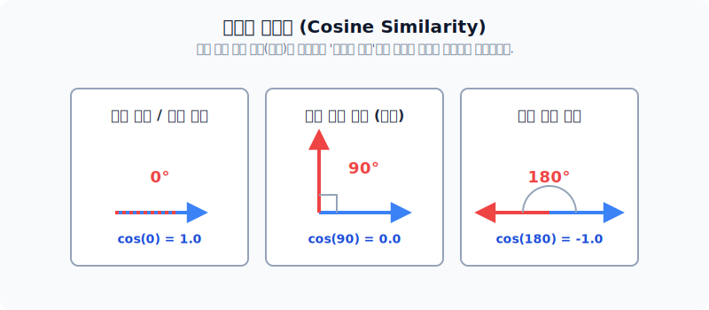
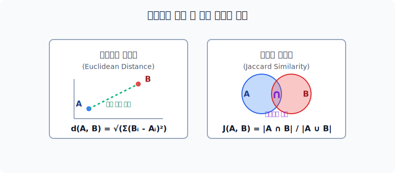

# TF-IDF와 텍스트 유사도 비교

단순히 전체 빈도수(Count)만을 측정했던 DTM 모델의 한계를 극복하기 위해, '이 단어가 얼마나 핵심적인지'를 수학적으로 정규화해 내는 범용적인 단어 가중치 기법이 바로 **TF-IDF**입니다. 변환된 벡터 공간 상에서 두 문서가 얼마나 비슷한지를 각도와 거리를 통해 연산하는 과정도 함께 다룹니다.

---

## 1. TF-IDF (Term Frequency - Inverse Document Frequency)

모든 문서에 등장하는 매우 흔한 단어(관사 'a', 조사 '은/는' 등)의 중요도에는 패널티를 주고, 특정 문서에만 자주 집중적으로 등장하는 단어에는 가산점을 주도록 수식을 조율한 기법입니다.

TF-IDF 수식은 이름 그대로 **TF**와 **IDF**의 곱셈으로 이루어집니다.

1. **TF (단어 빈도)**: 특정 문서 안에서 해당 단어가 얼마나 자주 등장했는가? (높을수록 중요)
2. **DF (문서 빈도)**: 전체 문서 집합 중에서 이 단어를 포함하고 있는 문서가 총 몇 개인가? (높을수록 진부함)
3. **IDF (역문서 빈도)**: DF 값을 역수로 뒤집고 로그를 씌운 값. (흔한 단어일수록 값이 0에 수렴하여 패널티 효과를 냄)

---

## 2. 텍스트 유사도 척도 (Similarity Metrics)

문서를 벡터로 표현하는 이유 중 가장 중요한 것은, 대수적 연산(연산자 작용)을 통해 문서 사이의 '유사도'를 수학적으로 검증하기 위함입니다. 

### 코사인 유사도 (Cosine Similarity)

자연어 처리에서 가장 빈번하게 이용되는 유사도 공식입니다. 벡터 공간에서 두 벡터가 가리키는 **'방향의 좁기(각도)'** 를 기준으로 유사도를 잽니다. 문서의 길이가 짧든 길든 상관없이 단어들의 성향과 비율만 일치하면 매우 비슷한 문서로 취급해 줍니다. 

*방향이 똑같으면 각도가 0도이므로 $\cos(0)=1$(가장 유사함), 90도 직각일 경우 완전히 독립적이므로 $\cos(90)=0$ (무관함)*

### 기타 유사도 기법들 (유클리드, 자카드)

- **유클리드 유사도 (Euclidean Distance)**: 중학교 수학에서 배우는 피타고라스 정리를 이용해 좌표평면 상의 두 점 사이의 실제 물리적 거리를 구하는 클래식한 방식입니다. 
- **자카드 유사도 (Jaccard Similarity)**: 벡터의 값을 무시하고 오직 '단어 집합' 모델로 봅니다. 두 문서가 겹치는 교집합 단어의 수를 두 문서가 가진 전체 단어 수(합집합)로 나눈 비율값입니다. (0~1 사이)

---

## 3. 실습 코드 요약 (Scikit-Learn 활용)

위의 모든 복잡한 TF-IDF 수식 연산 및 코사인 유사도 측정을 파이썬 기반 머신러닝 라이브러리인 `Scikit-Learn`을 사용하여 단 몇 줄의 코드로 구현할 수 있습니다. `TfidfVectorizer`나 `cosine_similarity` 같은 유틸리티들의 사용법은 실습 예제를 참고해주시기 바랍니다.
