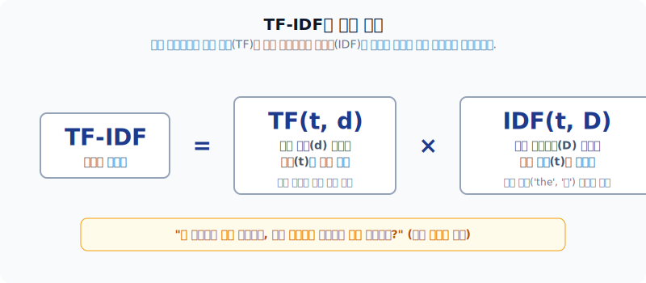
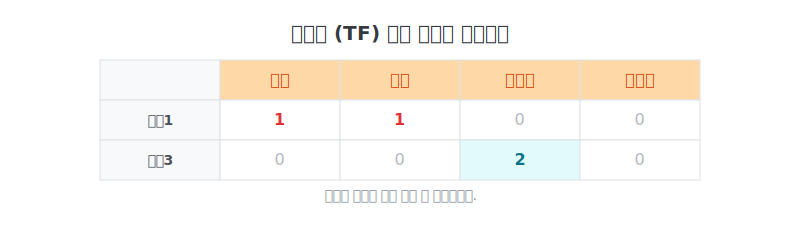
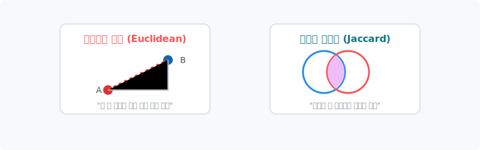

# TF-IDF 모델과 벡터의 유사도 계산 방정식

이 문서에서는 단순 카운트 기반(DTM)의 치명적인 단점을 수학적으로 완전히 제압하는 **TF-IDF 보정 방정식**과, 우주 공간(좌표축)에 뿌려진 문서 벡터들 간의 거리를 자로 재보는 **텍스트 척도(유사도)**를 아름다운 수학 공식과 함께 배웁니다.

---

## 00. TF-IDF와 텍스트 유사도
가장 무거운 단어, 핵심 정보를 수학적 저울에 올려놓고 걸러내는 모델입니다.

## 01. TF-IDF (Term Frequency-Inverse Document Frequency)
단어를 스코어링하는 가중치 기법 중 **가장 널리 쓰이는 매우 강력하고 대중적인 엔진**입니다.
* 모든 문서에 지겹게 나타나는 흔빠진 관사(`the`, `a`)에는 **가차 없이 매우 패널티**를 매깁니다.
* 반대로, 어쩌다 특정 문서 1개에서 유독 폭발적으로 자주 등장하는 단어라면 "너가 이 문서의 진짜 주인공이구나!" 라며 **아주 높은 보너스 점수**를 부여합니다.

## 02. TF-IDF의 수학적 연산 구조
이 식은 우리가 배울 TF 단어빈도 수식과 역문서빈도(IDF) 식을 단순히 서로 곱한 값입니다.

$$ \text{TF-IDF}(t, d, D) = \text{TF}(t, d) \times \text{IDF}(t, D) $$

(단어 $t$, 개별 문서 $d$, 전체 말뭉치 문서 집합 $D$)

## 03. 단어빈도 (Term Frequency, TF)
* **정의**: 특정 문서 $d$ 내부에서 특정 단어 $t$가 등장하는 절대 혹은 상대 카운트.

$$ \text{TF}(t,d) = f_{t,d} $$

## 04. 문서빈도와 역문서빈도 (DF / IDF의 마법)
이 파트가 바로 `the`, `a` 같은 잡음을 걸러내는 필터 공식의 핵심입니다.

* **DF (문서빈도)**: 총 100만 개 문서 중에서, 단어 $t$가 1번이라도 쓰여진 '문서들의 갯수'입니다. (이 수치가 높을수록 뻔한 단어)

$$ \text{DF}(t, D) = |\{ d \in D : t \in d \}| $$

* **IDF (역문서빈도)**: DF를 분모로 깔고 자연로그($\ln$)를 씌워버려서 패널티 보정값을 만들어냅니다.

$$ \text{IDF}(t, D) = \ln \left( \frac{N}{1 + \text{DF}(t, D)} \right) $$

> [!TIP]  
> **📖 초심자를 위한 쉬운 해설**  
> 분모에 뜬금없이 `+ 1`이 왜 있나요?   
> 만약 듣도보도 못한 외계어 단어가 들어와서 전체 문서 중에 등장 횟수가 `0`번이 찍히면, 분모가 `0`이 되는 순간 파이썬 프로그램엔 심각한 **Divide by Zero** 에러가 터지고 죽어버립니다! 이를 막아주기 위한 일종의 보험용 스무딩(Smoothing) 더하기입니다.

## 05. TF-IDF 행렬 결과 및 활용
각 단어 고유의 희소성(IDF) 보정값을 TF에 곱하면, 단순 빈도수 카운트표(DTM)에서는 가려졌던 진정으로 문서 특징을 식별할 수 있는 소수점 가중치가 완성됩니다.

## 06. 텍스트 유사성 척도 (Vector Similarity)
이제 텍스트를 모두 수학적인 벡터 화살표 $\mathbf{v}$ 로 치환했습니다. 기하학적 공간에 떠다니는 두 문서 벡터가 **얼마나 똑같은 의미를 가지는지('가까운지')** 실수(Float)로 뽑아내 볼 차례입니다.

## 07. 코사인 유사도 (Cosine Similarity)
자연어처리 분야에서 가장 압도적으로 많이 쓰이는 최고 존엄 유사도 판별법입니다.

$$ \text{Cosine}(A, B) = \cos(\theta) = \frac{\mathbf{A} \cdot \mathbf{B}}{\|\mathbf{A}\|\|\mathbf{B}\|} = \frac{\sum_{i=1}^{n} A_i B_i}{\sqrt{\sum_{i=1}^{n} A_i^2} \sqrt{\sum_{i=1}^{n} B_i^2}} $$

* 오직 두 문서 벡터가 향하는 '각도($\cos$)'의 방향만을 비교합니다.
* 똑같이 겹치면(0도) `1`, 아예 반대로 향하면(180도) `-1`을 반환합니다.

## 08. 문장 코사인 유사도 왜 좋을까? (길이 방어막)
`문서1 : 저는 사과 좋아요`
`문서3 : 저는 사과 좋아요 저는 사과 좋아요`

> [!IMPORTANT]  
> **📖 초심자를 위한 쉬운 해설**  
> 문서3은 사람으로 치면 말만 엄청 두 배로 많이 하는 앵무새일 뿐, 사실상 문서1과 의미성분 비율은 완전히 100% 똑같습니다!  
> 다른 거리 척도들(예: 직선을 재는 유클리드)은 문서3의 꼬리가 길다고 "음, 둘은 엄청 멀고 다른 문서네?" 라고 오판합니다.  
> 하지만 **코사인 유사도**는 **오직 방향의 비율(각도)만 쳐다보기 때문**에, 말의 길이에 절대 속지 않고 "너네 둘은 각도가 0도로 똑같네. 100% 일치(1.000) 문서!" 라며 정답을 가려냅니다. 이것이 NLP 깡패 기술인 이유입니다.

## 09. 여러 가지 거리 유사도 기법 비교
코사인 이외에도 다른 기하학적 수학 거리 공식들이 있습니다.

### 유클리드 (Euclidean) 유사도
* 우리가 중학교 수학 시간에 배운 피타고라스 직각삼각형 빗변(가장 짧은 직선 거리)을 구하는 공식입니다.
$$ d(\mathbf{A}, \mathbf{B}) = \sqrt{\sum_{i=1}^n (A_i - B_i)^2} $$

### 자카드 (Jaccard) 유사도
* 찌그러진 공간 좌표계를 쓰지 않고, 순수 **집합(Set)** 단위로 벤다이어그램을 그려 교집합 비율(A∩B / A∪B)을 재는 매우 직관적이고 가벼운 로직입니다.
$$ J(A, B) = \frac{|A \cap B|}{|A \cup B|} = \frac{|A \cap B|}{|A| + |B| - |A \cap B|} $$

## 10. 파이썬 코드 실습 안내
파이썬의 `scikit-learn` 라이브러리를 활용하면, 여러분은 저 복잡한 기하학적 수식(루트와 시그마)을 전혀 알지 못해도 단 두 줄 만에 수만 장의 텍스트를 `TF-IDF Matrix`로 변환할 수 있습니다!

`from sklearn.feature_extraction.text import TfidfVectorizer`

제공된 `Week_3_grad_text_representation.ipynb` 주피터 노트북 파일에서 직접 코드를 돌려보며 챗봇 응답 시스템을 설계해 보세요.
