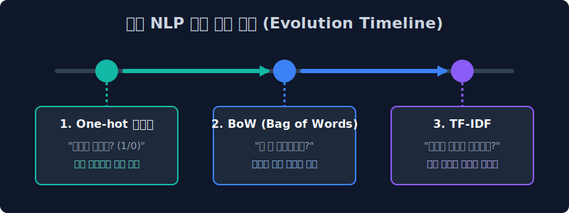
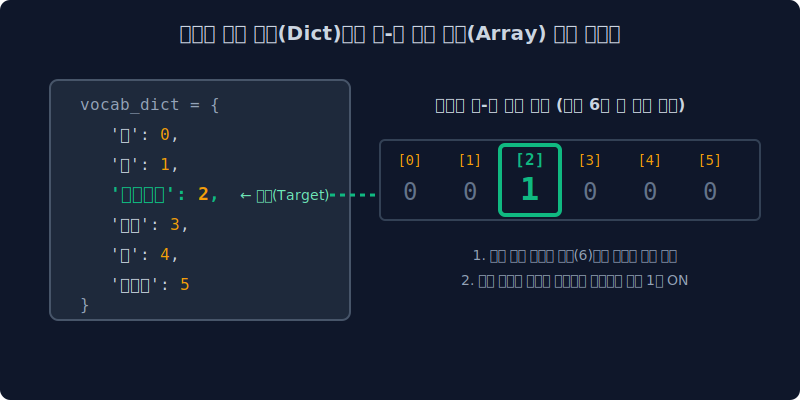

# 3.2 가장 단순한 치환: 원-핫 인코딩(One-hot)의 저주

단어를 기계가 읽을 수 있는 숫자로 바꾸기 위해 학자들이 맨 처음 생각해 냈던 가장 1차원적인 모델, 즉 원-핫 인코딩(One-hot Encoding)을 먼저 살펴봅니다. 알고리즘 구현이 너무나 쉽다는 장점 이면에 숨겨져 있는 메모리 폭발(Sparsity)이라는 치명적인 저주를 해부해 봅니다.

---

## 3.2.1 벡터 공간 모델 (Vector Space Model) 이란?

우리가 평소에 스마트폰으로 작성하는 이런 평범한 텍스트 문장들을 통계적으로 낱낱이 집계하여, 거대한 대수학 수학 공간 좌표계에 **'물리적인 화살표(Vector)'나 '좌표 점'** 으로 변환시켜 매핑하는 기법을 벡터 공간 모델이라고 부릅니다. 

이 벡터를 컴퓨터 친화적으로 예쁘게 만들어내기 위해 대표적으로 원-핫 인코딩(One-hot), 백 오브 워즈(BoW), TF-IDF 등의 고전 NLP 기법들이 시대순으로 개발되었습니다.

오늘은 가장 오래된 통계 모델의 조상님을 만납니다.

---

## 3.2.2 원-핫 인코딩 (One-hot encoding)의 직관적 개념

원-핫, 즉 "자신의 번호 딱 하나에만 뜨겁게 불이 켜져 있다"는 직관적인 네이밍입니다. 

문서에 존재하는 모든 단어의 사전을 엑셀의 가로축 헤더로 기나길게 쭉 짜놓은 뒤, 자신을 뜻하는 딱 1개의 칸에만 전구 불(`1`)이 들어오게 하고 나머지 모든 칸은 철저하게 암전(`0`) 시키는 극단적인 1차원 할당 방식입니다.

$$
\begin{bmatrix}
\text{나} \\
\text{는} \\
\text{자연어} \\
\text{처리}
\end{bmatrix}
\implies
\begin{array}{c|cccc}
\text{Index 카운트} & \text{나} & \text{는} & \text{자연어} & \text{처리} \\
\hline
v(\text{나}) & \mathbf{1} & 0 & 0 & 0 \\
v(\text{는}) & 0 & \mathbf{1} & 0 & 0 \\
v(\text{자연어}) & 0 & 0 & \mathbf{1} & 0 \\
v(\text{처리}) & 0 & 0 & 0 & \mathbf{1} \\
\end{array}
$$

> [!NOTE]  
> **💡 대체 왜 스위치처럼 자기 자신만 `1`로 켜는 방식을 쓰는 걸까요?**  
> 가장 큰 이유는 **'서열(가중치)의 착각'**을 방지하기 위해서입니다. 만약 사전에 있는 단어들에 억지로 출석 번호(사과=1, 바나나=2, 참외=3)를 매겨버린 배열을 만들면 어떻게 될까요? 기계는 수학의 무심한 본능대로 계산하므로 **"아하, 참외(3)는 사과(1)보다 3배 훌륭하고 무거운 과일이구나!"** 혹은 **"사과(1)랑 바나나(2)를 더하면 참외(3)가 만들어지네?"** 라는 말도 안 되는 오해를 해 버립니다.  
> 
> 인간의 실제 문법 세상에서 단어와 단어는 모두 평등하며 상하 크기의 우열 관계가 성립할 수 없습니다. 따라서 컴퓨터에게 **"모든 단어는 완전히 독립적이며 다른 단어와 절대로 섞이거나 연산되지 않는 평등한 남남이다"**라는 사실을 가장 완벽하게 못 박아 버리기 위해, 오로지 자신만의 고유한 1개의 스위치 방만 갖게 하고 본인이 출석했을 때 방 불을 `1(True)`로 켜주는 것입니다.

---

## 3.2.3 정수 희소 벡터 표현 (희박한 데이터 매핑)

내가 원하는 단어의 인덱스 칸에만 `1`을 켜고, 나머지 모든 우주 공간 단어 지점에는 모조리 블랙홀처럼 `0`을 때려 박아서 배열표(Array)를 만듭니다.

### 1. 전산학적 파이썬 변환 상세 과정

인공지능 코드를 짤 때 가장 먼저 구동시키는 **"텍스트를 숫자로 바꾸는 맵핑 작업"**의 실제 내부 동작을 들여다봅시다. 가장 먼저 코덱(Tokenizer 혹은 Dictionary)이 텍스트 문장을 쪼개서 고유 번호를 발급해 줍니다. 

문장: `"나 는 자연언어 처리 를 배운다"`

이 문장에서 발견된 6개의 단어 조각들은 컴퓨터 메모리의 단어 공간(Vocabulary Dictionary)에 다음과 같이 순차적으로 등재됩니다. 
*예시: `{'나': 0, '는': 1, '자연언어': 2, '처리': 3, '를': 4, '배운다': 5}`*

이제 코드가 `'자연언어'`라는 텍스트를 마주치면, 이를 데이터 베이스에 표현하기 위해 2단계 작업을 거칩니다.

1. **공간 전체 할당 (차원 선언):** 전체 사전에 등록된 단어의 총 개수(여기서는 6개)를 미리 살펴보고, 길이가 6인 모두 $0$으로 비어 있는 숫자 배열(깡통 공간)을 준비합니다. `[0, 0, 0, 0, 0, 0]`
2. **고유 인덱스 스위치 켜기 (One-Hot On):** 사전에서 찾은 나의 인덱스 번호인 **2번** 위치(배열은 0번부터 시작하므로 세 번째 칸)에만 정확히 접근하여 기존의 $0$을 버리고 $1$이란 전류를 흘려보냅니다. 

결과적으로 시스템 메모리에는 텍스트 글자는 모두 폐기되고 오직 아래와 같은 데이터 어레이 공간만 남게 됩니다.
$$ \mathbf{v}_{\text{자연언어}} = [0, 0, \textbf{1}, 0, 0, 0] $$

모든 단어의 배정 인덱스는 절대 겹치지 않도록 설계되기 때문에, 기계 상에서 각각의 단어들은 오직 자신만의 독립적인 좌표 구역을 개척하여 절대로 다른 단어들과 연산 상석에서 뒤섞이거나 오염되지 않음으로써 평등성을 유지합니다.

---

## 3.2.4 한계점: 단어 간의 기하학적 유사도(관계) 붕괴

원-핫 인코딩의 첫 번째 뼈아픈 한계는, 단어들의 '보이지 않는 의미적 연결고리(문맥)'를 수학적으로 완전하게 박살 내버린다는 점입니다. 원-핫 벡터는 무조건 단어 하나당 `서로 겹치지 않는 독립적인 수직 축(차원)`을 강제로 쪼개어 개방하기 때문입니다.

이를 이해하기 위해 인간의 언어 체계를 떠올려 봅시다. 

우리가 익히 아는 **"강아지"** 와 **"개"** 는 사실상 똑같은 동물을 지칭하는 일란성 쌍둥이 같은 유의어입니다. 하지만 원-핫 모델의 무심한 시스템 안에서 이 둘은, 그저 주소 번표(인덱스)가 `3번`과 `8번`으로 다르게 배정된 완전한 철천지원수(남남)일 뿐입니다. 

### 📐 왜 기계는 "강아지"와 "개"가 통한다는 걸 모를까?

기하학적 공간에서 두 단어를 나타내는 화살표(Vector)가 "서로 얼마나 의미가 유사한가?"를 측정하려면, 본질적으로 두 배열 사이의 곱셈인 **내적(Dot Product)** 을 진행하거나 `코사인 각도`를 측정해야 합니다.

* $\mathbf{v}_{\text{강아지}} = [0, 0, \textbf{1}, 0, 0, 0, 0, 0, 0]$
* $\mathbf{v}_{\text{개}} \;\;\quad= [0, 0, 0, 0, 0, 0, 0, \textbf{1}, 0]$
* $\mathbf{v}_{\text{노트북}} = [0, \textbf{1}, 0, 0, 0, 0, 0, 0, 0]$

여기서 어떤 두 벡터를 골라잡아 수직 쌍으로 곱셈(내적 계산)을 시도하더라도, 절대로 $1$과 $1$이 서로 같은 칸에서 맞물려 곱해지는 경우는 우주가 멸망할 때까지 단 한 번도 발생하지 않습니다. 언제나 교차 곱의 합산 결과는 $0$ 이 나오기 마련입니다.

수학적으로 벡터 내적 값이 **$0$** 이라는 뜻은, 거대한 우주 공간상에서 두 화살표가 완벽하게 90도로 엇갈려 있는 **직교(Orthogonal)** 상태라는 것을 의미합니다. 

결과적으로 컴퓨터 모델이 통계적으로 분석해 볼 때 "강아지" 와 "개" 사이의 유사도 점수는, 전혀 뜬금없는 "강아지" 와 "노트북" 사이의 무관도 수치($0$점)와 완벽히 똑같게 산출됩니다. 애써 인문학적으로 엮어놓은 단어 간의 **유의미한 관계망과 문맥적 결합도가 '직교($0$)' 상태로 영락없이 증발 및 붕괴**해 버리고 마는 것입니다.

---

## 3.2.5 데이터의 희소성(Sparsity) 문제와 차원의 저주

원-핫 인코딩은 구현 알고리즘이 매우 단순하고 직관적이라는 장점이 있으나, 현재의 거대한 트랜스포머 언어 모델과 최신 딥러닝 설계에서는 거의 사용되지 않습니다. 그 주된 이유는 **메모리 공간의 극심한 비효율성**과 **데이터의 희소성(Sparsity)** 문제 때문입니다.

> [!CAUTION]  
> **💡 메모리 낭비와 차원의 저주 (Curse of Dimensionality)**  
> 실제 대규모 자연어 처리 환경에서 컴퓨터가 인식해야 하는 애플리케이션 전체 단어 사전(Vocabulary)의 크기가 약 100만 개라고 가정해 보겠습니다.  
> 원-핫 인코딩 방식의 규칙에 따르면, 우리가 `'Apple (사과)'`라는 단 한 개의 단어 정보를 메모리에 올리기 위해서 길이 100만 짜리의 거대한 1차원 숫자 배열을 시스템(RAM)에 강제적으로 할당해야만 합니다.
> 
> 이 할당된 배열의 세부를 살펴보면, 오직 1개의 고유 인덱스 칸에만 유의미한 데이터인 `1`이 기록되며, **나머지 99만 9999개의 칸은 컴퓨팅 측면에서 연산에 하등 도움을 주지 않는 `0`으로 채워지게 됩니다.** 이렇게 전체 벡터 공간 내에서 극히 일부의 인덱스만 0이 아닌 값을 가지고, 대다수의 값이 0으로 채워진 데이터를 **희소 벡터(Sparse Vector)** 라고 부릅니다.
> 
> 수백만 개의 문장 텍스트로 이루어진 대용량 코퍼스(Corpus)를 오직 이 희소 벡터 형태만으로 변환하여 신경망을 학습시킬 경우, 기하급수적으로 팽창한 0 값 매트릭스에 대한 불필요한 행렬 곱셈 연산으로 인해 시스템은 심각한 클럭 소모와 공간 복잡도(Space Complexity) 증가를 겪게 됩니다. 결국, 아무리 훌륭한 고성능의 GPU 컴퓨팅 자원이라 할지라도 지속적으로 누적되는 고차원 벡터의 메모리 한계를 극복하지 못하고 치명적인 메모리 부족(OOM: Out Of Memory) 오류에 직면하게 되며, 이를 컴퓨팅 영역에서 **'차원의 저주'**라고 통칭합니다.
