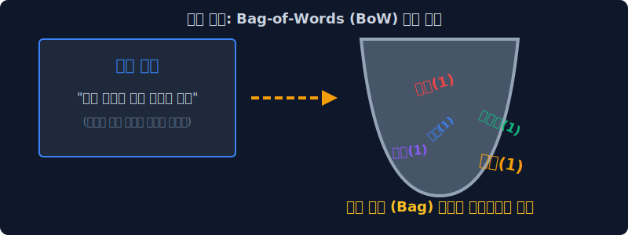
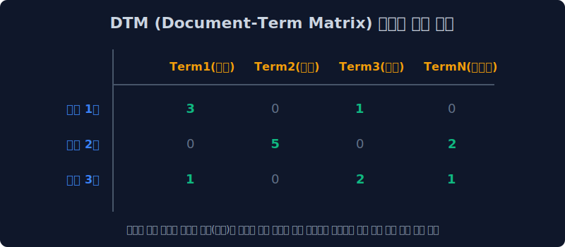
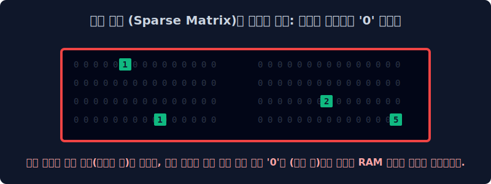

# 3.3 문법 파괴자 Bag-of-Words(BoW)와 DTM 문서 행렬

원-핫 인코딩이 단어 1개를 작은 공간 좌표(점) 하나로 치환했다면, 이제 기계가 100페이지에 달하는 기나긴 텍스트 문서를 통째로 하나의 거대한 숫자 묶음 수열로 압축하는 방식을 배웁니다. 이것이 고전 통계학 기반 자연어 처리(NLP)의 상징인 BoW(Bag-of-Words) 사상의 시발점입니다.

---

## 3.3.1 백 오브 워즈 (Bag-of-Words, BoW) 란?

글자 그대로 단어들이 마구잡이로 들어있는 '가방(Bag)' 이라는 뜻입니다.
가장 큰 특징은 단어들이 문서에 등장하는 **순서, 문법적 구조, 뉘앙스는 완전히 가차 없이 파괴(개무시)하고**, 오직 그 단어의 **절대적 출현 빈도수 수치(Count)** 만을 집계해서 수학 벡터(Vector)로 표기하는 방식입니다. 단순 무식해 보이지만 통계적 관점에서는 구조가 압도적으로 직관적이고 강력합니다.

> [!WARNING]  
> **📖 초심자를 위한 쉬운 해설: 폭력성 100% 검은 쓰레기 봉투**  
> "나는 사과가 너무 달아서 싫다" 라는 문장이 있습니다. 사람에게 여기서 가장 중요한 건 주어와 목적어, 부정어의 완벽한 조립(문법)입니다.  
> 하지만 BoW 모델은 명사와 동사를 거대한 검은색 쓰레기 봉투(Bag) 안에 싹 다 쓸어 담고 마구마구 흔들어 섞어버립니다. 문법 질서가 완전히 붕괴됩니다. 그리고 봉투 안에서 손을 쓱 집어넣어 단어표를 하나씩 꺼내보며 **"어? 빨간색 단어 딱지 3개 나왔네. 파란색 단어 딱지는 2개네. 분석 끝!"** 하고 빈도수 숫자만 잽싸게 세고 치워버리는 매우 거친 분석 형태입니다.

---

## 3.3.2 백 오브 워즈 (BoW) - 문서의 강력한 수치 압축

원-핫 인코딩은 고작 단어 1개 밖에 표현을 못했지만, BoW는 100페이지짜리 책 한 권 전체, 혹은 웹사이트 한 페이지 전체의 방대한 내용을 **단 하나의 1차원 벡터(Vector) 수열 괄호**로 예쁘고 콤팩트하게 압축시켜 줍니다.

$$ \text{Book Vector (1권)} = [6, 3, 2, 0, 1, \dots, 5] $$
*(사전의 각 가나다 순서별로 1번 단어가 6번 등장, 2번 단어 `사과`가 3번, 3번 단어가 2번... 등장했다는 의미의 거대한 문서 카운트 수식의 완성)*

이 카운트 숫자가 배열된 형태(밀도)를 쳐다보고 비슷한 패턴을 가진 문서를 유저에게 추천해 주는 다소 원시적인 알고리즘이 바로 과거 넷플릭스와 유튜브 초창기의 '콘텐츠 기반 추천 시스템' 코어 원리였습니다.

---

## 3.3.3 문서-단어 행렬 (Document-Term Matrix, DTM) 이란?

BoW로 만들어낸 벡터(책 한 권)를 여러 권 가져오면 어떻게 될까요? 가로와 세로 축이 존재하는 거대한 엑셀 표기판(2차원 행렬)이 마침내 탄생합니다.
다수의 수만 개 문서(Document)를 세로축(행, Row)으로, 각 사전의 모든 수십만 개 단어(Term)들을 가로축(열, Column)으로 끝없이 도열시킨 뒤 교차하는 지점에 출현 카운트를 입력하는 **거대 2차원 행렬(Matrix) 수학 엑셀표**입니다.

위의 DTM 매트릭스는 대수학 수학 기호 공식으로 다음과 같이 표기됩니다.
$$
D = 
\begin{pmatrix}
1 & 0 & 2 & \cdots & 0 \\
0 & 3 & 1 & \cdots & 1 \\
\vdots & \vdots & \vdots & \ddots & \vdots \\
0 & 0 & 5 & \cdots & 2 
\end{pmatrix}
$$

---

## 3.3.4 DTM의 엄청난 한계점 - 공간적 낭비 (희소 행렬의 저주)

DTM은 얼핏 보기에 너무나 체계적이고 완벽히 정돈된 빅데이터 통계 테이블 같지만, 원-핫 인코딩 모델과 똑같은 치명적인 메모리 저주를 피할 수 없습니다.

전 세계 모든 사용 가능한 영단어가 10만 개라고 가정해 봅시다. 수학 행렬의 규칙상 가로축 열(Column)은 무조건 언제나 10만 칸으로 고정되어야만 합니다. 그런데 오늘 제가 친구에게 쓴 짧은 이메일(문서 1줄)에는 단어가 딱 50종류만 쓰였습니다. 

> [!CAUTION]  
> **📖 공간의 파괴범: 희소성 폭격 (Sparsity Curse)**  
> DTM은 규격을 수학적으로 임의로 줄이거나 어길 수 없으므로, 메일 한 통을 저장하기 위해 무조건 RAM(메모리) 상에 10만 칸짜리 DTM 보드 한 줄을 통째로 띄워야 합니다!!!  
> 딱 50개의 칸엔 카운팅 숫자가 반짝거리겠지만, 옆에 있는 무려 99,950개의 엑셀 빈칸에는 **영원히 쓰지 않을 거대한 암흑물질 `0`** 들이 끝없이 채워지며 블랙홀처럼 빈 데이터를 유지합니다. 
> 
> 이는 연산 속도를 박살 내고 컴퓨터 DB 용량을 미친 듯이 갉아먹는 치명적 시스템 타격(Sparsity 문제)을 개발자에게 안겨줍니다.

이뿐만이 아닙니다. 단순히 `0`을 메모리로 버티는 기술적 문제 외에도, 버젓이 숫자가 적혀 있는 의미 있는 칸(`1, 2, 3..`) 마저도 통계적 관점에서 너무나 치명적인 맹점이 숨어 있습니다. 다음 장(지프의 법칙)에서 그 최악의 오류를 두 눈으로 확인해 보겠습니다.
