# 문법 파괴자 Bag-of-Words(BoW)와 DTM 문서 행렬

원-핫 인코딩이 단어 1개를 점 하나로 치환했다면, 이제 기계가 100페이지에 달하는 기나긴 텍스트 문서를 하나의 거대한 숫자의 묶음으로 압축하는 방식을 배웁니다. 이것이 NLP 고전 통계학의 상징인 BoW(Bag-of-Words) 사상입니다.

---

## 00. 백 오브 워즈 (Bag-of-Words, BoW) 란?
글자 그대로 단어들이 마구잡이로 들어있는 '가방(Bag)' 이라는 뜻입니다.
단어들이 문서에 등장하는 **순서, 문법, 느낌은 완전히 깡그리 개무시**하고, 오직 그 단어의 **출현 빈도수 수치**만 세어서 벡터(화살표)로 표현하는, 무식하지만 압도적으로 강력한 기법입니다.



> [!WARNING]  
> **📖 초심자를 위한 쉬운 해설: 폭력성 100% 가방**  
> "나는 사과가 너무 달아서 싫다" 라는 문장이 있습니다. 여기서 사람에게 중요한 건 주어와 목적어의 조립(문법)입니다.  
> 하지만 BoW 모델은 명사와 동사를 거대한 검은색 쓰레기 봉투(Bag) 안에 싹 다 쓸어 담고 마구마구 흔들어 섞어버립니다. 문법 질서가 완전히 파괴됩니다. 그리고 봉투 안에서 손을 쓱 집어넣어서 꺼내보며 **"어? 빨간색 단어 3개 나왔네. 파란색 단어는 2개네. 통계 끝!"** 하고 숫자만 잽싸게 세고 분석을 치워버리는 형태입니다.

## 01. 백 오브 워즈 (BoW) - 문서의 압축 표현
원-핫 인코딩은 단어 1개 밖에 표현을 못했지만, BoW는 100페이지짜리 책 한 권 전체 내용을 단 하나의 벡터(Vector) 수열 괄호로 예쁘게 압축시켜 줍니다.

$$ \text{Book Vector} = [6, 3, 2, 0, 1, \dots, 5] $$
*(사전의 각 순서별로 `The`가 6번 등장, `red`가 3번, `dog`가 2번... 등장했다는 의미, 거대한 문서 벡터 수식 완성)*

이 카운트 숫자의 밀도를 쳐다보고 비슷한 문서를 추천해 주는 알고리즘이 바로 넷플릭스와 유튜브 초창기의 추천 알고리즘의 원리였습니다.

## 02. 문서-단어 행렬 (Document-Term Matrix, DTM) 이란?
BoW로 만들어낸 벡터(책 한 권)를 여러 권 가져오면 어떻게 될까요? 가로와 세로가 있는 거대한 엑셀 표기판(행렬)이 탄생합니다.
다수의 문서(Document)를 세로축으로, 각 사전의 모든 단어(Term)들을 가로축으로 도열시킨 뒤 카운트를 입력하는 **2차원 행렬(Matrix) 수학 엑셀표**입니다.

```math
\begin{array}{r|ccccc}
\text{DTM 행렬} & \text{Term}_1 & \text{Term}_2 & \text{Term}_3 & \cdots & \text{Term}_N \\
\hline
\text{Document}_1 & 3 & 0 & 1 & \cdots & 0 \\
\text{Document}_2 & 0 & 1 & 0 & \cdots & 5 \\
\vdots & \vdots & \vdots & \vdots & \ddots & \vdots \\
\text{Document}_M & 1 & 0 & 2 & \cdots & 1 \\
\end{array}
```

$$
D = 
\begin{pmatrix}
1 & 0 & 2 & \cdots & 0 \\
0 & 3 & 1 & \cdots & 1 \\
\vdots & \vdots & \vdots & \ddots & \vdots \\
0 & 0 & 5 & \cdots & 2 
\end{pmatrix}
$$
*(세로 라인은 문서1, 문서2, 문서3... 이고 괄호 안의 숫자는 해당 단어가 문서 안에서 몇 번 외쳐졌는지를 뜻합니다.)*

## 03. DTM의 엄청난 한계점 - 공간적 낭비 (희소 행렬의 저주)
DTM은 얼핏 보기에 너무나 체계적인 빅데이터 테이블 같지만, 원-핫 인코딩과 똑같은 치명적인 저주를 피할 수 피할 수 없습니다.

전 세계 모든 영단어가 10만 개라고 해봅시다. 가로축 열(Column)은 무조건 규칙상 10만 칸이 되어야 합니다. 그런데 오늘 제가 쓴 짧은 메일(문서 1줄)에는 단어가 딱 50종류만 쓰였습니다. 


> [!CAUTION]  
> **📖 초심자를 위한 쉬운 해설 (희소성 폭격)**  
> DTM은 규격을 수학적으로 어길 수 없으므로 무조건 메모리 상에 10만 칸짜리 DTM 보드를 띄워야 합니다!!!  
> 50개의 칸엔 제가 쓴 단어가 숫자로 적혀서 반짝거리겠지만, 옆에 있는 무려 99,950개의 엑셀 칸에는 영원히 쓰지 않을 **거대한 암흑물질 `0`** 들이 끝없이 복사되며 빈칸을 유지합니다. 컴퓨터 램(RAM)과 DB 용량을 미친 듯이 갉아먹는 치명타(Sparsity)를 입힙니다.

이뿐만이 아닙니다. 단순히 `0`을 버티는 것 외에도, 숫자가 적혀 있는 의미 있는 칸(`1, 2, 3..`) 마저도 치명적인 통계적 맹점이 숨어 있습니다. 다음 장에서 그 오류를 확인해 보겠습니다.
