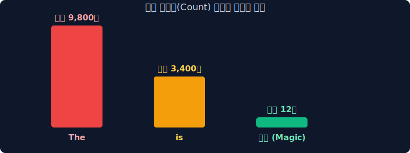
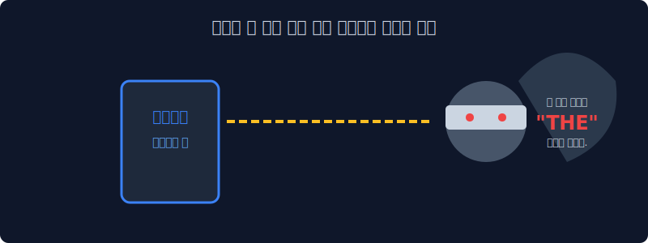
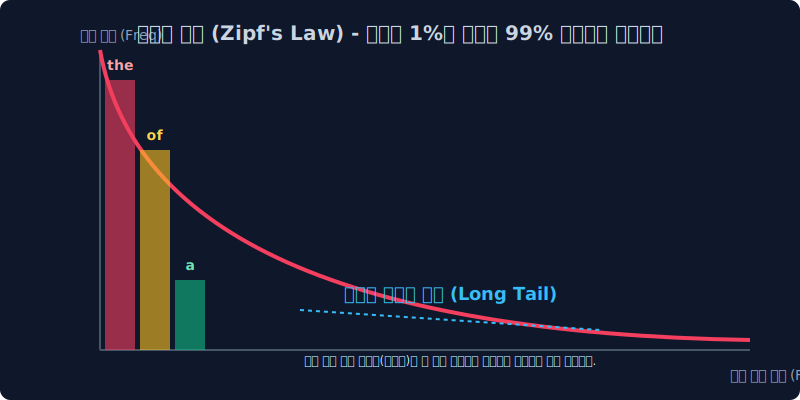
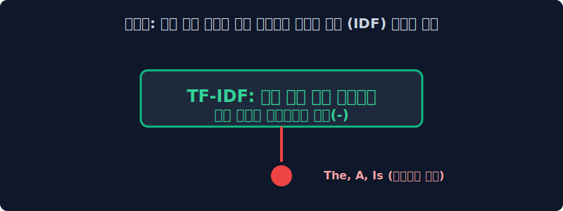

# 3.4 무적의 관사와 지프의 법칙 (Zipf's Law) 오류

단어 가방(Bag-of-Words)과 DTM 행렬 안의 숫자(출현 빈도수)가 높다고 무조건 그 문서에서 가장 중요한 "핵심 단어" 정답일까요? 천만의 말씀입니다. 단순하게 카운트만 절대값으로 믿어버리면 영어 발음 기호나 스팸 단어가 전체 지능 시스템의 분석망을 삼켜버리는 최악의 통계적 오류(Zipf's Law) 현상을 상세히 파헤칩니다.

---

## 3.4.1 빈도수(Count) 분석의 치명적 속임수

인간의 논리적 상식으로 문서 안에서 가장 많이 쓰인 단어(빈도수 1위)는 당연히 그 책에서 가장 중요한 주제어(Keyword) 여야만 합니다. 초창기 컴퓨터 공학자들도 똑같이 '단순 무식한 단어 랭킹(Count)' 기준으로 문서를 쪼개려 했습니다. 

그러나 막상 DTM 엑셀표를 빈도수 최상위 기준으로 정렬해 뚜껑을 열어보면, 컴퓨터의 입술에서 아무 짝에도 쓸모없는 기괴한 결론이 튀어나오게 됩니다.

---

## 3.4.2 무적의 영어 문법 관사: "The, A, Is" 의 독식

기계에게 **"해리포터 1권 전체를 스캔해서 가장 많이 나온 핵심 단어(최상위 랭킹)가 뭐야? 당연히 마법(Magic)인가?"** 물어봤더니, 기계가 당당하게 대답합니다. 

> **"해리포터의 핵심 주제어 1위는 `The` 이고, 2위는 `A` 이고, 3위는 `Is` 입니다 삐리릿!"** 

영어 등 모든 자연어의 문법 특성상 문장을 이어붙이기 위한 전치사, 접속사, 관사(`The`, `A`, `of`, `to`)가 다른 일반 단어보다 무려 수십 배는 더 많이 쓰일 수밖에 없습니다.
따라서, 과거의 '순수 카운팅 집계' 기술만으로는 절대 `magic(마법)`이나 `wand(지팡이)`처럼 우리에게 진짜로 필요한 영양가 있는 핵심 단어를 상위 랭크(Top rank)로 건져 올릴 수 없습니다.

---

## 3.4.3 자연어의 통계적 숙명: 지프의 법칙 (Zipf's Law)

세상의 모든 언어는 아주 묘하게도 경제학의 부의 불평등 구조(파레토 법칙)를 완벽하게 닮아 있습니다. 소수의 아주 흔한 문법 상위 단어 몇 개가, 전체 텍스트 대화 빈도의 80~90% 이상을 꿀꺽 탐욕스럽게 집어삼킵니다. 이를 언어학에서는 **롱테일(Long Tail) 법칙, 더 정확히는 지프의 법칙(Zipf's Law)** 이라고 정의합니다.

지프의 법칙의 수식적 특성: 단어의 출현 빈도 $f$는 그 빈도 순위 $r$에 반비례합니다.
$$ f(r) \propto \frac{1}{r} $$

* **최상위 1% 포식자 집단** : `I`, `you`, `the`, `is`, `a` (그 어떤 책이나 논문을 뒤져도 언제나 빈도수 1~10위를 싹쓸이하는 쓰레기 스팸 단어들)
* **보이지 않는 99%의 롱테일(Long Tail)** : `데이터베이스`, `인공지능`, `마법사` 등등. 절대적 빈도수는 1~3번 출현으로 압도적으로 낮지만, 해당 문서의 정체성을 완벽히 규정하는 찐(진짜) 핵심 황금 단어들입니다. 이들은 그래프의 평평한 긴 꼬리 끝자락에 먼지처럼 수만 개 깔려 있습니다.

---

## 3.4.4 지프의 늪에 빠진 컴퓨터의 슬픔과 해결책의 여명

이 지프의 늪을 방치한다면 컴퓨터는 평생 진짜 핵심 단어를 못 찾고, 영원히 "모든 문서의 핵심 내용은 `The` 입니다" 라는 멍청한 분석 결과만 뱉어낼 것입니다.
방대한 빅데이터 늪 속에서 시끄러운 문법 소음(**불용어, Stop words**)들을 기계적으로 싹 다 발라내 없애버려야만 합니다. 

> [!TIP]  
> **📖 천재 알고리즘의 탄생: 어떻게 무적의 관사를 끌어내릴까?**  
> `The` 나 `A` 라는 단어의 치명적 약점이 무엇일까요? 바로 **"세상의 모든 책, 모든 웹문서에 개나 소나 너무나도 골고루 아주 많이 등장한다!!"** 라는 성질입니다.  
> 
> 반대로 `트랜스포머` 라는 황금 단어의 특징은? **"특정 컴퓨터 공학 논문(단 1권) 안에서만 혼자 미친 듯이 튀게 등장하고, 나머지 99만 권의 요리책이나 소설책에서는 평생 아예 한 번도 등장하지 않는다!"** 가 됩니다.  
>  
> 이 성질을 간파한 데이터 마이닝 학자들은 아주 기발한 결론을 도출합니다.  
> **"세상 모든 책(문서 전체)에 두루두루 다 개근해서 등장하는 단어는 쓸데없는 스팸 문법 단어임이 확실하니까, 역으로 무자비한 벌점(패널티)을 산술적으로 먹여 버리자!!!"**

이 기발한 역발상을 통해 탄생한 인류 최고의 자연어 가중치 통계 방정식이 바로 다음 섹션에서 배울 전설적인 **TF-IDF (Term Frequency-Inverse Document Frequency) 패널티 모델**입니다.
