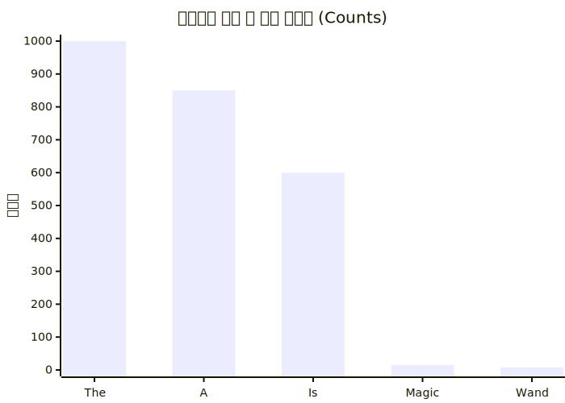

# 무적의 관사와 지프의 법칙 (Zipf's Law) 오류

BoW와 DTM 행렬 안의 숫자(조회수)가 높다고 무조건 그 문서의 중요한 "핵심 단어"일까요? 천만의 말씀입니다. 단순하게 카운트만 믿어버리면 영어 발음 기호나 스팸 단어가 전체 지능 시스템의 분석망을 삼켜버리는 오해석(Zipf's Law) 현상을 배웁니다.

---

## 00. 빈도수(Count) 분석의 치명적 속임수
사람의 상식으로 문서 안에서 많이 쓰인 단어는 그 책에서 가장 중요한 주제어(Keyword) 여야만 합니다. 컴퓨터 역명도 마찬가지로 문서 안에서 가장 점수(빈도)가 높은 단어를 뽑아 유저에게 제시하게 됩니다.
그런데 막상 DTM 엑셀표를 빈도수 1위 기준으로 정렬해 보면, 컴퓨터의 입술에서 기괴한 헛발질이 튀어나옵니다.

## 01. 무적의 영어 관사: "The, A, Is" 의 독식
기계에게 **"해리포터 1권에서 가장 많이 나온 핵심 단어(최상위 랭킹)가 뭐야? 마법인가?"** 물어봤더니, 기계가 당당하게 대답합니다. 

> **"해리포터의 핵심 주제어 1위는 `The` 이고, 2위는 `A` 이고, 3위는 `Is` 입니다!"** 

영어 문법 특성상 접속사나 관사가 미친 듯이 많이 쓰이기 때문에, 단순 빈도수 집계로는 절대 `magic(마법)`이나 `wand(지팡이)` 같은 영양가 있는 핵심 단어가 상위권에 오르지 못합니다!

## 02. 자연어의 통계적 숙명: 지프의 법칙 (Zipf's Law)
세상의 언어는 아주 묘하게도 경제학의 부의 불평등 구조처럼, 소수의 상위 단어 몇 개가 전체 대화 빈도의 80% 이상을 꿀꺽 탐욕스럽게 먹어 치웁니다. 이를 **롱테일(Long Tail) 법칙, 또는 지프의 법칙**이라고 부릅니다. 

* **상위 1% 포식자** : `I`, `you`, `the`, `is`, `a` (그 어떤 책을 뒤져도 항상 빈도수 1~10위를 모조리 싹쓸이함)
* **하위 99% 롱테일** : `데이터베이스`, `인공지능`, `마법사` 등 빈도수는 낮지만 진짜로 우리가 찾고자 했던 황금 같은 핵심 단어들

## 03. 지프의 늪에 빠진 컴퓨터의 슬픔
이대로라면 컴퓨터는 평생 핵심 단어를 못 찾고, 영원히 "모든 문서의 핵심 내용은 `The` 입니다" 라는 바보 같은 소리만 반복하게 됩니다.
빅데이터 속에서 쓰레기 시끄러운 소음(불용어, Stop words)들을 발라내야만 합니다. 

> [!TIP]  
> **📖 초심자를 위한 쉬운 해설: 어떻게 무적의 관사를 끌어내릴까?**  
> `The` 나 `A` 라는 단어의 특징이 무엇일까요? 바로 **"세상의 모든 책에 너무나도 골고루 아주 많이 등장한다!!"** 라는 성질입니다.  
> 반대로 `인공지능` 이라는 단어의 특징은? **"특정 컴퓨터 공학 책(1권)에서만 유독 튀게 등장하고, 나머지 요리책이나 소설책에서는 아예 한 번도 등장 안 한다!"** 입니다.  
>  
> 따라서 천재 학자들은 아주 기발한 결론을 내립니다.  
> **"모든 책(문서) 전체에 두루두루 다 등장하는 단어는 쓸데없는 스팸 흔한 단어(불용어)니까 무조건 감점을 시켜서 패널티를 줘버리자!!!"**

그렇게 탄생한 인류 최악의 문서 가중치 치환 수학 공식이 바로 이 다음 장에 이어질 저 유명한 **TF-IDF (Term Frequency-Inverse Document Frequency) 패널티 공식**입니다.
