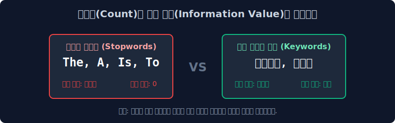
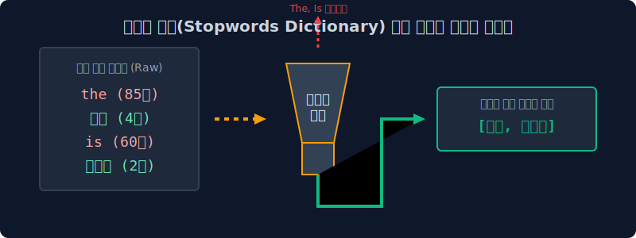
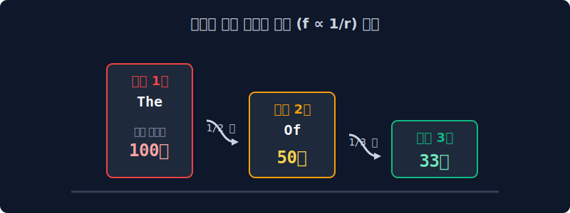
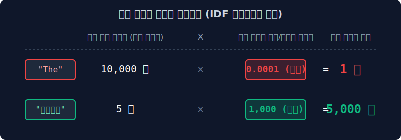

# 3.4 카운트 기반 모델의 한계와 지프의 법칙 (Zipf's Law)

앞서 살펴본 Bag-of-Words(BoW)와 DTM 시스템은 단순히 특정 문서 내에서 단어의 출현 최다 빈도수(Count)가 높을수록 해당 단어의 '중요도'가 크다고 평가하는 절대적 수치 통계 모델입니다. 

그러나 이 단순한 논리적 전제에는 기계 학습 모델 전체의 분석망을 마비시키는 치명적인 통계적 함정이 도사리고 있습니다. 

이번 장에서는 자연어 자체가 역사적으로 가지고 있는 `본질적인 불균형성`인 **지프의 법칙(Zipf's Law)** 현상을 상세히 파헤치고, 빈도수 모델의 모순을 증명합니다.

---

## 3.4.1 단순 절대 빈도(Count) 분석의 수리적 맹점

직관적으로 생각할 때, 특정 텍스트 내에서 가장 빈번하게 등장한 단어(빈도수 1위)는 가장 핵심적인 통찰을 가진 주제어(Keyword)가 되어야 타당합니다. 초창기 정보 검색(Information Retrieval) 및 컴퓨터 공학자들 또한 '명목적인 단어의 누적 카운트' 수술을 기준으로 문서의 성격을 일차원적으로 분류하려 시도했습니다. 

그러나 대규모 코퍼스 텍스트 데이터를 기반으로 생성된 DTM의 최상위 빈도수 랭킹을 정렬해 뚜껑을 열어 보면, 문맥의 진짜 주제와는 전혀 상관이 없는 무의미한 기능적 어휘들만이 분류 알고리즘의 상위권을 독식하는 기괴한 논리적 왜곡 현상을 필연적으로 마주하게 됩니다.

---

## 3.4.2 불용어(Stopwords)의 통계적 과점 현상

시스템에게 **"조앤 K. 롤링의 해리포터 1권 전체를 스캔하여, 해당 문서의 정체성을 가장 잘 나타내는 최상위 빈도 단어를 추출하라"**는 명령을 내렸다고 가정해 보겠습니다. 

사람들은 상식적으로 `마법(magic)`이나 `호그와트(Hogwarts)`가 1위로 도출되기를 기대합니다. 

하지만 실제 텍스트 마이닝 매트릭스 시스템의 분석 결과는 이와 완벽하게 엇나갑니다.
> **"통계 분석 결과, 당 문서의 최상위 핵심 주제어 1위는 `the`, 2위는 `and`, 3위는 `to`, 4위는 `a` 입니다."** 

이는 비단 영어뿐만 아니라 한국어(`은/는/이/가`)를 포함한 모든 자연어가 공유하는 숙명적인 `형태론` 때문입니다. 

문장을 성립시키기 위해 문법적으로 골조 역할을 수행해야만 하는 관사, 전치사, 접속사들은 그 어떤 고수준의 전문적인 지식 단어들보다도 수십, 수백 배 이상 더 자주 사용될 수밖에 없습니다.

결과적으로 '순수한 단순 카운팅(Raw Term Frequency)' 합산 로직만으로는, 정보의 가치가 전혀 없는 문법적 파편들이 문서의 주제 공간을 모두 점령하며, 우리가 실제로 필요로 하는 정보성 핵심 단어들(Information-rich terms)의 위치를 완전히 침식해버리게 됩니다.

---

## 3.4.3 자연어의 통계적 숙명: 지프의 법칙 (Zipf's Law)

하버드 대학교의 언어학자 조지 킹슬리 지프(George K. Zipf)는 세상에 존재하는 모든 수만 페이지의 자연어 문서들을 통계적으로 분석한 결과, 이들이 마치 경제학의 부의 불평등 현상인 파레토 법칙과 완전히 일치하는 극단적인 빈도 분포 곡선을 그린다는 사실을 규명해 냈습니다. 

이를 언어학에서 **지프의 법칙(Zipf's Law)** 내지는 롱테일 법칙이라고 정의합니다.

수학적으로 명명된 지프의 법칙은 특정 단어의 출현 빈도 $f$ 가 그 단어의 전체 빈도 순위 $r$ 에 완전히 반비례하여 급감한다는 관측 법칙입니다.

$$ f(r) \propto \frac{1}{r} $$

### **극소수의 최상위 포식자 집단 (Head)** : 
`the`, `of`, `to` 와 같은 구조적 불용어(Stopword) 들은 단어 사전에서 차지하는 종류의 비중이 1% 도 채 안 되지만, 무려 전체 텍스트 발화 빈도수의 80~90% 이상을 통계상으로 포식하고 독식합니다.

### **거대한 롱테일 (Long Tail) 집단** : 
반면에 `데이터베이스`, `인공지능`, `마법사` 처럼 **해당 문서의 핵심 정체성과 도메인을 완벽히 규명해 내는 진짜 황금 키워드들** 은 통계 그래프의 우측 평평하고 긴 꼬리 자락 끝부분에 가루처럼 흩뿌려져 있습니다. 이들은 방대한 코퍼스 전체를 통틀어 고작 1~3번밖에 출현하지 않는 극단적으로 희소한 빈도를 가집니다.

---

## 3.4.4 한계의 극복과 해결책의 여명 (가중치 패널티 알고리즘의 필요성)

구조적인 한계를 지닌 BoW 모델이나 단순 카운트에 기반한 DTM의 맹점을 그대로 방치한다면, 컴퓨터 정보 검색 분류 모델은 영구적으로 유의미한 문서 카테고리를 분류해낼 수 없게 됩니다. 

이를 구제하기 위해서는 지프 분포표의 최상위권에 몰려 있는 노이즈성 어문학 집단, 즉 **불용어(Stopwords)** 에 강력한 통계적 필터링을 가하고 수리적인 패널티 제어 메커니즘을 알고리즘 내부에 성공적으로 이식해야만 합니다.

> [!TIP]  
> **💡 정보 이론(Information Theory) 관점에서의 역발상 통계 제어 설계**  
> `the` 와 구별되는 `트랜스포머` 같은 핵심 황금 단어의 가장 큰 통계적 차별점은 무엇일까요?  
> 바로 **"특정 컴퓨터 공학 논문(단 1권) 내부에서는 핵심적으로 반복해 빈번히 등장하지만, 나머지 전체 외부 문서 생태계(수십만 권의 소설책, 요리책, 에세이 등)에서는 평생 한 번도 존재 자체가 관측되지 않는다"**는 극단적인 쏠림(분포 차별성) 편향을 갖는다는 점입니다.  
> 
> 이와는 정반대로 `the` 나 `a` 라는 단어 집단은 **"분석하려는 텍스트 코퍼스의 전체 100% 문서 생태계 영역에 언제나 항상 범용적이고 균일한 속도로 관측된다"**는 교집합적 특성을 띱니다. 데이터 마이닝 선구자 학자들은 이러한 보편적 출현 확률의 역설을 이용해 다음과 같은 진리를 수학적으로 조립해 냅니다.  
> 
> **"전체 문서 집합 생태계 전반에 걸쳐 너무나도 흔하고 보편적으로 발견되는 단어일수록, 문서와 문서를 특색 있게 나누어주는 '분류 변별력(Discriminative Power)'의 정보 가치가 수학적으로 영($0$)에 수렴하므로 그만큼 파괴적인 체계적 가중치 패널티(패널티 역수)를 직접적으로 부여하여 카운트 점수를 감점시켜야 한다."**

이러한 정보 이론적 역발상을 베이스로 빈도의 함정인 지프의 법칙을 타파하기 위해 수학적으로 완벽하게 매핑 설계되어 탄생한 자연어 처리 역사의 가장 위대한 통계 알고리즘 방정식이 바로, 다음 섹션에서 정식으로 학습할 **TF-IDF (Term Frequency - Inverse Document Frequency) 모델** 입니다.
